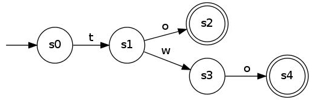

# Part 3: Deterministic Finite Automata

## Contents:

*   [Mutable Types — Lists, Sets, and Dictionaries](#mutable-types-lists-sets-and-dictionaries)
*   [Functions Redux — Mutability and Default Arguments](#functions-redux-mutability-and-default-arguments)
*   [Iterators](#iterators)
*   [Files](#files)
*   [**Exercise 3: Deterministic Finite Automata — 20 Marks**](#exercise-3-deterministic-finite-automata-20-marks)

## Mutable Types — Lists, Sets, and Dictionaries

Lists are a lot like tuples except we can change the contents of a list.

Empty lists are made as follows:

```python
students = []
```

We can also create a list which starts with some things in it:

```python
students = ["Ludwig", "Simone", 4, 1.2]
```

Unlike tuples, we can add and remove elements from a list.

```python
>>> students = ["Ludwig", "Simone"]
>>> students
["Ludwig", "Simone"]
>>> students.append("Bertrand")
>>> students
["Ludwig", "Simone", "Bertrand"]
>>> students[0] = students[0].upper()
>>> students
["LUDWIG", "Simone", "Bertrand"]
```

Use the help function to explore the methods which can be used to modify lists.

Python also comes with a set of functions which work specifically with lists, tuples, etc. The most important of these is the `len` function, which returns the length of the given list. The `min`, `max`, and `sum` functions are also very useful.

Lists have constant-time indexed access. The time complexity of many Python operations can be found [here](https://wiki.python.org/moin/TimeComplexity).

Lists can be sorted in place using the `sort` method. There is also a built in function `sorted` which will accept any iterable object and return a new sorted list with its contents. Details about sorting in Python can be found [here](https://wiki.python.org/moin/HowTo/Sorting).

Python contains a powerful `set` type.

Sets are like lists except:

*   They do not admit duplicates;
*   Are unordered;
*   Can only contain immutable (and therefore hashable) values; and
*   Have constant time memberships tests (it is linear time to check membership in a list).

An empty set can be created as follows:

```python
students = set()
```

A set with contents can be created by passing it a list or tuple (or other iterable object).

```python
students = set(["Ludwig", "Simone", "Bertrand"])
```

We can add and remove elements from a set as follows:

```python
>>> students.add("Ludwig")
>>> students.remove("Bertrand")
>>> students
set(["Ludwig", "Simone"])
```

Note that lists, sets, and dictionaries cannot be added to sets because they are not hashable. Instead use tuples or frozensets.

There are lots of very useful set functions with very nice time complexities, so use the help function (or documentation) to check them out.

Dictionaries are like associative array. They associate immutable keys with mutable or immutable values.

Dictionaries are created as follows:

```python
ages = {}
```

Access is usually performed with the square brackets.

```python
>>> ages["Bertrand"] = 142
>>> ages["Ludwig"] = 125
>>> ages["Bertrand"] = -1
>>> ages["Ludwig"]
125
>>> ages["Bertrand"]
-1
```

It is possible for a value in a dictionary to be any object, including a mutable object like a list (or another dictionary).

```python
>>> works = {"Ludwig" : [], "Bertrand" : []}
>>> works["Bertrand"] = ["Principia Mathematica"]
>>> works["Bertrand"].append("What I believe")
>>> works["Ludwig"].append("Tractatus")
>>> works
{"Bertrand": ["Principia Mathematica", "What I believe"], "Ludwig": ["Tractatus"]}
```

Assuming a dictionary `d` is not too large, then the following could be used to make it hashable so we can put it in a set or use it as the key in another dictionary:

```python
tuple(sorted(d.items()))
```

One important thing, which we need to mention here is that variables can point to the same value. If that value is mutable, then changes made with one variable will affect the other variable.

This can be avoided by making a copy of the list, set, etc. as follows:

```python
>>> x = [1, 2]
>>> y = x
>>> z = list(x)
>>> x.append(3)
>>> x
[1, 2, 3]
>>> y
[1, 2, 3]
>>> z
[1, 2]
```

Similarly, we can use the functions `set` and `dict` to make copies of sets and dictionaries.

More generally, objects can be copied using the `copy` and `deepcopy` functions in the `copy` module.

The type functions (`list`, `set`, `dict`) and the `copy` function will copy an object, but not make copies of its attributes.

The `deepcopy` function will recursively copy an object and its attributes.

## Functions Redux — Mutability and Default Arguments

Earlier we saw that a function cannot affect immutable objects when passed as arguments. However, we have since met some mutable objects and if these are supplied as arguments they can be changed within a function.

Given a function:

```python
def increase_list(x):
    x[0] += 1
```

The following can happen:

```python
>>> x = [1, 2]
>>> increase_list(x)
>>> x
[2, 2]
```

Remember, assignments never change a value. It only points a variable to a new value.

Python uses a reference-counting based garbage collection scheme. Any variables created within the scope of the function to which no references remain after the function terminates will be garbage collected. If you are having issues with garbage collection, methods on [this page](http://docs.python.org/3/library/gc.html) will help with debugging.

Python allows us to specify default values for the arguments of functions. All arguments without default values must come before any argument with a default value.

Here is an example of a function with default arguments:

```python
def confirm_order(prompt, retries=3, complaint="Error (yes/no) required"):
    ...
```

We can then supply a variable number of arguments which are evaluated positionally. In addition to positional arguments, we can specify some number of keyword arguments where the name of the argument is explicitly specified with the associated value. Keyword arguments must be supplied after all non-keyword arguments.

The following are all valid calls to the `confirm_order` function:

```python
confirm_order("Please confirm")
confirm_order("Please confirm", 2)
confirm_order("Please confirm", complaint = "Oh come on, really?")
```

The default values are evaluated at the point of function definition in the defining scope:

```python
>>> i = 5
>>> def f(arg=i):
        print(arg)
>>> i = 6
>>> f()
5
```

Important warning: The default value is evaluated only once. This makes a difference when the default is a mutable object such as a list, dictionary, or instances of most classes. For example, the following function accumulates the arguments passed to it on subsequent calls:

```python
>>> def f(a, l=[]):
        l.append(a)
        return l
>>> f(1)
[1]
>>> f(2)
[1, 2]
>>> f(3)
[1, 2, 3]
```

Recursion in Python is quite inefficient as it does not do tail call elimination. If speed is required, it is recommended to use iteration instead of recursion. While outside the scope of this tutorial, Python provides a way to create [generating functions](https://wiki.python.org/moin/Generators), which can be used as an alternative to recursion.

## Iterators

In Python, some objects are iterable. The containers we have seen are examples of iterable objects. We will cover a few other useful iterators here.

Lets say that we want to access all of the elements in a string, list, or set, tuple, or the keys of a dictionary called `container`. It is as simple as follows:

```python
for item in container:
    ...
```

Remember, sets and dictionaries are not ordered, so the for loop will access the elements of these containers in an arbitrary order.

What if we want to access the values in a dictionary?

There are six useful iteration methods we should know about. First, there are three, `keys`, `values`, and `items` which return <emph>iterables</emph> of keys, values, and key-value pairs (as tuples) respectively.

```python
>>> alph = {"a" : 1, "b" : 2, "c" : 3}
>>> [d for d in alph.keys()]
["b", "a", "c"]
>>> [v for v in alph.values()]
[1, 3, 2]
>>> [i for i in alph.items()]
[("a", 1), ("b", 2), ("c", 3)]
```

We could then iterate over any of these with a for loop.

Each element of the `items` list is a tuple containing the key and value pairs. We need to unpack these tuples to use the key and value.

```python
for kv_pair in alph.items():
    key, value = kv_pair
    ...
```

More elegantly:

```python
for key, value in alph.items():
    ...
```

And less elegantly:

```python
for key in alph.keys():
    value = alph[key]
    ...
```

Next, there are a few very helpful functions which play nice with for loops and make life in Python much nicer.

Say we want to access an element in a list or a character in a string using a numerical index. How could we generate a sequence of these indexes?

A while loop would work, but it is a bit cumbersome. So, we use the `range` function:

```python
>>> range(5)
[0, 1, 2, 3, 4]
>>> range(3, 8)
[3, 4, 5, 6, 7]
>>> range(2, 10, 2)
[2, 4, 6, 8]
```

So, we can do the following:

```python
week_days = ["Monday", "Tuesday", "Wednesday", "Thursday", "Friday"]
for day_no in range(len(week_days)):
    print("Day number {} is {}".format(day_no, week_days[day_no]))
```

Which will print:

```
Day number 0 is Monday
Day number 1 is Tuesday
...
```

Alternatively, we can use the enumerate function (which is very handy for accessing parallel lists):

```python
for day_no, day in enumerate(week_days):
    print("Day number", day_no, "is", day)
```

The `enumerate` function returns an iterator which returns a sequence of tuples. The first element of each tuple is the index corresponding to the value in the second element.

`enumerate` will work on sets and dictionaries, but elements are accessed in an arbitrary order and will therefore have arbitrary indexes (which cannot be used to access the set or dictionary).

## Files

In Python files can be accessed via a built in `file` type.

To create a file object use the `open` function:

```python
student_file = open("students.txt", "r")
```

The first argument is the name of the file to be opened. Paths are assumed to either be absolute or relative to the directory from which the Python script (or interactive interpreter) is run.

For tools to deal with file paths see the built in `os.path` module.

The second argument is an optional string containing an access mode for the file. The mode can be "r" to read the file, "w" to (over)write the file, and "a" to append to the file. The default value is "r".

For more details about access modes, and how Windows handles end of line characters (if for some crazy reason you work in Windows) go [here](http://docs.python.org/3/tutorial/inputoutput.html#reading-and-writing-files).

We can read from a file in a number of ways.

First, the `read` method will return a string containing the entire contents.

```python
contents = student_file.read()
```

Maybe more practically, the file object is iterable and can be used in a for loop as follows:

```python
for line in student_file:
    print(line)
```

Try this with a file and you will notice something strange about the result. Python will print a blank line between each line from the file. This quirk is common to all methods of accessing lines from files in Python. It comes about because when a line is read from a file, it has a newline character on the end. Furthermore, the `print` function also automatically adds another new line to the end.

This can be avoided by telling the `print` function to not add a new line:

```python
for line in student_file:
    print(line, end="")
```

or by manually removing the last character of each line:

```python
for line in student_file:
    line = line[:-1]
    print(line)
```

Alternatively, to remove all whitespace around a line:

```python
for line in student_file:
    line = line.strip()
    print(line)
```

We can alternatively access the next line in a file with the `readline` method. `readline` will return an empty string if there is no more of the file left to read. So, we can read the file as follows:

```python
while True:
    line = student_file.readline()
    if not line: break
    ...
```

All of the lines in a file can be read at once using the `readlines` method. This returns a list containing strings, each of which contains a line of the file. Each of these strings will be terminated with a newline character.

After you are finished with a file, you should close it with the `close` method.

A more Pythonic way to close a file is to use the `with` keyword as follows:

```python
with open("students.txt") as student_file:
    for line in student_file:
        ...
```

When the code in the indented block has been executed, or when an exception is raised, Python will close the file automatically.

Writing to a file is handled with the `write` and `writelines` methods. The `write` method takes a string as an argument and the `writelines` method takes an iterable containing strings.

The `write` and `writelines` methods expect you to supply your own newline characters if you require them.

Finally, you may need to use the `flush` method to flush the output buffer. This will occur automatically when a file is closed.

## Exercise 3\. Deterministic Finite Automata — 20 Marks

You will write a program to read in a text file containing a graph representing a deterministic finite automaton (DFA). You will then write a function to test if the DFA accepts a given word.

If you need to refresh your memory about DFAs, you can look at the relevant [Wikipedia page](https://en.wikipedia.org/wiki/Deterministic_finite_automaton).

For our purposes, a DFA is a multigraph with directed, labelled edges and the following properties:

*   Nodes represent states;
*   Edges represent transitions between states;
*   There is a single node representing the initial state;
*   There is a set of nodes representing accepting states;
*   The labels on the outgoing edges at a given node are distinct individual characters.

A DFA can be used to accept or reject words. The DFA starts in the start state and we are initially reading the first character (with index `0`) of a word `w`.

We apply the following rules. If a DFA is in a state `s`, reading character with index `i` of word `w`, then there are four possibilities:

1.  If `i = len(w)` and `s` is an accepting state, the automaton accepts `w`; otherwise
2.  If `i = len(w)` and `s` is not an accepting state, the automaton rejects `w`; otherwise
3.  If `s` has an outgoing edge labelled with `w[i]`, the automaton transitions to the successor state and increments `i`; otherwise
4.  The automaton rejects `w`.

Here is an example automaton that accepts the words `to` and `two`. `s0` is the start state and `s2`, `s4` are the accepting states.



Example automata files are provided in the `exercise3_dfa` subdirectory of the assignment files.

In these files, all lines consist of whitespace delimited tokens. There are three such types of line:

1.  `initial s` — where `s` represents the name of the starting (initial) state.
2.  `accepting s0 ... sn` — where `s0 ... sn` is a space-separated list of names of accepting states.
3.  `transition s0 s1 label` — where `s0` and `s1` are the start and end states of the transition and `label` is the label of the edge. Labels are a single character.

You are not required to check for error conditions when reading the automata files and may assume that correctly formatted input will be supplied.

Edit the supplied file `dfa.py` to complete this exercise. As with the previous exercises, it should be commented appropriately.

Within this file, you are free to create any functions, variables, etc., but the following functions are required:

```python
def load_dfa(path_to_dfa_file):
    """ This function reads the DFA in the specified file and returns a
        data structure representing it. It is up to you to choose an appropriate
        data structure. The returned DFA will be used by your accepts_word
        function. Consider using a tuple to hold the parts of your DFA, one of which
        might be a dictionary containing the edges.

        We suggest that you return a tuple containing the names of the start
        and accepting states, and a dictionary which represents the edges in
        the DFA.

        (str) -> Object
    """

def accepts_word(dfa, word):
    """ This function takes in a DFA (that is produced by your load_dfa function)
        and then returns True if the DFA accepts the given word, and False
        otherwise.

        (Object, str) -> bool
    """
```

Test your code with the supplied DFAs. They should accept exactly the following words (case sensitive):

*   `test1.dfa` — `planning`, `satisfiability`, `search`, `reinforcement`, `learning`.
*   `test2.dfa` — `sang`, `sing`, `song`, `sung`.
*   `test3.dfa` — `0`, `01`, `010`, `0101`, `01010`, `010101`, `0101010`, `01010101`, `010101010`, `0101010101`.

We will test this project by importing your file and loading a number of DFAs. When the file is imported, nothing should be printed to the screen. We will check that you correctly use these DFAs to accept and reject words.

Include your completed `dfa.py` with the submission of your assignment.

Now you can either go back to the [index](README.md) or move to the
[next exercise](4_pandemic.md).
