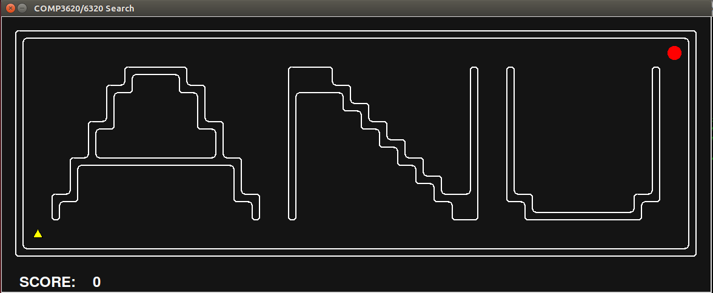

# Getting Started

Contents:

1. [Capturing One Yellow Bird](#capturing-one-yellow-bird)
2. [Capturing Many Yellow Birds](#capturing-many-yellow-birds)
3. [Competing With an Adversary](#competing-with-an-adversary)


We will start this Assignment by having you solve *manually* three tasks.

## Capturing One Yellow Bird

Open up a console and navigate to the assignment folder and type the following
command:

```
python3 red_bird.py -l search_layouts/anuSearch.lay
```

and the screen below should pop up:



The first task you'll encounter during the assignment is a simple navigation
problem. That is, how to get the red bird (the red circle) to the position of
the yellow bird (the yellow triangle) as fast as possible. Here "as fast as
possible" means that the agent is to *minimize the number of moves done* to
reach the yellow bird.

You can move the agent using the following controls:

- `↑` or `w` to execute the action _Move North_
- `↓` or `s` to execute the action _Move South_
- `←` or `a` to execute the action _Move West_
- `→` or `d` to execute the action _Move East_

You will see that the *SCORE* readout goes negative as you move, at the rate of
one unit per move done. The only way to get that score to be greater than zero
is to reach the *yellow bird* in less than 100 steps, since doing so adds *100*
points to the score.

When you get the agent onto the yellow bird position, the screen will vanish
after a brief pause and the following information will be reported on the
terminal:

```
The game is over. Score: 55
Average Score: 55.0
Scores:        55.0
Win Rate:      1/1 (1.00)
Record:        Win
```

The only bit relevant to the current task is the "Score".

You may be wondering by now how this fits into the characterization of Search
Problems you have seen already in class. Let us walk you through the details:

- The **state space** is the set of cells the agent (the *red circle*) can be
  in at any point in time. These cells are identified by their coordinates and
  represented as a pair `(x,y)`.
- The **goal state** is given by the cell where the yellow bird is located.
- The **initial state** is the cell where the agent starts.
- The **actions** are given by the set of possible moves (discussed above).
- The set of actions _A_ *applicable* in a given state _s_ is given by the
  following rules:
  1. The agent cannot exit the map.
  2. The agent cannot move through walls.
  3. The agent can move in any of the 4 compass directions: North, East, South,
     and West.

- The *cost function* is given by the expression
  ```
  cost = number_of_steps
  ```
  The **optimal** solution is the one minimizing cost, i.e. it
  **minimizes the number of steps taken**. The **score** of the agent is a
  *different* measure that is given by:
  ```
  score = value_of_captured_yellow_bird - number_of_steps
  ```
  so obtaining the **maximum** score means that the red agent is following the
  shortest path to the goal.

We have provided several _instances_ of this task inside the folder
`search_layouts`:

- `aiSearch.lay`
- `anuSearch.lay`
- `mazeSearch.lay`

Feel free to get familiar with them by solving them manually.

## Capturing Many Yellow Birds

Open up a console, navigate to the assignment folder, and type the following command:

```
python3 red_bird.py -l search_layouts/anuMultiSearch.lay
```

and the screen below should pop up:


We can see that several yellow birds are now scattered all over the place. If
you try to move the red bird around, you'll see that although the agent can do
the **same set of actions** (moving in one of four possible compass
directions), now it is not enough just to get to **one** yellow bird. Rather we
need to move through **each** of the yellow bird locations.

When you complete the task (did it require **more effort** than the previous
one?) you will be prompted with a similar message as before:

```
The game is over. Score: 481
Average Score: 481.0
Scores:        481.0
Win Rate:      1/1 (1.00)
Record:        Win

```

As before, capturing each yellow bird is rewarded with 100 points, while each
move reduces your score by 1.

Intuitively, the task is pretty much the same. The environment is still fully
observable and the actions are deterministic. As a side note, this relates to
[this very famous problem](https://en.wikipedia.org/wiki/Hamiltonian_path).

Formally, what really changes here is the *definition* of a *state*:

- A *state* is made up of **pairs** `(p, Y)` where
   1. `p = (x, y)` the pair representing the *coordinates* of the cell occupied by the agent,
   2. `Y` is the list of coordinates `(x_i, y_i)` of the cells where
      the `n` yellow birds still to collect are located
- The *initial* state is `(p_0, Y_0)` where `p_0 = (x_0, y_0)` is the initial position of
  the agent. Initially `Y_0 = [(x_1, y_1), ..., (x_i, y_i) ,..., (x_n, y_n)]`.
- A *goal* state is the state `(p, Y')` where `Y' = []`
  (it's an **empty list**),

- The *cost function* remains the same:
  ```
  cost = number_of_steps
  ```
  while the score now involves counting up the values of all captured yellow
  birds:
  ```
  score = total_value_of_captured_yellow_birds - number_of_steps
  ```

The folder `search_layouts` includes a variety of scenarios that you can
try out:

- `aiMultiSearch.lay`
- `anuMultiSearch.lay`
- `mazeMultiSearch.lay`
- `smallMultiSearch.lay`

## Competing With an Adversary

Let's go back to the console and now type the following command:

```
python3 red_bird.py -l adv_search_layouts/aiAdversarial.lay -n 3
```

this window should pop up:


We now introduce a new character: the black agent, who is also interested in
collecting yellow birds. You still control the red agent (use the same controls
as before). The goal now is for you to capture more yellow birds than the black
agent. You can play as many matches as you want by using the `-n` option from
the shell. For example, the example command above allows you to play 3 matches.

The follows shows the output over 3 matches:
```
All Birds EATEN
The game is over. Score: 86.87458127689783
All Birds EATEN
The game is over. Score: 86.87458127689783
All Birds EATEN
The game is over. Score: 83.45137614500875
Average Score: 85.73351289960146
Scores:        86.87458127689783, 86.87458127689783, 83.45137614500875
Win Rate:      3/3 (1.00)
Record:        Win, Win, Win
```

The average score averages over the three match scores.

In this example the black agent is choosing its moves at **random**. You
can try to capture the black agent by moving onto its position. Beware! The
black agent could also do the same to you, if you happen to be on its path.

Not shown in the interface is the fact that the value of the yellow birds
decays at a constant rate after each player takes his move. In effect, this is
equivalent to have a **time out** to "complete the level".

Now try this command:

```
python3 red_bird.py -l adv_search_layouts/aiAdversarial.lay -n 3 -b GreedyBlackBirdAgent
```

Visually nothing changes, but if you go through the three games, you might get:

```
Black EATS Red!
The game is over. Score: -249.7089572070889
Black EATS Red!
The game is over. Score: -481.185015485747
Black EATS Red!
The game is over. Score: -249.7089572070889
Average Score: -326.86764329997493
Scores:        -249.7089572070889, -481.185015485747, -249.7089572070889
Win Rate:      0/3 (0.00)
Record:        Loss, Loss, Loss
```

With the second command, the black agent is no longer choosing its moves
randomly. Instead it is following a very simple rule:

```
next_action = first_move_in_shortest_path_to_nearest_yellow_bird
```

It will always try to move towards the closest yellow bird via the shortest
route, ignoring the red bird.

A *state* now is the tuple `(pR, pB, Y, v)` where

* The `pR = (xR, yR)` is the pair representing the *coordinates* of the cell
  occupied by the **red** agent,
* `pB = (xB, yB)` is the pair representing the *coordinates* of the cell
  occupied by the **black** agent,
* `Y` is the list of coordinates `(x_i, y_i)` of the cells where the `n` yellow
  birds are located, and is initially
  `Y_0 = [(x_1, y_1), ..., (x_i, y_i),..., (x_n, y_n)]`,
* `v` is the current value of the yellow birds.

The *initial* state is `(pR_0, pB_0, Y_0, 100)` where `pR_0 = (xR_0, yR_0)` is
the initial position of the red agent, and `pB_0 = (xB_0, yB_0)` is
the initial position of the black agent. Instead of goal states, now we have
*terminal states*: the tuples `(pR', pB', Y')` such that

* `Y' = []` (**the empty list**), or
* `pR' = pB'`, or
* the value of the yellow birds is less than 0.5.

Terminal states are **winning states** for the red bird when the scoring
function is *positive*:

```
score = total_value_of_yellow_birds_captured_by_red_agent - total_value_of_yellow_birds_captured_by_black_agent + capture_value
```

where `capture_value` is `250` if the red agent captures the black agent, and
`-250` the the black agent captures the red agent.

## And that's all folks!

Thanks for having made it here, now you can move to the
[next section](2_implementation_notes.md) or go back to the [index](README.md).
