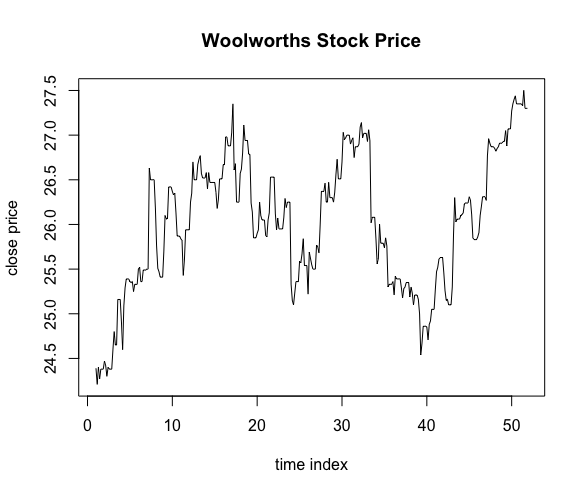
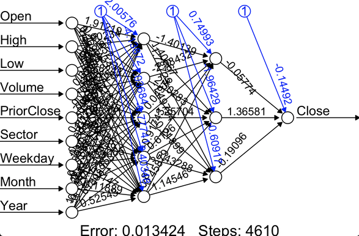
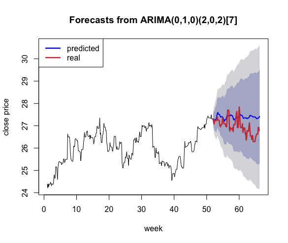

```{r setup, include=FALSE}
knitr::opts_chunk$set(warning = FALSE)
knitr::opts_chunk$set(echo = FALSE)
knitr::opts_chunk$set(cache = TRUE)
knitr::opts_chunk$set(fig.align="center")
set.seed(8410)
```

# 1. Introduction

One of the features of stock market prices is its unpredictability and volatility. Burton Malkiel, argues in his 1973 book, "A Random Walk Down Wall Street", that if the market is genuinely efficient and a share price reflects all factors immediately as soon as they're made public, a blindfolded monkey throwing darts at a newspaper stock listing should do as well as any investment professional [1]. However, things are not always extreme. If we treat the stock prices as a non-stochastic process then at least we can model the data. Even though our potential model wouldn't be exact, it still makes capturing the trend of rise and fall possible.

In the matter of "learning something interesting about the data", one could start in two opposite ways. On the one hand, we could investigate the patterns within; on the other hand, we could use learned outcome to predict the future. Therefore, we list the following questions as our goal of this data mining project:

1. Are there any frequent patterns among different stocks?
2. Are there any methods to predict future stock price changes? If the answer is yes, can we find other ways based on different prior knowledge?

# 2. Data Description

```{r load-data}
dat <- read.csv('dat/ALL.csv')
# "Date" to date
dat$Date <- as.Date(as.character(dat$Date), format="%Y%m%d")
# sum(is.na(dat))

# divide data by industry
write.csv(dat[dat$Sector=="Technology",], file="dat/tech.csv")
write.csv(dat[dat$Sector=="Financial_Services",], file="dat/finn.csv")
write.csv(dat[dat$Sector=="Agriculture",], file="dat/agri.csv")
write.csv(dat[dat$Sector=="Basic_Materials/Resources",], file="dat/rsrc.csv")
write.csv(dat[dat$Sector=="Retail/Wholesale",], file="dat/sale.csv")
write.csv(dat[dat$Code=="WOW",], file="dat/WOW.csv")
```

- Source: The data was web-mined from the Wall Street Journal [2].
- Attributes: Stored in a CSV file, the attributes of each entry consist of:
    - `Code`: the stock code of a company.
    - `Sector` and `SubSector`: the particular field of a company.
    - `Date`, `Weekday`, `DayofMonth`, `Month`, `Year`, `WeekofYear` and `DayofYear`: time-related attributes of a data entry.
    - `Open`, `High`, `Low`, `Close`: four basic prices information within one day.
    - `Volume`: the trading volume.
    - `Close.Open`, `Change`, `High.Low`, `HMLOL`: four advanced price information which reflect the relationship among the basics. `Close.Open` and `High.Low` are the differences, `HMLOL` is the ratio between `High.Low` and `Low`. `Change` indicates whether `Close.Open` is positive or not. 
    - `PriorClose`: the close price on the previous day.
- Components: The data set includes 61 selected Australian stocks and their daily prices ranging from 1 January 2017 to 12 April 2018. These 61 stocks can be grouped into five different industries. These companies involve some big names like *Woolworths*, *Commonwealth Bank*, *ANZ*, etc.
- Data quality: the data was pretty tidy. We found no missing data inside.
- Summary: the basic summary statistics of numeric attributes is shown below. Two results stand out:
    * Four basic price attributes are highly right-skewed, that means the majority of data has rather low values less than 1.
    * "Up" are almost twice of "down"s. So the general trend of stock prices in our period of interest is increasing.

```{r summary}
summary(subset(dat,select=c("Open","High","Low","Close","Volume","Close.Open","Change","High.Low","HMLOL","PriorClose")))
```

# 3. Mining Methods

## 3.1 Associate Mining
As we mentioned before, we would like to see the pattern in stock prices. In details, what factors are responsible for the increase or decrease in stock prices? To achieve this goal, we are going to make some changes to the original data set and use `Rattle` to unearth the hidden correlation inside.

Because we are only interested in the qualitative change, instead of quantitative difference here, we select the following variables as inputs: `Change`, `Sector`, `SubSector`, `Weekday`, `Month`, `Year`. Naturally, we ignore the rest. Then we set the minimum support threshold to be `0.1` and minimum confidence threshold to be `0.5`. In other words, a rule will only be selected under the circumstance that it quite "frequent", taking about 10% occurrences. Additionally, it has to be "truth", that the proportion of the transaction that contains LHS also contain RHS.

After that, we need to hand-pick some rules, because some are flawed, thus not as interesting as we expected, and they should be filtered out.

- Some rules have `Sector/Subsector` on the left hand side and `Subsector/Sector` on the right hand side. These are not very informative.
- Some rules exceed minimum confidence threshold but have lift values smaller than 1, which indicate negative correlations.

Meanwhile, we use $\chi^2>1$ as a rule-of-thumb to ensure that the correlation is interesting. [8]


## 3.2 General Stock Price Predictions

After answering the question about what patterns we could see from the data, the next one followed is if we could use some known information to predict the stock price quantitatively. The answer is an absolute yes!

In the following paragraphs, we are going to use two numeric methods, neural network (non-deterministic) and logistic regression (deterministic) to formulate a mathematical expression of stock prices. Moreover, we will use daily `Close` prices as a target, since it is the best conclusion of a stock price after one day.

### 3.2.1 Neural Network
One highlighted advantage of a neural network is its tolerance of noise so that it is handy to deal with untrained real-world data. In our case, we aim to randomly separate the data into one training set and one testing set with a ratio $3:1$. The input layer will include some basic numeric attributes `High`, `Low`, `Open`, two other numeric attributes `Volume` and `PriorClose` and some categorical attributes `Sector`, `Weekday`, `Month` and `Year`.

The reason why we exclude relational attributes like `HMLOL` and `Close.Open` is because we believe they provide no more additional information than its corresponding basic attributes. Especially in the later method we are going to use, linear regression is pretty good at capturing linear relation between quantities. What is more, we turn `Sector`, `Weekday` and `Month` into numeric so that they could be handled by neural networks.

Note that we have known that the price data are highly skewed, which means they concentrate on small values. Hence the step of normalisation is necessary before we proceed to train the neural network.

Regarding the selections of the number of hidden layers and neurons on each layer, we referenced some empirical choices [3]. That is, to choose 1 or 2 hidden layers with the number of neurons fewer than that of input neurons. After several trials, we decide to use a 2-hidden-layer neural network with 8 neurons on the first layer and 4 on the second.

### 3.2.2 Linear Regression

The linear regression method to predict untrained data is straightforward. The core step is to assume a linear relation between the target `Close` and inputs. At the same time, we should also suppose the error terms are independent and identically normally distributed. In this case:

$$
\begin{split}
\text{Close} &\sim \text{Open}+\text{High}+\text{Low}+\text{Volume}\\
&\  \  \ \  \ \ \ \ \ \ \ +\text{PriorClose}+\text{factor(Sector)} +\text{factor(Weekday)}\\
&\  \  \ \  \ \ \ \ \ \ \ +\text{factor(Month)}+\text{Year}+\epsilon\\
&\text{where }\epsilon\sim N(\mu,\sigma^2)\text{ for some }\mu, \sigma\\
\end{split}
$$


### 3.2.3 Remark

Now, let us review what we have done so far. We use two different methods to construct models and train them with some data, then use trained model to predict unknown data. These are accomplished based on unbalanced "general knowledge", that is to say, we are ignoring the fact that in our data, more stocks tend to have comparatively low prices. Now consider an extreme case that a well-trained model for stock prices between $0.01$ and $1.00$, it might not handle high price stock well, because it has never studied any background knowledge about high price stock so far. So here comes an alternative approach, which is to do time series analysis on one stock separately, then predict its future trend and values.

## 3.3 Time Series Analysis

Time series analysis is the most common and fundamental method used to forecast stock prices [5]. It only requires historical information of the subject of interest itself; then the model won't be distracted by noise from other unrelated stocks.

Note that one precondition of performing time series analysis is that values should be measured at equal time intervals. After that, during the data cleaning procedure, we need to extract one stock from the whole dataset and do imputations by adding "fake" closing price on non-trading days such as holidays and weekends. Brutally setting the closing prices as zero is irrational, it will add unnecessary fluctuations and messes up the data. What we choose to perform here is to set the close prices on non-trading days as the last close price on trading days. For example, let the close prices on Saturday and Sunday be that of the closest Friday's. (detail see appendix)

Another change we have made towards the data is, we take data in the year 2017 as training data, such that no stock price in the year 2018 is taken into time series analysis. When the model is fixed, we would like to check how our model predicts the stock prices change in the year 2018.

In this experiment, we choose the stock prices of Woolworths Ltd (Code: `WOW`) and apply a basic ARIMA model on the daily close price. In the way, we could model close price as:

\[\text{Close}_t=S_t+T_t+E_t,\]

where $S_t$ is the seasonal component, $T_t$ is the trend component and $E_t$ is the random noise. A seasonal ARIMA model can be expressed as $ARIMA(p,d,q)(P,D,Q)_m$ where $(p,d,q)$ is the non-seasonal part of the model and $(P,D,Q)_m$ is the seasonal part.$m$ is the number of periods per season.

```{r, out.width = "400px", fig.cap="Woolworths stock price"}

```

From the stock price line plot, we cannot directly confirm the size of a cycle. But recall that we have found some frequent patterns that stock prices tend to be increasing on Thursdays and Fridays, so we would like to give 7-day-cycle a try, letting $m=7$. Then we use the built-in `auto.arima()` function in `forecast` package [6] to automatically determine the model parameter by finding the model with the least AIC (Akaike information criterion) [7]. Note that `auto.arima()` speeds up by taking shortcuts in the algorithm, but we can set `stepwise=F` and `approximation=F` to avoid it. In this way, we have the following model.

```
Series: wow.train
ARIMA(0,1,0)(2,0,2)[7]

Coefficients:
    sar1     sar2    sma1    sma2
-0.5589  -0.8341  0.3741  0.8643
s.e.   0.0592   0.0797  0.0646  0.0894

sigma^2 estimated as 0.03044:  log likelihood=115.83
AIC=-221.67   AICc=-221.49   BIC=-202.29
```

Then our candidate model is $ARIMA(0,1,0)(2,0,2)_7$. Detailed scripts about the discovery of this model can be found in Appendix.

# 4. Presentation

## 4.1 Frequent Patterns
For this experiment, `Rattle` [4] is used, and a total of 26 rules are generated by `Rattle` package. Based on some manual criteria we mentioned above, not all strong rules are selected because some of them are meaningless. The hand-picked rules are listed below:

```
[8]  {SubSector=Mining_&_Metals}          => {Change=up}
[11] {SubSector=Software}                 => {Change=up}
[14] {Weekday=Friday}                     => {Change=up}
[15] {Sector=Basic_Materials/Resources}   => {Change=up}
[17] {Weekday=Thursday}                   => {Change=up}
[20] {Sector=Technology}                  => {Change=up}
[21] {Sector=Basic_Materials/Resources, SubSector=Mining_&_Metals} => {Change=up}
[24] {Sector=Technology, SubSector=Software} => {Change=up} 
```

The barplot below indicates the support count and confidence of rules of our selection.

```{r hist, echo=FALSE, out.width = "400px", fig.cap="Barplot of frequent rules"}
changeup <- nrow(dat[which(dat$Change=="up"),])
lhs.8 <- nrow(dat[which(dat$SubSector=="Mining_&_Metals"),])
rhs.8 <- nrow(dat[which(dat$SubSector=="Mining_&_Metals" &
                            dat$Change=="up"),])
lhs.11 <- nrow(dat[which(dat$SubSector=="Software"),])
rhs.11 <- nrow(dat[which(dat$SubSector=="Software" &
                             dat$Change=="up"),])
lhs.14 <- nrow(dat[which(dat$Weekday=="Friday"),])
rhs.14 <- nrow(dat[which(dat$Weekday=="Friday" &
                             dat$Change=="up"),])
lhs.15 <- nrow(dat[which(dat$Sector=="Basic_Materials/Resources"),])
rhs.15 <- nrow(dat[which(dat$Sector=="Basic_Materials/Resources" &
                             dat$Change=="up"),])
lhs.17 <- nrow(dat[which(dat$Weekday=="Thursday"),])
rhs.17 <- nrow(dat[which(dat$Weekday=="Thursday" &
                             dat$Change=="up"),])
lhs.20 <- nrow(dat[which(dat$Sector=="Technology"),])
rhs.20 <- nrow(dat[which(dat$Sector=="Technology" &
                             dat$Change=="up"),])
lhs.21 <- nrow(dat[which(dat$Sector=="Basic_Materials/Resources" &
                             dat$SubSector=="Mining_&_Metals"),])
rhs.21 <- nrow(dat[which(dat$Sector=="Basic_Materials/Resources" &
                             dat$SubSector=="Mining_&_Metals" &
                             dat$Change=="up"),])
lhs.24 <- nrow(dat[which(dat$Sector=="Technology" &
                             dat$SubSector=="Software"),])
rhs.24 <- nrow(dat[which(dat$Sector=="Technology" &
                             dat$SubSector=="Software" &
                             dat$Change=="up"),])
rules <- matrix(data=c(lhs.8,rhs.8,lhs.11,rhs.11,lhs.14,rhs.14,
                       lhs.15,rhs.15,lhs.17,rhs.17,lhs.20,rhs.20,
                       lhs.21,rhs.21,lhs.24,rhs.24),nrow=2)
colnames(rules) <- c(8,11,14,15,17,20,21,24)
rownames(rules) <- c("LHS true but RHS false", "LHS true")
rules[1,] <- rules[1,]-rules[2,]

barplot(rules[2:1,],col=c("#5289B1","#EFD247"),
        border="white",space=0.04,font.axis=2,xlab="Rule index",
        legend=rownames(rules[2:1,]),args.legend = list(x="topleft"))
```

An interpretation of these interesting rules can be: during the whole year of 2017 and the first quarter of 2018, the Australian stock prices (according to the selection of 61 stocks) tend to be increasing on Thursday and Friday. Among all industries, the technology industry and basic materials industry are thriving. Two types of sub-industries, the mining and metals (under resources) and software (under technology) are typical examples.

The detailed output of association mining can be found in Appendix.

## 4.2 General Stock Price Predictions

```{r, out.width = "300px", fig.cap="Trained neural network"}

```

The neural network is hard to interpret at this moment. However, we understand the goal of this method is to roughly predict the numeric value of closing price given some inputs, hence we could still evaluate how it works by calculating its mean absolute difference ($MAE$) between true and predicted values on preprocessed testing data. The $MAE$ we use here is defined as followed:

\[MAE=\frac{\sum^N_{i=1}|x^*_i-x_i|}{N},\]

where $x^*_i$ is the predicted value of $i$th observation and $x_i$ is the true value, and $N$ is the total number of observations.

And we repeat the evaluation process on linear regression result, and then we could have a general idea about how precise these predictions are by comparing them side by side.

We use R to calculate the corresponding $MAE$s, and we have:

\[
MAE_{NN}=0.0725,\ MAE_{LM}=0.0223
\]

This means, on average, the neural network's prediction deviates about $\pm 0.0725$ around the actual values, and linear regression's prediction deviates about $\pm 0.0223$. It seems that linear regression performs better in predicting `Close` prices. We look back into the basic summary statistics of numeric inputs in part 1. 


```{r, out.width = "400px", fig.cap="Real value vs predicted values"}
knitr::include_graphics("image/[resize + optimize]/original-vs.png")
```

```{r}
summary(dat$Close)
```

The data is skewed, though the $MAE$s are not very ideal for 1st quantile data, it still provides consistent estimation in general.

Another procedure we would like to conduct is to check the summary information of the linear model.

```
Call:
glm(formula = f, data = train)

Deviance Residuals: 
     Min        1Q    Median        3Q       Max  
-0.63529  -0.15119  -0.00271   0.16717   0.62842  

Coefficients:
              Estimate Std. Error t value Pr(>|t|)    
(Intercept)  1.571e+02  8.275e+01   1.898   0.0589 .  
Open        -6.347e-01  5.661e-02 -11.210   <2e-16 ***
High         7.182e-01  6.046e-02  11.880   <2e-16 ***
Low          8.821e-01  5.266e-02  16.750   <2e-16 ***
Volume       1.128e-08  1.368e-08   0.824   0.4105    
PriorClose   3.533e-02  3.133e-02   1.128   0.2607    
Year        -7.786e-02  4.092e-02  -1.903   0.0583 .  
---
Signif. codes:  0 ‘***’ 0.001 ‘**’ 0.01 ‘*’ 0.05 ‘.’ 0.1 ‘ ’ 1

(Dispersion parameter for gaussian family taken to be 0.05444812)

    Null deviance: 3068.540  on 237  degrees of freedom
Residual deviance:   12.578  on 231  degrees of freedom
AIC: -8.3909

Number of Fisher Scoring iterations: 2
```

The summary statistics reflect the insignificancce of input variables `Sector`, `Weekday` and `Month`. They do not provide very information in prediction. Consequently, a potential operation is to simplify the model by removing them. Additionally, by looking at the prediction vs real plot, we notice the existence of 4 "clusters". Then we can stratify the data, repeat training separate neural networks and linear regression models. 

Afterwards, we have this table of $MAE$s from different models.

|                              |    NN    |  LM   | num of observations |
|:-----------------------------|:--------:|:-----:|:---------:|
|original                      |    0.0725|	0.0223|      18836|
|reduced ($Close \leq 20$)     |	0.0190|	0.0133|      16934|
|reduced ($20 < Close \leq 40$)|	0.0972|	0.0674|       1268|
|reduced ($40 < Close \leq 60$)|	0.1090|	0.1106|        317|
|reduced ($Close > 60$)        |	0.3403|	0.1977|        317|

It is not hard to find out that, the more observations we have, the more accurate our neural network / linear regression model can be trained. The models are the most accurate when predicting small value stock prices. Besides, linear models are generally more reliable than neural networks. The neural network only outperforms linear model in the $(40,60]$ price range.

Another thing we need to notice is that we should always be careful with the temptation of overfitting. In this part, we simplify the problem by taking only one pair of training and testing data for each model.

## 4.3 Time Series Analysis

After finding the seasonal ARIMA model, we are interested in its predicting power.

```{r, out.width = "400px", fig.cap="Predicted Woolworths stock price"}

```

As we can see, the red line indicates the real stock price of Woolworths in the year 2018, while the blue line is the original prediction by ARIMA. Meanwhile, the outer shaded area stands for 80% confidence interval, and the inner is 95%. In other words, there is 80% or 95% chance the future stock prices fall in the respective area. In fact, the real stock prices in 2018 are inside the 95% confidence interval region. However, the real fluctuation is more active than predicted, and the prediction does not capture a downward trend on a large scale. But if we zoom in the consider different segments of data, it is clear that the prediction is correct about up and down in most of the cases, only the magnitude is inaccurate to some extent. For this reason, but generally we have a solid prediction.

Therefore, we have confirmed the possibility of picking out one stock and predict its future price by solely studying its historical prices. The third goal of our experiment is fulfilled.

# 5. Conclusions and Extensions

From our previous three mining method experiments, we can draw some direct conclusions, which can answer the questions we had at the very beginning.

**Conclusions:**

1. Are there any frequent patterns among different stocks? Yes. We notice that stock prices tend to be increasing on Thursday and Friday. Besides, the resource industry and technology industry are thriving during this period.

2. Are there any methods to predict future stock price changes? Yes, we can build mathematical models, either as explicit as linear regressions or implicit as neural networks, to predict the future stock price with some given input. An extra approach is to use data of a single stock, to build a time series model. And in this way, the same goal can be achieved as well. For the former method, once we finish training, we are bold enough to use it to predict any other stock prices in the data set. However, the latter needs to be carried out toward the target stock we would like to predict. This is the difference between the two.

But before celebrating the discovery of these conclusions, we would also like to state some limitations and possible improvements we can make.

**Limitations:** 

1. Since our data only covers 61 manually selected Australian stocks, the data might be biased, thus cannot serve as a good representative of the Australian economy. That is to say, even if we have a well-developed model, it is still a toy to play with these 61 stocks, and will not be as powerful as expected to predict any other stocks.

2. The limitation of data not only appears as a limited number of stocks but also as not enough observed history. Traditionally in time series analysis, we need to have at least two cycles (periods) of data [5]. Some stock prices, in fact, have yearly seasonality. For example, the sales amount of an argriculture company might be at its peak in a certain season. But if trace back to our data, it only covers around 16 months of data. Needless to say, it restricted our choices.

3. Due to the limitation of computing power, we cannot conduct more complex neural network training. Although we believe any further improvement in mean absolute difference is questionable, we still would like to mention this.

**Improvements:**

1. Expanding the dimensions of our data is our top priority. It is possible for us to web-mine more stocks and more detailed price changes in the past. The more information our algorithm learns, more accurate they could be in predicting future prices.

2. In time series analysis, we used a seasonal ARIMA model. It worth trying some other models like Box-Cox forecast and exponential smoothing forecast.

3. High-dimensional time series analysis is worth trying as well. It is suitable for comparing different stocks prices at the same time.

At last, we would like to reaffirm that the ultimate goal of data mining is to find the pattern in the history and use them properly, to serve us better in the future. Put it into this context, finding and studying the patterns from a large chunk of data is never the end of data mining, applying it to prediction is. Although the prediction of stock prices is troublesome and uninterpretable sometimes, it is still the right track we should stay on and keep on trying.

\pagebreak

# 6. References

[1] B. Malkiel, *A random walk down wall street*, 9th ed. New York, N.Y.: W.W. Norton, 2007.

[2] "Company List - Wall Street Journal", _The Wall Street Journal_, 2018. [Online]. Available: https://quotes.wsj.com. [Accessed: 13- May- 2018].

[3] "How to choose the number of hidden layers and nodes in a feedforward neural network?", _Cross Validated_. [Online]. Available: https://stats.stackexchange.com/questions/181/how-to-choose-the-number-of-hidden -layers-and-nodes-in-a-feedforward-neural-netw. [Accessed: 13- May- 2018].

[4] G. Williams, _Rattle_. Togaware, 2017.

[5] R. Hyndman and G. Athanasopoulos, "Forecasting: principles and practice", _OTexts_, 2012. [Online]. Available: https://www.otexts.org/fpp. [Accessed: 13- May- 2018].

[6] R. Hyndman, G. Athanasopoulos and C. Bergmeir, _forecast: Forecasting Functions for Time Series and Linear Models_. 2018.

[7] H. Akaike, “Information Theory and an Extension of the Maximum Likelihood Principle,” in _Selected Papers of Hirotugu Akaike_, E. Parzen, K. Tanabe and G. Kitagawa. Springer, New York, NY, 1998, pp-199-213.

\pagebreak

# 7. Appendix

## 7.1 Raw Data Summary
```
Below we summarise the dataset.


Data frame:crs$dataset[, c(crs$input, crs$risk, crs$target)]    
18836 observations and 11 variables    Maximum # NAs:0


           Levels Storage
Code           61 integer
Sector          5 integer
SubSector      10 integer
Date              integer
Weekday         5 integer
Open               double
High               double
Low                double
Volume            integer
PriorClose         double
Close              double

+---------+-------------------------------------------------------------------+
|Variable |Levels                                                             |
+---------+-------------------------------------------------------------------+
|Code     |3DP,8EC,8IH,AAC,ABT,ACB,ADH,AEG,AEI,AIV,AJC,AJX,AMP,ANO,ANZ,API,ATR|
|         |AUB,BEN,BHP,BIG,BIQ,BOQ,BUD,CBA,CBL,CCA,CDC,CGC,CHK,CL8,CNW,CRL,CSS|
|         |CYB,DSX,ELD,FCT,FRM,GBT,GNC,GTK,HOT,HUO,IRI,LOV,LVH,MTM,MYO,MYQ,NAB|
|         |NNW,SFG,SMG,SOP,TOT,VII,WES,WOW,ZEL,ZIP                            |
+---------+-------------------------------------------------------------------+
|Sector   |Agriculture,Basic_Materials/Resources,Financial_Services           |
|         |Retail/Wholesale,Technology                                        |
+---------+-------------------------------------------------------------------+
|SubSector|Banking/Credit_Companies,Chemicals,Farming,Fishing                 |
|         |Insurance_Companies,Internet/Online,Investing/Securities_Companies |
|         |Mining_&_Metals,Retail,Software                                    |
+---------+-------------------------------------------------------------------+
|Weekday  |Friday,Monday,Thursday,Tuesday,Wednesday                           |
+---------+-------------------------------------------------------------------+

For the simple distribution tables below the 1st and 3rd Qu. 
refer to the first and third quartiles, indicating that 25% 
of the observations have values of that variable which are 
less than or greater than (respectively) the value listed.

      Code                             Sector    
 3DP    :  317   Agriculture              :3404  
 8EC    :  317   Basic_Materials/Resources:3794  
 8IH    :  317   Financial_Services       :4710  
 AAC    :  317   Retail/Wholesale         :2199  
 ABT    :  317   Technology               :4729  
 ACB    :  317                                   
 (Other):16934                                   
                    SubSector         Date               Weekday    
 Software                :2850   Min.   :20170109   Friday   :3686  
 Mining_&_Metals         :2535   1st Qu.:20170503   Monday   :3625  
 Banking/Credit_Companies:2219   Median :20170823   Thursday :3803  
 Retail                  :2199   Mean   :20172712   Tuesday  :3801  
 Farming                 :2137   3rd Qu.:20171212   Wednesday:3921  
 Internet/Online         :1879   Max.   :20180411                   
 (Other)                 :5017                                      
      Open             High             Low             Volume         
 Min.   : 0.001   Min.   : 0.001   Min.   : 0.001   Min.   :        0  
 1st Qu.: 0.115   1st Qu.: 0.115   1st Qu.: 0.110   1st Qu.:    16300  
 Median : 0.900   Median : 0.910   Median : 0.890   Median :   185000  
 Mean   : 5.921   Mean   : 5.965   Mean   : 5.875   Mean   :  1177051  
 3rd Qu.: 4.890   3rd Qu.: 4.940   3rd Qu.: 4.850   3rd Qu.:  1280000  
 Max.   :87.660   Max.   :87.720   Max.   :87.020   Max.   :117230000  
                                                                       
   PriorClose         Close       
 Min.   : 0.001   Min.   : 0.001  
 1st Qu.: 0.115   1st Qu.: 0.115  
 Median : 0.900   Median : 0.900  
 Mean   : 5.921   Mean   : 5.921  
 3rd Qu.: 4.890   3rd Qu.: 4.890  
 Max.   :87.660   Max.   :87.660  
                                  

Rattle timestamp: 2018-05-11 09:19:26 rqiu
======================================================================
```
\pagebreak

# 7.2 Frequent Patterns
```
Summary of the Transactions:

      Length        Class         Mode 
       18836 transactions           S4 

Summary of the Apriori Association Rules:

Number of Rules: 26 

Summary of the Measures of Interestingness:

    support         confidence          lift            count     
 Min.   :0.1026   Min.   :0.5987   Min.   :0.9023   Min.   :1933  
 1st Qu.:0.1068   1st Qu.:0.6540   1st Qu.:1.0210   1st Qu.:2011  
 Median :0.1173   Median :0.6782   Median :2.5920   Median :2209  
 Mean   :0.1249   Mean   :0.7746   Mean   :3.1351   Mean   :2353  
 3rd Qu.:0.1365   3rd Qu.:1.0000   3rd Qu.:4.9592   3rd Qu.:2570  
 Max.   :0.1690   Max.   :1.0000   Max.   :8.5657   Max.   :3183  

Summary of the Execution of the Apriori Command:
Apriori

Parameter specification:
 confidence minval smax arem  aval originalSupport maxtime support minlen maxlen
        0.5    0.1    1 none FALSE            TRUE       5     0.1      2     10
 target   ext
  rules FALSE

Algorithmic control:
 filter tree heap memopt load sort verbose
    0.1 TRUE TRUE  FALSE TRUE    2    TRUE

Absolute minimum support count: 1883 

set item appearances ...[0 item(s)] done [0.00s].
set transactions ...[34 item(s), 18836 transaction(s)] done [0.01s].
sorting and recoding items ... [20 item(s)] done [0.00s].
creating transaction tree ... done [0.01s].
checking subsets of size 1 2 3 done [0.00s].
writing ... [26 rule(s)] done [0.00s].
creating S4 object  ... done [0.00s].

Time taken: 0.02 secs

Rattle timestamp: 2018-05-13 11:45:15 rqiu
======================================================================
All Rules

     lhs                                     rhs                                  support confidence      lift count
[1]  {SubSector=Farming}                  => {Sector=Agriculture}    
0.1134530  1.0000000 5.5334900  2137
[2]  {Sector=Agriculture}                 => {SubSector=Farming}      
0.1134530  0.6277908 5.5334900  2137
[3]  {SubSector=Retail}                   => {Sector=Retail/Wholesale}      
0.1167445  1.0000000 8.5657117  2199
[4]  {Sector=Retail/Wholesale}            => {SubSector=Retail}             
0.1167445  1.0000000 8.5657117  2199
[5]  {SubSector=Banking/Credit_Companies} => {Sector=Financial_Services}    
0.1178063  1.0000000 3.9991507  2219
[6]  {SubSector=Mining_&_Metals}          => {Sector=Basic_Materials/Resources}
0.1345827  1.0000000 4.9646811  2535
[7]  {Sector=Basic_Materials/Resources}   => {SubSector=Mining_&_Metals}    
0.1345827  0.6681603 4.9646811  2535
[8]  {SubSector=Mining_&_Metals}          => {Change=up}                    
0.1067636  0.7932939 1.1955900  2011
[9]  {SubSector=Software}                 => {Sector=Technology}            
0.1513060  1.0000000 3.9830831  2850
[10] {Sector=Technology}                  => {SubSector=Software}           
0.1513060  0.6026644 3.9830831  2850
[11] {SubSector=Software}                 => {Change=up}                    
0.1026226  0.6782456 1.0221983  1933
[12] {Sector=Agriculture}                 => {Change=up}                    
0.1081971  0.5987074 0.9023246  2038
[13] {Weekday=Monday}                     => {Change=up}                    
0.1255574  0.6524138 0.9832666  2365
[14] {Weekday=Friday}                     => {Change=up}                    
0.1325122  0.6771568 1.0205573  2496
[15] {Sector=Basic_Materials/Resources}   => {Change=up}                    
0.1604906  0.7967844 1.2008506  3023
[16] {Weekday=Tuesday}                    => {Change=up}                    
0.1312381  0.6503552 0.9801640  2472
[17] {Weekday=Thursday}                   => {Change=up}                    
0.1370779  0.6789377 1.0232413  2582
[18] {Weekday=Wednesday}                  => {Change=up}                    
0.1371310  0.6587605 0.9928319  2583
[19] {Sector=Financial_Services}          => {Change=up}                    
0.1595349  0.6380042 0.9615497  3005
[20] {Sector=Technology}                  => {Change=up}                    
0.1689849  0.6730810 1.0144146  3183
[21] {Sector=Basic_Materials/Resources,                                                                             
      SubSector=Mining_&_Metals}          => {Change=up}       
      0.1067636  0.7932939 1.1955900  2011
[22] {SubSector=Mining_&_Metals,                                                                                    
      Change=up}                          => {Sector=Basic_Materials/Resources}
      0.1067636  1.0000000 4.9646811  2011
[23] {Sector=Basic_Materials/Resources,                                                                             
      Change=up}                          => {SubSector=Mining_&_Metals}    
      0.1067636  0.6652332 4.9429321  2011
[24] {Sector=Technology,                                                                                            
      SubSector=Software}                 => {Change=up}                    
      0.1026226  0.6782456 1.0221983  1933
[25] {SubSector=Software,                                                                                           
      Change=up}                          => {Sector=Technology}            
      0.1026226  1.0000000 3.9830831  1933
[26] {Sector=Technology,                                                                                            
      Change=up}                          => {SubSector=Software}           
      0.1026226  0.6072887 4.0136457  1933

Rattle timestamp: 2018-05-13 11:45:17 rqiu
======================================================================
Interestng Measures

     chiSquared hyperLift hyperConfidence     leverage     oddsRatio
1  10927.867044 5.0164319    1.000000e+00  0.092949996            NA
2  10927.867044 5.0164319    1.000000e+00  0.092949996 -5.723741e+16
3  18836.000000 7.5827586    1.000000e+00  0.103115246            NA
4  18836.000000 7.5827586    1.000000e+00  0.103115246            NA
5   7543.825934 3.6983333    1.000000e+00  0.088348492            NA
6  11613.433991 4.5675676    1.000000e+00  0.107474686            NA
7  11613.433991 4.5675676    1.000000e+00  0.107474686 -6.660206e+16
8    220.970302 1.1604155    1.000000e+00  0.017465770  2.127671e+00
9  10017.493873 3.7254902    1.000000e+00  0.113318851            NA
10 10017.493873 3.7254902    1.000000e+00  0.113318851            NA
11     3.263034 0.9938303    9.631582e-01  0.002228578  1.081614e+00
12    78.165453 0.8795857    9.090354e-19 -0.011712187  7.091742e-01
13     2.478532 0.9594320    5.570025e-02 -0.002136756  9.406223e-01
14     3.819035 0.9964072    9.737163e-01  0.002669227  1.079566e+00
15   377.933168 1.1726144    1.000000e+00  0.026843160  2.303699e+00
16     3.694695 0.9573974    2.631021e-02 -0.002655918  9.292805e-01
17     5.075509 0.9992260    9.874172e-01  0.003113512  1.091238e+00
18     0.501716 0.9699587    2.333452e-01 -0.000990065  9.735216e-01
19    18.309582 0.9420063    9.306426e-06 -0.006379460  8.601593e-01
20     2.587117 0.9937559    9.443285e-01  0.002401235  1.059159e+00
21   220.970302 1.1604155    1.000000e+00  0.017465770  2.127671e+00
22  8925.939467 4.5191011    1.000000e+00  0.085259011            NA
23  8705.923826 4.4988814    1.000000e+00  0.085164390  5.798015e+01
24     3.263034 0.9938303    9.631582e-01  0.002228578  1.081614e+00
25  6425.724429 3.6609848    1.000000e+00  0.076858014            NA
26  6201.791818 3.6819048    1.000000e+00  0.077054203  2.485033e+01
            phi
1   0.761681417
2   0.761681417
3   1.000000000
4   1.000000000
5   0.632851026
6   0.785210299
7   0.785210299
8   0.108311012
9   0.729264716
10  0.729264716
11  0.013161835
12 -0.064418867
13 -0.011471044
14  0.014239097
15  0.141648886
16 -0.014005381
17  0.016415173
18 -0.005161009
19 -0.031177758
20  0.011719625
21  0.108311012
22  0.688386949
23  0.679849982
24  0.013161835
25  0.584072431
26  0.573804898

Rattle timestamp: 2018-05-13 11:45:17 rqiu
======================================================================
```
\pagebreak

## 7.3 Rule Barplots

```{r, eval=FALSE, echo=TRUE}
changeup <- nrow(dat[which(dat$Change=="up"),])
lhs.8 <- nrow(dat[which(dat$SubSector=="Mining_&_Metals"),])
rhs.8 <- nrow(dat[which(dat$SubSector=="Mining_&_Metals" &
                            dat$Change=="up"),])
lhs.11 <- nrow(dat[which(dat$SubSector=="Software"),])
rhs.11 <- nrow(dat[which(dat$SubSector=="Software" &
                             dat$Change=="up"),])
lhs.14 <- nrow(dat[which(dat$Weekday=="Friday"),])
rhs.14 <- nrow(dat[which(dat$Weekday=="Friday" &
                             dat$Change=="up"),])
lhs.15 <- nrow(dat[which(dat$Sector=="Basic_Materials/Resources"),])
rhs.15 <- nrow(dat[which(dat$Sector=="Basic_Materials/Resources" &
                             dat$Change=="up"),])
lhs.17 <- nrow(dat[which(dat$Weekday=="Thursday"),])
rhs.17 <- nrow(dat[which(dat$Weekday=="Thursday" &
                             dat$Change=="up"),])
lhs.20 <- nrow(dat[which(dat$Sector=="Technology"),])
rhs.20 <- nrow(dat[which(dat$Sector=="Technology" &
                             dat$Change=="up"),])
lhs.21 <- nrow(dat[which(dat$Sector=="Basic_Materials/Resources" &
                             dat$SubSector=="Mining_&_Metals"),])
rhs.21 <- nrow(dat[which(dat$Sector=="Basic_Materials/Resources" &
                             dat$SubSector=="Mining_&_Metals" &
                             dat$Change=="up"),])
lhs.24 <- nrow(dat[which(dat$Sector=="Technology" &
                             dat$SubSector=="Software"),])
rhs.24 <- nrow(dat[which(dat$Sector=="Technology" &
                             dat$SubSector=="Software" &
                             dat$Change=="up"),])
rules <- matrix(data=c(lhs.8,rhs.8,lhs.11,rhs.11,lhs.14,rhs.14,
                       lhs.15,rhs.15,lhs.17,rhs.17,lhs.20,rhs.20,
                       lhs.21,rhs.21,lhs.24,rhs.24),nrow=2)
colnames(rules) <- c(8,11,14,15,17,20,21,24)
rownames(rules) <- c("LHS true but RHS false", "LHS true")
rules[1,] <- rules[1,]-rules[2,]

barplot(rules[2:1,],col=c("#5289B1","#EFD247"),
        border="white",space=0.04,font.axis=2,xlab="Rule index",
        legend=rownames(rules[2:1,]),args.legend = list(x="topleft"))
```
\pagebreak

## 7.4 Neural Network and Linear Regression
```{r, eval=FALSE, echo=TRUE}
library(neuralnet)
set.seed(8410)
dat <- read.csv('dat/ALL-lite.csv')

dat$Sector <- as.numeric(as.factor(dat$Sector))
dat$Weekday <- as.numeric(as.factor(dat$Weekday))
dat$Month <- as.numeric(as.factor(dat$Month))

# divide dat by different price levels.
dat.1 <- dat[dat$Close<=20,]
dat.2 <- dat[dat$Close<=40 & dat$Close>20,]
dat.3 <- dat[dat$Close>40 & dat$Close<=60,]
dat.4 <- dat[dat$Close>60,]
 
# ========================= neural network ===========================
nndat <- subset(dat, select = c("Close", "Open", "High", "Low", "Volume", "PriorClose",
                                "Sector", "Weekday", "Month", "Year"))
# nndat <- subset(dat, select = c("Close", "Open", "High", "Low", "Volume", "PriorClose",
#                                 "Year"))
index <- sample(1:nrow(nndat),round(0.75*nrow(nndat)))
train <- nndat[index,]
test <- nndat[-index,]

# normalization
maxs <- apply(nndat, 2, max)
mins <- apply(nndat, 2, min)
scaled <- as.data.frame(scale(nndat, center = mins, scale = maxs - mins))
train_ <- scaled[index,]
test_ <- scaled[-index,]
f <- "Close ~ Open + High + Low + Volume + PriorClose + Sector + Weekday + Month + Year"
# f <- "Close ~ Open + High + Low + Volume + PriorClose + Year"
nn <- neuralnet(f, data=train_, hidden=c(5,3), act.fct = "logistic", linear.output = T)
# nn <- neuralnet(f, data=train_, hidden=c(4,2), act.fct = "logistic", linear.output = T)

plot(nn)
pr.nn <- compute(nn, test_[,2:ncol(nndat)])
pr.nn_ <- pr.nn$net.result*(max(nndat$Close)-min(nndat$Close))+min(nndat$Close)
test.r <- (test_$Close)*(max(nndat$Close)-min(nndat$Close))+min(nndat$Close)
MAE.nn <- sum(abs(test.r-pr.nn_))/nrow(test)

# ================ regression ======================
lm.fit <- glm(f, data=train)
pr.lm <- predict(lm.fit, test)
MAE.lm <- sum(abs(pr.lm-test$Close))/nrow(test)

par(mfrow=c(1,2))
plot(test$Close,pr.nn_,col='#5289B1',main='Real vs predicted NN',
     pch=16,cex=1.1,xlab="real",ylab="predicted")
abline(0,1,lwd=2)
legend('bottomright',legend='NN',pch=16,col='#5289B1', bty='n')
plot(test$Close,pr.lm,col='#C83E45',main='Real vs predicted lm',
     pch=18, cex=1.1,xlab="real",ylab="predicted")
abline(0,1,lwd=2)
legend('bottomright',legend='LM',pch=18,col='#C83E45', bty='n')

print(MAE.nn)
print(MAE.lm)

summary(lm.fit)
```
\pagebreak

## 7.5 Time Series Analysis

```{r, eval=F, echo=TRUE}
library(tseries)
library(forecast)
par(mfrow=c(1,1))
wowdata <- read.csv("dat/WOW.csv")
wowdata <- subset(wowdata, select=c("Date","Close"))
wowdata$Date <- as.Date(wowdata$Date, "%Y-%m-%d")

# imputation
start <- as.Date("2017-01-09",format="%Y-%m-%d")
end <- as.Date("2018-04-11",format="%Y-%m-%d")
theDate <- start
index <- 1
while (theDate <= end){
    if (wowdata$Date[index] != theDate) {
        wowdata <- rbind(wowdata[1:index-1,], c(NA, NA),
                         wowdata[-(1:index-1),])
        wowdata[index,1] <- theDate
        wowdata[index,2] <- as.numeric(wowdata$Close[index-1])
    }
    index <- index + 1   
    theDate <- theDate + 1
}

train <- wowdata[which(wowdata$Date<"2018-01-01"),]
rownames(train) <- NULL
wow.train <- ts(train$Close, frequency=7)
test <- wowdata[which(wowdata$Date>="2018-01-01"),]
rownames(test) <- NULL
wow.test <- ts(test$Close, frequency=7)


plot(wow.train, ylab="close price", xlab="time index", 
     main="Woolworths Stock Price")

auto.arima(wow.train,stepwise=FALSE,approximation=FALSE)

# fit <- Arima(wow.train, order=c(2,1,1), seasonal=c(1,0,0))
fit <- Arima(wow.train, order=c(0,1,0), seasonal=c(2,0,2))

plot(forecast(fit, h=101),xlab="week",ylab="close price")
indices <- (363:463)/7
lines(indices, wow.test, col="#C83E45",lwd=2.5)
legend("topleft", c("predicted","real"), lty=c(1,1), lwd=2.5, 
       col=c("blue","#C83E45"))
```