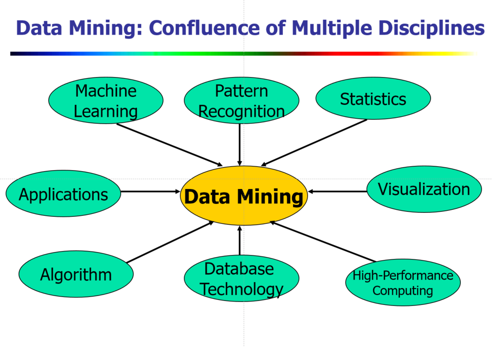
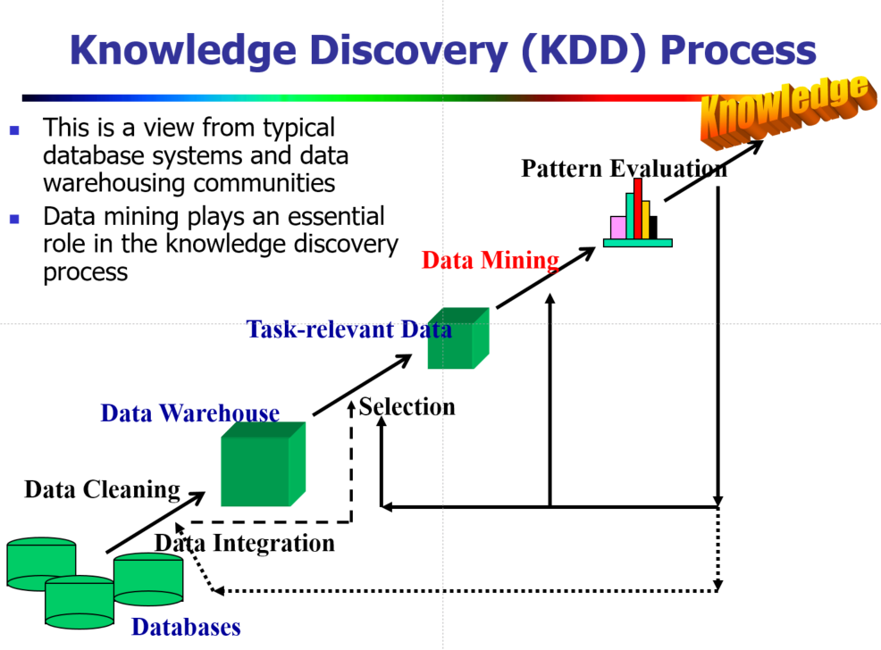
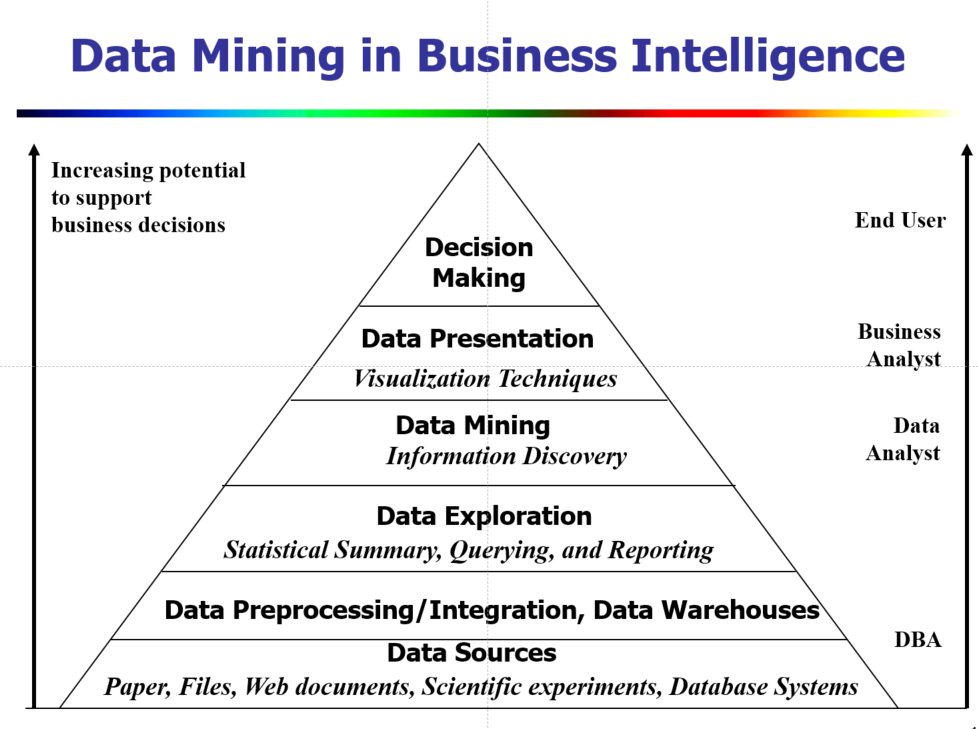
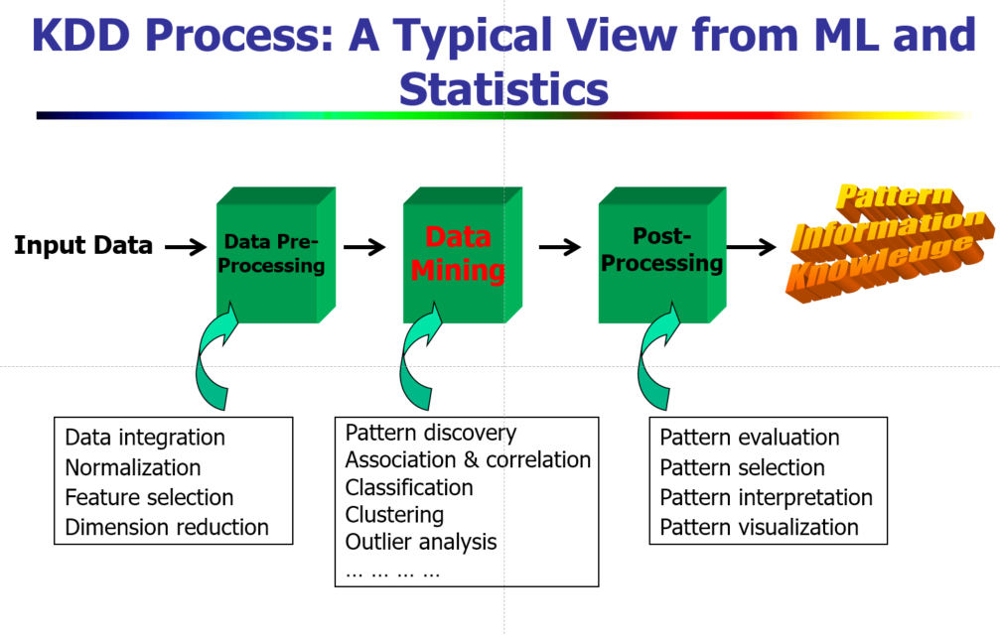
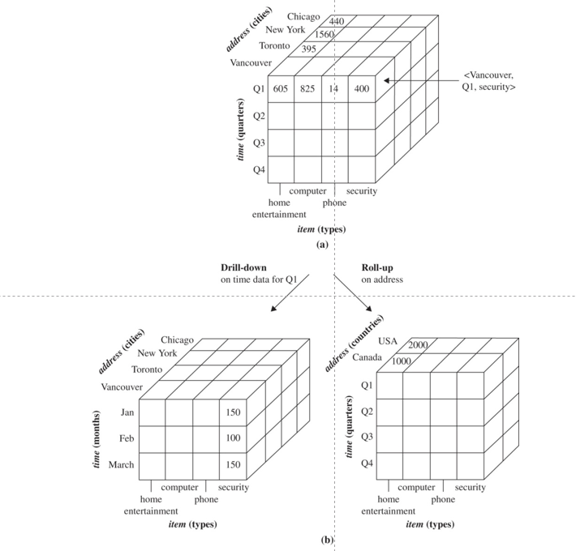
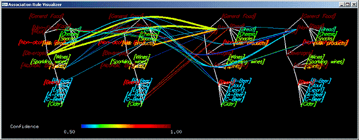

# Week 1 Introduction to Data Mining

## 1. Introduction (Text: 1)

> Most of this material is derived from the text, Han, Kamber and Pei, Chapter 1, or the corresponding powerpoint slides made available by the publisher.  Where a source other than the text or its slides was used for the material, attribution is given. Unless otherwise stated, images are copyright of the publisher, Elsevier.
>
> In this e-book we motivate and give a broad outline of the course content and go into a bit more detail on topics relevant to your assignment.

### 1.1 Why Data Mining?

The Explosive Growth of Data: from terabytes to petabytes

- Data collection and data availability
  - Automated data collection tools, database systems, Web, computerised society
- Major sources of abundant data
  - Business: Web, e-commerce, transactions, stocks, Web shopping…
  - Science: Remote sensing, bioinformatics, instrumentation and simulation, astronomy
    - Australia's ASKAP now generating 5.2 terabytes/sec [[Conversation](http://theconversation.com/the-australian-square-kilometre-array-pathfinder-finally-hits-the-big-data-highway-71217)]
  - Society and everyone: news, digital cameras, YouTube, twitter
  - Government: Medicare claims, Tax returns, cash transaction reports,  arrival cards, business surveys, census

We are drowning in data, but starving for knowledge!

Necessity is the mother of invention"- hence Data mining—Automated analysis of massive data sets

Read: [Companies and governments need to get on board with data](http://www.afr.com/technology/companies-and-governments-need-to-get-on-board-with-data-20170519-gw8f2v)

### 1.2 What is Data Mining?

#### Data Mining (knowledge discovery from data)

Definition: **Extraction of interesting (non-trivial, implicit, previously unknown and potentially useful) patterns or knowledge from huge amounts of data**

This can also be described as **building models** of data and **evaluating the models **for usefulness.

**Alternative names: **Knowledge discovery in databases (KDD), knowledge extraction, data/pattern analysis, data archaeology, data dredging, information harvesting, business intelligence, machine learning, pattern recognition etc.

Watch: [What is Data Mining? (Business-oriented)](https://www.youtube.com/watch?v=R-sGvh6tI04)

#### Data Mining vs Machine Learning vs Statistics?

No strict distinction, but indicative of a research or business community.**Machine Learning** as induction, abduction and generalisation is older and arose as a branch of AI in the very early days of computing. **Data mining**  (and KDD) arose from Database research in the early 90s.  Machine learning may aim at more agent-oriented methods such as incremental, active and bio-inspired learning. Data mining is more likely to be batch- and large-data- oriented.  Both schools draw heavily on **Statistics **for data characterisation. Some machine-learning/data-mining techniques also arise in Statistics e.g. Naive Bayes, Decision trees.

Due to the very mixed heritage of data mining techniques, you will see data mining language arising from each of these three discipline areas, with very often different names used for the same or a very similar idea. For example, the very fundamental idea of an atomic chunk of data that contributes to the description of some object of interest is variously called an *attribute*, a *feature*, or a *variable*. This course primarily uses the language in the text, which is primarily derived from a  database background, but as a practicing data miner, you must be able to recognise and interchangeably use the various terms.

The professional data miner often needs to be multi-skilled:

The following diagram illustrates that data mining is usually regarded as only one element of KDD, although it is common enough to describe the whole process as data mining.

**Data Cleaning:** Removes noise and inconsistent data

**Data integration:** Multiple data sources are combined

**Data Selection:** Relevant data is retrieved from a data warehouse

**Data Transformation** (not shown above): Data is transformed and consolidated by summary or aggregation operations

**Data mining:** Intelligent methods are applied to extract data patterns

**Pattern evaluation:** Interesting patterns are identified

**Knowledge Presentation:** Present mined knowledge to users via visualisation and knowledge representation.

Example: **Web mining** usually involves

- Data cleaning
- Data integration from multiple sources
- Warehousing the data
- Data cube construction
- Data selection for data mining
- Data mining
- Presentation of the mining results
- Patterns and knowledge to be used or stored into knowledge-base

In **Business Intelligence, **the warehouse, data cube and reporting are emphasised, but targeted at (human) data exploration and presentation, not much on automated mining. Note the attribution of tasks to occupational roles.

In **Statistics and Machine Learning,** the process might look more like this.

### 1.3 What Kind of Data Can be Mined?

Well.... any kind that can be represented in a machine.

This course focuses on database data, data warehouse data and transactional data - the typical kind of data likely to be held in government repositories.

We also lightly cover some of the more advanced and more complex data types:

- Data streams and sensor data
- Time-series data, temporal data, sequence data (incl. bio-sequences)
- Stucture data, graphs, social networks and multi-linked data
- Spatial data and spatiotemporal data
- Text data
- The World-Wide Web, particularly *linked data*

Other complex data areas  that we will not cover are

- Multimedia data
- Heterogeneous databases and legacy databases
- Object-relational databases

### 1.4 What Kind of Patterns Can be Mined? 

The following summarises patterns and corresponding  methods, most of which  will be covered in detail through the course. 

#### Data Mining for Generalization

- Data warehousing
  - multidimensional data model
  - Data cube technology 
  - OLAP (online analytical processing)
- Multidimensional  class or concept description: Characterization and discrimination
- Generalize, summarize, and contrast data characteristics, e.g., dry vs. wet region
- Data characterised by a user specified class description can be retrieved from a warehouse
- Data discrimination can compare features of selected classes
- OLAP operations can be used to summarise data along user-specified dimensions 

#### Frequent Patterns, Association and Correlation Analysis

- Frequent patterns (or frequent itemsets)
  - What prescribed drugs are frequently taken together? What welfare payments are frequently received together?
- Association, correlation vs. causality
  - A typical association rule: Tertiary Education -> Atheist  [10%, 20%]  (support, confidence)
  - Are strongly associated items also strongly correlated?
- How to mine such patterns and rules efficiently in large datasets?
- How to use such patterns for classification, clustering, and other applications?

#### Classification

- Classification and prediction 
  - Construct models (functions) based on some training examples (**supervised** learning)
  - Describe and distinguish classes or concepts for future prediction
  - E.g., classify countries based on (climate), or classify cars based on (gas mileage)
  - Predict unknown class labels

- Typical methods - Decision trees, naïve Bayesian classification, support vector machines, neural networks, rule-based classification, pattern-based classification, logistic regression, …
- Typical applications - Credit card or taxation fraud detection, direct marketing, classifying stars, diseases,  web-pages, …

#### Clustering / Cluster Analysis

- **Unsupervised** learning (i.e., Class label is unknown)
- Group data to form new categories (i.e., clusters), e.g., cluster houses to find distribution patterns, cluster youth in detention to develop  targeted interventions.
- Principle: Maximizing intra-cluster similarity & minimizing inter-cluster similarity
- Many methods and applications

#### Outlier Analysis

- Outlier: A data object that does not comply with the general behavior of the data
- Noise or exception? ― One person’s garbage could be another person’s treasure
- Methods: by-product of clustering or regression analysis, …
- Useful in fraud detection, rare events analysis, who is slipping through the safety net?

#### Others

- Sequence, trend, and evolution analysis (for temporal  or other sequence data)
- Structure, network and text analysis, e.g. Web mining
- Inductive logic programming e.g. linked data mining

### 1.5. What makes a pattern useful?

One of the challenges in data mining is that automated tools can typically generate thousands or millions of patterns. Ultimately,  not all can be used, so data miners and their tools need to be able to select* interesting* patterns for further study and possible application.

Typically a pattern is **interesting** if

- it is easily understood by humans working in the domain of application
- it is *valid* (true), with some required degree of *certainty*, on sample data and real  data in practice
- it is potentially useful or actionable
- it is novel, that is not already well known or else it validates a hypothesis that needed confirmation

An interesting pattern can be characterised as representing knowledge.

However, not all of these conditions are achieved by all mining methods, and not all these conditions *can *be met in automated ways.

**Objective** and automatable measures of pattern interestingness do exist, based on pattern structure and statistical measures.Commonly such a measure would need to exceed some user-selected *threshold* to be considered interesting, or alternatively, just some user-selected number of the *best-ranked* patterns by that measure are considered **interesting.**

For example, *support* and *confidence* are used to assess association rules. These indicate respectively  how much of the data the rule has any relevance to, and how much of the relevant data it is valid for.  *Coverage* and *accuracy*  have respectively  similar roles for classification rules. The *simplicity* of the pattern is commonly assesed, too. The formulation of these objective measures may be  specific to a mining method and is not directly comparable across methods.

**Subjective **measures of interestingness, based on user beliefs about the data,  are also generally required. These may be domain-dependent and it is typically the task of a data miner (you!) to know enough about the domain of the data and the proposed application of the mining results to be able to apply judgement here.  Results will generally need to be communicated and shared with other domain experts prior to accepting and acting on them.****

Subjectively, interesting patterns may be *unexpected (I did not know this!), actionable (I can use that result to change what we do), or confirming (I had a hunch that might be true, but now I have evidence for it)*

It is highly desirable for data mining methods to generate only interesting patterns for users. It is also efficient for data mining methods to use concepts of interestingness internally during the search for patterns, so that computations that will result in uninteresting patterns need not be explored. This means that in order for a method to be  a  viable candidate for a data mining problem, the notion of interestingness built in to the method must be aligned to the user's concept of interestingness associated with the problem.

*Interestingness*, and how it can be used for efficient mining, is an important aspect of every data mining technique, and it affects the nature of problems to which the technique can be applied.

### 1.6 Challenges in Data Mining

#### Basic Competency

It does not take a lot of skill to pick up a data mining tool and to push its buttons to run some algorithms  over some data and to get some output back again. But this approach will not provide the required insight into application problems and can be very harmful in some circumstances.

The competent data miner *must *be capable of 

- Selecting the right tool for the job. This will be informed by both the question being asked and the nature of the data that is used; 
-  Evaluating  the output of the tool. What is it telling you? How good are the results? Is there a way of obtaining better results? What does "better" mean for the particular question being asked?; and
- Interpreting the results in the context of the question. What can be learnt from the results and  for what purpose can that information be ethically and robustly used?   

The following challenges are indicative of the issues which professional data miners encounter and for which data mining researchers attempt to create new methods.

#### Mining Methodology

- Mining various and new kinds of knowledge
- Mining knowledge in multi-dimensional space
- Interdisciplinary skills
- Boosting the power of discovery in a networked environment
- Handling noise, uncertainty, and incompleteness of data
- Pattern evaluation and pattern- or constraint-guided mining

#### Leveraging Human Knowledge

- Goal-directed mining
- Interactive mining
- Incorporation of background knowledge
- Presentation and visualization of data mining results

#### Efficiency and Scalability

- Data reduction
- Efficiency and scalability of data mining algorithms
- Parallel, distributed, stream, and incremental mining methods

#### Diversity of Data Types

- Handling complex types of data
- Mining dynamic, networked, and global data repositories

#### Data Mining and Society

- Social impacts of data mining
- Privacy-preserving data mining
- Invisible data mining

Watch: [Invisible Data Mining](https://vimeo.com/134832714)

### 1.7 Privacy Implications of Data Mining (Text 13.4.2)

*This material is derived and extended from Section 13.4.2 of the text.*

Data mining often uses information about individual people. 

- People often feel that this information is private to themselves, and only the person in question has the right to decide who to share it with, and for what purpose.
- People often willingly or unconsciously but consentingly share such private information.
- The information may be shared for reasons quite independently of data mining, but it may be mined for *secondary use.*
- e.g. credit card transactions, health records, personal financial records, individual biological traits, criminal or justice investigations, ethnicity, educational performance.**

Not all data mining uses personal data, although it may nevertheless be*confidential* data.

- e.g. natural resources, climate and weather, water storage and floods, astronomy, geography, geology, biology
- other scientific and engineering data

Access to individual records directly attributable to individual people is the most common source of concern. This data may leak in ways that have no connection to data mining (e.g Web shopping). Nevertheless, when it is collected initially for the purposes of mining, or when mining is a secondary use, the data miner should be aware of their legal and ethical obligations to protect privacy.

Who has access to this data?

Watch: [TIME columnist Joel Stein learns just what data mining companies know about him. Turns out, it's a lot](http://content.time.com/time/video/player/0,32068,821500876001_2058396,00.html)

Read: [Trust me, I'm an algorithm](https://wattlecourses.anu.edu.au/pluginfile.php/1623207/mod_resource/content/2/new_scientist%2015_July_2017.pdf)

#### Privacy Principles

The OECD (Organisation for Economic Cooperation), of which Australia is a member,  publishes the O[ECD Privacy Framework 2013.](http://www.oecd.org/sti/ieconomy/oecd_privacy_framework.pdf) It  provides some useful principles for personal data, summarised here:

- **Collection Limitation**: Data should be collected by lawful and fair means, with the knowledge and consent of the individual where appropriate.
- **Data Quality**: For the purpose that data is used, it should be relevant, accurate, complete and up-to-date.
- **Purpose Specification:** Data should be collected only for a specified purpose, and used for that purpose (although alternative uses are conditionally possible).
- **Use Limitation**: Data should not be disclosed or used for other purposes unless authorised by the person or by the law.
- **Security Safeguards**: Data should be protected by reasonable security safeguards.
- **Openness Principle**:  Developments, practices and policies with respect to data should be open, including the existence and nature of data, the main purposes of use, and the identity and contact method for a data controller.
- **Individual Participation**: Individuals have the right to obtain confirmation of existence or absence of data relating to them, to obtain such data, to challenge such data, and if successful,  to have the data erased, rectified, completed or amended.
- **Accountability Principle**: A data controller is accountable for complying with the principles.

#### How to protect privacy when data mining

Careless disclosure control by data miners can be the cause of privacy breaches. Private data should be managed securely, and privacy-preserving data mining can be used to ensure that the results of data mining can be shared without sharing personal data.

**Data-security enhancing techniques** include

- **Multilevel security model in databases** - users are authorised to access only data that is classified at their security level. Although can permit an inference of hidden data.
- **Encryption** - personal data may be encrypted and protected by signatures, biometrics, locational distribution.
- **Intrusion detection** - actively monitor for breaches
- **Physical access control -** keep the data off-network and secured in a physical space.

**Privacy-preserving data mining techniques **include

- **Randomization methods (a.k.a perturbation) -** where noise is added to the data (i.e .errors are introduced), that are sufficiently large to hide the genuine values, but so that the final results of data mining will be preserved -e.g. aggregate distributions are preserved.****
- **K-anonymity methods **- where the granularity of data is reduced so that at least *k* individuals share the same data so no individual can be uniquely recognised (e.g. grouping street address to postcode).****
- **L-diversity methods  **- where granularity is reduced as for *K*-anonymity but additionally values for particularly sensitive information within a group are required to be diverse  (e.g. all salary brackets should be represented in the group with the same postcode).
- **Distributed Privacy Preservation methods ** - large data sets are partitioned into subsets that are mined independently but limited information sharing of data mining results can assure individual privacy while enabling aggregate results.
- **Downgrading results **- Hide some of the results like association rules or clusters that apply to small numbers of individuals.
- **Differential Privacy **- use special algorithms that are formally guaranteed to give approximately the same results on data sets that differ in only a small number of records, so that the presence of absence of an individual's data does not affect the result significantly.
- **Statistical Disclosure Control - **implement governance procedures that ensure sensitive information is not released. 

## 2. Popular Data Mining Tools

Please have a look over these popular data mining tools. This information was primarily derived from [here]([https://togaware.com/datamining/survivor/index.html ](https://togaware.com/datamining/survivor/index.html)) and is copyright TogaWare.

## 3. Reading and Exercises

For this week's hands-on you are asked to learn a little about the data mining tool we will be using often in this course.

Read: [Williams, Rattle: A Data Mining GUI for R, The R Journal December 2009](https://wattlecourses.anu.edu.au/mod/resource/view.php?id=1298456)

Install Rattle and get to know it.

Set Up for Data Warehouse Activities.

## 4. Quiz