# Week 10 Text and Web Mining

## 1. Introduction (not covered in text)

Most of this material is derived from the **2nd edition** 2006 of the text Han and Kamber, Data Mining Concepts and Techniques, Chapter 10, or the corresponding powerpoint slides made available by the publisher.  Where a source other than the text or its slides was used for the material, attribution is given. Unless othewise stated, images are copyright of the publisher, Elsevier.

Many images in chapter  2  were provided by Gaya Jayasinghe, and are individually attributed.

## 2. Text Data Analysis and Information Retrieval (not in text)

**Typical information retrieval systems**

- Online library catalogues
- Online document management systems
- News and legal databases
- Recommender systems (that *push* rather  than *pull* information)
- While IR has a long history, the innovation of **Web search engines** has driven development in the past 25 years.

**Information retrieval (IR) versus database (DB) systems**

- Some DB problems are not present in IR, such as: updates, transaction management, complex structured objects
- Some IR problems are not addressed well in DBMS, for example:
  - unstructured documents
  - approximate search using keywords and relevance

### 2.1 Basic Measures for Information Retrieval

First, how do we evaluate quality?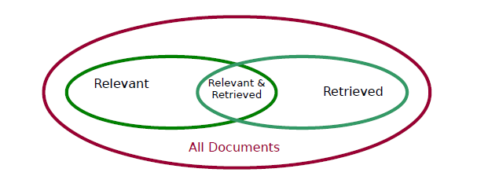

**Precision**: the proportion of retrieved documents that are in fact relevant to the query (i.e., the “correct” responses)

$precision = \frac{|\{Relevant\}\cap\{Retrieved\}|}{|\{Retrieved\}|}$

**Recall:** the proportion  of documents that are relevant to the query and were, in fact, retrieved

$precision = \frac{|\{Relevant\}\cap\{Retrieved\}|}{|\{Relevant\}|}$

There is typically a tradeoff between precision and recall, as you can get perfect recall but very poor precision by retrieving everything. You can get perfect precision by retrieving just one relevant document, but the recall will be very poor if there were many more relevant documents that should have been retrieved.

They can be combined into one measure, called the **F-score**, (or commonly *F-measure,* or *F1*) which is the*harmonic mean*  of the two that disfavours one variable's high performance at the expense of the other. 

$\frac{2\times precision \times recall}{precision + recall}$

**Action: Think where you have seen this before** (see [various evaluation measures in a confusion matrix](https://wattlecourses.anu.edu.au/mod/book/edit.php?cmid=1169846&id=228387)). Although orignally developed for information retrieval these have become used for classification, too, as they emphasise the behaviour of positives in an asymmetric space where the negatives dominate.

### 2.2 Information Retrieval Techniques

**Basic structure**

Text comprises a **sequence of words**  (or commonly simply a **bag** of words). Words are also called *terms.*

A  sequence of words is aggregated into a **document**.

A set of documents is aggregated into a **collection** or ***corpus***.

A document can be described by a set of representative **keywords** called **index terms.**

- These index terms take the role of *attributes* in Information Retrieval
- Can be *binary-valued attributes*: absence or presence

But different index terms have varying relevance when used to describe document contents.

- This effect is captured through the assignment of numerical **weights** to each index term of a document (for example, *frequency,* or *TF-IDF*)
- These weights take the role of *attribute values.*

**Basic Process**

(1) Select index terms

(2) Build an index (high dimensional term and document frequency matrices)

(3) Match the query to the index to retrieve optimal answers, typically by a

- Boolean model
- Vector space model, or
- Probablistic model (categories modeled by probability distributions, find likelihood a document belongs to a certain category, similar to Bayesian classification)

### 2.3 Selecting Index Terms

The words in the document are selected for indexing by preprocessing, typically:

(1) **Tokenising** -- separate based on spaces and other punctuation and remove punctuation

(2) **Normalisation and Stemming** -- reduce the word to a canonical form to remove syntactic variance

(3) **Remove Stop Words** -- these are typically very common words of little meaning, (e.g. the, of,  for, to, with)  but can also be chosen to suit the problem domain (e.g. "law" in a legal database).


### 2.4 Building an Index

Indexes need to link the (preprocessed) words in the document collection to the documents in which they occur. This is typically a **term-document matrix**  or similar **inverted index**. A **signature file** is an alternative approach.

An inverted index is well-suited to parallel computation using methods like MapReduce over distributed file systems.  

**Example**

Let us build a **term-document matrix** for documents *D1* and *D2*  (term x document, with an aggregate document count also shown here).

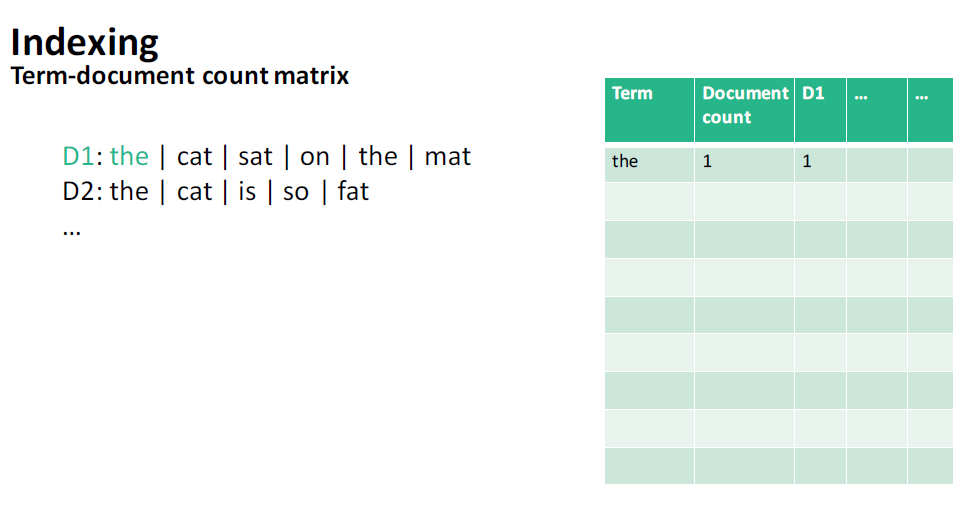

then

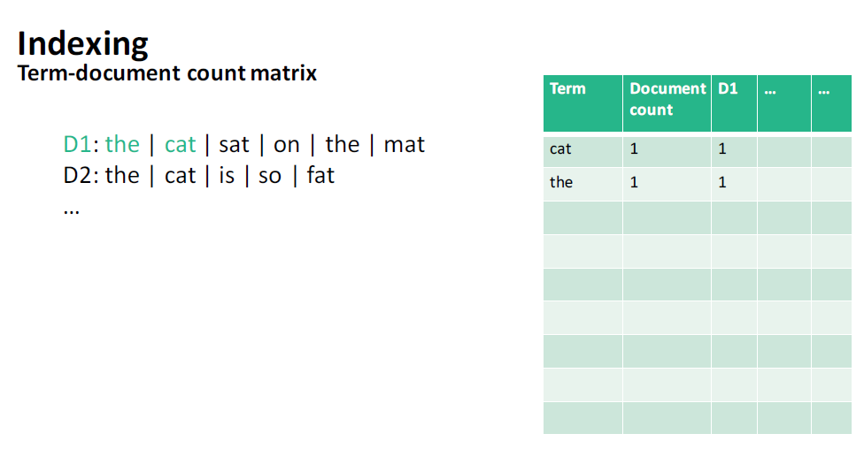

… and so on to

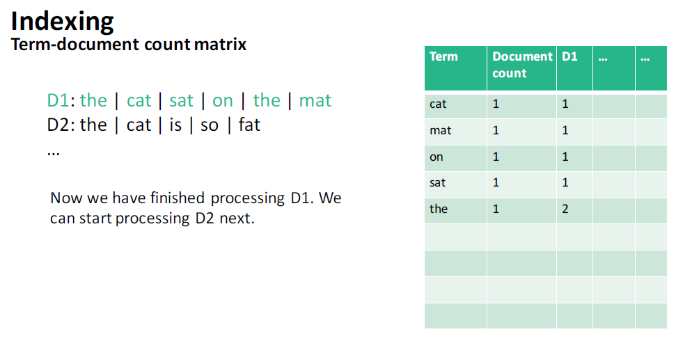

… and eventually finish the term-document matrxi with

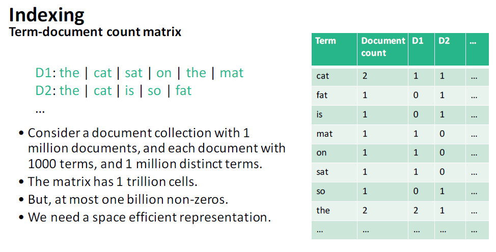

In practice, this may be represented as a much more compact  **inverted index** for large document collections (such as the Web) as:


Note that each column of the matrix identifies the frequency of words in that document, which is a **term vector,**or a **feature vector** for that document.

### 2.5 Matching the query to the index

Similarity metrics: measure the closeness of a document to a query (a set of keywords).

 **Boolean queries**

For Boolean queries such as in a library catalogue, a **query** is composed of index terms linked by three connectives: not, and, and or.

That is, for queries of the form $W_1$ AND $W_2$ AND NOT $W_3$ for words $W_i$, the index can be used directly to retrieve matching documents (possibly after query pre-processing to remove stop words etc).

**Vector space model**

But for the vector space model for queries, and document clustering approaches, we need a richer notion of document similarity.

If querying, the query itself is modelled as any other document for matching. We want to be able to *rank*matching documents  by similarity to the query. For this we  use dot product or cosine similarity, over **weighted**document vectors.

Given two documents $D_i=(w_{i1},w_{i2},\dots,w_{iN})$ and $D_j=(w_{j1},w_{j2},\dots,w_{jN})$

**Dot Product similarity**

$Sim(D_i,D_j)=\sum^N_{i=1}w_{it}*w_{jt}$

**Normalized Dot Product (Cosine similarity)**

$Sim(D_i,D_j)=\frac{\sum^N_{t=i}w_{it}*w_{jt}}{\sqrt{\sum^N_{t=1}(w_{it})^2}*\sum^N_{t=1}(w_{jt})^2}$

Recall cosine similarity for sparse vectors in Week 2.

We can use simple boolean weights, i.e. 0 for a term's absence and 1 for a term's presence, but more sophisticated weightings have shown to be beneficial.

### 2.6 How to assign weights to term occurrences

Here are three **weighting heuristics** based on term frequency and document frequency, but many other variants are used in practice. TF-IDF is a very common choice.

**TF (Term Frequency)**

- More frequent within a document => more relevant to semantics of document as a whole

- e.g. “classification” versus “SVM”

- **Raw TF = tf(t,d)** from the term-document  matrix i.e. how many times term *t* appears in doc *d*

- However,
  - Document length varies => relative frequency within the document preferred to avoid bias against short documents.
  - Relevance is not linearly proprtional to the term frequency.
  - So perform normalisation or scaling. Many ways are possible.

- For example, use **logarithmic term frequency** to get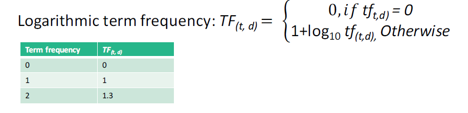

- **IDF (Inverse Document Frequency)**

  Terms less frequent among documents in collection ==> more discriminative and hence more useful
  • e.g. “algebra” versus “science”

  So assign a higher weight to rare terms than frequent terms

  • Formula:
  *n* = total number of documents
  *k* = number of documents with term *t* appearing (also called *DF(t)*)

  $IDF(t)=1+\log(\frac{n}{k})$

  **Example:**

  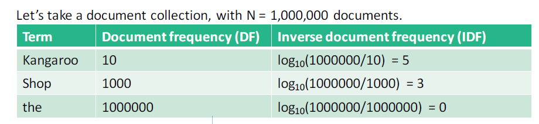

  **TF-IDF (Inverse Document Frequency)**

  TF and IDF may be combined to form the **TF-IDF measure**

  $TF-IDF(t,d)=TF(t,d)*IDF(t)$

  - Frequent within doc => high TF => high weight 
  - Selective among docs => high IDF=> high weight

### 2.7 Putting it together: Ranking in the vector space model

**Example**: ranking for information retrieval

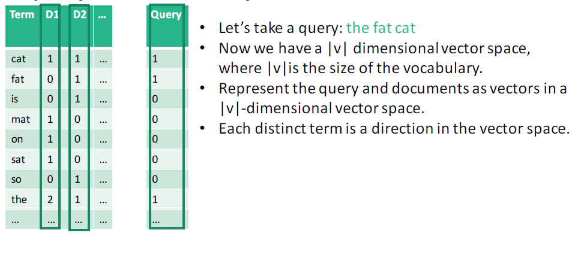

1. Query: Weight query terms as TF-IDF and normalise (to unit length)

2. Documents: Weight document terms by TF and normalize (to unit length)

3.  Compute **Relevance(Query, $D_i$) = Sim(Query,$D_i$)  where Sim is cosine similarity.**

   That is, the  relevance of document $D_i$ expressed as a normalised TF-weighted vector, to the query $Q$ expressed as a normalised TF-IDF-weighted vector, is given by

   $relevance(Q,D_i)=cosine(Q,D_i)$

Example: Below we can see the Query and 3 documents, $D_1$, $D_2$ and $D_3$ projected on to 2-D vector space (or where |v| =2, so only 2 dimensions). $D_3$ is the most relevant because the angle between Query and $D_3$ is the smallest. Similarly, the  ranking order will be *D3 D2 D1.*


**How do you know if your relevance ranking is any good?**

- Carry out experiements using Precision, Recall or F-score, where  you have a "**gold standard**" set of validation queries with the right answers already selected by people.
- On-line learning from user behaviour and feedback can be used to improve performance: *relevance feedback*
- This is the underlying basis of modern web search, but there are **many** more things done, too.

## 3. Text mining problems (2nd ed of text)

What do we have so far?

- A feature space with a similarity measure
- This is a classic supervised learning problem!

We can use a  standard classifier or clustering method

- Vector space model based classifiers
- Decision tree based
- Neural networks
- [Support vector machine](https://wattlecourses.anu.edu.au/mod/resource/view.php?id=1298528)

To solve problems in

- Keyword-based association analysis
- Automatic document classification
- Similarity detection
- Link analysis: unusual correlation between entities
  - Cluster documents by a common author
  - Cluster documents containing information from a common source
- Sequence analysis: predicting a recurring event
- Anomaly detection: find information that violates usual patterns
- Hypertext analysis
  - Patterns in anchors/links (for example, anchor text correlations with linked objects)

For applications: news article classification, automatic e-mail filtering, Web page classification, hate blogs, etc.

**ACTION: Think of some more applications for these techniques for data mining over text, beyond information retrieval.**

### 3.1 Keyword based association analysis

**Motivation**
• Collect sets of keywords or terms that occur frequently together and then find the association or correlation relationships among them

**Association analysis process**

-  Pre-process the text data by parsing, stemming, removing stop words, etc.
- Invoke [association mining](https://wattlecourses.anu.edu.au/mod/book/view.php?id=1298487) algorithms (week 4)

• Consider each **document** as a **transaction**
• View a set of words in the document as a set of items in the transaction

- Term level [association mining](https://wattlecourses.anu.edu.au/mod/book/view.php?id=1298487) (week 4)
  - Can extract compound associations as entities or domain concepts (e.g. "New South Wales", or "big data").
  - Can replace human effort for tagging documents in databases.
  - The number of meaningless results and the execution time is greatly reduced over word-based search or mining

Example: What is being said about Donald Trump this week?

### 3.2 Text Classification

**Motivation**
• Automatic classification for the large number of on-line text documents
(Web pages, e-mails, corporate intranet documents, etc.)

**Classification process**

• Data pre-processing
• Definition of training set and test sets
• Creation of the classification model using the selected classification algorithm
• Classification model validation
• Classification of new/unknown text documents

**Text document classification differs from the classification** **of relational data**
• Document databases are not structured according to attribute-value pairs

**Class labels (categories) may be developed by hand**

- Pre-given classes (categories) and labeled documents (examples)
- Categories may form hierarchy/taxonomy
- Classify new documents
- A standard classification (supervised learning) problem


**Classification algorithms that are used:**

- Support vector machines
- K-nearest neighbors
- Naïve Bayes
- Neural networks
- Decision trees
- Association rule-based
- Boosting
- more..

Here are some methods from the literature used for such classification.

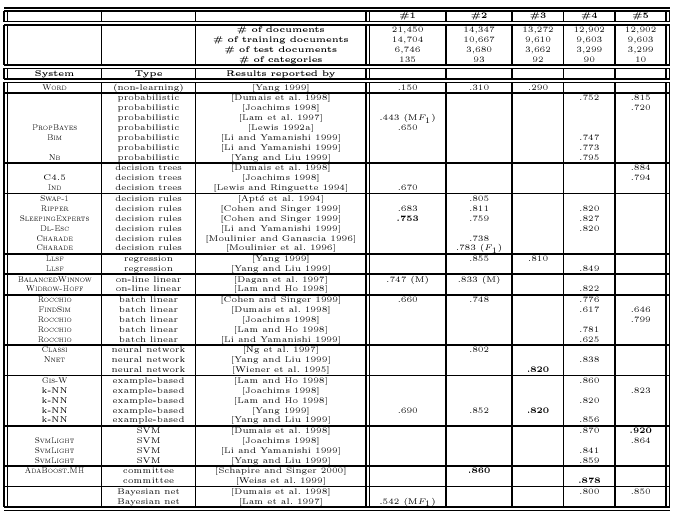

### 3.3 Document Clustering

**Motivation**
• Automatically group related documents based on their contents
• No predetermined training sets or taxonomies
• Generate a taxonomy at runtime

**Clustering process**

• Data **preprocessing:** remove stop words, stem, feature extraction, lexical analysis, etc.

• Document vectors are very high-dimensional -- need to **project to a lower-dimensional** space using spectral clustering, mixture model clustering, Latent Semantic Indexing or Locality Preserving Indexing.

• **Hierarchical clustering**: compute similarities applying clustering algorithms

or
• **Model-based clustering** (neural network approach): clusters are represented by “exemplars” (for example Self-Organising Maps, SOM)

## 4. Word meaning (not covered in text)

Recently, the **Word2Vec** models have become very popular for their ability to  represent word meaning as a vector of probabilities of association with other *context* words, partially replacing earlier approaches such as*latent semantic analysis*.

One important training algorithm is **Continuous Bag of Words** whereby neural net classifiers are trained on a*window* of the words surrounding the target word in the corpus to predict the missing word. The other algorithm,**Continuous Skip-gram** does the reverse and predicts the surrounding words based on a single focus word. 

It turns out that this causes the neural net to represent *meaning* in the sense that the vectors in the learnt classifiers for words can be arithmetically manipulated to derive the representations for similar words. Famously,

vector(”King”) - vector(”Man”) + vector(”Woman”) = vector("Queen")

Tomas Mikolov, Kai Chen, Greg corrado, Jeffrey Dean,   *Efficient Estimation of Word Representations in Vector Space*, arXiv preprint, arXiv:1301.3781  https://arxiv.org/pdf/1301.3781.pdf  2013

## 5.Web mining (2nd ed of text)

**The Web as a data source**
• The biggest source of information
• Distributed, dynamic, linked, new data types 
• Web pages contain semi-structured data (HTML and XML), as well as free format text, images, videos, sounds, etc.
• Many Web pages are dynamically created, often by accessing databases (for example online stores, information directories, search engines)
• Web pages are linked
• Some parts of the Web are only accessible to certain people (logins required)
• New [*Semantic Web/ Linked Data* ](https://wattlecourses.anu.edu.au/mod/book/view.php?id=1298538)standards for reperesentation of Data on the Web improve capability for data integration, data re-use and data mining. (We will be doing more on this later).

**Types of Web mining**

• Mining the Web page layout structure
• Mining the Web's link structure
• Mining multimedia data on the Web
• Automatic classification of Web documents
• Weblog mining 
• Linked data mining

### 5.1 Mining Page Structure

- Compared to plain text, a Web page is a two-dimensional presentation 
- Rich visual effects created by different font types, formats, separators, blank areas, colours, pictures, etc
- Different parts of a page are not equally important 

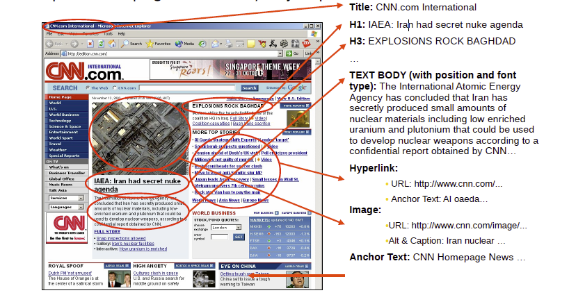

Mining over **content,** plus **hyperlinks**, plus**layout:** two-dimensional  visual layout and DOM tree structure.

DOM is more related to content display,  and may not reflect semantic structure

Example: VIPS

Deng Cai, Shipeng Yu, Ji-Rong Wen, Wei-Ying Ma, *VIPS: a Vision-based Page Segmentation Algorithm*, Microsoft Technical Report, November 2003.<https://www.microsoft.com/en-us/research/publication/vips-a-vision-based-page-segmentation-algorithm/>

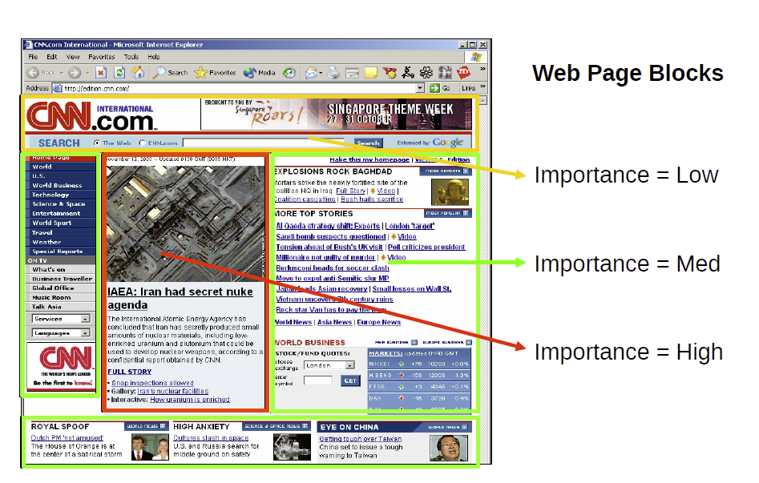

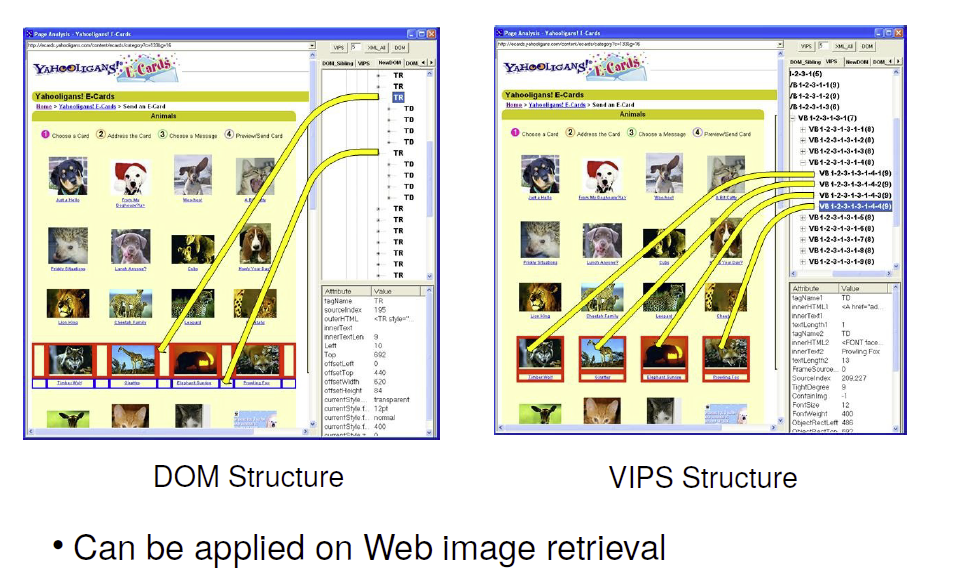

### 5.2 Mining Web link Structure

- The Web is a massive graph (Web pages are nodes, hyperlinks between them are edges)

  - Can use graph and link mining approaches

- Example: Find authoritative Web pages on a certain topic

  - i.e a page many other pages point to
  - Not as easy, for example www.google.com does not explicitly contain "Web search engine"
  - Commercial and competitive interests, such as advertisements, distort the picture, as do many navigational link

- To find authoritative Web pages, use hub pages (pages that provides links to many authoritative Web pages)

  - Example hub page: a personal home page with a list of recommended links

  - HITS (Hyperlink-Induced Topic Search): Start from search query, get root page set, which is then expanded, and iteratively propagate weights for hub and authoritative page weights

     

### 5.3 Mining Multmedia on the Web

- Data includes images, video, audio, graphs, etc.
- Mostly embedded into Web pages, often via hyperlinks
- Increasing demand for effective methods to organise and retrieve multimedia data
- Web page layout mining can be used to find multimedia blocks
- Example: Classify images
- Use VIPS to identify multimedia blocks in a Web page
- Use textual description around images for classification/categorisation
- Use block-level link analysis (rather than page level link analysis such as Google's PageRank)

### 5.4 Web Usage Mining

- Mining Web log records to discover user access patterns of Web pages
  - For example: “*after looking at a  digital camera pages, 70% of users will look at memory card pages*”
- Web log entry: URL requested, source IP address, time stamp, browser details, cookies, etc.Apply association and frequent pattern mining, and trend analysis
  - Low level details, need to be cleaned, condensed, and transformed
  - Use data stream mining techniques
- Applications: e-Commerce, improve Web system design (navigation and caching), Web page pre-fetching, adaptive Web sites (that depend upon user's history)

## 6. Query-answering

**ACTION:** If you are interested in how these elements are put together in Watson, the IBM system that famously beat the best humans in a television game show using Web information,  this talk by Chris Welty in 2011 is an entertaining introduction,  with  some insight into the research process and some predictions for the future that is already here.

[IBM Watson Project](http://videolectures.net/eswc2011_welty_watson/) Chris Welty, Marko Grobelnik

## 7. Text Understanding and the Brain (not in text)

**ACTION: Watch  and discuss this video in the lecture**

June 15, 2017: Using Machine Learning to Study Neural Representations of Language meaning, with Tom Mitchell [video](https://videoken.com/embed/?videoID=Xc5SM9sbUiQ)

## 8. Practical Exercises: Text Mining

**Text and Web Mining in Rattle**

**Objectives**

The objective of this exercise is to experiment with the text mining capabilities available in **R**, in order to better understand the issues involved with text mining  to consolidate the lectures in this topic. Unfortunately, **Rattle** does not provide a user interface to these R packages so we will need to work with R directly.  These instructions are intended to be sufficiently well-defined so that you should still be ok if your R knowledge is very slim.

The exercises are inspired by [Hands-On Data Science with R Text Mining](http://onepager.togaware.com/TextMiningO.pdf) authored by Graham Williams, the author of Rattle.  If you would like to develop your skills further you might like to follow up with those notes.

**Preliminaries**

If you haven't done so yet, I suggest you create a **comp8410** folder and a **text_mining** folder within that.

Start **R** as you have done before. Here is a quick repeat of the steps involved:

a) Open a terminal window.

b) Start **R** by typing R (capitalised!) followed by 'Enter'.

We will be using several new packages in this session, and because we are not using **Rattle**, we will have to install them explicitly *if and only if you are working outside the lab* on your own **R** installation.  This will be once-off per R instance.

For each package, type `install.packages('packagename')` at the R prompt:

```R
install.packages('tm') 
install.packages('SnowballC')
install.packages('wordcloud')
install.packages('tmcn.word2vec',repos="http://R-Forge.R-project.org") # note word2vec  should be in this exercise but it is not currently working in the lab environment nor a Windows 10 platform. If you are interested,  having a look at this package is  recommended.
```

Irrespective of your **R** installation, you will  need to load the packages in each session. For each package, type library(*packagename*) at the **R** prompt:

```R
library(tm) 
library(SnowballC)
library(wordcloud)
library(word2vec)
```

Once loaded, you can use  library(help=*packagename*)for documentation. e.g. library(help=tm)

**Tasks**

**A. Load a corpus of text**

Our corpus contains four files that have been Web-scraped from the ANU’s own Program and Courses website. In each file, we can see  various course descriptions, with one paragraph each. The course descriptions are organised into a separate file for each ANU College that offers the courses. We have a file for CAP (Asia and the Pacific), CASS (Arts and Social Sciences), CECS (Engineering and Computer Science) and CMBE_CPS (Science, Environment, Medicine and Health).

1. Put the data files somewhere in a fresh directory, empty of other files:

2. At the **R** prompt, find out where your current working directory is `getwd()`

3. In **R**, Change to the directory where you just put your  data with `setwd()`: e.g. `setwd("C:/Users/ddiez/Dropbox/rFunction/Videos")`

4. In **R**, type  `dir('.')` to check you can see the data, your corpus of 4 files. 

5. To load the corpus into working memory, type

   ```R
   docs <- Corpus(DirSource('.'))
   ```

   Here we are assigning the value of the expression `Corpus(DirSource('.')) ` to the variable `docs` using the **R** *assignment* operator, `<-`

6.  Check this worked by typing  `docs`,  and then `summary(docs)`. Now look at the all the text: `inspect(docs)`. Notice that `docs` is an array of 4 documents, one for each file. You can reference the first document by  `docs[1]` (try it)  and then  try `inspect(docs[1])` and you can see the name of the source file and the full text of the first document.  Try the other elements of the `docs` array until you understand the structure.

**B. Preprocess the corpus**

Now we will prepare the data for mining. We can use transformations available in the `tm` package. `getTransformations()` will show you what they are (try it). We can also use some other basic **R** functions. We will use `tm_map()` and `content_transformer()` to apply selected transformations to each document in  our corpus `docs`.

1. Change everything to  to lower case. Type

   ```R
   docs<-tm_map(docs, content_transformer(tolower))
   ```

   Check: `inspect(docs[1])`

2. Remove stopwords.

   Type `stopwords('English')` to see a pre-built list of words we can use. Now use `tm_map` to remove them from every document:

   ```R
   docs<-tm_map(docs, removeWords, stopwords('English')
   ```

3. Remove punctuation.

   Note we cannot remove punctuation *before* removing stopwords with `stopwords('English')`. Why not?  Now,

   ```R
   docs<- tm_map(docs, removePunctuation)
   ```

   and have a look: `inspect(docs[1])`

4. Remove white space, including line breaks

   ```R
   docs<-tm_map(docs, stripWhitespace)
   ```

   And check: `Inspect(docs[1])`

5. Stem (remove grammatical word clues, such as verb endings  that are not relevant to our study). 

   Stem:  `docs<-tm_map(docs, stemDocument)`

   And have a look: `Inspect(docs[1])`

**C. Build a Document Term Matrix**

1. `dtm<- DocumentTermMatrix(docs)`

   and have a look at a summary of the matrix:  `dtm`

   `dim(dtm) `shows  that there are 4 rows and 1628 columns, that is, 1628 distinct terms.

   Have a deeper look: `inspect(dtm)`

2. What is the most frequent word across every document?  Why? Perhaps it would have been a good idea to remove some of those very frequent words as stop words earlier. However, it is pretty easy to see what kind of corpus we are working with by simply looking at those top 10 words – a very simple corpus summary. You can also see the sparsity (63%, i.e. 63% of all the [document, term] cells are 0) which is actually rather low – suggesting all these documents overlap  in their word choices quite a lot.  What do you notice about the term “system”?  Does that surprise you?

3. Have a look at the first 10 words:  `inspect(dtm[1:4, 1:10])`And the last 10: `inspect(dtm[1:4, 1619: 1628])` and you can see the sparsity. How are the terms ordered in the DTM?

4. We can also make the transpose *inverted index:* 

   ```R
   tdm<-TermDocumentMatrix(docs)
   inspect(tdm)
   ```

5. **D. Build a term frequency vector**

   We can obtain the term frequencies as a term frequency vector for the corpus as a whole, no longer distinguishing the separate documents in the corpus: `freq<-colSums(as.matrix(dtm))`

   We can sort the frequencies in ascending order (to obtain an index into the term frequency matrix): `ord<-order(freq)`

   Look at the most frequent terms at the end of the ordered rows `freq[tail(ord)]` and now the most frequent 10 terms `freq[tail(ord,n=10)]` and the most frequent 100 terms `freq[tail(ord,n=100)]`. Notice all those education-speak words! *Understand, question, explore, communicate, knowledge, research*  etc. Can you see how well they characterise the the corpus content, and therefore why they might be helpful in document classification?

   What terms occur at least 20 times? Type find `FreqTerms(dtm,lowfreq=20)`

**E. Look at term associations**

What words co-occur often with "data", "system" and "language"? Here the Pearson correlation is used,  with 0  for no correlation and 1 for full correlation,  associating the pattern of  a term 's frequency across documents with the pattern of other  terms in the same documents.

```r
findAssocs(dtm, 'data', corlimit=0.85)
findAssocs(dtm, 'system', corlimit=0.85)
findAssocs(dtm, 'languag', corlimit=0.85)
```

Why has 'languag' been used in place of 'language'? Can you see how different "system" and "language" are by association? Can you see a pattern that you can explain?

**F. Word clouds**

Can be a nice visual way to show word frequent  terms in the corpus:

`set.seed(8410) `– you don’t have to do this, but it f you do it each time before wordcloud you can get the same cloud image every time.

Now generate the word cloud: `wordcloud(names(freq), freq, min.freq=10)`

You can also add some colour, `wordcloud(names(freq), freq, min.freq=10, colors=brewer.pal(6, "Dark2"))`

If you have more time, you might like to play around with other options, see `help(wordcloud)`

**G. Finish. Don't forget to exit R and log out if you are in the lab.** 

