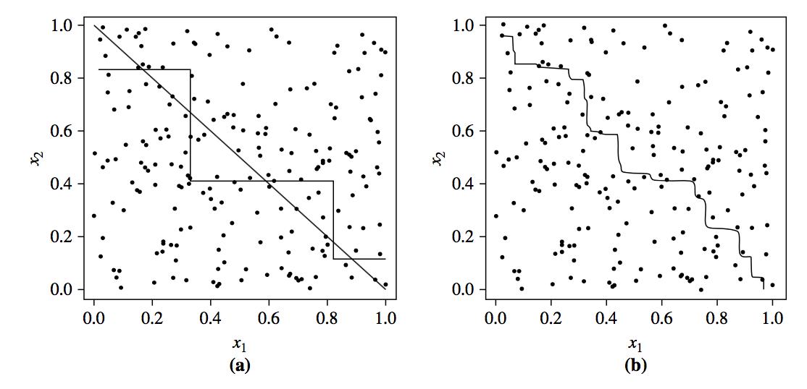
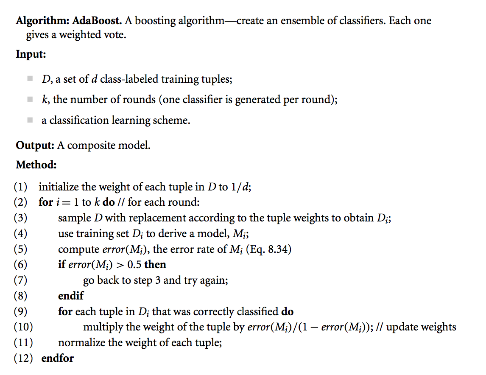
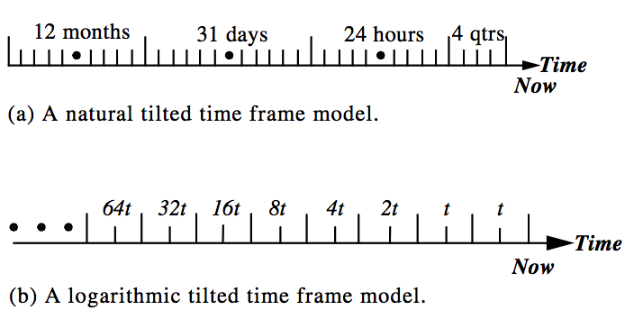
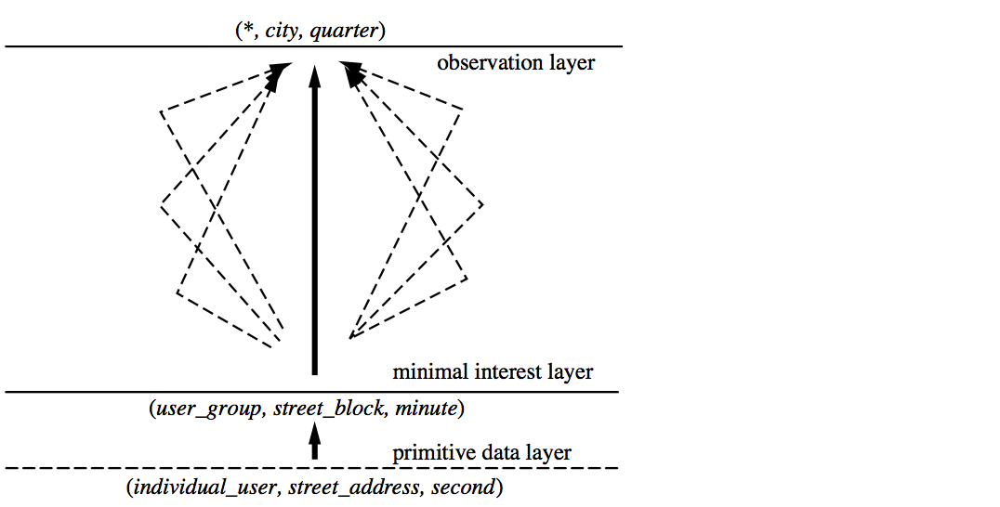
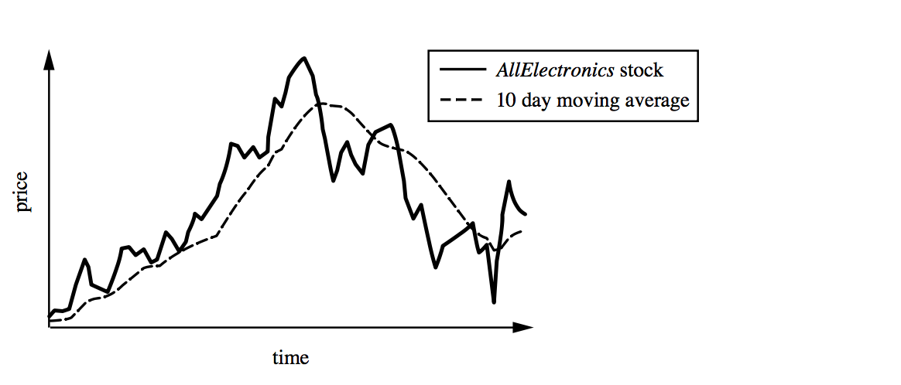

# Week 11 Specialist Topics

## 1. Introduction

The first part of this week's material is derived from Chapter 8 of textbook, or the corresponding powerpoint slides made available by the publisher.  The second part of this week's material is derived from Chapter 8 of the second edition of the text book. Unless otherwise stated, images are copyright of the publisher, Elsevier.

In this e-book we present some  ensemble methods for classification and prediciotn,  and some specialist topics in data mining: data streams and time series.

## 2. Ensemble Methods (Text: 8.6)

**Ensemble method**

- Assumption: a combination of multiple classifier will increase a classification performance.
- General approach
  - Given dataset $D$, create $k$ training datasets, $D_1,D_2,\dots, D_k.$
  - Train a classification model $M_i$ using training data set $D_i (1\leq i\leq k)$
  - Combine $k$ learned models (base classifiers) $M_1,M_2,\dots, M_k$ to create a better model $M*$
- Ensemble approaches can be distinguished by the training set creation methods, training models, and combination methods. e.g.
  - Bagging
  - Boosting
  - Random Forest

>  An illustration of the ensemble approach. $D$ is the original data. From the original data, an ensemble approach curates $k$ training data sets, $D_1,D_2,\dots, D_k$,and then trains $k$ different classification models based on the training data sets. The combination of the trained model will be used for a future prediction.

> An example of the ensemble approach. (a) two lines represent decision boundaries of two different classification models. (b) An ensemble approach combines two decision boundaries to generate a more complex decision boundary.

### 2.1 Bagging (Text 8.6.2)

**Bagging (also called Bootstrap aggregation)**

Bagging uses a simple majority voting approach to combine multiple classifiers. To train $k>1$ classifiers, we first need $k$ training data sets. We iterate over the following $k$ times, where $k$ is commonly set to 10.

**Constructing training data**

- Original dataset $D$ with $d$ tuples $\{(x_1,y_1),(x_2,y_2),\dots, (x_d,y_d)\}$
- Construction of Training data $D_i$: $d$ tuples are **sampled with replacement** (explained below) from the original set of tuples $D$.
- Earlier, we used this bootstrap (week6) technique for boosting the evaluation of a classifier when the dataset is small.

**Training classifiers**

- Classification model $M_i$ is trained on dataset $D_i$

**Combining classifiers**

- Given a test tuple, a classification result of each classifier is considered as one vote. The majority class will be the final predicted class of that tuple.

Bagging can also be applied to prediction. Prediction of a continuous variable will be the average value of predictions made by each model.

**Sampling with Replacement**

Sampling: select one tuple from the data set $D$ according to some probability.

If the probability is not specified, then the basic assumption is uniform probability (probability of sampling a tuple is $\frac1{|D|}$

Sampling with replacement: 

- Sampling is called *with replacement* when a tuple selected at random from the population (dataset) is returned to the population and then the second tuple is selected at random. **A tuple can be selected more than once**. There is no change at all in the size of the population at any stage. We can assume that a sample of any size can be selected from the given population of any size.

Sampling without replacement:

- Once a unit is selected, that unit cannot be selected in a further sampling sequence.
- Therefore if we sample $d$ tuples from $D$ without replacement, the resulting set $D_i$ is equal to $D$ and $|D|=d.$

**Example**: sample 3 objects from dataset $D=1,2,3,4,5,6$

We can obtain 3 tuples {2,2,3} by  sampling with replacement, but it is not possible to obtain this training set using sampling without replacement.

Reference: [http://www.emathzone.com/tutorials/basic-statistics/sampling-with-replacement.html](http://www.emathzone.com/tutorials/basic-statistics/sampling-with-replacement.html#ixzz4lr5oVrKj)

### 2.2. AdaBoost (Text 8.6.3)

**Boosting Approach**

- $k$ classifiers are learned iteratively.
- Boosting assigns a weight to each training tuple.
- After training some classifier $M_i$, the weights of tuple are updated to allow the subsequent classifier $M_{i+1}$ to **pay more attention** to the training tuples that were misclassified by $M_i$.
- The final classifier $M*$ combines votes of classifiers, where an importance of a vote is measured by the accuracy of the classifier.

**AdaBoost**

AdaBoost is a boosting algorithm.

AdaBoost adjust a weight of each tuple adaptively after training each classifier $M_i$.

Let's see the algorithm first:

- Line (1): AdaBoost initialise each tuple with equal weight.
- Line (3): To construct $D_i$, sampling $d$-tuples from $D$ according to the weights with replacement. If a weight of certain tuple is relatively larger than the others, the tuple is more likely to be sampled from the dataset $D$.
  - The next classifier $M_i$ is more likely to focus on the tuples that have large weights.
- Line (5): $err(M_i)=\sum^d_{j=1}w_j\times missed(x_j)$
  - where $missed(x_j)$ is 1 if the tuple is misclassified by $M_i$ and 0 otherwise.
  - Note that we only use the tuples in $D_i$ to compute the error, i.e. $x_j\in D_i$
- Line (10): **Adjust the weights of tuples used to train classifier** $M_i$
  - The range of $err(M_i) / (1-err(M_i))$ is $0 \leq err(M_i) / (1-err(M_i)) < 1$ because $err(M_i)$ is always less than $0.5$.
  - We will **decrease the weights of the correctly classified tuples!**
  - The weights of unused and misclassified tuples will not be changed.
  - Note that the weight of a tuple will be updated once, although the tuple appears in $D_i$ multiple times.
- Line (11): Normalise the weights in order to ensure that the sum of weights is 1 (for the sampling in line (3))
  - The normalized weight of $i$th tuple: $\overline{w_i}=\frac{w_i}{\sum^d_{j=1}w_j}$
  - Replace $\bar{w_i}$ to $w_i$ after the normalization, and go back to step 3 if $i\leq k$.

**Prediction with AdaBoost**

Unlike *bagging*, where each classifier was assigned an equal vote, *boosting* and AdaBoost assign a different weight to each classifier.

The weight of classifier $M_i$ is given by

$\log\frac{1-err(M_i)}{err(M_i)}$

For each class $c$, we sum the weights of each classifier that assigns class $c$. The class with the highest sum is the winner.

**Boosting vs Bagging**

- Boosting focuses on the misclassified tuples, it risks overfitting the resulting composite model. Therefore, sometimes the boosted model may be less accurate than a single model.
- Bagging is less susceptible to model overfitting.
- Both can significantly improve accuracy, but Boosting tends to achieve greater accuracy.

 **ACTION:  Follow this worked example for AdaBoost. You can follow the example on paper, or in the video, or both; the example is the same.**

## Example: AdaBoost ensemble method

Boosting is when you generate different training sets by sampling with replacement. You are relying on the theory of bootstrapping improve the accuracy of a weak learner. Adaboost learns a sequence of classifiers,  and weights both the vote for each classifier and the  training set for the subsequent classifier based on accuracy. Let's run through AdaBoost.

Assume  a 1-dimensional training set of 2 classes of tuples (represented by their values here) D = + : {1, 2, 3} , - : { 4, 5}.

Weight the training set uniformly, so assign weight 1/5 to each : WD_1 = +: {1:1/5, 2:1/5, 3:1/5}, -:  {4:1/5, 5:1/5}.

Now start the loop to learn a predetermined number of classifiers:

- Draw a weighted random sample with replacement from WD_1 to derive training set, say D_1 = +1,+1,+ 2, -4 -,4  (class label is shown  together with the value here).

- Using D_1 for training, learn a classifier, say M_1. Let's say M_1 is the function *M_1(x) Ξ if x<=1 then "+" else "-".* Note that this will classify the value 2 wrongly.

- Compute err(M_1) *on its training set D_1* using the formula $err(M_i)=\sum^d_{j=1}w_j\times missed(x_j)$ where $missed(x)\equiv $ if $x$ missclassified by $M_1$ then "1" else "0", so $err(M_1)=$1/5* 0 + 1/5 * 0 + 1/5 *1  + 1/5 * 0 + 1/5 * 0 = 1/5

- Now update weights in WD_1 by multiplying  correct tuples by by (err(M_1 ) / (1-err(M_1))  = (1/5) / (1- 1/5)  = 1/4 and leaving the incorrect or unused tuples as they were.

- To get WD_1' = +: {1:1/5 * 1/4 , 2:1/5 , 3:1/5}, -:  {4:1/5 *1/4, 5:1/5}. That is, WD_1' = +: {1:1/20, 2:1/5 , 3:1/5},   -: {4:1/20, 5:1/5}.

- Now we need to normalise the weights in WD_1' to add to 1. So compute the sum of the weights and divide all the weights by that sum.

  ​                Sum of weights in  WD_1' = 1/20+ 1/5 + 1/5  +1/20 +1/5 = 7/10

  ​                New normalised WD_2 ready for next round, WD_2 =  +: {1: (1/20)/(7/10), 2: (1/5)/(7/10) , 3: (1/5)/(7/10)},   -: {4: (1/20)/(7/10), 5: (1/5)/(7/10)}.

  ​                That is,  WD_2 = +: {1: 1/14), 2: 2/7) , 3: 2/7)},   -: {4: 1/14), 5: 2/7)}.  Note how the weights for the correct answers of M_1, namely 1 and 4, are now very low.

WD_2 is now our weighted training set ready for learning the next classifier M_2, and we go back to  iterate the next round of the loop.

Finally, we need to know how our classifiers will vote.  Reusing err(M_1) =1/5 as calclulated above, we assign the weight of any vote by M_1 using the formula:

$\log\frac{1-err(M_i)}{err(M_i)}$

For M_1 this is log((1-1/5)/(1/5))  = log(4) = 0.602. We use log to base 10 here, which is fine but convenient, although natural log is more common.

Now, say we have learnt  M_1, M_2 and M_3 with weights respectively of 0.6, 0.3, 0.4.

**What is the  voted classification for  unseen tuple 7?**

Say M_1 votes "-" with weight 0.6. M_2 votes "+" with weight  0.3. M_3 votes "+" with weight 0.4. 

Compare the votes: 0.6 for "-" and 0.7 for "+". **Therefore the class "+" is assigned.**

**adaboost.mp4**

### 2.3 Random Forest (Text 8.6.4)

As the name suggests, a random forest algorithm consists of a collection of decision trees.

They use bagging, that is, the training dataset for each decision tree is sampled with replacement from the original dataset.

**Building the forest**

- Forest-RI
  - Random forest with **R**andom **I**nput selection is called Forest-RI
  - The CART methodology can be used to grow the trees.
  - A decision tree is generated using a random selection of attributes at each node (random input selection).
  - The trees are grown to maximum size and are not pruned.

- Forest-RC

- - Uses a **R**andom linear **C**ombination of the input attributes
  - Creates new attributes that are a linear combination of the existing attributes.
    - At a given node, the algorithm randomly selects attribute
    - \+ combines selected attributes with random coefficient drawn between -1 and 1
    - Create a decision tree based on the original attributes + combined attributes
  - Useful when there are only a few attributes available.

**Using the forest**

As for other bagging methods, each tree votes on the classification and the majority wins.

Random forest is very popular because it is relatively computationally efficient, and has empirically good performance. You can also arbirtarily select a tree to generate rules for human interpretation,  although these rules (from one tree alone) will not give the same results as the forest overall. Random forest demonstrates accuracy as good as AdaBoost, but is more robust to errors and outliers and do not overfit.

### 2.4 Practical Exercise: Random Forest and AdaBoost

**Objectives**

The objectives of this exercise are to experiment with the **RandomForest** and**AdaBoost** packages available in **Rattle** and **R,** in order to have a better understanding of ensemble learning approaches.

**Preliminaries**

For this exercise, we will mainly use `randomForest` and `ada` packages in R. 

You can get help on these packages by typing the following command into the **R** console.

- `library(randomForest`
- `help(randomForest)`
- `library(ada)`
- `help(ada)`

**Tasks**

1. Start **Rattle** as described in the first lab sheet. Here is a quick repeat of the steps involved:

   a) Open a console/terminal window. b) Start R by typing **R** (capitalised!) followed by 'Enter'. c) Type: library(rattle) followed by 'Enter'. d) Type: rattle() followed by 'Enter'.

2. We will use a part of the **census income dataset** for this exercise. Download the following dataset first: adult dataset

   The original source of this dataset can be found here: [UCI Repository](https://archive.ics.uci.edu/ml/datasets/adult) 

   Basically, the goal of this dataset is to *classify whether a person's income exceeds 50k/year* based on personal informations such as age and education levels. 

3. Load the **CSV** data set (make sure you have **CSV File** selected in the **Data** tab, and the **Header** box is ticked).

   Click `Execute` to load the data into **Rattle**. Click `View` button to see how the actual dataset looks like.

4. Now make sure the variable (attribute) **INCOME** is selected as the `Target` variable, and that you partition the data (e.g. leave the 70/15/15 percentage split in the `Partition` box - which must be ticked). This means that we will use 70% of all records for training, 15% for validation (tuning) and 15% for testing. Click `Execute` to update the settings.

5. You can select or set to `Ignore` other variables if you feel they are not suitable for classification (after having built a classification model you might later want to come back to the `Data` tab and change your variable selection). 

6. Now go to the `Model` tab and make sure the `Forest` type radio button is selected. As you can see, there are three main parameters you can modify: the number of trees, the number of variables, and impute selection box. The number of variables will be considered at any time in deciding how to partition the dataset. The model is generally not very sensitive to this value. Keep the default value 3. If you check the impute selection box, **Rattle** will automatically replace missing values to the median (numeric variable) or the most frequent (categorical variable) value. Turn off the imputation for now.

7. To build a `RandomForest`, click on `Execute` and inspect what is printed into the main **Rattle** output area. This will show **OOB** estimate of error rate and confusion matrix.

   **OOB** stands for "out of bag". The idea is that in building any particular tree in the ensemble, we use a sample of the training dataset (bootstrap samples). The entities that are in the sample are said to be contained within the bag that is used to build the model. Thus those that are not being used to build the model are said to be out-of-bag. These out-of-bag entities are not used in building the model this time round, and hence can be used as a test dataset for this specific model. 

   Any particular observation will be out-of-bag a reasonable number of times, and so we can obtain the proportion of times this observation is correctly classified and so obtain the estimates of performance for the whole model, which is what is reported by the model builder.

8. Click the `Importance` button. The button allows us to graphically view the random forest's perspective on which variables are important in determining the value of the output variable.

   `MeanDecreaseAccuracy` is computed from permuting OOB data: For each tree, the prediction error on the out-of-bag portion of the data is recorded (error rate for classification, MSE for regression). Then the same is done after permuting each predictor variable. The difference between the two are then averaged over all trees, and normalized by the standard deviation of the differences. If the standard deviation of the differences is equal to 0 for a variable, the division is not done (but the average is almost always equal to 0 in that case).

   `MeanDecreaseGini` is the total decrease in node impurities from splitting on the variable, averaged over all trees. For classification, the node impurity is measured by the Gini index. For regression, it is measured by residual sum of squares.

9. Time to evaluate the model. First we need a model to compare. Go to `Model` tab and choose `Tree`. Click `Execute` to train the tree. You may try other classification models.

10. Go to `Evaluation` tab. Make sure all trained classification models are selected. Compute `ErrorMatrix` and `ROC` scores. Which model performs better? In general, `RandomForest` would perform better than `DecisionTree`.

11. Let's compare the `RandomForest` with `AdaBoost` algorithm. Go to `Model` tab, and click `Boost`. Make sure that `Adaptive` radio button is selected. **Rattle**uses a decision tree as a base classifier of `AdaBoost`. Keep the default parameters and run `Execute`. 

12. `AdaBoost` also use samples from training dataset to build multiple classifiers. Again, **OOB** error is estimated based on the out-of-bag samples. Inspect the main **Rattle** output area to check the **OOB** errors.

13. You can plot every decision tree used in `AdaBoost` by clicking `List` and Drawbutton. Change the number next to the `Draw` button to choose the decision tree that you want to inspect.

14. Click `Errors` button next to `Importance` button. This will show the training error of classifiers over the number of iterations. Note that AdaBoost rejects a classifier whose accuracy is less than 0.5. What does this error trace plot indicate? What will happen if you increase the number of trees used for the classification?

15. Move to `Evaluate` tab and compare performances between `RandomForest` and `AdaBoost`. Make sure both `Boost` and `Forest` boxes are checked. Compute `ErrorMatrix` and `ROC` scores.

16. Which model performs better? If you have time, you may tune parameters of both models to get a better result.

## 3. Data Stream Mining (Ch8 2nd ed)

The conventional focus of data mining was on mining resident data stored in large data repositories. However, the growth of technologies such as wireless sensor networks have contributed to the emergence of **data streams**. Examples of such streams of data:

- NASA's Earth Observing System Data and Information System (EOSDIS) adds about **6.4 TB** of data to its archives and distributes almost 28 TB worth of data to an average of 11,000 unique users around the world **every day**.

Characteristics of Data Streams:

- Huge volumes of continuous data, potentially infinite
- Fast changing and requires fast, real-time response
- Data stream methods can also apply to massive non-streaming data
- Random access is expensive—need **single scan algorithm** (can only have one look at each record!)
- Store only the summary of the data seen thus far
- Most stream data are at pretty low-level or multi-dimensional in nature, needs multi-level (ML) and multi-dimensional (MD) processing

Examples of Data Streams:

- Telecommunication calling records
- Business: credit card transaction flows
- Network monitoring and traffic engineering
- Financial market: stock exchange
- Engineering & industrial processes: power supply and manufacturing
- Sensor, monitoring & surveillance: video streams, RFIDs
- Security monitoring
- Web logs and Web page click streams
- Internet of Things

Difference between Streaming and Traditional Processing

### 3.1 Methodologies for Stream Data Processing

**Synopses**

- It is impractical to scan through an entire data stream more than once.
- Sometimes, we cannot even *look* at every element of a stream.
  - => Need to relax the requirement that our answers are exact
  - => Willing to settle for approximate rather that exact answers
- Synopses allows for this by providing summaries of the data based on synopsis data structures
- The summaries can be used to return approximate answers to queries.

**Examples of some common synopsis techniques are**

- Random sampling
- Sliding windows
- Histograms
- Multi-resolution Methods
- Sketches

**Random Sampling**

- Random sampling refers to the process of probabilistic choice of a data item to be processed (stored) or not.
- Sampling cannot be directly applied to data stream since we do not know the total dataset size.
- Reservoir sampling: Keep reservoir with at least $s$ samples.
- Random samples of size $s$ can be generated from the reservoir.
- When reservoir is too large to directly sample from it, we maintain a set of $s$ candidates in the reservoir.
- Every new element has a certain probability of replacing an old element in the reservoir.
- E.g. $N$ elements thus far in the stream. The probability of a new element replacing an old one is $s/N$.

**Sliding Window**

- Instead of random sampling, make a decision on some recent data.
- A new data arrived at time $t$ will be expired at time $t+w$. 
- $w$ is the window size.
- Useful for stocks or sensor networks where only recent events are important.

**Histograms**

- The histogram can be used to approximate the frequency distribution of element values in a data stream.
- A histogram partitions the data into a set of contiguous buckets.
- Used to approximate query answers about data frequency (more efficient than sampling).

### 3.2 Stream OLAP

Multidimensional OLAP analysis is still needed in stream data analysis.

Due to the limited memory, disk space, and processing power, it is impossible to store the detailed level of data and compute a fully materialised cube

How can we implement Stream OLAP? Three key techniques for Stream OLAP:

- Tilted time frame
- Critical layer storing
- Partial materialisation

**Tilted Time Frame: Time Dimension with Compressed Time Scale**

- Key idea: The most recent time is registered at the finest granularity; the most distant time is registered at a coarser granularity.
- The level of coarseness depends on applications.
- Two examples to design a tilted time frame:

1. Natural tilted time frame model

- Time frame is structured in multiple granularities based on the natural time scale (See example in the figure (a) below).
- The most recent 4 quarters, followed by the last 24 hours, then 31 days, and then 12 months = 71 units of time for a year.
- Compute frequent item sets
  - in the last hour with the precision of a quarter of an hour or
  - in the last day with the precision of an hour ...

2. Logarithmic tilted time frame model (figure (b) below)

- Time frame is structured in multiple granularities according to a logarithmic scale.

- Suppose the most recent slot holds the current quarter

- the remaining slots are for the last quarter, the next 2 quarters, 4 quarters, 8 quarters, and so on.

  - growing at an exponential rate

    

**Critical Layers**

- Even with the tilted time frame model, it can still be too costly to dynamically compute and store a materialized cube.
- Compute and store only some **mission-critical cuboids** of the full data cube
- Dynamically and incrementally compute and store two critical cuboids (or layers)
  - The first layer, called the **minimal interest layer**, is the minimally interesting layer that an analyst would like to study.
  - The second layer, called the **observation layer**, is the layer at which an analyst (or an automated system) would like to continuously study the data.
  - These layers are determined based on their conceptual and computational importance in stream data analysis

Example of Critical Layers

- Dimensions at the **raw data layer** includes *individual user, street address*, and *second*.

- At the **minimal interest** layer, the three dimensions are *user group, street block*, and*minute*, respectively.

  - Any cuboids that are lower than the minimal interest layer are beyond user interest.
  - We only need to compute and store the (three-dimensional) aggregate cells for the (user group, street block, minute).

- At the **observation layer**, the three dimensions are *∗ (meaning all user), city*, and*quarter*, respectively. 

- - The cuboids at the observation layer should be computed dynamically, taking the tilted time frame model into account as well.
  - This is the layer that an analyst takes as an observation to make decisions.

**Partial Materialisation**

“What if a user needs a layer that would be between the two critical layers?”

Materialising a cube at only two critical layers leaves much room for how to compute the cuboids in between. These cuboids can be precomputed fully, partially, or not at all (i.e., leave everything to be computed on the fly).

**Popular path cubing:** 

- rolls up the cuboids from the minimal interest layer to the observation layer by following one popular drilling path
- materialises only the layers along the path, and leaves other layers to be computed only when needed.

### 3.3 Frequent Pattern Mining

**Motivating Example**

Say you're looking at the traffic for Facebook profiles. You have billions of hits. You want to find which profiles are accessed the most often. You could keep a count for each profile, but then you'd have a very large number of counts to keep track of, the *vast majority of which would be meaningless*.

From https://stackoverflow.com/questions/8033012/what-is-lossy-counting

Frequent-pattern mining finds a set of patterns that occur frequently in a data set, where a pattern can be a set of items (called an itemset). A pattern is considered frequent if its count satisfies a **minimum support**.

Many frequent-pattern mining algorithms require the system to scan the whole data set more than once, but this is unrealistic for data streams.

We introduce one algorithm: the **Lossy Counting algorithm**. It **approximates the frequency** of items or itemsets within a user-specified error bound, $\epsilon$. We illustrate the concept of lossy counting as follows:

 **Approximate frequent items**. You are interested in all profiles whose frequency is at least 1% (*min support*) of the entire Facebook traffic seen so far. It is felt that 1/10 of *min support*(i.e., $\epsilon=0.1\%$) is an acceptable margin of error. This means that all frequent items with a support of at least min support will be output, but that some items with a support of at least (*min support* − $\epsilon$) will also be output.

**Lossy Counting Algorithm**

**Definitions**

- We first need to set our margin of error $\epsilon$ bewteen 0 and 1.
- The incoming stream is conceptually divided into buckets of width $\omega=\lceil1/\epsilon\rceil$ transactions each.
  - This is a conceptual bucket! We will not store all items from the incoming stream.
- Buckets are labeled with *bucket ids*, starting from 1.
- Let $N$ be the current stream length (the index of last item in the stream).
- The current *bucket id* of $N$th item is $b_c=\lceil N/\omega\rceil$.
- For an element $e$, we denote its frequency in the stream by $f$.
- Note that $e$ and $w$ are fixed
  - while $N, b_c$ and $f$ are running variables whose values change as the stream progresses.
- Our data structure $D$, is a set of triples of the form $(e,f,\Delta)$
  - $e$ is an element in the stream
  - $f$ is an integer representing its estimated frequency.
  - $\Delta$ is the maximum possible error in $f$.

**Algorithm:**

1. Initially, $D$ is empty.
2. Whenever a new element $e$ arrives, we first lookup $D$ to see whether an entry for $e$ already exists or not.
   1. If looup succeeds, we update the entry by incrementing its frequency $f$ by one. $(e,f,\Delta)\longrightarrow (e,f+1,\Delta)$
   2. Otherwise, we create a new entry of the form $(e,1,b_c-1)$
3. We **prune** $D$ by deleting some of its entries whenever $N\ \text{mod}\ w =0$.
   1. Deletion rule: an entry $(e,f,\Delta)$ is deleted if $f+\Delta$ is deleted if $f+\Delta\leq b_c$.
4. When a user request a list of item with min support $\sigma$, we output those entries in $D$ where $f\geq (\sigma-\epsilon) N$.

Note that we delete item $e$ based on deletion rule in step 3. If the deleted item will appear in the stream later, the frequency $f$ of the item will start from 1. (Step 2-2)

**Example:**

Let $\epsilon=0.1$, then the size of each bucket is $\lceil 1/0.1\rceil = 10$

From a data stream, we first observed following 10 elements: (e1, e2, e3, e4, e5, e1, e2, e6, e1)

Then the lossy counting data structure $D$ should keep following triples:

(e1, 4, 0)

(e2, 2, 0)

(e3, 1, 0)

(e4, 1, 0)

(e5, 1, 0)

(e6, 1, 0)

Given these triples, the algorithm starts pruning(step3) because 10 mod 10 = 0.

By the deletion rule, we only keep the following triples in $D$ (note that $b_c=1$):

(e1, 4, 0)

(e2, 2, 0)

If the 11th element will be e3, then the updated $D$ will contain:

(e1, 4, 0)

(e2, 2, 0)

(e3, 1, 1)

because $b_c=2$ for the 11th element.

**Error Analysis**

Goal: identify how much a frequency count can be underestimated

An item is deleted when $f+\Delta \leq b_c$ for an item. We know $b_c\leq N/w$ that is $b_c\leq \epsilon N$. 

The actual frequency of an item is at most $f+\Delta$.

Therefore the most that an item can be underestimated is $\epsilon N (\because f+\Delta\leq b_c\leq \epsilon N)$

If the actual support of removed item is $\sigma$,  then the actual frequency is $\sigma N$, and the frequency, $f$, on the frequency list should be at least $(\sigma N-\epsilon N)$.

Thus if we output all the items in the frequency list having $f$ value of at least $(\sigma N- \epsilon N)$, then all of the frequent items will be output.

In addition, some sub-frequent items will be output too (whose actual frequency is at least $(\sigma N- \epsilon N)$ but less than $\sigma N$)

### 3.4 Clustering

**Clustering Evolving Data Stream**

Data stream clustering can be used for network intrusion detection, analysing web clickstream, and stock market analysis.

Efficient stream clustering algorithm should have at least one of following properties:

- Compute and store summaries of past data
- Apply a divide and conquer strategy
  - Divide data streams into chunks based on order of arrival, compute summaries for these chunks, and then merge the summaries with the previous ones.
- Incremental clustering of incoming data streams
- Perform, micro-clustering as well as macro-clustering
  - Two step approaches
  - Compute and store summaries at the micro-cluster level
  - Clustering micro-clusters to obtain macro-clusters
- Explore multiple time granularity for the analysis of cluster evolution
  - Give more weight to the recent data for clustering
- Divide stream clustering into online and offline processes

Many algorithms have been developed for clustering data streams.

We introduce the simple STREAM algorithm here.

**STREAM**

K-medians based stream clustering algorithm.

Algorithm:

1. Wait until we obtain  data points from a data stream.
2. when $m$ data points are collected, find $k$ clusters from the collected set using $k$-median clustering
   1. $K$-median: choose the median object for each cluster as the centroid.
3. Keep the cluster centres $c_i$ together with the number of points assigned to each cluster centre $w_i$.
4. When another set of $m$ data points are collected from the data stream, find $k$ cluster centres from previous centres and new data points using k-median clustering.
   1. For example, if $w_i$ is the weight of previous cluster $c_i$ then we duplicate the cluster centre $w_i$ times, and rerun $k$-median algorithm on the $\sum^k_{i=1}(c_i * w_i)+m$ points to find $k$ clusters.
5. Go back to step 3 for another round.

STREAM only retains the information of cluster centres and weights, so it can effectively reduce the required storage space.

## 4. Time Series Analysis (Ch8 2nd ed)

A **time-series** database consists of sequences of values or events obtained over repeated measurements of time.

The values are typically measured at equal time intervals (e.g., hourly, daily, weekly).

**Applications**

- Stock market analysis
- economic and sales forecasting
- inventory studies
- yield projections
- workload projections
- observation of natural phenomena (such as atmosphere, temperature, wind, earthquake)
- medical treatments

**Questions**

- How can we find correlation relationships within time-series data?

- How can we analyse huge numbers of time series to find

- - similar or regular patterns,
  - trends,
  - bursts, and
  - outliers

### 4.1 Trend Analysis

A time series $Y$ can be viewed as a function of time $t$

$Y=F(t)$

Such function can be illustrated as a time-series graph as follows:

The goal of time-series analysis

- Modelling time series: to gain insight into the mechanisms or underlying forces that generate the time series
- Forecasting time series: to predict the future values of the time-series variables.

Time-series can be characterised by the following four major components:

- Trend or long-term movements: a general direction in which a time-series is moving over a long interval of time. The movement can be displayed by a trend curve (dashed line in the above figure)
- Cyclic movements or cyclic variations: Long-term oscillations about a trend line, which may or may not be periodic. The cycles need not necessarily follow exactly similar patterns.
- Seasonal movements or seasonal variations: systematic or calendar related movements, e.g. sudden increase in sales of chocolates and flowers before Valentine's day.
- Irregular or random movements: sporadic motion of time series due to random or chance events, such as labor disputes or floods

The trend, cyclic, seasonal, and irregular movements are represented by the variables T, C, S, I, respectively.

Time-series modelling is also referred to as the decomposition of a time series into these four basic movements. The time-series variable $Y$ can be modelled as either the product of the four variables (i.e., $Y=T\times C\times S\times I$) or their sum (i.e. $Y=T+C+S+I$). This choice is typically empirical.

**Detect Seasonal Patterns**

Seasonal patterns can be identified by an autocorrelation analysis on two intervals of sequence.

Let $Y=<y_1,y_2,\dots,y_N>$ be the time series.

Autocorrelation analysis: compute correlation coefficient between two subsequences $<y_i, y_i+1,\dots, y_i+m>$ and $<y_i+k,\dots, y_i+k+m>$ given time lag $k$

- Positive coefficient: positive correlation.
- Negative coefficient: negative correlation. If one variable increases then the other decreases.
- Zero coefficient: No correlation between two subsequences

**Moving Average of Order** $n$:  to determine the trend of the data

From a time series $Y=<y_1,y_2,\dots, y_N>$, generate another time series:

$\frac{y_1+y_2+\dots+y_n}{n},\frac{y_2+y_3+\dots+y_{n+1}}{n},\dots$

A moving average tends to reduce the amount of variation present in the data set. Thus the process of replacing the time series by its moving average eliminates unwanted fluctuations (smoothing of time series). 

**Weighted moving average of order** $n$:

A weighted moving average reduces the effect of extreme values and irregular variations, using a vector of $n$ weights chosen with greater values in the central elements.

Given a sequence of weights $(w_1,w_2,\dots, w_n)$, we can compute the weighted moving average of order $n$ as:

$\frac{w_1y_1+w_2y_2+\dots +w_ny_n}{\sum^n_{i=1} w_i}, \frac{w_1y_2+w_2y_3+\dots +w_ny_{n+1}}{\sum^n_{i=1} w_i},\frac{w_1y_3+w_2y_4+\dots +w_ny_{n+2}}{\sum^n_{i=1} w_i},\dots$

Example: Given a sequence of nine values, we can compute its moving average of order 3, and its weighted moving average of order 3 using the weights (1, 4, 1). 

- Original data: 3, 7, 2, 0, 4, 5, 9 ,7, 2
- Moving average of order 3: 4, 3, 2, 3, 6, 7, 6
- Weighted (1,4,1) moving average of order 3: 5.5, 2.5, 1, 3.5, 5.5, 8, 6.5

### 4.2 Similarity Search

For similarity analysis of time-series data, Euclidean distance is typically used as a similarity measure. 

The smaller the distance between two sets of time-series data, the more similar are the two series.

However, we cannot directly apply the Euclidean distance. Instead, we need to consider differences in the **baseline** and **scale** (or amplitude) of our two series. 

For example, one stock’s value may have a baseline of around \$20 and fluctuate with a relatively large amplitude (such as between \$15 and \$25), while another could have a baseline of around \$100 and fluctuate with a relatively small amplitude (such as between \$90 and \$110).

**Offset**: the distance from one baseline to another.

**Normalisation transformation:** one way to solve the baseline and scale problem

A sequence $X=<x_1,x_2,\dots, x_n>$ can be replaced by normalized sequence $X'=<x_1',x_2',\dots, x_n'>$ using $x'_i=\frac{x_i-\mu}{\sigma}$ where $\mu$ is the mean value of sequence $X$ and $\sigma$ is the standard deviation of $X$.

Sequence matching does not require perfect matching.

We should allow for pairs of subsequences to match if they are of the same shape, but differ due to the presence of **gaps** within a sequence (where one of the series may be missing some of the values that exist in the other) or differences in offsets or amplitudes.

"*How can subsequence matching be performed to allow for such differences?*"

Users or experts can specify parameters such as a sliding window size, the width of an envelope for similarity, the maximum gap, a matching fraction, and so on.

> Illustration of the process for subsequence matching

As illustrated, we begin with two sequences in their original form (1). 

(2) gaps are removed.

(3) normalisation with respect to offset translation (where one time series is adjusted to align with the other by shifting the baseline or phase)

(4) amplitude scaling. Two subsequences are considered similar and can be matched if one lies within an envelope of  width around the other, ignoring outliers. Two sequences are similar if they have enough nonoverlapping time-ordered pairs of similar subsequences.

Based on the above, a similarity search that handles gaps and differences in offsets and amplitudes can be performed by the following steps:

1. Atomic matching: Normalise the data. Find all pairs of gap-free windows of a small length that are similar.
2. Window stitching: Stitch similar windows to form pairs of large similar subsequences, allowing gaps between atomic matches.
3. Subsequence ordering: Linearly order the subsequence matches to determine whether enough similar pieces exist.

With such processing, sequences of similar shape but with gaps or differences in offsets or amplitudes can be found to match each other or to match query templates.

