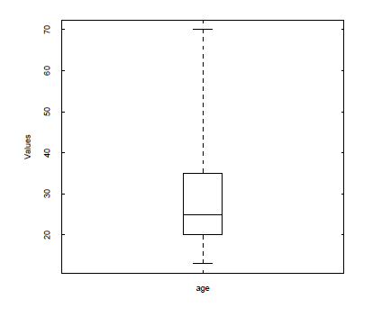
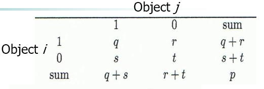
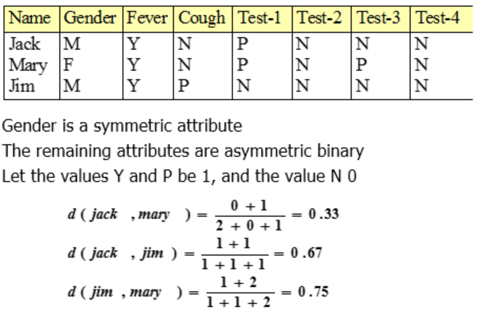
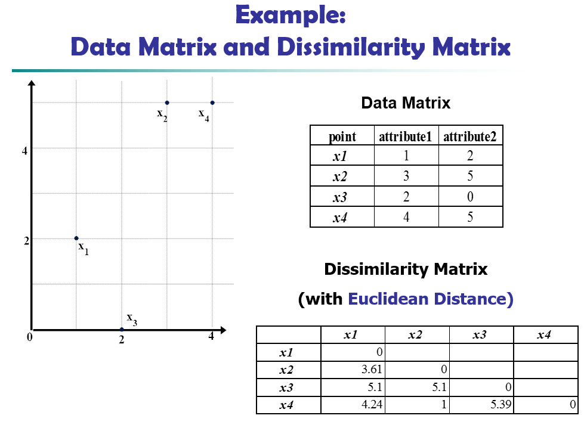
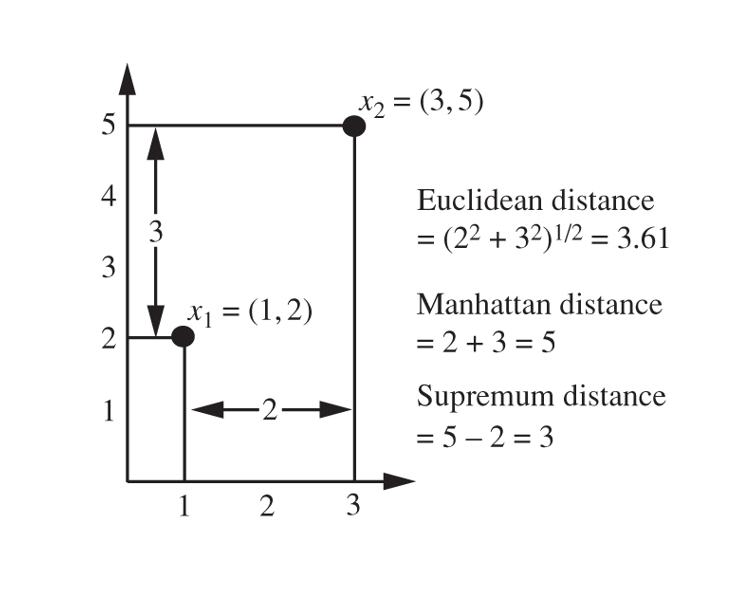
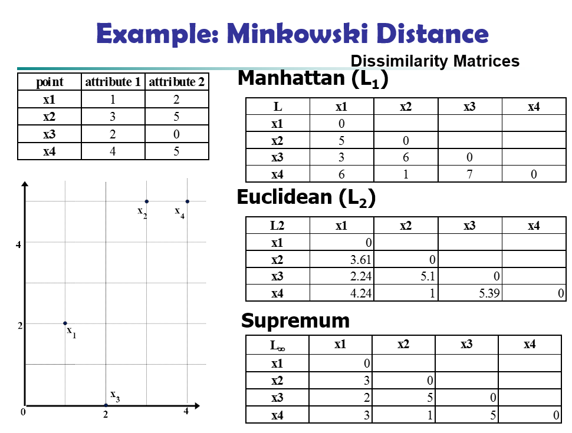
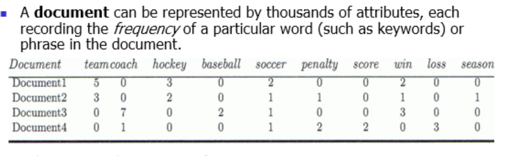
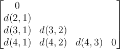
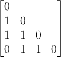
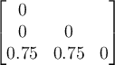

# Week 2 Foundation Concepts for Data Mining

## 1. Introduction

> Most of this material is derived from the text, Han, Kamber and Pei, Chapter 2, or the corresponding powerpoint slides made available by the publisher.  Where a source other than the text or its slides was used for the material, attribution is given. Unless othewise stated, images are copyright of the publisher, Elsevier.
>
> Here, we introduce some important concepts that are used right across data mining methods and the KDD process.

## 2. Data Types and Representations (Text 2.1)

Data is generally structured as **objects,** with each object representing some kind of **properties**, or **attributes** of some real-world or abstract entity. Some of those attributes may include **relationships** to other objects.

- Example: a Medical database may include information about patient objects, treatment objects and relations connecting patients to the treatments they are given
- Example: Attributes of a patient may include name, gender and birth date.

The objects may also be called *samples, examples, instances, data points, rows, tuples, records…* The attributes may also be called *fields, variables, dimensions, features…* This will depend on the data model or data mining discipline you are working with.

Commonly, a **data model  **(also called a **meta-model** ) dictates how these concepts are materialised in a data structure, such as the relational data model, for example.  Alternatively, a **data model** could refer to a model that instantiates a particular meta-model for some domain of application, for example, the relational schema that is used in your hospital's medical records system. 

In this course, we will be employing the relational data model, multidimensional data models, a transactional data model, simple tables, graph and ontology data models, and others.

### Attribute Types

The type of an attribute defines the way its instances are represented, the ways it can be manipulated, and appropriate methods for mining.

#### Nominal 

- categories, states, classes, or “names of things”
- also  called **categorical**
- e.g. Hair_color = {auburn, black, blond, brown, grey, red, white}
- e.g. marital status, occupation, ID numbers, postcodes

#### Binary

- Nominal attribute with only 2 states (0 and 1)
- Symmetric binary: both outcomes equally important
  - e.g., gender
- Asymmetric binary: outcomes not equally important. 
  - e.g., medical test (positive vs. negative). e.g. attended class (no, yes)
  - Convention: assign 1 to most important outcome (e.g., HIV positive)

#### Ordinal

- Values have a meaningful order (ranking) but magnitude between successive values is not known.
- e.g. Size = {small, medium, large}, grades, army rankings
- Commonly used in surveys e.g. {very poor, poor, moderate, good, excellent}
- Can be derived by discretising numeric quantities into ordinal categories (e.g. ANU marks -> grades or age -> child/adult).

#### Numeric Interval-Scaled

- Could be integer or real 
- Measured on a scale of equal-sized units
- Values have order
- No true zero-point
- e.g, temperature in ˚C, calendar dates 
- We can reason about the difference amongst values, but not about the multiples or ratios of values.
  - e.g., 20˚C is 10˚C warmer than 10˚C but it is not twice as warm as 10˚C.
- Are not very common in practice

#### Numeric Ratio-Scaled

- Could be integer or real
- Inherent zero-point
- A ratio scale has all the properties of interval-scaled  attributes  and the additional property of permitting reasoning over multiples of values
- We can speak of values as being a multiple of another in the same unit of measurement (10 K˚ is twice as high as 5 K˚).
- We can also reason about the difference between values, as for interval-scaled.
- e.g., temperature in Kelvin, length, counts, monetary quantities

### Discrete versus Continuous Attributes

Another classification of attributes, more often used in machine learning:

#### Discrete Attribute

- Has only a finite or countably infinite set of values
- e.g., postcodes, profession, or the set of words in a collection of documents
- Sometimes, represented as integer variables
- Binary, nominal and ordinal attributes are a special case of discrete attributes

#### Continuous Attribute

- real numbers as values
- e.g., temperature, height, weight, circumference
- In practice, real values can only be measured and represented using a finite number of bits (so in that sense are approximated by discrete values)
- Typically represented as floating-point variables

## 3. Basic Statistical Descriptions of a Single Data Variable (Text 2.2)

Simple statistics can help us to understand the data we are working with, and by that to select appropriate cleaning and data mining methods, and to interpret data mining results. We will look at the **central tendency** (*what is the middle value)?*, and **dispersion** (*how uniform are the values? and how are they spread?*).

These should mostly be concepts you have seen before.

But before that, we look briefly at the cost of computing these and other functions in data mining.

### 3.1 Computation of Measures (Text: 4.2.4)

When analysis or data mining needs to operate over big data, we need to think about the computational cost of all stages of the processing.

When assessing the character of data, when summarising data, and when developing measures of similarity and interestingness of data and data patterns, some measures are computationally more difficult to compute than others.

The classification of measure functions as *distributive,* *algebraic* or *holistic* is useful to understand their computational complexity.

#### **Distributive**

Suppose the data is partitioned into *n* sets, and the function is applied to each of those sets. Then, suppose the function is applied to those *n* results. If the result is the same as applying the function to all of the data without partitioning, then the function is *distributive*. e.g., count(), sum(), min(), max()

Such computations can be made efficient by distributing the computation. 

#### **Algebraic**

A function is *algebraic* if it can be computed by a function with *M* arguments (where *M* is a bounded integer), each of which is obtained by applying a distributive function.

e.g. average() can be computed from sum() and count().

e.g. min_N() and max_N (*N* minimum/maximum values for integer *N*)

e.g. standard_deviation()

Such computations can take advantage of the distributive sub-functions to be made efficient.

#### **Holistic**

A function is holistic if there is no constant bound on the storage size needed to describe sub-functions. That is, there is no algebraic function with *M* arguments (where *M* is a bounded integer) that characterises the computation.

e.g.  median(), mode(), rank()

Such computations are difficult to compute efficiently and often efficient*approximations* are used instead.

### 3.2. Measuring the Central Tendency: Mean, Median and Mode (Text 2.2.1)

Let $X$ be an attribute (e.g. *salary*).

Let $x_1, x_2, \dots, x_n$ be a set of *n* observations or observed values for $X$.

#### Arithmetic Mean (or, simply Mean)

$\overline{x}=\frac1n\sum^n_{i=1}x_i$

#### Weighted (Arithmetic) Mean

Used when some values are more important or more significant than others (e.g occurrence frequency, or weightings for most important people represented in the data). Also called **weighted** **average**.

$\overline{x}=\frac{\sum^n_{i=1}w_ix_i}{\sum^n_{i=1}w_i}$

Can also use **trimmed mean **that removes a portion of the highest and lowest values and compute the mean of the remainder - to avoid being pushed off centre by extreme values.

#### Median

- The middle value of an ordered set of values (or the average of the middle two values if there is an even number of values).
- Represents the centre better than the mean when data is skewed  (asymmetrical) towards one end or has extreme values.
- Works for ordinal data as well as numeric data.
  - But if there is an even number of values then it is not unique: the two middlemost values and anything in between those values
- Can be expensive to compute but can be approximated by interpolation when data values are grouped into ranges with frequencies.

#### Mode

- Defined as value that occurs most frequently in the data
- Works for numeric and nominal or ordinal data
- May not be unique - data sets with multiple modes are called unimodal, bimodal, trimodal (1,2,3 modes respectively)
- An empirical formula that applies to *unimodal* data that is at most moderately skewed, meaning that the mode can be easily approximated from mean and median:

$\text{mean}-\text{mode}\approx3\times(\text{mean}-\text{median})$

#### Midrange

- Defined as the average of the largest and smallest values
- Cheap to compute as indication of central tendency of thedata

#### Skewness

The figure illustrates the main central tendency measures of symmetric and skewed data.

Skewness is a measure of asymmetry in data. As seen here the sign and magnitude of the difference between mean and mode is an simple indicator of skewness in the data. There are many other ways to measure skewness.

### 3.3. Measuring the Dispersion of Data: Range, Quartile, Variance, Standard Deviation, and Interquartile Range (Text 2.2.2)

Let $X$ be a **numeric** attribute (e.g. *salary*),

Let $x_1,x_2,\dots,x_n$ be a set of $n$ observations or observed values for $X$.

#### **Range**

The range is the difference between the largest and smallest values, i.e. $\max{(X)}-\min{(X)}$

#### **Quartiles**

**Quantiles** are data values that split the data into (nearly) equal-sized increasing-order subsets.

- Given an integer *k* such that  *0<k<q*, the *k*th *q*-quantile is the value *x* such that
  - at most *k/q* of the values are less than *x* and
  - at most *(q-k)/q* are greater than *x*
- There are *q-1* *q*-quantiles. 
- The 2-quantile splits the ordered data into 2 parts and is also called the **median.**
- The 4-quantiles are called **quartiles**.
- The 100-quantiles are called **percentiles**. 

#### Interquartile range (IQR)

The distance between the first and third quartiles gives the range of values covered by the middle half of the data and is a simple indicator of spread.

$IQR = Q_3-Q_1$

#### Five-number Summary and Boxplots

- **Five-number summary, **In order: **min, Q1, median=Q2, Q3, max**
- Convenient summary of data dispersion
- Illustrated in a **boxplot.**
- Boxplots can be used to visually compare sets of compatible data.
- Ends of the **box** are the quartiles; median is marked by a line;**whiskers** extend to min and max.
- **Outlier**: usually, a value below  Q1 − 1.5 IQR or above Q3 + 1.5 IQR
  - If there are outliers, then the whiskers commonly extend to 1.5 x IQR (instead of min, max) and outliers are plotted individually.
  - The "tailedness" or frequency of outliers compared to a central peak of the distribution in each direction is easily seen by the length of the whiskers and occurrence of individual outliers. A formal measure of tailedness called *kurtosis* can be calculated instead. 

#### Standard Deviation and Variance

- Used very commonly to indicate data dispersion
- A low standard deviation indicates that values tend to be close to the mean
- Is cheap to compute
- Measures deviation around the mean so should only be used when the mean is also used for centrality
- σ = 0 only when all values are the same
- An observation is unlikely to be more than several standard deviations from the mean.

- Formally (**Chebyshev's inequality**),

> At least $(1 - 1/k^2)$ x 100% of the observations are no more than $k$ standard deviations from the mean.

#### Variance, $s^2$ or $\sigma^2$

$s^2=\frac1{n-1}\sum^n_{i=1}(x_i-\bar{x})^2=\frac1{n-1}[\sum^n_{i=1}x_i^2-\frac1n(\sum^n_{i=1}x_i)^2]$

#### Standard deviation, $s$ or $\sigma$

- is the square root of variance $s2$ (or $\sigma^2$)

#### **Population or Sample?**

In the formula above, the so-called "n-1" method is used, due to the "n-1"  term in the denominator. You will often see standard deviation or variance alternatively written with "n", the size of the data, instead of  "n-1". For example, the course text uses that  "n" form. Strictly, the "n-1" method is properly used for observational data that is understood to be a *sample*  (say, collected by a survey) selected from the complete real data, and the standard deviation computed this way is an *estimation* of the real standard deviation of the complete real data, and this estimation minimises the expected error wrt the real standard deviation.  On the other hand, the  "n"  method computes exactly the standard deviation of the observations at hand which are then assumed to be the complete real data (say, collected by a population census). We use  the "n-1" form here under the assumption that we are interested in estimating the spread of the intended population, not just the sample to hand.  Of course, for very large data sets to which data mining is normally applied, the difference is too small to be a matter of concern.

### 3.4 Exercises

> Suppose that the data for analysis includes the attribute *age.* The age values for the data tuples are (in increasing order) 13, 15, 16, 16, 19, 20, 20, 21, 22, 22, 25, 25, 25, 25, 30, 33, 33, 35, 35, 35, 35, 36, 40, 45, 46, 52, 70.

(a) What is the mean of the data? What is the median? The (arithmetic) mean of the data is:  $\bar{x}=30$

(b) What is the mode of the data? Comment on the data’s modality (i.e., bimodal, trimodal, etc.). This data set has two values that occur with the same highest frequency and is, therefore, bimodal. The modes (values occurring with the greatest frequency) of the data are 25 and 35.

(c) What is the midrange of the data? The midrange (average of the largest and smallest values in the data set) of the data is: (70 +13)/2 = 41.5

(d) Can you find (roughly) the first quartile (Q1) and the third quartile (Q3) of the data? The first quartile (corresponding to the 25th percentile) of the data is: 20. The third quartile (corresponding to the 75th percentile) of the data is: 35.

(e) Give the five-number summary of the data. The five number summary of a distribution consists of the minimum value, first quartile, median value, third quartile, and maximum value. It provides a good summary of the shape of the distribution and for this data is: 13, 20, 25, 35, 70.

(f) Show a boxplot of the data. 

## 4. Measuring Correlation amongst Two Variables (not in Text)

There are some measures commonly used to assess whether variables are **correlated**, that is that one can (approximately) be computed directly from the other.

**Pearson's Correlation **

- Measures how well a straight line can be fitted to two numeric attributes (one on each axis).
- Also called Pearson's r, Pearson product-moment correlation, Pearson correlation coefficient, bivariate correlation
- Ranges from -1 (perfectly negatively correlated), through 0 (no correlation) to 1 (perfectly positively correlated).

Pearson's $r$ can be calculated over attributes $X$ and $Y$ (for $n$ objects, $(x_i, y_i)$) by:

$r=\frac{\sum^n_{i=1}(x_i-\bar{x})(y_i-\bar{y})}{\sqrt{\sum^n_{i=1}(x_i-\bar{x})^2\sum^n_{i=1}(y_i-\bar{y})^2}}$

- This formulation relies on the standard deviation formula for a sample, so we are assuming we are using a sample to estimate correlation in the real, full dataset here.
- For nominal attributes, the chi-square test that considers the frequency of co-occurrence of values should be used instead.

## 5. Measuring Similarity and Dissimilarity of Multivariate Data (Text 2.4)

We need algorithmic ways to assess how alike or unlike objects are to others  e.g. Are some set of taxpayers similar in their characteristics of age, employment status and income?

- **Similarity**
  - Numerical measure of how alike two data objects are
  - Value is higher when objects are more alike
  - Often falls in the range [0,1]

- **Dissimilarity** (e.g., distance)
  - Numerical measure of how different two data objects are
  - Lower when objects are more alike
  - Minimum dissimilarity is often 0
  - Upper limit varies
  - **Proximity** refers to a similarity *or* dissimilarity

**Dissimilarity Matrix**

- Common data structure used to represent dissimilarity amongst objects
- Used e.g. in main-memory based algorithms for clustering and nearest neighbour
- For $n$ data points, an $n\times n$ matrix data structure that shows dissimilarity or distance $d(i,j)$ for all pairs of $n$ objects $i$, and $j$.
- $d(i,j)$ is close to 0 when objects $i$, and $j$ are near to each other, i.e., the distance is small.
- It is defined that $d(i,j)=d(j,i)$
- It is defined that $d(i,i)=0$
- Therefore the matrix is **symmetric** or **triangular** with zeros along the diagonal and duplicates (often not represented at all) in the upper right triangle.
- **Single mode **or **one-mode** matrix because rows and columns represent the same things (i.e. objects). 
- **Similarity**, $sim(i,j)$ is often expressed as a function of dissimilarity, e.g. when $d(i,j)$ is normalized to $[0,1]$ we may have $sim(i,j)=1-d(i,j)$

### 5.1 Proximity Measures for Nominal Attributes (Text 2.4.2)

A nominal attribute may have two or more states as values (if only two, then it is binary).

Let the number of states for a nominal attribute be *M*.

For convenience, we denote the states by integers *1,2,...,M*  but note that no ordering is implied here.

#### Method 1: Simple matching

Let *m* be the number of matches  i.e. the number of attributes for which object *i* and *j* have the same value.

Let *p* be the number of variables (i.e attributes for each object).

Then, define $d(i,j)=\frac{p-m}p$

Similarity may then be defined as $sim(i,j)=1-d(i,j)=m/p$

#### Method 2: Map nominals to a large number of binary attributes

- Create a new binary attribute for each of the *M* nominal states of the attribute.
- e.g. for attribute Colour = {red, blue, green}, introduce  binary attributes Red, Blue and Green  and map an object with Colour = red to the corresponding object with attribute Red = 1, attribute Blue = 0 and attribute Green = 0.
- Then use any method for the proximity of binary attributes.

### 5.2 Proximity Measures for Binary Attributes (Text 2.4.3)

- Binary attributes have only one of two values: 0 or 1
- The attributes may be symmetric or asymmetric: asymmetric means the 1-value state is more important than the 0-value state.
- Treating the values as numeric can be misleading
- The methods presented in this subsection require that all the attributes of the objects are binary

#### Contingency Table

Let us consider a pair of objects *i* and *j* with a total number of attributes *p*.

Let *q* be the number of attributes that equal 1 for both *i* and *j.*

Let *r* be the number of attributes that equal 1 for object  *i*  but 0 for object  *j.*

Let *s* be the number of attributes that equal 0 for object  *i*  but 1 for object  *j.* 

Let *t* be the number of attributes that equal 0 for both object *i*  and object *j.* 

Then $p= q+r+s+t$ and we have the contingency table below.

#### Symmetric binary dissimilarity

Then the dissimilarity is defined as

$d(i,j)=\frac{r+s}{q+r+s+t}$

That is, the proportion of non-matching attributes amongst all attributes.

#### Asymmetric binary dissimilarity

The agreement of two 1 values (i.e. the agreement of the important values, a *positive match*) counts more than the agreement of two 0 values (i.e. a *negative match*). Dissimilarity is defined as

$d(i,j)=\frac{r+s}{q+r+s}$

The corresponding similarity, **asymmetric binary similarity**, is called the **Jaccard coefficient** and is widely used.

It is also called *coherence*,

$sim(i,j)=1-d(i,j)=sim_{Jaccard}(i,j)=\frac{q}{q+r+s}$

**Example of binary dissimilarity**

Calculate distance on the basis of the asymmetric attributes alone.

### 5.3 Dissimilarity of Numeric Data: Normalization (Text 3.5.2)

Numeric data is commonly *normalised*  (also called *standardised*) before calculating distance. This is done by scaling all attributes to a common range such as [0.0,1.0] so that all attributes are weighted evenly. Otherwise, attributes with a greater range will have a greater effect on the distance measure.

#### Normalization of numeric data

Methods for normalisation are not covered here in depth. Here is one method, **min-max normalisation**,  that normalises values by a linear transformation.

Each value for an attribute, $v_i$ is normalized by replacing it with a value $v_i'$ that falls within a desired range [new_min, new_max] defined as:

$v_i'=(v_i-min)\frac{(newmax-newmin)}{max-min}+newmin$

where $min,max$ are the minimum and maximum values respectively in the original attribute and $newmin, newmax$ are the desired minimum and maximum values respectively in the transformed attribute.

If you want to ensure normalized values fall in [0.0, 1.0], you can set $newmin$ to 0 and $newmax$ to 1.

### 5.4 Dissimilarity of Numeric Data: Minkowski Distance (Text 2.4.4)

Popular distance measures for **numeric** attributes are *Euclidian,* *Manhattan* and *Minkowski* measures that are closely related.

Data is commonly *normalised*  (also called *standardised*) before calculating distance. This is done by scaling all attributes to a common range such as [0.0,1.0] so that all attributes are weighted evenly. Otherwise, attributes with a greater range will have a greater effect on the distance measure.

#### Metric Measures

A measure is a **metric** when it satisfies the following properties that have some intuitive appeal

- **Identity of indiscernible**: $d(i,i)=0$ The distance from an object to itself is 0.
- **Symmetry:** $d(i,j)=d(j,i)$ The distance between objects is the same irrespective of direction.
- **Triangle inequality:** $d(i,j)\leq d(i,k)+d(k,j)$ Going directly from object $i$ to $j$ is no further than making a detour via any other object $k$.
- **Non-negativity:** $d(i,j)\geq 0$ Distance is a non-negative number, this is a consequence of the 3 properties above.

*Euclidean, Manhattan* and *Minkowski* measures are *metrics*.

#### Minkowski Distance

Minkowski is a *family* of several popular metrics, where the parameter $h$ selects a particular metric.

For $p$-dimensional data objects $i=(x_{i1},x_{i2},\dots,x_{ip})$ and $j=(x_{j1},x_{j2},\dots,x_{jp})$ i.e., two objects with $p$ attributes

Minkowski distance of **order** $h$ is:

$d(i,j)=\sqrt[h]{|x_{i1}-x_{j1}|^h+|x_{i2}-x_{j2}|^h+\cdots+|x_{ip}-x_{jp}|^h}$

#### Manhattan (City Block) Distance

- Distance in blocks between any two points in a city, where corners cannot be cut.
- Also called **Hamming distance** when the $x_{ij}$ are bits: i.e. counts the number of bits that are different between two binary vectors
- Minkowski distance with $h=1$.
- Also called the **$L_1$ norm**
- $d(i,j)=|x_{i1}-x_{j1}|+|x_{i2}-x_{j2}|+\cdots+|x_{ip}-x_{jp}|$

#### Euclidean Distance

- Distance in a straight line between any two points, cutting corners (*Pythagoras's Theorem)*
- Minkowski distance with $h=2$.
- **$L_2$ norm**
- $d(i,j)=\sqrt{d(i,j)=|x_{i1}-x_{j1}|^2+|x_{i2}-x_{j2}|^2+\cdots+|x_{ip}-x_{jp}|^2}$ 

#### Supremum Distance

- The maximum of all the individual attribute distances.
- Also called **Chebyshev distance **and the **uniform norm.**
- Minkowski distance with h → ∞
- called **$L_\infty$ norm and $L_{max}$**
- $d(i,j)=\lim_{h\to\infty}\left(\sum^p_{f=1}|x_{if}-x_{jf}|^h\right)^{\frac1h}=\max^p_f |x_{if}-x_{jf}|$

**Examples of Minkowski Distances**

### 5.5 Proximity Measures for Ordinal Attributes (Text 2.4.5)

Ordinal data has a meaningful ordering amongst values, so some pairs of values are closer together than others and this should be taken into account.

The approach maps ordinal values to numeric values so that numeric attribute methods can be used.

Let $f$ be an attribute from a set of $p$ ordinal attributes where $\{x_{i1},x_{i2},x_{if},x_{ip}\}$ describes the $i$th object of $n$ objects.

Let $M_j$ be the number of possible states for attribute $j$ where $j$ in $\{1,\dots,p\}$.

Let $M_f$ be the number of possible states for attribute $f$ and let $1,\dots,M_f$ be the ranking defined by the attribute values arranged in increasing order.

Then, to compute the dissimilarity with respect to attribute $f$ do:

1. For each object $i=\{x_{i1},x_{i2},x_{if},\dots,x_{ip}\}$ replace $x_{if}$ by its corresponding rank $r_{if}$ in $\{1,\dots, M_f\}$.

2. Normalizaiton: Scale the range of each attribute to $[0,1]$ so that each attribute has equal weight irrespective of the number of distinct states it has.

   To do this, replace the ranke $r_{if}$ of the $i$th object in the $f$th attribute by the normalized rank $z_{if}$ given by

   $z_{if}=\frac{r_{if}-1}{M_f-1}$

3. Compute **dissimilarity** by any distance measure for numeric attributes, using $z_{if}$ to represent the $f$ value for the $i$th object.

### 5.6 Dissimilarity for Attributes of Mixed Types (Text 2.4.6)

So far we have considered methods for dissimilarity for *nominal,* *symmetric binary*, *asymmetric binary*, *numeric* and *ordinal* attributes, but only when all attributes of an object are the *same type*. This is rarely the case in practice, where *mixed* attribute types are common.

One technique combines all the attributes into a single dissimilarity matrix, bringing all attributes to a common scale of the interval [0.0, 1.0].

Let the data set contain *p* attributes of mixed type. The dissimilarity of objects *i* and *j* is defined as the **average of the normalised distances between each attribute** of the pair of objects. That is,

$d(i,j)=\frac{\sum^p_{f=1}\delta_{ij}^{(f)}d_{ij}^{(f)}}{\sum^p_{f=1}\delta_{ij}^{(f)}}$

where indicator $\delta_{ij}=0$ if either $x_{if}$ or $x_{jf}$ is missing or $f$ is asymmetric binary and $x_{if}=x_{jf}=0$ or $1$ otherwise 

and depending on the type of $f$ either

1. attribute $f$ is binary or nominal and $d_{ij}^{(f)}=0$ if $x_{if}=x_{jf}$, or $d_{ij}^{(f)}=1$ otherwise
2. attribute $f$ is numeric and $d_{ij}^{(f)}$ is a normalized distance measure for $f$ on [0.0, 1.0]
3. attribute $f$ is ordinal and $d_{ij}^{(f)}$ is determined from the normalized rank $z_{if}$ treated as a numeric interval-scaled attribute derived from $x_{if}$ by computing rank $r_{if}$ and $z_{if}=\frac{r_{if}-1}{M_f-1}$.

### 5.7 Cosine Similarity for Sparse Vectors (Text 2.4.7)

- Measures similarity between two vectors of a multidimensional space, determining whether they are pointing in a similar direction
- Used for **sparse numeric data** where previous methods do not work well ( where data is dominated by zeros and zero-matches are not interesting).
- Classic application is similarity of documents of words (information retrieval, text document clustering)
- Also used in biological taxonomy and gene expression in microarrays

#### Cosine Similarity

Given $x$ and $y$ are two vectors then

$sim(x,y)=\cos(x,y)=\frac{x\cdot y}{\norm{x}\norm{y}}$

where $\norm{x}$ is the *Euclidean norm* for vector $x$ and $\cdot$ is the vector dot product.

- **Euclidean norm** is defined as the Euclidean distance, $L_2$ norm,  between  $x$ and the zero vector (i.e the square root of the sum of the squares of each $x_i$ in $x$
- Cosine similarity computes the cosine of the angle between the two vectors.  A value of 0 means the vectors are orthogonal and do not match at all. The closer the value to 1, the smaller the angle and so the greater the match. 
- Cosine similarity is *not* a metric measure.

Example of cosine similarity

Find the similarity between Document1 and Document2. (sim=0.94)

### 5.8 Exercises

**1. Nominal Attributes**

Suppose we have some data for four objects (X1,..,X4) with 1 nominal attribute as follows:

X1 = Code A

X2 = Code B

X3 = Code C

X4 = Code A

Using the pattern with $d(i,j)$ is the dissimilarity of the pair Xi and Xj (i,j=1,..,4), compute the dissimilarity matrix

Since there is only one nominal attribute, set $p=1$ so that $d(i,j)$ is $0$ if the attribute values for $i$ and $j$ match and $1$ if they do not. We get

so only objects 1 and 4 are similar i.e. $d(4,1)=0$

**2. Symmetric Binary Attributes**

Using this data for three true/false  quiz responses for 4 questions,

| id   | q1    | q2    | q3    | q4   |
| ---- | ----- | ----- | ----- | ---- |
| A    | true  | false | true  | true |
| B    | true  | false | true  | true |
| C    | false | true  | false | true |

 draw a dissimilarity matrix, treating the binary attributes as symmetric.

A and B are the same, so their dissimilarity is 0. A and C differ  in 3/4 attributes.

**3. Minkowski distance for numeric attributes**

Given two objects represented by the tuples (22, 1, 42, 10) and (20, 0, 36, 8):

(a) Compute the Euclidean distance between the two objects.

$\sqrt{(22-20)^2+(1-0)^2+(42-36)^2+(10-8)^2}=\sqrt{45}=6.7082$

(b) Compute the Manhattan distance between the two objects.

$|22-20|+|1-0|+|42-36|+|10-8|=11$

(c) Compute the Minkowski distance between the two objects, using h = 3.

$\sqrt[3]{…} = \sqrt[3]{233}=6.1534$

(d) Compute the supremum distance between the two objects.

$42-36=6$.

**4. what do you do to calculate dissimilarity for 2 objects of mixed types?**

Treat each attribute according to its type as before. For **binary** and **norminal** assign 1 if it matches, 0 if it doesn't and then treat as numeric. For **ordinal** use the normalized rank and treat as numeric. For **numeric** use difference of values normalzied to [0,1] (which is simply their difference divided by the difference of the max and min values, or equivalently, a normalzied L1 norm of one variable).

Then add up all the differences and divivde by the number of attributes to put on [0,1] scale. This would be an L1 norm (normalzied). Or combine them according to one of the other Minkowski distance metrics.

## 6. Weekly Quiz

