# Introduction to Data Warehousing

## 1. Introduction

Most of this material is derived from the text, Han, Kamber and Pei, Chapter 4, or the corresponding powerpoint slides made available by the publisher.  Where a source other than the text or its slides was used for the material, attribution is given. Unless othewise stated, images are copyright of the publisher, Elsevier.

Here, we introduce some basic data warehouse concepts which will be extended in the next e-book.

Those of you who studied COMP8430 Data Wrangling will have seen some of this before, but we will go deeper into this topic here, together with some practical exercises.

You will need some basic understanding of relational databases and SQL in this part of the Data Mining course.

[SQL refresher](https://www.pgexercises.com/)

The work on data warehousing in this course aims  to help you  to understand the role of a data warehouse in enterprise data management and how it relates to data mining, especially challenges related to large scale data management. This will to equip you with the knowledge you need to be able to navigate and extract the data you need from a data warehouse, or to exploit or develop data mining techniques embedded within data warehouse architectures. 

## 2. Basic concepts (Text 4.1)

### What is a Data Warehouse?

- Defined in many different ways, but not rigorously.
- A decision support database that is maintained separately from the organisation’s operational database
- Supports information processing by providing a solid platform of consolidated, historical data for analysis.
- A data warehouse is a subject-oriented, integrated, time-variant, and nonvolatile collection of data in support of management’s decision-making process.”—W. H. Inmon
- *Data warehousing* is the process of constructing and using data warehouses

### Typical Characteristics of a Data Warehouse

#### Subject-Oriented

- Organised around major subjects, such as customer, product, sales
- Focusing on the modelling and analysis of data for decision makers, not on daily operations or transaction processing
- Provides a simple and concise view around particular subject issues by excluding data that are not useful in the decision support process

#### Integrated

- Constructed by integrating multiple, heterogeneous data source e.g. relational databases, flat files, on-line transaction records
- Data cleaning and data integration techniques are applied.
  - Ensure consistency in naming conventions, encoding structures, attribute measures, etc. among different data sources
  - e.g., Hotel price: currency, tax, breakfast covered, etc.
  - When data is moved to the warehouse, it is converted (this process is called *ETL*, for Extract, Transform, Load)

#### Time Variant

- The time horizon for the data warehouse is significantly longer than that of operational systems
  - Operational database: current value data
  - Data warehouse data: provide information from a historical perspective (e.g., past 5-10 years)
- Every key structure in the data warehouse
  - Contains an element of time, explicitly or implicitly
  - But the key of operational data may or may not contain “time element”

#### Nonvolatile

- A physically separate store of data transformed from the operational environment
- Operational update of data does not occur in the data warehouse environment
  - Does not require transaction processing, recovery, and concurrency control mechanisms
  - Requires only two operations in data accessing: Initial loading of data and access of data

### Comparison with typical operational databases

Most databases are used for **online transaction processing (OLTP)** and querying for day-to-day operations. On the other hand, data warehouses are built specifically for analytics to support decision making, that is, **online analytical processing (OLAP).**

|                        | **OLTP**                                              | **OLAP**                                                     |
| ---------------------- | ----------------------------------------------------- | ------------------------------------------------------------ |
| **users**              | clerk, IT professional                                | knowledge worker                                             |
| **function**           | day to day operations                                 | decision support                                             |
| **DB design**          | application-oriented                                  | subject-oriented                                             |
| **data**               | current, up-to-date detailed, flat relational islated | historical, summarized, multidimensional integrated, consolidated |
| **usage**              | repetitive                                            | ad-hoc                                                       |
| **access**             | read/write index/hash on prim key                     | lots of scans                                                |
| **unit of work**       | short, simple transaction                             | complex query                                                |
| **# records accessed** | tens                                                  | millions                                                     |
| **# users**            | thousands                                             | hundreds                                                     |
| **DB size**            | 100MB-GB                                              | 100GB-TB                                                     |
| **metric**             | transaction throughput                                | query throughput, response                                   |


### Why a Separate Data Warehouse?

- High performance for both systems
  - DBMS— tuned for OLTP: access methods, indexing, concurrency control, recovery
  - Warehouse—tuned for OLAP: complex OLAP queries, multidimensional view, consolidation
- Different functions and different data:
  - missing data: Decision support requires historical data which operational DBs do not typically maintain
  - data consolidation:  Decision support requires consolidation (aggregation, summarization) of data from heterogeneous sources
  - data quality: different sources typically use inconsistent data representations, codes and formats which have to be reconciled
- Note: There are more and more systems which perform OLAP analysis directly on relational databases

### Multi-tiered Architecture

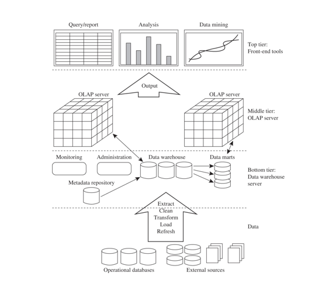

## 3. Data Cube and OLAP (Text 4.2)

### From Tables and Spreadsheets to Data Cubes

- A data warehouse is based on a **multidimensional data model** which views data in the form of a data cube
- A data cube, such as *sales*, allows data to be modeled and viewed in multiple dimensions.
- The cube axes are the **dimensions **such as item (item_name, brand, type), or time(day, week, month, quarter, year)
- The cube interior cells hold  the **measures** (such as dollars_sold).

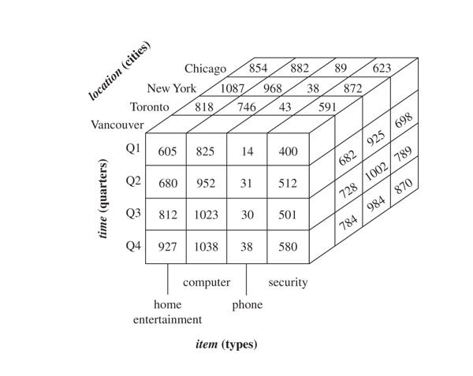

- n data warehousing literature, an n-dimensional base cube is called a **base cuboid**.
- Measures along one or more dimensions may be aggregated to form  a cubiod with a subset of the original dimensions.
- The top most 0-D cuboid, which holds the highest-level of summarisation, is called the **apex cuboid, **commonly denoted *all.* 


- **The lattice of cuboids forms a data cube.**
- In this case the *all* cuboid contains a single cell  that represents aggregated dollars_sold over time,item, location and supplier.

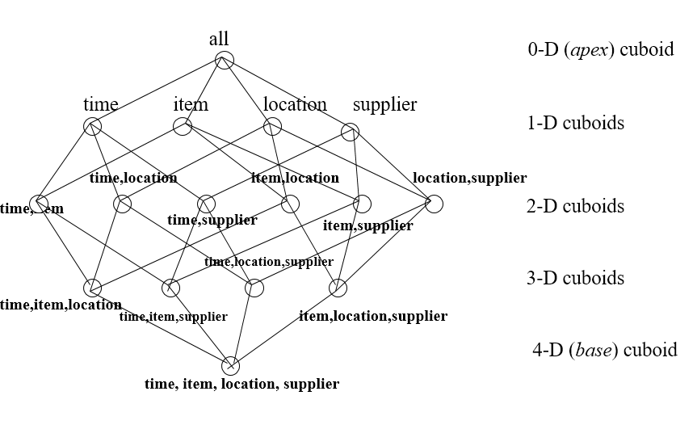

- **For an $n$-dimensional base cube, how many cuboids (i.e. node) are there in the datacube lattice? Solution: $2^n$**
- **For a 10-D datacube, how many cuboids are there at level 2 in the cube? couting from the base as level 0. Solution: $n=10,r=2, \frac{10!}{2!\cdot 8!}=45$**

### Modelling the Cube in a relational database

Need:

- Dimension tables, such as item (item_name, brand, type), or time(day, week, month, quarter, year)
- A fact table that contains measures (such as dollars_sold) and keys to each of the related dimension table

**Star schema**: A fact table in the middle connected to a set of dimension tables

**Snowflake schema**:  A refinement of star schema where some dimensional hierarchy is normalised into a set of smaller dimension tables, forming a shape similar to snowflake

**Fact constellations**:  Multiple fact tables share dimension tables, viewed as a collection of stars, therefore called galaxy schema or fact constellation

Snowflake and Constellation schemes are fairly obvious generalisations of the basic Star schema to more complex data.

**Example Star Schema**

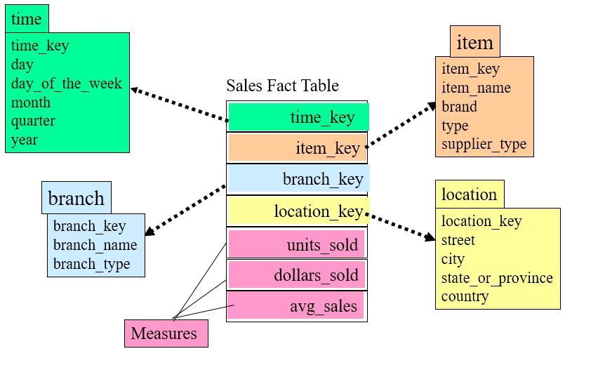

**Example Snowflake Schema**

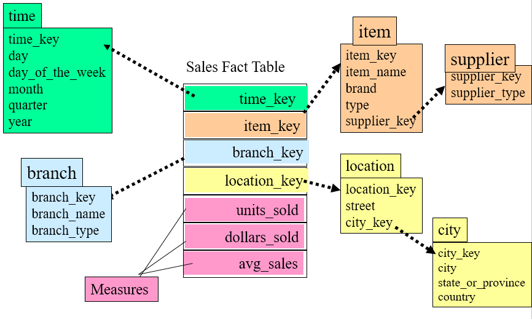

Here we can see the snowflake schema derived from the star schema above by normalising both the item and location dimension tables in line with the dimensional hierarchies they represent (supplier < supplier type and street < city respectively).

**Example Fact Constellation Schema**

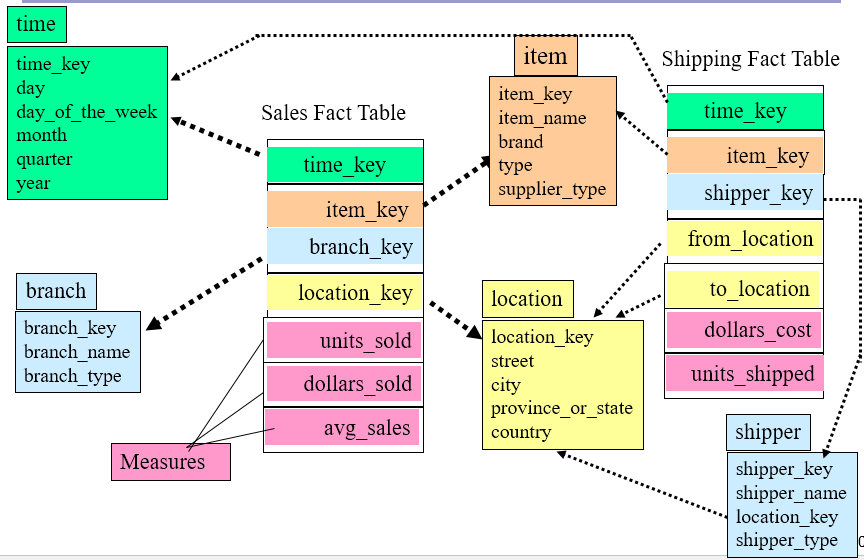

Here we can see that the fact constellation schema adds an additional fact table (shipping) and shares the dimension tables for the location with the original fact table for sales. 

## 4. Concept Hierarchies

A **concept hierarchy** defines a sequence of mappings from a set of low-level concepts to higher-level, more general concepts. They support the modelling of data at varying levels of abstraction.

For example, a concept hierarchy for *location* could be:

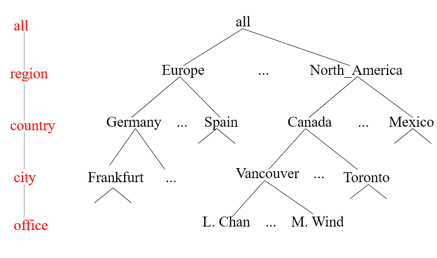

A lattice is also possible,  for example for *time*, as shown here contrasted with the simpler hierarchy. Organising time as shown here is very common.

It illustrates the partial order `day< {week ; month < quarter} < year`,

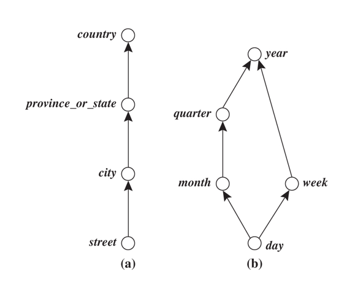

Concept hierarchies may also be defined by discretizing or grouping values, called a *set-grouping hierarchy,* as shown in the example below for *price.*

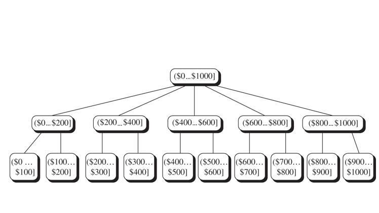

## 5. Practical Exercises

## 6. Quiz

***

# Analysing Data in Warehouses

## 1.Introduction

Most of this material is derived from the text, Han, Kamber and Pei, Chapters 4 and 5, or the corresponding powerpoint slides made available by the publisher.  Where a source other than the text or its slides was used for the material, attribution is given. Unless othewise stated, images are copyright of the publisher, Elsevier.

Here, we  continue from the previous e-book to work on OLAP and cubes.

##2. Typical OLAP Operations (Text 4.2.5 + 4.4.4)

In the multidimensional model, data are organised into multiple dimensions and each dimension contains multiple levels of abstraction defined by concept hierarchies.

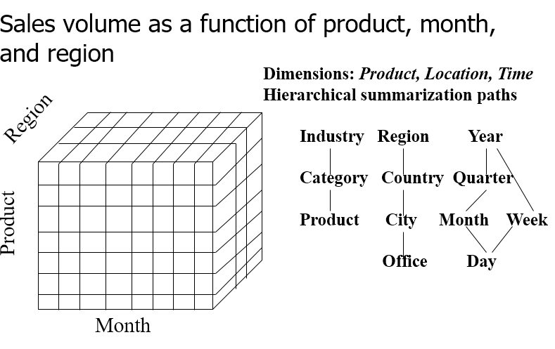

The typical OLAP operations are implemented in OLAP servers.

The SQL standard also defines some OLAP operators but these are generally implemented inconsistently in relational databases.

A common architecture for multidimensional cube operations is to extend and optimise relational architecture to form a **ROLAP** (i.e Relational OLAP) server which is likely to rely on a *star schema* (+snowflake, fact constellation)  database structure. A  form of this highly specialised for ROLAP may drop support for common OLAP functions.

Alternatively, a **MOLAP** (Multidimensional OLAP) server uses a very different column-oriented data storage architecture, which is particularly well suited to optimise rapid access to aggregate data and to storage of sparse cubes.

Finally, a hybrid architecture **HOLAP **(Hybrid OLAP)  server combines ROLAP and MOLAP, with detailed data in a relational database and aggregations in a MOLAP store. This may have the performance advantages of each. 

### 2.1 Roll-up

**Rollup **(also called *drill-up*) summarises data in one of two ways.

####By dimension reduction

Move from one cubiod to another higher up the lattice towards the apex, where some dimension of the cube is removed and the remaining dimensions are represented by measures that are now aggregated over the missing dimension.

Starting from here:


**Rollup **along *item* to get:

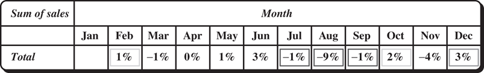

#### By climbing up the concept hierarchy

Move from one cuboid to another by stepping up a level in a concept hierarchy on one dimension. This does not remove a dimension from the cube but aggregates the measures for that dimension into bigger chunks, and so reduces the number of data points along that dimension. 

Example:

Consider the cube of *sales* with dimensions *item x time x location* and the concept hierarchy  along the location dimension of (*offices < cities < countries < regions*).

Starting from the cuboid *types x quarters x cities*, a rollup operation:

$$\textbf{roll up} \text{ on loaction from cities to countries}$$

would move to the cubiod t*ypes x quarters x countries*. Now, instead of being grouped by cities, the data is grouped by countries.

Another subsequent rollup  along the same  location dimension would move to the cuboid  *types x quarters x regions.*

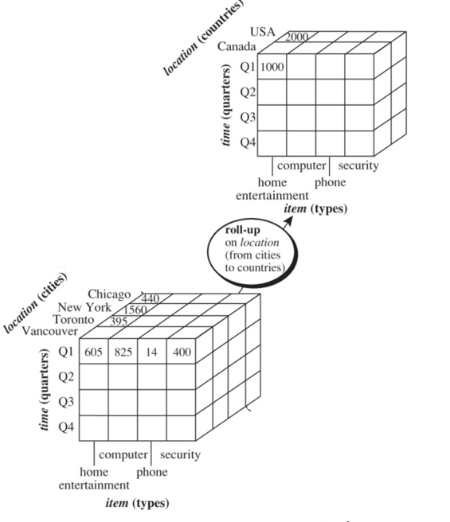

### 2.2 Drill-down

**Drill-down ** (also called **roll down**) is the reverse of rollup, navigating from less detailed data to more detailed data. As for rollup, there are two ways to do this.

#### By introducing additional dimensions

Starting from here:

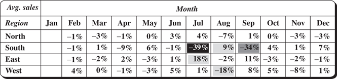

**Drill-down** along *item* to get as follows. *Region* from above would be included in the cuboid below but is not shown here for convenience.

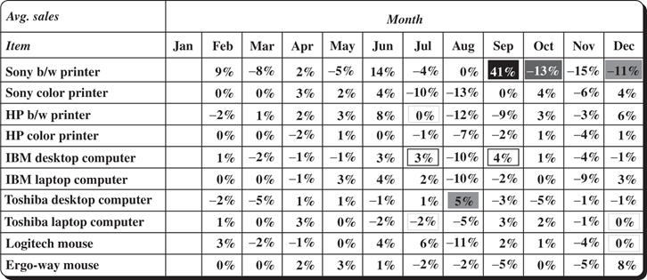

#### By stepping down a concept hierarchy

Move from one cuboid to another by stepping  down a level in a concept hierarchy on one dimension. This does not remove a dimension from the cube but disaggregates the measures for that dimension into  smaller chunks, and so increases  the number of data points along that dimension. 

Example:

Consider the cube of *sales* with dimensions *item x time x location* and  the concept hierarchy  along the *time* dimension of (*days < months < quarters < years)*. Starting from the cuboid *types x quarters x cities,* a drill-down operation:

$$\textbf{dril-down} \text{ on time from quarters to months}$$

would move to the cubiod t*ypes x months x cities.* Now, instead of being grouped by quarters, the data is grouped by months.

Another subsequent drill-down  long the same *time* dimension would move to the cuboid  *types x days x cities.*

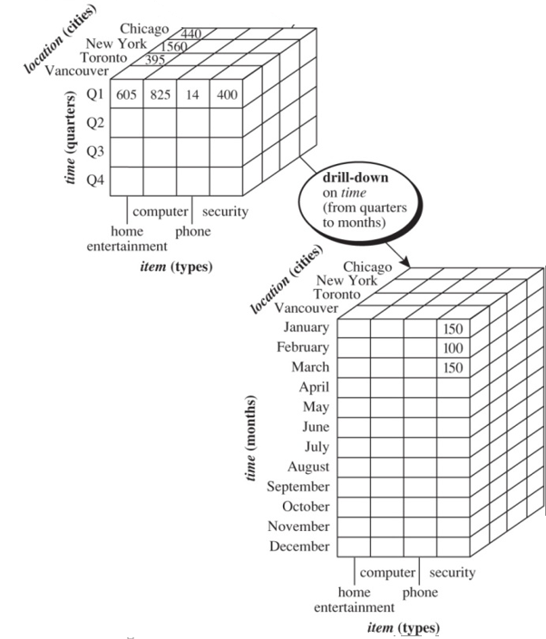

### 2.3 Slice and Dice

**Slice **and **Dice **cut out rectangular sections of a cuboid.

#### Slice

Slice cuts off one dimension of the cube, not by aggregating but by selecting only one fixed value along one dimension.

It corresponds to a  relational algebra *select*  (to choose which fixed value from which dimension) then  *project*  (on the remaining dimensions).

Example

Consider the cube of *sales* with dimensions *item x time x location.*

Starting from the cuboid *types x quarters x cities,* a slice operation:

$$\textbf{slice }\text{for time = "Q1"}$$

would move to the cubiod *types x cities* and every value represented holds only for the quarter Q1. 

Another subsequent slice, say for *item = "computer"* would  result in a cuboid  for *cities* alone, with all data for each city being values only for computers in Q1.

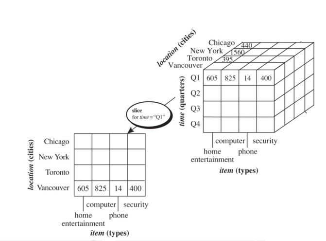

#### Dice

**Dice** cuts out  a sub-cube, not by aggregating but by selecting multiple fixed values for each of multiple dimensions.

It corresponds to some relational algebra *selects*  to choose which fixed values from which dimensions. 

Example

Consider the cube of *sales* with dimensions *item x time x location.*

Starting from the cuboid *types x quarters x cities,* a dice  operation:

$$\textbf{dice }\text{for (location="Toronto" or "Vancouver") and (time="Q1" or "Q2") and (item="home entertainment" or "computer")}$$

would move to the cubiod *types x quarters x cities* but only data for those selected dimension values would  be represented in the cuboid. That is, the only data  in the cuboid is for computers and home entertainment products, in Q1 and Q2, from Toronto and Vancouver. 

Another subsequent  dice, say for *item = "computer"* would  result in a  3-D cuboid without any home entertainment products. 

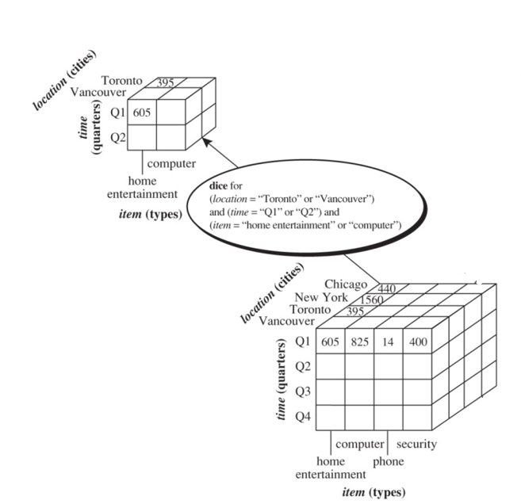

### 2.4 Pivot and Other Operations

**Pivot **(also called **rotate**) is a visualisation operator and does not change the data. It changes the data axes in view to an alternative presentation, such as by geometrically rotating a 3D cube or by presenting a 3D cube as a series of 2D planes.

Example

Starting from the  2-D  presentation below of sales with dimensions *types  x cities,* a *pivot* operation would  rotate the axes to  show  *cities x types* and the values would remain unchanged. 

**Other OLAP Operations**

OLAP servers typically offer many other operations. Some of the more common are

- Drill-across: involving (across) more than one fact table
- Drill-through: through the bottom level of the cube to its back-end relational tables (using SQL)
- Ranking: top-k or bottom-k items in a list ordered by some measure
- Moving averages: over time
- Statistical functions
- Domain specific operators: growth rates, interest, internal rate of return, depreciation, currency conversion.

## 3. Data Mining in Data Warehouses (Text 4.3)

**Three kinds of data warehouse applications** (in order of increasing sophistication)

- (1) Information processing
  - supports querying, basic statistical analysis, and reporting using crosstabs, tables, charts and graphs
  - provides information directly stored or aggregated.

- (2) Analytical processing
  - *multidimensional* analysis of data warehouse data.
  - supports basic OLAP operations, slice-dice, drilling, pivoting.
  - derives information summarised at multiple granularites from user specified subsets (i.e user-specified concepts).
- (3) Data mining
  - knowledge discovery from hidden patterns
  - supports finding associations, constructing analytical models, performing classification and prediction, and presenting the mining results using visualization tools
  - *automated* discovery of implicit patterns

**Multi-dimensional data mining**

- also called *Exploratory multidimensional data mining*, *Online Analytical Mining*,  and *OLAM*
- integrates OLAP with with data mining
- benefits from the high quality of data warehouse data
- information processing infrastructure of the data warehouse can be used (acess, APIs, storage, security, maintainance etc).
- OLAP can be used for exploration

## 4. Processing OLAP queries

Data Warehouses contain huge volumes of data, yet aim to answer queries in interactive query time time-frames.

One way to deliver fast response times is to pre-compute all the aggregate measures required, at a much increased storage cost.

Data Warehouses must support efficient cube computation, access methods and query processing techniques.

### 4.1 Efficient Data Cube Computation (Text 4.4.1)

**Data Cubes**

- A Data cube can be viewed as a lattice of cuboids 
- The bottom-most cuboid is the base cuboid
- The top-most cuboid (apex) contains only one cell

Example:

The diagram shows a lattice of cuboids making up a 3D data cube of *sales* with dimensions *city x item x year.*  Each cuboid represents a different group-by.

The base cuboid contains all three dimensions, at the lowest level of aggregation, that is, the finest granularity.

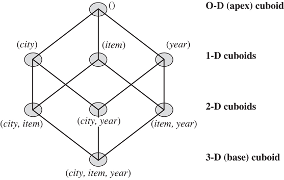

- The 3-D base cuboid represents the answer to queries such as  "*What  are the sales for each city, item and year?".* It is the least generalised (most specific) cuboid.
- The 2-D  cuboids represent the answer to queries such as  "*What is the sum of sales, grouping by city and item?".*
- The level-2 1-D cuboids represent the answer to queries such as *"What is the sum of sales, grouping by city?".*
- The  0-D apex cuboid, often denoted all,  represents the the answer to *"What is the sum of sales?"*. It is the most generalised (least specific) cuboid.
- The total number of cuboids for this 3-D data cube is $2^3=8.$

**Compute cube**

In general, the number of cuboids in a data cube of dimension $n$ is $2^n.$

This cube may be only conceptual, but it can also be *materialised* (that is, pre-computed) in full to reduce run-time query processing costs.

It can be generated by a sequence of  SQL group-by queries, one for each cuboid.

In a generalised syntax, the complete data cube above could be defined by the query

$$\text{define cube sales_cube [city, item, year]: sum(sales in dollars)}$$

And it could them be fully materialised as all 8 cuboids by

$$\text{compute cube sales_cube}$$

In extended SQL by

```sql
select city, item, year, SUM(sales in dollars)
from sales
group by cube (city, item, year)
```

However, the full materialisation can be useful for fast query response times, but very expensive in storage. 

**Size of the materialised data cube**

In general, the number of cuboids in a data cube  of dimension $n$ is $2^n.$

However,  when we  also  count cuboids generated for concept hierarchies for roll-ups,  for $L_i$ being the number of  levels in the hierarchy for concept $i$, we get the total number of cuboids, $T$.

$$T=\Pi^n_{i=1}(L_i+1)$$

There can be at most one abstraction level in each dimension in a cuboid ($L_i$), plust one extra level on each hierarchy to account for _all_.

Example:

Consider a cube of 10 dimensions with 5 levels for each dimension (including all). Then the number of cuboids is $5^{10}\approx9.8\times10^6.$

In practice, 60 or so dimensions is not unusual.

As the number of dimensions, the number  and length of conceptual hierarchies, and the number of distinct values in each dimension grows, the storage space for the cuboids can grossly exceed the  storage size for the initial data. Furthermore the computation cost of evaluating all cuboids becomes prohibitive.

**Question:**

Consider the  (4D)   cube of *sales* with dimensions *item x time x location x supplier* and  the concept hierarchy  along the location dimension of (*offices < cities < countries < regions)* and the concept hierarchy along the time dimension of (*days < weeks < years*).

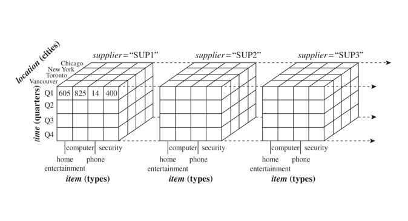

How many cuboids are there in the materialised data cube?

$n=4, L_1=L_{item}=1, L_2=L_{time}=3,L_3=L_{location}=4,L_4=L_{supplier}=1,T=2\times 4\times5\times 2=80.$

### 4.2 Processing OLAP queries (Text: 4.4.3)

Precomputing all of a data cube is often prohibitively expensive in storage, and typically large parts of the cubiod are never used.

We can

- Materialise every (cuboid) (full materialisation),
- none (no materialisation),
- or some (partial materialisation)

The latter is the typical choice, but it requires intelligent strategies for run-time query processing.

In general, query processing must

1. **Determine which operations should be performed on the available cuboids** Transform drill, roll, etc. into corresponding SQL and/or OLAP operations, e.g., dice = selection + projection on a cuboid
2. **Determine which materialized cuboid(s) should be selected for  the OLAP operation**

Example

Consider *sales_cube [time, item, location]* with measure *sum(sales_in_dollars)* with 3 hierarchies

time: (day < month < quarter < year)

item: (item_name < brand < type)

location: (street < city < province_or_state < country)

Let the query to be processed be on {brand, province_or_state} with the condition “year = 2017”, and there are 4 materialised cuboids available:

1) {year, item_name, city} 

2) {year, brand, country}

3) {year, brand, province_or_state}

4) {item_name, province_or_state}  where year = 2017

5) {item_name, province_or_state} 

*Which cuboid could be selected to process the query?*

- The cuboid must contain at least the dimensions mentioned in the query (or more)
  - *Cuboids 1,2,3 meet this condition*
  - Although a selection clause in a query can imply the exception clause in the cuboid
    - *This allows cuboid 4 to be used, too, because the dimensions {item_name, province_or_state} mentioned in the query are in the cuboid.*
- Finer-granularity data cannot be generated from coarser-granularity data.
  - Cuboid 2 cannot be used because *country* is more general than *province_or_state*. That leaves 1,3,4 as the only cuboids that *can* be used.

*Which cuboid  would be best to use for the query?*

- Prefer a cuboid at the coarsest granularity of data 
  - Cuboid 1 is the finest granularity and should typically not be used. So that leaves 3 and 4.
- **Prefer a small  cuboid or one with prebuilt efficient indexes**
  - If there are few *year* values overall  but there are many *item_name*s for each *brand* then 3 would be smaller and so a good choice.
  - On the other hand, if 4 has efficient indexes, it could be the better choice.

### 4.3 Cube Materialization (Text 5.1)

The major strategies precomputing cubes are

- (1) **Full Cube materialisation** - possibly using the Multiway method, that computes aggregations simultanously across multiple dimensions.
- (2) **Cube shell**:
  - Compute all cuboids with *k* dimensions or less (for some small *k*, like 3) on the assumption that most investigations only need a few selected dimensions; or
  - Compute *shell fragments*  by pre-computation and and fill them in with run-time computation:  a semi-online strategy
- (3) **Iceberg Cube:** The Iceberg is a partial cube that can be built top-down by the *BUC metho*d  or top-down and bottom-up by *Star Cubing.* 

### 4.4 Iceberg Cubes (Text 5.1.1)

**Sparse data cubes**

Many cells in a cuboid may have a zero measures, and be of little interest to anyone. For example, may stores may not stock many products of the product line, and their counts of items sold for unstocked products will always be zero. 

Cuboids with many zero-valued cells are  **sparse cuboids**; a cube with many sparse cuboids is a **sparse cube.** Typically, datacube representations are designed for sparse cubes and cells with zero measures are not materialised.

**Iceberg Cubes**

Further, *low* values of measures are often considered of little interest.  If measures are lower than some predefined threshold  then such cells  may also be left out of the datacube, and although an analyst may not know exactly what the values are, they can infer that they are below that threshold.

Such partially-materialised cubes are called called **iceberg cubes **because only the  interesting tip of the huge iceberg of data is visible in the cube.

The threshold is called the **minimum support threshold** or *min_sup.*

Example: precomputing an iceberg cube from the *salesinfo* relation

*compute cube sales iceberg as*

```sql
select month, city, customer group, count(*)
from salesInfo
group by cube(month,ciy,customer,group)
having count(*)>=min_sup
```

The constraint "*count(\*) >= min_sup*" is called the **iceberg condition**, in this case applying to the count measure, but other measures can  also be used.

This approach does avoid materialising trivial aggregate cells, but there are still many redundant cells generated.

Example

Consider the iceberg cube with a 100-D base cuboid of only two cells meeting the threshold condition, say *sum >= 10*. These 2  cells are

A: $(a_1,\dots,a_{100})$ with sum $10$; and

B: $(b_1,\dots, b_{100})$ with sum 10 and all the $a_i \not= b_i$ for $i=1,\dots, n$. That is, for every dimension, the attribute values for A and B are different.

Then, each of  the 100 99-D cuboids  up one level from the base also have 2 cells in them, because whichever dimension is aggregated at that level, all of the 99 values for the remaining 99 dimensions are different for the two cells with measure value 10. For every level up the cuboid this same pattern will apply; the two cells will continue to be represented in two different aggregate cellls in every cuboid, except only for the apex cuboid.  Even at one level below the apex the 100  1-D  cuboids will each have two cells because they each have different values for the 1 dimension of every cuboid. At the apex, the cells will combine to form a single aggregate with measure value 20.

That is, even though each cuboid is small, with only 2 cells per cuboid (apart from the apex),  there are neverthless $2^{100}$ cuboids to be computed and stored. That is $2\times 2^{100}-1$ cells are stored: 2 for each of $2^n$ cuboids less 1 for the apex cuboid that has only one cell.

**Closed cubes**

Clearly, there is a lot of redundant information here, and this too can be reduced through the concept of *closed cells.*The idea is that  any cell only needs to be represented at its least aggregated (lowest)  cuboid in the  lattice where it satisfies the threshold condition, and there is no need to store it in aggregated form with the very same measure value at any higher level, until it gets  aggregated with some other cells that *do* cause the measure value to change.  In our example, we would store the two very different cells at the base cuboid, both with sum value 10,  and would store the apex cell where those two cells are combined to give sum 20, but no other cells are represented. The closed iceberg cube  then is storing only  only 3 cells, contrasting with $2^{101}-1$ for the basic iceberg cube as described above.

A cell is a **closed cell** if there is no other cell that is a descendant (above it in the lattice)  that has the same measure value as itself.

A **closed cube** materialises only closed cells.

For **query processing**, if we are looking for the measure of some  cell that is not materialised, we can look down for the next more specific cell and use the measure  value found there. If we find no such cell even in the base cuboid, then we know that the measure value failed the iceberg condition.

Example:

In our example above of two cells at the base, assume we are looking for, say $(*,a_2,*,a_4,\dots,a_{100})$ where $*$s here indicates the aggregation over the first and third dimensions, that is a cell in a 98-D cuboid of the datacube. Then when we find that cell is not materialised, we can traverse downwards to hit materialised A, and that gives us the sum value of 10.

## 5. Speiclist Data Cubes

Various special materialisation and processing strategies have been developed for specific kinds of query patterns.

These include sampling cubes, ranking cubes, prediction cubes,  multifeature cubes, and exception-based cubes.

These have a more automated data-mining role, along with attribute-oriented induction  that finds compact descriptions of data instances

### 5.1 Attribute oriented induction (Text 4.5)

**Attribute oriented induction** produces **concept descriptions** (also called **class descriptions**) of groups of data, using the language of the attributes and concept hierarchies around which the warehouse is designed.

Concept descriptions may be a **characterisation** of data in the class, or a **comparison** or **discrimination** comparing multiple classes.

The following is a simplified presentation for **characterisation.**

User first provides a relational database query that defines the class of data of interest.

Example: *select Name, University, location, Degree from CV where discipline = "computer science"*

Tuples in the answer are written as  attribute-value pairs, with counts

Example: *Name = 'Kerry" and University = ANU  and location = Canberra and Degree = MADA*, 1

The algorithm attempts to generalise the  set of tuples to simplify their description.

**How it is done?**

1. Collect the task-relevant data (initial relation) using a relational database query
2. Perform generalization by attribute removal or attribute generalization (various heuristics may be used to determine how far to generalise)
   1. Remove the attribute if it has a lot of different values, and so is not selective (e.g. Name)
   2. Try replacing the attribute by another up a level in a concept hierarchy, and use that  (eg. Degree -> Degreelevel)
3. Apply aggregation by merging identical, generalised tuples and accumulating their respective counts and other measures
   1. generalisation will have collpased some tuples to identity so combine and aggregate measures.
4. Interaction with users for knowledge presentation or adjustment

Example: after induction, we have the following concept description of computer science  CVs.

| University | DegreeLevel | Count |
| ---------- | ----------- | ----- |
| UNSW       | Undergrad   | 20    |
| ANU        | Postgrad    | 30    |
| ANU        | Undergrad   | 5     |

For **discrimination**, the method is similar, with separate starting queries to identify the target class and one or more discriminating classes. The discriminating classes serve as constraints on the generalisation of the target class to avoid including answers of the discriminating classes.

## 6. Reading

Ramakrishnan_and_Chen_2007

## 7. Practical Exercises

## 8. Quiz


***

What are some strategies for dealing with the problem that a materialised cuboid can be very large, i.e. much larger than the original source unaggregated data?:

- partial materialization basd on expected query load - selected dimensions and aggregation leels


- iceberg cubes with a filter constraint on the measures defining what is materialized 
- intelligent query processing that takes account of the info that is materialized


One example of a data mining method that may be embedded in a RDBMS is attribute-oriented induction, that can give similar results to decision tree or ILP methods. Given a set of relational tuples (or, equivalently key-value pairs), what are some of the structural operators that could be applied to find a generalised description of the tuples?


- removing att from the data description
- describing attrs by labels higher up the concept hierarchy
- adjusting the descriptions through user feedback
- wokring from a user query that identifies the instances in the class to be described
- aggregating (transformed) identical attributes into classes