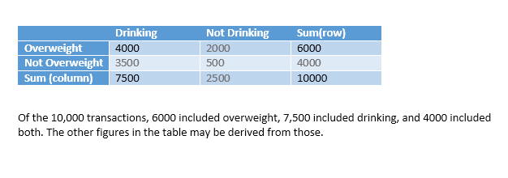
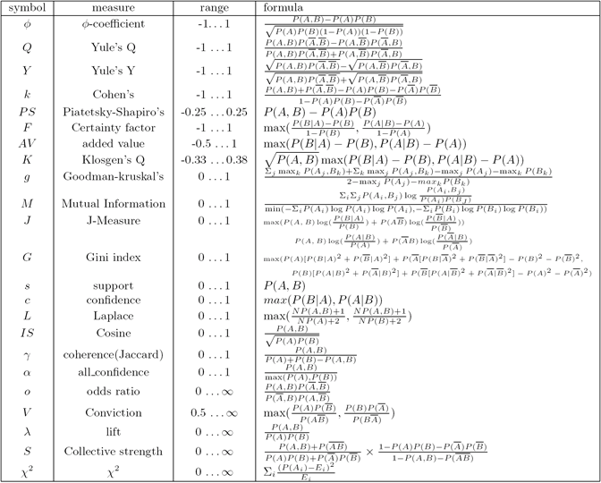
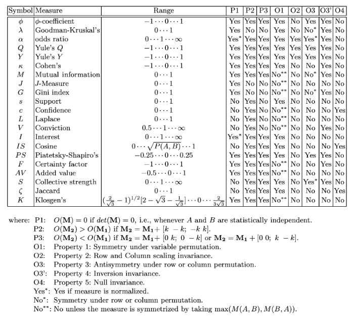
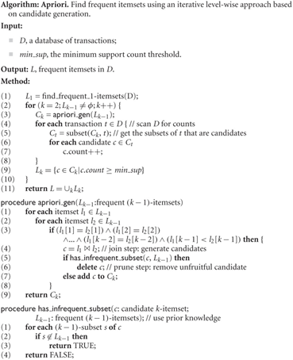
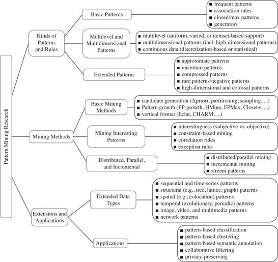

# Week 4 Association Mining

## 1. Introduction

Most of this material is derived from the text, Han, Kamber and Pei, Chapters  6 and 7, or the corresponding powerpoint slides made available by the publisher.  Where a source other than the text or its slides was used for the material, attribution is given. Unless otherwise stated, images are copyright of the publisher, Elsevier.

In this e-book we present the data mining method known as association mining, an early success for the field of data mining.  We discuss the types of problems and data for which it is appropriate, the basic methods for evaluation of mining results, and the way the basic algorithm actually works. There are practical exercises using Rattle.

## 2. Motivation (Text: 6.1)

**Frequent pattern mining** discovers associations and correlations in itemsets in transactional and relational databases. The earliest techniques were developed for commercial *market basket analysis*, and forged the birth of data mining and KDD from a database perspective in the 90s.

The language of frequent pattern mining derives from the assumption that data *items* are grouped into *transactions* (also called *itemsets)*  and we aim to find patterns of *items* that occur in a very high proportion of *transactions.*  The classic example is based on supermarket shopping, where mining is said to have revealed that purchasers of nappies are also very likely to purchase beer in the same transaction. Supermarkets can use this information either to place beer and nappies very close together on the floor, so that such customers can shop very quickly, or perhaps to place them very far apart, so that shoppers might be tempted to buy additional products they see on the intervening shelves.

More recently, frequent pattern mining is used in many other applications where *very many heterogenous but simple items (nominal data)  may be grouped into large (unordered) sets*.  An example could be the pharmaceutical benefits scheme (PBS), where items may be drugs taken under the  scheme and each itemset represents the drugs taken by one individual in a fixed period of time. Applications are often but not always commercial, including shopping basket analysis, cross marketing, catalogue design, sale campaign analysis, Web click stream analysis and DNA sequence analysis. 

Our work on frequent pattern mining focuses on **association mining** to learn patterns of**association rules**.

## 3. Association Mining: Basic Concepts (Text: 6.1)

**Preliminary Definitions**

- **itemset:** a set of one or more items. Let $I=\{I_1,I_2,\dots, I_m\}$ be an itemset.
- **k-itemset:** Let $X=\{x_1,\dots, x_k\}$ be an itemset of cardinality $k$. Then $X$ is a $k$-itemset for some $k.$
- $T$ is a **transaction**, a non-empty itemset and $T\in D$ where $D$ is a set of **task-relevant transactions** (or a **dataset**)
- Each transaction, $T$ has a unique **identifier**, say $TID$ (This is not always explicit in the transaction, e.g., the definition above, but is needed to ensure that multiple transactions containing the same items are distinguised).
- Let $A$ and $B$ be item sets, $A,B\sube I$
- A transaction $T$ is said to **contain** $A$ if $A\sube T.$

**Support**

The **support count** of itemset $A$ in dataset $D$ is the cardinality of $\{T, \text{such that}\ A\sube T\ \text{and}\ T\in D\}$. That is, it counts the number of transactions that contain it. Support count is also called *ocurrence frequency, frequency, absolute support* and *count*.

The **support** (commonly called **relative support** and sometimes *frequency*) of itemset $A$ in dataset $D$ is the

$\frac{\text{suppot count of }A\ \text{in}\ D}{\text{cardinality of}\ D}$

That is, it measures the proportion of transactions that contains it. Let's denote this $support(A)$.

An itemset $A$ is **frequent** in dataset $D$ when $support(A)\geq min\_sup$ where $min\_sup$ is a user-defined, application-specific parameter called the **minimum support threshold.**

**Association Rule**

An **association rule** is an implication of the form $A\implies B$ where $A\sub I, B\sub I, A\not=\emptyset,B\not=\empty$ and $A\cap B=\empty$.

The rule $A\implies B$ is said to **hold** in the dataset $D$ with **support** $s$ when $s$ is the relative support of $A\cup B$ in $D.$

The support for an association rule counts the proportion of transactions that contain *every one of both* $A'$s and $B'$s items and it does not distinguish between $A$ and $B$. We can think of support as a measure of significance of the association rule in the dataset — what proportion of transactions does this rule apply to?

Following a frequentist viewpoint, $s=P(A\cup B)$, i.e. the *probability* that an arbitrary transaction in the dataset contains every item of $A$ and every item of $B$.

**Confidence**

The rule $A\implies B$ is said to hold in the dataset $D$ with confidence $c$ when

$c=\frac{support(A\cup B)}{support(A)}$

Confidence for an association rule is the support count of $A\cup B$ in $D$ as a proportion of the support cound of $A$ in $D$.

In a frequentist view, this can be interpreted as the *truth* of the association rule, that is, what proportion of the transactions that contain $A$ also contain $B$, or how much does $A$ imply $B$?

**Strong**

An association rule $A\implies B$ is **strong** when $A\cup B$ is **frequent** in $D$ (i.e. satisifies $min\_sup$) and the rule also satisfies a minimum confidence parameter, $min\_conf$.

That is $A\implies B$ is strong when $support(A\cup B)\geq min\_sup$ and also $support(A\cup B)/support(A)\geq min\_conf$ where $min\_conf$ is a user-defined, application-specific parameter called the **minimum confidence threshold**.

### Exercise: Basic concepts in frequent pattern mining

Consider the dataset of transactions as follows

| **TID** | **Health and lifestyle**             |
| :------ | :----------------------------------- |
| 1       | {diabetes, drinking, overweight}     |
| 2       | {diabetes, smoking, cerebrovascular} |
| 3       | {drinking, overweight, liver}        |
| 4       | {drinking, overweight}               |
| 5       | {diabetes, overweight, exercise}     |

1. What is the support count of {drinking} in D? **3.**
2. What is the support of {drinking} in D? **60%**
3. What are the transactions that contain {drinking, overweight}? And what is the support? **1,3,4, support=3/5**
4. Consider the rule {drinking}$\implies${overweight}. What is the support? **3/5**
5. What is the confidence for the rule above? **3/3=1**
6. Consider the rule {overweight}$\implies${drinking}. What is the support? **3/5**
7. What is the confidence for the rule above? **3/4**
8. Assume min_sup is 60% and min_conf is 80%. Which of  the above rules, (q4) and (q6), is strong?  **q4 only**

## 4. Association Mining: which patterns are interesting? (Text: 6.3)

**Strong rules are not necessarily interesting**

We need useful, automated measures for assessing pattern *interesting-ness* as there are way too many possible patterns to do it all by human assessment.

**Example**

Consider the *contingency table,* which compares the frequency of combinations of two items  below.

Consider $min\_sup=30\%$ and $min\_conf=60\%$ and the *strong* rule {overweight}$\implies$ {drinking} with support 40% and confidence 60%.

The probability of drinking is already 75%, irrespective of overweightness. To suggest that overweightness implies drinking seems misleading at best.

In addition to support and confidence which measure *association*,  **lift** is used to evaulate patterns to measure *correlation.*

**Lift**

Inspired by probability theory, itemset $A$ is considered independent of itemset $B$ if $P(A\cup B)=P(A)\times P(B).$ Otherwise they are dependent and correlated.

Therefore we define the **lift** of rule $A\implies B$ by $support(A\cup B)/(support(A)\times support(B))$.

The numerator is the probability of the customer purchasing both, while the denominator is what the probability of purchasing both *would have been* if the items were independent.

If $lift=1$ then $A$ and $B$ are **independent**.

If $lift>1$ then they are **positively correlated** as the presence of one suggests the presence of the other. In other words, it suggests that each lifts the likelihood of the other.

If $lift <1$ then the itemsets are **negatively correlated** and the occurrence of one itemset suggests the more likely absence of the other.

**Example**

What is the lift for {overweight}$\implies$ {drinking} above?

$lift=\frac{4000/10000}{6000/10000\times7500/10000}=16/18=0.89$. Therefore overweight and drinking are negatively correlated and the rule is not considered interesting, irrespective of confidence.

### 4.1 Practical Exercise: Association Mining (part1)

**Objectives**

The objective of this exercise is to experiment with the association mining package available in **R** and **Rattle**, in order to better understand the issues involved with this data mining technique, and to become more familiar with the **Rattle** tool.

**Preliminaries**

If you haven't done so yet, I suggest you create a  **comp8410** folder and an **association_mining**  folder within that.

For this lab we will use two data sets (that are available in **Rattle**): **dvdtrans** and **audit**. The first is a very small data set that contains 10 transactions with market baskets that contain DVDs (their titles), while the second data set contains artificial records created by Graham Williams. To quote from the **Rattle** documentation: *"It consists of 2,000 fictional clients who have been audited, perhaps for compliance with regard to the amount of a tax refund that is being claimed. For each case an outcome is recorded (whether the taxpayer's claims had to be adjusted or not) and any amount of adjustment that resulted is also recorded."*

Association mining in **Rattle** is based on the extension package **arules** (one of the many extension packages available for **R**). For more information about the **arules** please have a look at the [**arules**](http://cran.r-project.org/web/packages/arules/index.html) package information page.

**Tasks**

**1. Setup**

1. Start **Rattle** as you have done before. Here is a quick repeat of the steps involved:

   1. Open a terminal window.
   2. Start R by typing R (capitalised!) followed by 'Enter'.
   3. Type: `library(rattle)` followed by 'Enter'.
   4. Type: `rattle()` followed by 'Enter'. 

2. Load the data set **dvdtrans.csv** which is distributed with Rattle.  If you do not know where to find it, as its location will depend on how you installed R and Rattle in the first place,  you can either:

   **Method A to load an inbuilt dataset.** An easy way is to rely on Rattle's preload of the weather dataset, as long as you have not yet loaded other things in this Rattle session:

   (a) click `Execute` so that the weather data set is loaded, (b) confirm the popup box question, and once the data set is shown in the `Data` tab (c) click on the folder button in the `Filename` input box, (d) a window should pop up which shows you three files to choose from, one should be named **dvdtrans.csv**. (e) Select this file (click `Open`), and click `Execute` in the main Rattle window to load it.

   **or Method B to load an inbuilt  dataset.** This works by asking R to locate the Rattle csv folder:

   (a) Go back to the R interpreter and type `system.file("csv","dvdtrans.csv", package="rattle")` (b) You should expect a response something  like  "C:/Program Files/R/R-3.4.0/library/rattle/csv/dvdtrans.csv". (c) Go the the `Data` tab, click on the folder button in the `Filename`: input box and paste the location that R gave you above, trimming off the filename itself (e.g. "C:/Program Files/R/R-3.4.0/library/rattle/csv"). (d) You can point-and-click to select the**dvdtrans.csv** from the dialogue box and click `Execute` in the main Rattle window to load it.

**2. Min a little data set**

(1) This data set only contains two attributes or variables. On the `Data` tab, you can see the attributes are `ID` and `Item`.  Set the roles of  both attributes as inputs for exploration purposes but you will need to change them again before you start association mining: on the `Data` tab click the `Input` radio button for each Attribute.

(2) Also untick the `Partition` box, as we want to use the full data set for association mining. We will use the Partition feature later on. Then click on `Execute` to confirm this setting.

(3) Now open the data set in a spreadsheet program (e.g. LibreOffice as available from the main Ubuntu menu in the ANU labs, or Excel you may have locally). **How are transactions represented? How many transactions are there?**

**Solution: ** Each row has a <TID, item> pair, a transaction identified by a TID will have one row per item in its itemset.  10.

(4) Now explore this data set on the `Explore` tab, **Note that you might get some errors due to the limited content of this data set.**

(5) Once you have a good understanding of the content of the **dvdtrans** data, set up the data for association mining. On the `Data` tab set the roles of the attributes as follows. The `Ident` role indicates the attribute that is the identifier for an itemset or transaction, and the `Target` role indicates the attribute that represents the items in each itemset.

ID: Ident(ifier) 

Item: Target

click on `Execute` to confirm this setting.

(6) Go to the `Associate` tab. On the `Associate` tab, make sure `Baskets` is ticked. Click on `Freq Plot` and inspect the graph that is shown.  **What does this graph tell you?**

**Solution:**  Support for each singleton itemset.

(7) Now change the `Support` value to a higher value (like **0.3**), and re-generate the `Freq Plot`. **What do you see?**

**Solution:** Only support for singleton itemsets 3.0 or greater

(8) Change the `Support` back to its original value of **0.1** and start the association algorithm by clicking on the `Execute` button. Inspect the output generated. **How many rules were generated?**

**Solution:** 117.

(9) If you click on `Show Rules`, all the generated rules will be displayed in the main Rattle output area. Inspect the generated rules. **How are they sorted?** Also click on the `Plot` button, **how are the generated rules visualised?**

**Solution:**

By decreasing support.

Directed arrows connect each item on the lhs to a circle representing a rule, with support indicated by size and lift by colour. Outgoing arrows connect the circle to each item on the rhs of the rule.

(10) Now set the minimum length of rules (`Min Length`) to 1, click `Execute` and click `Show Rules`. Inspect the rules generated, and scroll down through all rules. **What is the meaning of rules that have an empty left-hand side?** (Hint: Compare these rules with the frequency plot you have generated earlier).

**Solution:** Support for the itemset on its rhs.

(11) Now play around with different values for *Support* and *Confidence*. For example, **what values would you set to get rules that appear in at least a quarter of all transactions**? Note that you have to click `Execute` each time you change these parameter values, followed by **`Show Rules`**. 

(12) Play  with **dvdtrans** for a while and find parameter settings that result in a good / interesting / useful (?) set of rules. 

**Solution:** Support = 0.25. Confidence =0

### 4.2 Chi-square (Text: 6.3.2 and 3.3.2)

For nominal data the correlation between two (and only two) attributes can be measured by the chi-square test. The **chi-square** ($\chi^2$) statistics tests the hypothesis that the attributes are independent. For association rules we treat the itemset on each side of the implication arrow as a single attribute, taking on the value of either all the items are present, or all the items are absent. In this way we consider the correlation amongst the complete itemsets of the left and right sides of a rule.

This chi-square test is also called *Pearson's chi-square test,* not to be confused with Pearson's r that measures correlation  of numerically valued attributes. Both are based on the chi-square distribution.

**Chi-square**

Let $A$ be a nominal that can take on $c$ distinct values $a_1,a_2,\dots, a_c$ and $B$ be a nominal that can take on $r$ distinct values $b_1, b_2,\dots, b_r$.

Let $n$ be the total number of data tuples (in our case, transactions).

Let $(A_i,B_j)$ represent the case that $A=a_i, B=b_j$

Then $\chi^2=\sum^c_{i=1}\sum^r_{j=1}\frac{(o_{ij}-e_{ij})^2}{e_{ij}},$

where $o_{ij}$ is the observed frequency (actual count in the data of $(A_i,B_j)$) and $e_{ij}$ is the expected frequency defined as $e_{ij}=\frac{count(A=a_i)\times count(B=b_j)}{n}$

The *degrees of freedom* $(r-1)\times (c-1)$ are used to assess the value needed to reject the hypothesis that A and B are independent at some selected significance level. This can be done by a table lookup such as <http://www.itl.nist.gov/div898/handbook/eda/section3/eda3674.htm>

**Chi-square interpretation**

$\chi^2=0$ only if the expected and true number of observations are equal in all cells, that is the attributes are independent.

$\chi^2\geq 0.05$ is commonly interpreted  as justification for rejecting the null hypothesis that the attributes are independent, that is, for asserting a likely correlation.

In data mining over large datasets, $\chi^2>1$can be used as a rule of thumb to suspect an interesting  correlation. But it does not tell you whether that correlation is positive (i.e. they occur together more than expected by chance) or negative (i.e. they occur together less than expected by chance). 

**Example**

This is most easily expressed in a contingency table. Here we extend the contingency table previously presented for lift previously.

The expected value for each value needs to be computed first.

Using the contingency table, this means, e.g.  

$e_{11}=count(overweight)\times count(drinking)/n = 600\times 7500/10000=4500$

The contingency table shows expected values indicated in parentheses in each cell.

The chi-square is then

$\chi^2=\sum\frac{(observed-expected)^2}{expected}=\frac{(4000-4500)^2}{4500}+\frac{(2000-1500)^2}{1500}+\frac{(3500-3000)^2}{3000}+\frac{(500-1000)^2}{1000}=555.6$

The degrees of freedom is $(r-1)\times(c-1)=1.$ Looking up the table given above, the chi-square value needed to reject the hypothesis of independence at the 0.001 significance level is 10.828. Therefore the value of 555.6 suggests the attributes are strongly correlated.

More simply and conveniently, because $\chi^2>1$and the observed value  in the top left (4000) is less than the expected value (4500) *overweight* and *drinking* are assumed to be negatively correlated. 

Therefore a rule *{overweight*}$\implies${*drinking}* is not considered interesting, and this concurs with the assessment using **lift** earlier.

### 4.3 Other interstingness measures (Text 6.3.3)

Many other measures of interestingness have been proposed in the literature, and can be shown to have intuitively attractive behaviour on at least some itemset patterns.

Here is a definition of many including the support, confidence,  lift and chi-square from:  Tan, Kumar, Srivastava, *Selecting the right interestingness measure for association patterns*, Proc 8th  ACM SIGKDD international conference on Knowledge discovery and data mining, 2002

**ACTION: Read the paper** Selecting the right objective measure for association analysis from which the following summary of characteristics of interestingness measures is taken.

The property called **null-invariance** is particularly relevant for patterns involving low-frequency itemsets. $\chi^2$ and lift are *not* null-invariant, meaning that their values are significantly raised by all the transactions in which the itemsets do *not* occur. That is they are affected by adding a whole lot of  apparently irrelevant transactions to a dataset. On the other hand, as you can see from the table below, confidence *is* **null-invariant** because its values are affected only by the transactions in which the itemsets *do* occur. 

Normally null-invariance is considered a useful property but this may be application-dependent.

## 5. Frequent Itemset Mining (Text 6.1.2)

Association mining can be viewed as a two-step process

(1) Find all frequent itemsets — i.e. all the itemsets that occur at least $min\_sup \times cardinality\ of\ dataset$ times in the dataset.

(2) Use the frequent itemsets to generate strong association rules that satisfy $min\_conf$.

The first step is much more computationally demanding than the second, especially when $min\_sup$ is low.

### 5.1 Apriori algorithm (Text: 6.2.1 and 6.2.3)

The *Apriori algorithm* is the archetypical algorithm for finding frequent itemsets.

It implements an iterative level-wise search for frequent itemsets, where  the k-itemsets (itemsets of cardinality *k*) at level *k* are used to explore the k+1-itemsets at level *k+1.* At each level, the transaction database is scanned to count items in transactions and  to collect the items that satisfy minimum support.

**Apriori Property**

The following observation is used to reduce the search space. This property is very closely related to the  *iceberg condition* we saw in data cube materialisation.

>  **All non-empty subsets of a frequent itemset are also frequent**

Recall that a frequent itemset is one with at least  least  *min_sup* support, i.e. one that occurs in at least *min_sup t*ransactions. Since each of its subsets occur in all those same transactions (and possibly in additional transactions as well),  the support of sub-itemsets cannot be less than *min_sup* either.

A consequence of this is that **if an itemset is not frequent, then any of its supersets cannot be frequent either** (otherwise the apriori property would be violated).

This can be used in a level-wise algorithm like the *apriori algorithm* to reduce the search space, because any k+1-itemset with a non-frequent k-itemset subset (all of which have already been found in the previous iteration) can be ignored.

**Apriori algorithm**

The basic form of the algorithm is sketched here for reference.  You can see the apriori property being used at (5) in procedure `apriori_gen` to prune itemset candidates. 

Many simple further **optimizations** are possible such as:

- in step  (4) of the main procedure above, ignoring transactions from consideration at level *k* that did not contain any frequent *j*-itemsets in an earlier level *j (j < k).* This optimisation is another application of the apriori property.
- sampling -- mine a random sample of D instead of the whole dataset

### Example: A-priori algorithm

Assume a dataset of three transactions:

1: {A, B, C, D}

2: {A, B}

3: {A, D}

Use  min_sup = 2/3, that is, a *minimum support count* of 2. Note that the size of the dataset  is 3.

First compute **$L_1=\text{frequent 1-itemsets} = \{A\}\text{ with count 3, }\{B\}\text{ with count 2 and }\{D\}\text{ with count 2}$** so they are frequent ($\{C\}$ is not frequent).

Call apriori_gen to find candidates for $L_2$

$c_2=\{\{A,B\},\{A,D\},\{B,D\}\}$ by pairwise joins on itemsets in $L_1$

Now count transactions containing each candidate of $c_2$

Transaction 1: {A,B}  +1, {A,D} +1 , {B,D} +1

Transaction 2: {A,B}  +1  = 2

Transaction 3:  {A,D} +1 =2

So only {A,B} and {A,D} are frequent so **L2 = { {A,B} , {A,D} }**

Loop around again to find L3 = frequent 3-itemsets

Call apriori_gen to find candidates for L3

c3=  only { {A,B,D} }  by pairwise joins on itemsets in L2 , noting here that the join concatenates itemsets that differ only in the rightmost element 

Check if this one itemset  in c3 has_infrequent_subset  (i.e. use the a-priori property)  and we find that subsets {A,B} and {A,D} are ok, but {B,D} fails because it is not in L2 above.

So the itemset is deleted and empty c3 is returned.

There is nothing to do with an empty candiate set and L3 is set to {}, i.e. empty

So the loop terminates in the test at the top of the next iteration.

The frequent itemsets is the union of L1 , L2. L3 = **{ {A}, {B}, {D}, {A,B} , {A,D} } with counts 3,2,2,2,2 for each itemset respectively.**

### 5.2 Generating Association rules (Text: 6.2.2)

Once all frequent itemsets have been found, *strong* association rules are generated as follows.

Note that all frequent itemsets and all their non-empty subsets already satisfy *min_sup*support, so we only need  to check *confidence* of the rule, which is $support(lhs\cup rhs)/support(lhs)$

For each frequent itemset *l,*

​	generate all non-empty proper subsets of *l*

​	for each non-empty proper subset *s* of *l*

​		if (support_count(*l)* / support_count(*s*) ≥ min_conf) then

​			output the rule $s\implies (l-s)$

### Exercise: Generating association rules from frequent itemsets

Consider the dataset, *D*, of transactions as follows.

| **TID** | **Health and lifestyle**                   |
| ------- | ------------------------------------------ |
| **1**   | {diabetes, drinking, overweight}           |
| **2**   | {diabetes, smoking, cerebrovascular}       |
| **3**   | {drinking, overweight, liver}              |
| **4**   | {drinking, overweight}                     |
| **5**   | {diabetes, overweight, exercise}           |
| **6**   | {diabetes, drinking, overweight, exercise} |

Let min_sup (minimum support) be 2/6

Consider *frequent* itemset  A = {diabetes, drinking, overweight }.

1. What is the support of A in D? **Solution:** 2/6

2. What are the frequent non-empty subsets of A? **Solution:** {diabetes } {drinking} {overweight } {diabetes, drinking } {diabetes,  overweight } {drinking, overweight } Note that all subsets are frequent because the full set is frequent.

3. What is the support count for each  of those subsets? **Solution:** Respectively: 4, 4, 5, 2, 3, 4 

4. What are the association rules that can be built from A together with their confidence?

   **Solution:**

   {diabetes } -> { drinking, overweight } 2/ 4

   {drinking} -> {diabetes,  overweight } 2/ 4

   {overweight } ->  {diabetes, drinking } 2/ 5

   {diabetes, drinking } -> {overweight } 2/ 2

   {diabetes,  overweight } -> {drinking} 2/ 3

   {drinking, overweight }- > {diabetes } 2/4

5. Let min_conf (minimum confidence) be 50%. What are the rules that are  output? **Solution:** All but the third.

6. What can you say about the causal relationship between the lhs and rhs of association rules? **Solution: **None can be inferred without other information. An association is just that.

### 5.3 Efficient frequent itemset mining (Text: 6.2.6)

Recall that if an itemset is frequent, then every subset is also frequent. This enables some significant memory-saving optimisations that can be used in the a-priori and other frequent pattern mining algorithms.

**Example:**

Consider frequent itemset $A=\{a_1,\dots,a_{100}\}$ so that $min\_sup$ proportion of transactions contain it. Then all those transactions also contain every non-empty subset of $A$ which are also frequent itemsets. Since there are $2^{100}-1\approx 1.27\times 10^{30}$ non-empty subsets this is a lot.

In data warehouse cuboids, we solved the same problem  of combinatorial explosion by looking at closed cells.

**Closed**

An itemset $X$ is **closed** in dataset $D$ if there is no itemset $Y$ in $D$ such that $X\sub Y$ and $Y$ has the same support count as $X$ in $D.$

(Note the use of the proper subset relation, not $\sube$ here).

Generally, support goes down as an itemset gets bigger, but a closed itemset is as big as it can be without reducing support.

An itemset is a **closed frequent itemset** if it is both closed and frequent.

An itemset $X$ is a **maximal frequent itemset**  (or **max-itemset**) in $D$ if $X$ is frequent in $D$ and there is no frequent itemset $Y$ in $D$ such that $X\sub Y$.

A maximal frequent itemset is as big as it can be yet still satisfy the  threshold, even though it might have subsets which have higher support but are not maximal-frequent.

The closed frequent itemsets of *D,* with their support counts,  represent all the frequent itemsets of *D* and their counts without loss of information.  The maximal frequent itemsets with their counts, however, do  represent all the frequent itemsets, but not their counts, we have only a lower bound on their counts. 

**Example:**

Consider *D*  is a dataset of two transactions: $\{\{a_1,\dots, a_{100}\},\{a_1\dots, a_{50}\}\}$.

Let $min\_sup$ be 50%, that is, the minimum support count is 1.

The  non-empty frequent itemsets in *D* are $\{a_1\},\dots,\{a_{100}\},\{a_1,a_2\},\dots,\{a_1,a_{100}\},\dots,\{a_1,a_2,a_3\},\dots, \{a_1\dots,a_{100}\}$ all $2^{100}-1$ of them.

The closed itemsets of $D$ are $\{a_1,\dots, a_{100}\}$ with support count 1 and $\{a_1,\dots, a_{50}\}$ with support count 2, so they are both frequent.

If we keep track only of all the closed frequent itemsets and their counts, then we can immediately infer all the other frequent itemsets and their counts, by using the maximum count of all the closed frequent itemsets that are its supersets. So $\{a_1\}$ for example, has support count  2.  We save a lot of space by not needing to represent all the frequent subsets of the closed frequent itemsets.

The only maximal frequent itemset in $D$ is $\{a_1,\dots, a_{100}\}$ with support count 1.

If we keep track only of all the maximal frequent itemsets and their counts, then we can immediately infer all the other frequent itemsets and a lower bound on  their counts, by using the maximum count of  all the maximal frequent itemsets each belongs to. So $\{a_1\}$ for example, has support count  >= 1. But we save even more space by not needing to represent all the closed frequent subsets of the maximal frequent itemsets.

Read: Closed and maximal itemsets.

## 6. Advanced Pattern Mining (Text: 6.2.4 and 7)

Algorithms other than a-priori have been developed to reduce database scans or reduce main memory usage and these may scale better over large datasets.

Some of these are:

- FP-growth, frequent pattern growth
- Eclat, equivalence class transformation
- Mining closed and max-patterns

Some algorithms rely on representing transactions in a *vertical* form  as <item, set of TIDs> instead of the *horizontal* form <TID, set of items> that we saw previously. However, many of these aternative approcahes use the apriori property  as does the apriori algorithm.

**Advanced Pattern Mining**

So far, we have spoken of very simple pattern mining where all the data in a transaction corresponds to multiple values drawn from a single nominal domain. Many extensions have been developed that  apply more structure over the  input data handled and the rules produced. The following diagram summarises these extensions, including extended sophistication of mining algorithm methods.

### 6.1 Extended data types (Text: 7.2.2)

Until now, we have assumed that all *items* are pretty much the same, i.e. they are all alternative values of a single nominal variable without any further structure. However, this assumption seriously limits the scope of application of association mining.

**Multi-dimensional patterns  over nominal data**

Earlier, we mixed  (controllable) lifestyle attributes with  disease attributes for a person as indistinguishable items for  a **single-dimensional rule.** Such rules are also called**Boolean association rules** since the binary  presence or absence of an item is represented.   Some pattern mining methods rely on explicitly distinguishing the dimensions for **multidimensional association rules**, but the apriori algorithm does not do this.

A simple solution to distinguish the attributes  for single-dimensional algorithms like a-priori is to transform the values of nominal attributes to  explicit attribute-value pairs and so to transfer all distinct nominal domains to the one nominal item domain for mining.

Example

For the domains *Disease = (diabetes, cerebrovascular, liver)*,  and *Lifestyle = (drinking, overweight,smoking,exercise)* a transaction such as {*diabetes, overweight, exercise*} would be transformed to *{Disease\**=**diabetes, Lifestyle=overweight, Lifestyle=exercise}* and these can then be treated homogenously as if from a single domain.

This transformation need not influence the data mining algorithm, that is, a single-dimensional algorithm like apriori can be used. It could, however,  affect  the measures for interestingness of rules and how you would like results to be presented.

**Ordinal data**

Typically,  frequent item set mining does not take account of any meaningful order amongst the values for categorical data. Therefore ordinal data can be treated as nominal data (as above), or alternatively, where the number of alternative values is very large, as continuous data (as below).

**Quantitative (continuous)  data**

A **quantitative association rule**  is one where, based on items that take on **quantitative values** drawn from a  numeric domain, rules include attribute values partitioned into discrete intervals, such as age *18-25*. There are two broad approaches that can be used:*static*, or the more sophisticated *dynamic*. 

**Static**

One approach to mining over continuous data is to transform quantitative attributes  into discrete, pre-determined nominal attributes  in advance. 

Example:

For the domain *Age = (0..120)*, a value such as "*25*" would be transformed to the item *Age=18-25* and a value  "*99*"  would be transformed to the item *Age=75 and over.*

The pre-determined method is generally most approriate where the intervals have meaning in the domain, generally related to where consequent actions can be targeted. For example, partitioning *age*  into the year groups  that correspond to educational stages might be helpful for targeting education-related interventions.

This transformation need not influence the data mining algorithm, that is, a nominal-only  algorithm like apriori can be  effectively used.

**Dynamic**

A more sophisticated approach is to cluster attribute values into bins relying on the data distribution, and  then further combining these bins during the mining process. In this case we are looking for a dynamic discretisation that interacts with the mining algorithm to choose  good value ranges  that, for example, maximise the confidence of rules. That is, you need to choose a mining method that is aware of the continuous values and an off-the-shelf apriori algorithm will not do.

One approach to this problem is to integrate the frequent item-set discovery with a data warehouse cube structure, so that the aggregate counts over multiple dimensions in the cube can be retrieved in a top-down fashion, (either drilling down over concept hierarchies or drilling down  to introduce additional dimensions) and stopping  the drill-down when a  count fails minimum support (because the apriori condition ensures that no lower cube will satisfy minimum support) and using the dimensional labels at that level as the bins for nominal items.

An alternative typical approach is to integrate a *clustering* method (covered later in the course). For each quantitative attribute a clustering algorithm is applied to each dimension to to satisfy minimum support. Then for each such cluster, we  look to combine it with another dimension to find a 2-D cluster with minimum support, and so on to higher dimensions. The range of attribute values that  occur in a cluster then define the discrete bins for nominal items. The apriori condition tells us that we need not look to combine a cluster with another once it fails to satisfy minimum support.

### 6.2 Practical Exercise: More association mining (part2)

**Objectives**

The objective of this second lab is to experiment with the association mining package available in **R** and **Rattle**, in order to better understand the issues involved with this data mining technique, and to become more familiar with the **Rattle** tool.

**Tasks**

(1) Start Rattle and Load the **audit** data set (click on the little folder icon next to `Filename`;, select `audit.csv`, then click `Execute`).

(2) For association mining, we do want to use all records in this data set. Therefore, un-tick the `Partition` box. Now set the role of all variables that contain missing values to `Ignore`. Also set the role of the variable `ID` to ignore - think about why we don't want to have the identifier variable in our association mining experiments. All other variables you should set to `Input`. Make sure you click on `Execute` to confirm your variable settings. Now explore this data set on the `Explore` tab, similar to what you have done before.

(3) Once you have a good understanding of the content of the **audit.csv** data set, go to the `Associate` tab. On the `Associate` tab, make sure `Baskets` is **NOT selected**. Click on `Freq Plot` and inspect the graph that is shown.

**What does this graph tell you, for example, about the distribution of records with Female and Male gender, or the distribution of the Marital values. Why areMarital=Widowed or Marital=Separated, for example, not shown?**

**Solution:**

There are many more males than females, widowed and separated are rare (in less than 10% of transactions), Education is mostly only one of Bachelor or College or HSGrad.

(4) Now change the `Support` value to a lower or a higher value, and re-generate the `Freq Plot`. **What do you see?** 

**Solution:** at support =0.3  there is only Gender, two Marital values and Education = HSGrad left. 
**Why don't you see numerical variables such as Age or Income in these frequency plots?** 

**Solution:** Because they are numeric, not categorical and apriori cannot work with them. If we wanted this,  we would need to pre-process the numerical data into categories, and even then because a-priori does not take account of any ordering in the attributes, we may not see an intersting trends.

(5) Change the `Support` back to its original value of **0.1** and start the association mining algorithm by clicking on the `Execute` button. Inspect the output generated. **How many rules were generated?** 19

(6) Click on `Show Rules`, and inspect the generated rules. **What can you find out about this data set?** 

**Solution:** The rule Marital=Absent => Gender = male  has reasonable support and confidence but the lift is < 0, showing that they are negatively correlated -- the association reflects the general abundancy of gender=male and marital=absent throughout. 

 Now play around with different values for *Support* and *Confidence*. For example, **what values would you set to get rules that appear in at least a quarter of all records?** Note that you have to click `Execute` each time you change these parameter values, followed by Show Rules. 

**Solution:** Support = 0.25, Confidence = 0, only married males are this prominent. 

(7) Now we want to modify and improve this data set to make it more suitable for association mining. Specifically, we will impute missing values and convert numerical variables into categorical ones. Go to the `Transform` tab, select Impute, then select `Constant` and type in a string value in the corresponding box. A value like **`**Missing**'**, or`Not available', or `NA' would make sense, of course.  Select the `Occupation` variable, and click on `Execute` to start the data imputation process. Once done, go to the `Data` tab to check that a fresh variable has been created, and make sure the role of this new variable is set as `Input`.  **What is the variable name?** Remember, if you change any of the variable roles you need to confirm this with a click on `Execute`.

**Solution:** `ICN_Occupation`, for me. 

(8) Go to the `Explore` tab and check that the new variable is now free of missing values, and that it contains the new string value you have just imputed. Go back to the `Associate` tab and re-do the association mining. **What new rules do you get?**

**Solution:** Occupations Executive and Repair both associate with males.

(9) As a last step we want to include the `Age` variable, by converting it into a categorical variable with 6 categories. Go to the `Transform` tab, select `Recode`, leave Quantiles selected, then change the `Number` field to **6**. Select the Age variable, and click on `Execute` to start the data re-mapping process. **What do you think your are doing here? **Once done, go to the `Data` tab to check that a new variable has been created, and make sure the role of this new variable is set as `Input`. Also make sure the role of the original `Age` variable is set to `Ignore` (again, remember to click on `Execute` to confirm any changes in roles). 

**Solution:** Binning the data into 6-tiles (i.e even number of items in each bin, but bins of varying sizes). 

(10) Go back to the `Associate` tab, click on `Freq Plot`, and then re-do the association mining. **What new rules do you get? Are they interesting?**

**Solution:** Several involving age ranges. The highest support has ages 17-24 associated with marital = absent.  This may be formally interesting (has high confidence and high lift),  but unsuprising (although I'd be wanting to look more closely at what Absent means in the data collection to understand this). Also several have certain age ranges associated with male gender, but these have lifts close to 1 (one is <1) , so mostly  positively correlated, but not by much. Indeed chi-square has  them all correlated, but barely (only one has chi-square >1, and still very small). These relationships are not very interesting, and are more likely to  reflect   sampling or poulation bias rather than anything actionable.

**Why does the new attribute appear in rules when the old one did not?** **Are there any other attributes that might need similar treatment before they appear in many (or any) rules?** When performing association rule mining on a dataset such as this, **what might you need to do to ensure that all attributes contribute to the rules that are generated?**

- The old one was numeric, now it is categorical (nominal).
-  Income, Deductions, Hours, Adjustment, Adjusted. 
- Impute missing values and bin numeric values. 

(11)  **Find a rule that looks interesting and explain why.**

**Solution:**

My choice: Rule 20: Occupation = Repair => Gender = male.   It has reasonable  support (10%), so it happens a lot (even though there are several other frequent occupations). It has very high confidence (0.96) so male Gender occurs nearly everywhere  that Repair does, reasonable  lift (1.4)  and chi-square (95) , so the pair are highly positively correlated, (they occur together more than they occur separately). Interpreting this in the context of the domain, it may be interesting as  confirming a pre-existing hypothesis; but it may not be particularly surprising. 

(12) **Find a rule with high support that looks not interesting and explain  why.**

**Solution:**

 My choice is rule 5. Marital = Absent -> Gender = Male. Gender = Male has very high frequency so it is going to have high support with anything else that occurs frequently (andMarital = Absent is in a third of the transactions).  So high support is only telling us they both occur a lot. Confidence is very high, so we know that when Absent, the gender is very often male, but male gender is very frequent everywhere (highly probable irrespective of Marital Status).  Lift is <1 so they occur  apart more than together (negative correlation) and  Chi-square is high, so the negative correlation is quite strong.  So this rule is only prominent because both items are prominent and the association  between them is actually negative, so uninteresting. We could, however,  by comparing confidence of this rule with others with the same lhs, notice that Males are the most  likely gender to fail to report marital status, but I can't see any reason why this might be interesting in the domain.

(13) Quit **Rattle (**Hint: `q()` in R)

### 6.3 Advanced applications (Text: 7.6.2)

Frequent pattern mining, despite being a rather simple idea, has proven to be very successful. Its success may be due partly to its ability to yield readable rules that can make sense for application. Other than market basket analysis, there are many other application areas. 

Pattern mining is widely used for **noise filtering and data cleaning**. For example, microarray data for studying gene expression has tens of thousands of dimensions (this is often called the "p >> n" problem) and it can be very noisy, so pattern mining offers a useful pre-processing tool because items that occur frequently together are likely to be significant rather than noise. We can then focus our analysis on those variables for which some values occur in rules with high support.

Pattern mining is useful for **data exploration** -- to discover inherent structures and clusters hidden in the data. These structures can then be used as basic building blocks for classification problems.

In high dimensional space, frequent patterns can be used for **clustering**, that is to define lower-dimensional sub-space features based on common frequent patterns.

Pattern mining is used in **spatio-temporal data**, time series data, **image data**, **video data**and **multimedia** data for identifying patterns of co-location, and identifying frequently occurring image fragments as the basis for clustering and description.

Pattern mining has been used for analysis of **sequence or structural data** such as trees and graphs. For example, there have ben successes in discovering both plagiarism and copy-paste bugs in large  software programs.

Pattern mining has been known to help in designing simple indexing structures for for large complex data sets to support **similarity search** in XML document databases and chemical compound databases.

**Recommender systems** have employed pattern mining for discovery of patterns in customer behaviour.

Often these applications require specialist techniques to handle the particular quirks of the data and the problem domain.