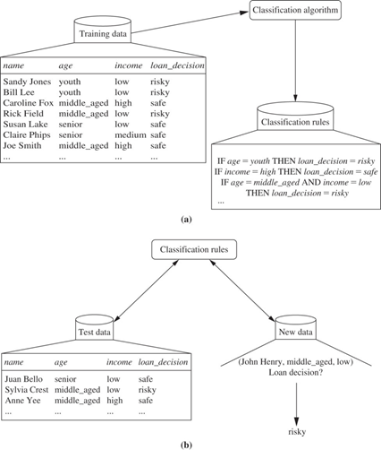
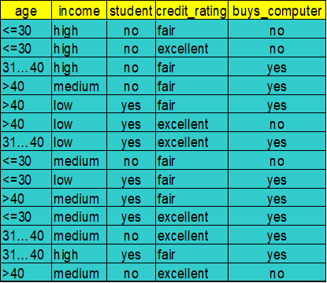
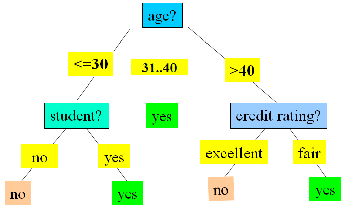
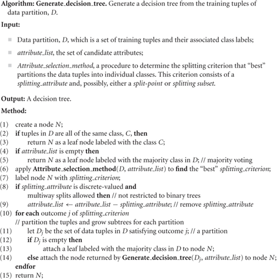
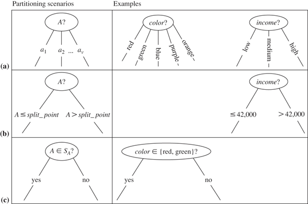
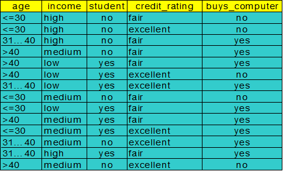
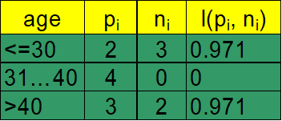
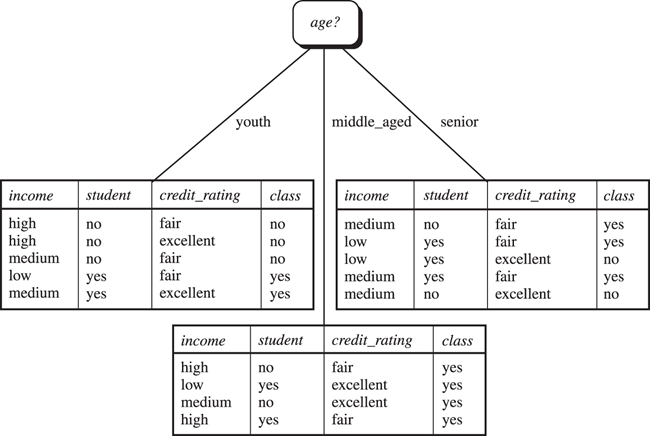
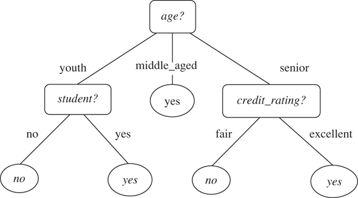
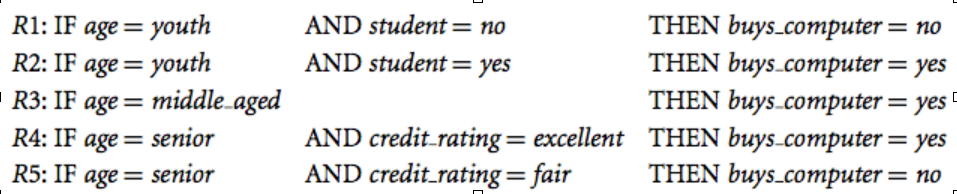

# Classification & Prediction 01: Introduction and Decision Trees

## 1. Introduction

Most of this material is derived from the text, Han, Kamber and Pei, Chapter 8, or the corresponding powerpoint slides made available by the publisher.  Where a source other than the text or its slides was used for the material, attribution is given. Unless othewise stated, images are copyright of the publisher, Elsevier.

In this module of work we  aim  to introduce the data mining  problems of *classification and prediction*, and to understand  the basic classification technique of  *decision trees*, so that you can  recognise a problem to which they may apply;  can apply them to the problem; and can evaluate the quality of the results. 

## 2. Classification (Text: 8.1)

Classification builds models that describe interesting **classes** of data.  The models are called **classifiers** because, once built, the model may be used to classify **unseen** data. Sometimes the model itself is more important than its use in ongoing classification  because it provides a **compact summary** of the data, that is explanatory for humans.

Most commonly classification is **binary,** that is, objects are determined to belong  to a class or not. For example, taxpayers are classified as fraudulent, or not. However, the generalisation to classfying data into more than two classes is important.

Classification is  often  classified as a machine-learning problem  due to its origins in AI research, although data mining research has developed the scalability to handle large disk-stored data sets.

Nowadays it is widely used in application to problems in science, marketing, fraud detection, performance prediction, medical diagnosis, and fault diagnosis. 

**Classification**

- Used to predict **categorical class labels** (discrete or nominal) from unlabelled data.
- Constructs (or **learns**) a **classifier** (or **model**)  from  **training** data that includes, for each **example** in the data,  **data values** as well as a pre-determined **class label.**
- Uses the model to **predict** the class label for new,unseen, unlabelled data.

**Classification vs Prediction**

Although classifiers predict the values of unknown class labels, classification is usually distinguished from the problem of **prediction** that  **builds models  of  continuous-valued functions** and so predicts unknown or missing **numeric** values. We will also study some popular prediction techniques. 

**Supervised Learning vs Unsupervised learning**

Again, we see the AI influence in the language here, where **supervised** learning refers to classification as we have defined it -- where the training data (observations, measurements, etc.) is accompanied by labels indicating the class of the observations, and new data is classified based on the training set. In this AI-oriented view of classification we often talk about **batch** vs **incremental** learning. The former is usually an unstated assumption for data mining. In the latter case the labelled data becomes available to the  learning algorithm in a sequence  and a working classifier developed initially from a small amount of data must be continually updated to account for new data.

On the other hand, for **unsupervised** learning there are no class labels in the training data and the learning algorthm must find some interesting classes, or classifications with which to classify new data. This is commonly called **clustering.** We will study some popular clustering techniques later.

So classification can also be defined as **supervised learning of categorical variables.**

### 2.1. Two steps: Construct and Use

**Step 1:  Training phase or learning step: Build a model from the labelled training set.**

Each **tuple/sample/record/object/example/instance/feature vector**  of the training  dataset  is assumed to belong to a predefined class, as determined by the class label attribute. Ideally, the tuples are a random sample from the full dataset.

- The set of tuples used for model construction is the training set: $T=\{X:X=(x_1,x_2,\dots,x_n)\}$ and each $x_i$ is an attribute value and $X\in C_j$ for some $j=1,\dots,k,k\geq 2$ and $j$ is the class label for $X$.
- Commonly, each $X\in T$ is assumed to belong to exactly one class $C_j$.
- In this special case of binary learning, the training classes are called the **positive examples** $C_+$ and **negative examples** $C_-$.
- The model is represented as classification rules, decision trees, mathematical formulae, or a "black box". The model can be viewed as a function $f(X)$ that can predict the class label for some unlabelled tuple $X$.

**Step 2: Use the model to classify unknown objects**

- Need to estimate the **accuracy** of the model
  - The known labels of a set of independent **test samples** is compared with the classified results for those same samples  from the model
  - **Accuracy** is the proportion of test set samples that are correctly classified by the model

- If the accuracy is acceptable, use the model to classify data objects whose class labels are not known

Example:

The data classification process:

(a) Learning: Training data is analysed by a classification algorithm. Here, the class label attribute is **loan_decision**, and the learned model or classifier is represented in the form of classification rules.

(b) Classification: Test data are used to estimate the accuracy of the classification rules. If the accuracy is considered acceptable, the rules can be applied to the classification of new data tuples.

### 2.2 Evaluation

Learning algorithms that build models built for classification and prediction are generally evaluated by:

- **Accuracy** often on benchmark data sets
  - Classifier accuracy: Predicting class label
  - Predictor accuracy: Guessing value of predicted attributes

- **Speed and complexity**
  - Time to construct the model (training time)
  - Time to use the model (classification/prediction time)
  - Worst case or average case theoretical complexity

- **Scalability**
  - Efficiency in handling disk-based databases

- **Robustness**
  - Handling noise and outliers

- **Interpretability**
  - Understanding and insight provided by the model

- **Other measures**
  - goodness of rules
  - decision tree size
  - compactness of classification rules

## 3. Decision Tree Induction (Text: 8.2)

A decision tree classifies labelled data by applying a sequence of logical tests on attributes that partition the data into finer and finer sets. The model that is learnt is a (usually binary) tree of logical tests.

The decision tree is a **flowchart-like structure**, where

- each **internal node** as well as the topmost **root node** represents a test on an attribute
- each **branch** directed out and down from an internal node represents an outcome of the test
- each **leaf node** (or terminal node) represents represents a decision and holds a class label
- a **path** from the root to a leaf traces out the classification for a tuple

Decision tree induction is **very popular for classification** because:

- relatively fast learning speed 
- convertible to simple and easy to understand classification rules
- can work with SQL queries to access databases while tree-building
- comparable classification accuracy with other methods

Exercise

Here is some data for a binary classification problem, with label *buys_computer.*

**ACTION:**  **Consider what sequence of decisions you would propose to identify "who buys a computer"?** 

And here is a decision tree model to classify the data.

**ACTION: Consider,  how does it differ from yours? Can you always  design a tree that correctly classifies every object in the training dataset?** 

## 4. Basic, greedy, decision tree algorithm

A typical basic algorithm follows. It is **greedy** (it makes decisions optimising the  next step context and  never backtracks to reconsider).

It is a  **recursive**, top-down divide-and-conquer approach to build a tree.

Attributes are **nominal** (if continuous-valued, they may be discretised in advance, if they are ordinal the order is irrelevant)

- At the **start,** all the training examples are at the root
- At a node, **test attributes are selected** on the basis of a heuristic or statistical measure (e.g., information gain)
- Examples at the node are  **partitioned** to sub-nodes  based on selected attributes
- **Recurse** over subnodes
- Paritioning **stops** when
  - All samples for a given node belong to the same class; or
  - There are no remaining attributes for further partitioning – majority voting is employed for classifying the leaf; or
  - There are no samples left

The slightly more generic algorithm sketch below permits n-ary (*multiway*) trees and can discretise continuous attributes dynamically, according to local context in the tree.

**ACTION: Go back to the previous page and build a tree stepping through the algorithm as shown here.** 

**Is your tree any different this time? What attribute_selection_method did you use?**

## 5. Attribute Selection Methods (Text 8.2.2)

Attribute selection methods are also called **splitting rules.**

- Techniques  to choose a **splitting criterion** comprised of a **splitting attribute** and a **split point** or **splitting subset**
- Aim to have partitions at each branch as **pure** as possible -- i.e. all examples at each sub- node  belong in the same class.

Example

This figure shows three possibilities for partitioning tuples based on the splitting criterion, each with examples. Let A be the splitting attribute. (a) If A is nominal-valued, then one branch is grown for each known value of A. (b) If A is continuous-valued or ordinal, then two branches are grown, corresponding to A $\leq$ split_point and A > split_point. (c) If A is nominal and a binary tree must be produced, then the test is of the form $A\in S_A$ where $S_A$ is the splitting subset for $A$.

**Heuristics,** (or **attribute slection measures**) are used to choose the best  splitting criterion.

- Information Gain, Gain ratio and Gini index are most popular.

- Information gain:
  - biased towards multivalued attributes

- Gain ratio:
  - tends to prefer unbalanced splits in which one partition is much smaller than the others

- Gini index:
  - biased towards multivalued attributes
  - has difficulty when number  of classes is large
  - tends to favour tests that result in equal-sized partitions and purity in both partitions

## 5. Attribute Selection Methods (Text 8.2.2)

### 5.1. Information Gain

**Information Gain**

- Very early, in ID3 and C4.5, stil popular.
- Selects the attribute with the highest information gain.
- Let $p_i$ be the probability that an arbitrary tuple in $D$ belongs to class $C_i$, of $m$ classes
  - estimated by $p_i=\frac{|C_{i,D}|}{|D|}$
- Expected information (**entropy**) needed to classify a tuple in $D$ is defined by $Info(D)=-\sum^m_{i=1}p_i\log_2(p_i)$
- After using attribute $A$ to split $D$ into $v$ partitions, the information needed to classify $D$ is $Info_A(D)=-\sum^v_{j=1}\frac{|D_j|}{|D|}\times Info(D_j)$
- Therefore, information gained by branching on attribute $A$: $Gain(A)=Info(D)-Info_A(D)$

Example (Continued from previous)

Class P: buys_computer = “yes”.  Class N: buys_computer = “no”

For some partition on $D$ with $p_i$ examples of $P$ and $n_i$ examples of $N$, let $Info(D)$ be written $I(p_i, n_i)$.

Using the definition $Info(D)=-\sum^m_{i=1}p_i\log_2(p_i)$ from above, we have $Info(D)=I(9,5)=-\frac9{14}\log_2(\frac9{14})-\frac5{14}\log_2(\frac5{14})=0.940$

Now consider the first partition on _age_. We have the following

and so

$Info_{age}(D)=\frac5{14}I(2,3)+\frac4{14}I(4,0)+\frac5{14}I(3,2)=0.694$

Therefore $Gain(age)=Info(D)-Info_{age}(D)=0.246$

Similarly,

$Gain(income)=0.029$

$Gain(student)=0.151$

$Gain(credit_rating)=0.048$

So Gain(Age) is optimal and we split on _age_ to get

### 5.2 Information Gain for continuous-valued attributes

Let attribute *A* be a continuous-valued attribute

To determine the *best split point* for A

- Sort the values of  *A* in increasing order

- Typically, the **midpoint between each pair of adjacent values** is considered as a possible split point
  - $(a_i+a_{i+1})/2$ is the midpoint between the values of $a_i$ and $a_{i+1}$
- Of these, the point with the minimum expected information requirement for $A$, $Info_A(D)$ is selected as the split-point for $A$.

Then Split:

$D1$ is the set of tuples in $D$ satisfying $A\leq$ _split-point_, and $D2$ is the set of tuples in $D$ satisfying $A>$_split-point_

This method can also be used for ordinal attributes with many values (where treating them simply as nominals may cause too much branching.)

### 5.3 Gain Ratio

- Used in C4.5 (a successor of ID3)  to overcome bias towards attributes with many values
- Normalises  information gain $SplitInfo_A(D)=-\sum^v_{j=1}\frac{|D_j|}{|D|}\times \log_2(\frac{|D_j|}{|D|})$, $splitinfo_A$ represents the _potential_ information generated by splitting $D$ into $v$ partitions, corresponding to the $v$ outcomes of a test on $A$.

Now we define:

$GainRatio(A)=Gain(A)/SplitInfo(A)$

Example (continued from previous)

$SplitInfo_{income}(D)=-\frac4{14}\times\log_2(\frac4{14})-\frac6{14}\times\log_2(\frac6{14})-\frac4{14}\times\log_2(\frac4{14})=1.557$

$gain_ratio(income)=0.029/1.557=0.019$

The attribute with the maximum gain ratio is selected as the splitting attribute.

### 5.4 Gini Index

**Gini index** is used in CART and IBM Intelligent miner

- All attributes are assumed nominal

If a data set *D* contains examples from *n* classes, gini index, *gini(D)*  measures the **impurity** of D and is defined as

$gini(D)=1-\sum^n_{j=1}p_j^2$ where $p_j$ is the relative frequency of class $j$ in $D$.

If a data set $D$ is split on attribute $A$ into two subsets $D_1$ and $D_2$ the gini index $gini(D)$ is defined as the weighted sum of the impurity of each partition:

$gini_A(D)=\frac{|D_1|}{|D|}gini(D_1)+\frac{|D_2|}{|D|}gini(D_2)$

**reduction in impurity:**

$\Delta gini(A)=gini(D)-gini_A(D)$

To split:

- enumerate all the possible splitting points for each attribute
- the attribute that provides the smallest $gini_{split}(D)$ (i.e. the largest reduction in impurity) is chosen to split the node

**Example (continued from previous):**

$D$ has  9 tuples in `buys_computer` = "yes" and 5 in "no"

$gini(D)=1-\left(\frac9{14}\right)^2-\left(\frac5{14}\right)^2=0.459$

Consider the attribute *income*.

Now partition $D$ into 10 in $D1$: {low, medium} and 4 in $D2$: {high}

We have 

$gini_{income\{low, medium\}}(D)=\left(\frac{10}{14}\right)Gini(D_1)+\left(\frac4{14}\right)Gini(D_1)$

$=\frac{10}{14}\left(1-\left(\frac7{10}\right)^2-\left(\frac3{10}\right)^2\right)+\frac4{14}\left(1-\left(\frac24\right)^2-\left(\frac24\right)^2\right)=0.443 = Gini_{income\in\{high\}}(D)$

Similarly, $Gini_{income}\{low, high\}$ is 0.458 and $Gini_{income}\{medium,high\}$ is 0.450.

Thus, we split on the {low,medium} (and {high}) since it has the lowest Gini index

When attributes are **continuous or ordinal**, the method for selecting the  **midpoint between each pair of adjacent values** (described earlier) may be used. 

### 5.5 Other Attribute Selection Methods

- **CHAID**: a popular decision tree algorithm, measure based on $\chi^2$ test for independence
- **C-SEP**: performs better than info. gain and gini index in certain cases
- **G-statistic**: has a close approximation to $\chi^2$ distribution
- **MDL (Minimal Description Length) principle** (i.e., the simplest solution is preferred):
  - The best tree as the one that requires the fewest # of bits to both (1) encode the tree, and (2) encode the exceptions to the tree
- Multivariate splits (partition based on multiple variable combinations)
  - **CART**: finds multivariate splits based on a linear comb. of attrs.

## 6. Overfitting and tree pruning (Text 8.2.3)

If you allow attributes to be re-used when growing the tree, it is always possible to have a tree that describes the training set with 100% accuracy on the training data, but very poor generalisation.

**Overfitting**:  An induced tree may **overfit** the training data

- Too many branches, some may reflect anomalies due to noise or outliers
- Poor accuracy for unseen samples

Two approaches to avoid overfitting

- **Prepruning**: Halt tree construction early ̵ do not split a node if this would result in the goodness measure falling below a threshold
  - Difficult to choose an appropriate threshold
- **Postpruning:** Remove branches from a “fully grown” tree—get a sequence of progressively pruned trees
  - Use a set of data different from the training data to decide which is the “best pruned tree”

https://en.wikipedia.org/wiki/Overfitting

## 7. Enhancements to the Basic Algorithm (not in text)

These enhancements may be embedded within the decision tree induction algorithm

- Handle missing attribute values
  - Assign the most common value of the attribute
  - Assign probability to each of the possible values
- Attribute construction
  - Create new attributes based on existing ones that are sparsely represented
  - This reduces fragmentation, repetition, and replication
- Continuous target variable
  - In this case the tree is called a *regression tree*, the leaf node classes are represented by their mean values, and  the tree performs prediction (using that mean value) rather than classification.

A non-technical overview of decision trees: https://algobeans.com/2016/07/27/decision-trees-tutorial/

## 8. Extracting Rules from Decision Trees (Text 8.4.2)

Decision trees can become large and difficult to interpret. We look at how to build a rule-based classifier by extracting IF-THEN rules from a decision tree. In comparison with a decision tree, the IF-THEN rules may be easier for humans to understand, particularly if the decision tree is very large.

- Rules are easier to understand than large trees
- One rule is created for each path from the root to a leaf
- Each attribute-value pair along a path forms a conjunction: the leaf holds the class prediction

**Example:**

From the decision tree above, we can extract IF-THEN rules by tracing them from the root node to each leaf node:

**Properties of extracted rules**

- Mutually exclusive

  - We cannot have rule conflicts here because no two rules will be triggered for the same tuple.
  - We have one rule per leaf, and any tuple can map to only one leaf.

- Exhaustive:

- - There is one rule for each possible attribute–value combination, so that this set of rules does not require a default rule.
  - No need of the rule ordering

\* Rattle supports generating rules from trained decision tree.

## 9. Practical Exercise: Decision Trees

**Objectives**

The objectives of this lab are to experiment with the **decision tree** package available in **R** and **Rattle**, in order to better understand the issues involved with this data mining technique; and to experiment with the different evaluation methods for supervised classification available in the Rattle tool.

 **Preliminaries**

Read through the following two sections in the **Rattle** online documentation:

- [**Building a Model**](https://www.togaware.com/datamining/survivor/Building_Model.html), and
- [**Decision Trees**](https://www.togaware.com/datamining/survivor/Decision_Trees.html) 

For this lab, we will mainly use the **audit.csv** data set which you have used previously. If you want to use another data set to conduct more experiments at the end of the lab please do so.

The binary (2-class) supervised decision tree classifier in **Rattle** is based on the**R** package **rpart** (Recursive partitioning and regression trees). You can get help on this package by typing the following three commands into the **R** console (the terminal window where you started **Rattle**):

`library(rpart)`

`help(rpart)`

`help(rpart.control)`

**Tasks**

1. Start **Rattle** in the lab. Here is a quick description of the steps involved:

   a) Open a terminal window (Main menu -> Accessories).

   b) Start R by typing `R` (capitalised!) followed by 'Enter'.

   c) Type: `library(rattle)` followed by 'Enter'.

   d) Type: `rattle()` followed by 'Enter'.

2. Go to the `Data` tab, make sure you have `Spreadsheet` selected and the `Header` box is ticked, pick the **audit.csv** CSV data set. 

3. Click `Execute` to load the data into **Rattle**. 

4. Now make sure the variable (attribute) **TARGET_Adjusted** is selected as `Target` variable, and that you partition the data (e.g. leave the 70/15/15 percentage split in the `Partition` box - which must be ticked). This means that we will use 70% of all records in the **audit** data set for training, 15% for validation and 15% for testing.

5. Also make sure that the variable **ID** is set to role `Ident`(ifier).

6. You can select or set to `Ignore` other variables if you feel they are not suitable for decision tree classification (after having built a decision tree you might later want to come back to the `Data` tab and change your variable selection).

7. Next you might want to explore the data set (on the `Explore` tab) in order to again become familiar with it. Specifically, you should examine the values of the *target* variable **TARGET_Adjusted**. 
   You might also want to have a look at the actual data (which you can do in the `Data` tab by clicking on the `View` button. You will need to close the window to go on).

8. Now go to the `Model` tab and make sure the `Tree` type radio button is selected. As you can see, there are various parameters that can be set and modified. Please read the **Rattle** documentation on [**decision trees**](http://www.togaware.com/datamining/survivor/Decision_Trees.html) for more information. You can also get additional help for these parameters from **R** by typing into the **R** console:
   `help(rpart.control)`

9. To generate a decision tree, click on `Execute` and inspect what is printed into the main **Rattle** output area. Next, click on `Draw` and a window with a decision tree will be shown. What can you see on this tree drawing?

10. Compare the decision tree drawing with the `Summary of the Decision tree model` in the main **Rattle** output area. Each node in the drawing has a boxed number which corresponds to the node number, a **0** or **1** (which is the class label from the **audit** data set according to the target variable**TARGET_Adjusted**),  a percentage number (which corresponds to the number of records covered by this node), and two numbers which correspond to the accuracy and miss-classification rates in this node.

11. Now go to the `Evaluate` tab and examine the different options to evaluate the accuracy of the decision tree you just generated. Make sure the `Validation` and the `Error matrix` radio buttons are both selected, and then click on `Execute`. You should check the `Error matrix` that is printed (and write down the four numbers for each tree you generate). What is the error rate of your decision tree? What is its accuracy?

12. Next check the `Testing` radio button, and again click on `Execute`. What is the error rate and what is the accuracy? Why are they different between the `Validation` and `Testing` settings?

13. Next, select the different graphical measures available, and for each click on `Execute`. You can read more about these evaluation measures in the **Rattle **documentation section on [**evaluation and deployment**](https://www.togaware.com/datamining/survivor/Evaluation.html).  For now, just note they are available. We will learn more about some of these measures in another set of exercises.

14. Now go back to the `Model` tab and experiment with different values for the parameters `Complexity, Min Bucket, Min Split` and` Max Depth`. Which tree will give you the best accuracy, which one the worst? Which tree is the easiest to interpret? Which is hardest? 
    Remember you need to click on `Execute` each time you changed a parameter setting and want to generate a new tree.

15. Also click on `Rules` to see the rules generated from a given tree. What is easier to understand, the tree diagram or the rules?

16. What is the highest accuracy you can achieve on the **audit** data set using the Rattle decision tree classifier? Which is the **best** tree you can generate?

17. If you have time, you might want to use different data sets, e.g. from the[UCI Machine Learning](http://www.ics.uci.edu/~mlearn/MLRepository.html) archive, and explore how you can build decision trees on them.

18. Make sure you log out from your computer *before* you leave the lab room!

