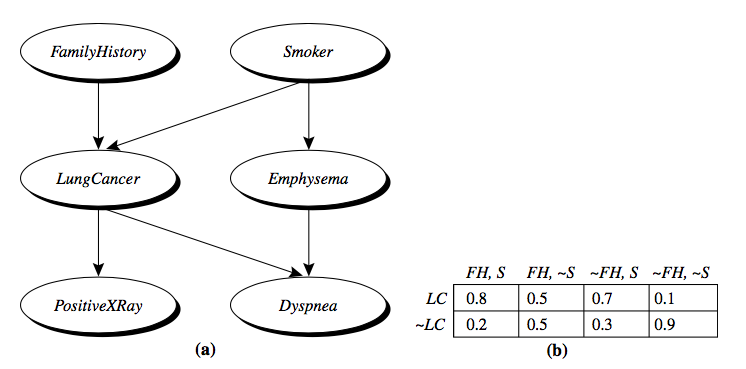
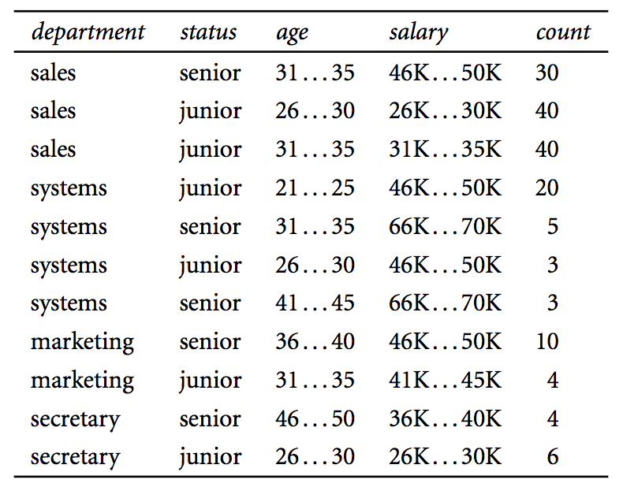

# Week 6 Classification & Prediction 02: Bayes Classifiers

## 1. Introduction

Most of this material is derived from the text, Han, Kamber and Pei, Chapter 8 and 9, or the corresponding powerpoint slides made available by the publisher.  Where a source other than the text or its slides was used for the material, attribution is given. Unless otherwise stated, images are copyright of the publisher, Elsevier.

Here, we will discuss the probabilistic classifiers derived from Bayes' theorem, including Bayes classifier, naive Bayes classifier and Bayesian belief networks.  

## 2. Probabilistic Classifier (Text 8.3.1)

**What is Bayesian classifier?**

- A statistical (probabilistic) classifier: Predicts the probability of a given tuple belonging to a particular class
- Foundation: Based on Bayes' theorem (described next)
- Performance: Comparable performance with decision tree and neural network classifiers
- Incremental: Each training example can incrementally contribute to the classification probabilities, so this allows adapting over time to gradual or incremental changes in (labelled)  training data.
- Not really possible to humanly interpret  the results (i.e. "black box" method)

### 2.1 Basic Probabilities (not in text)

**Basic probability theory**

before discussing probabilistic classifiers, we recap basic probability theory first.

- **Event** $X$: A subset of outcomes of an experiment (a subset of event space).
  - Let's assume that we roll a dice with six faces. If we observe number 3 from a single roll, then 3 is the event, $X=3$
  - A set of possible observations can also be an event. For example, a subset of outcomes from a dice roll $A=1,3,5$ can be an event.
- **Event space (sample space):** the set of all possible outcomes
  - e.g. {1,2,3,4,5,6} with a six-faced dice
- **Probability** of event $P(X)$: probability of observing an event
  - e.g. probability of observing 5 from a single dice roll, $P(X=5)$
- **Joint probability** $P(X,Y)$: probability of observing multiple distinguishable observations.
  - e.g. roll a dice and flip a coin, simultaneously. What would be the probability of observing 3 from the dice and HEAD from the coin? $P(X=3,Y=HEAD)$

**Example:**

For an experiment, we roll a dice and flip a coin simultaneously, and record the first six trials as follows:

 

| Trial # | Dice | Coin |
| ------- | ---- | ---- |
| 1       | 1    | H    |
| 2       | 2    | T    |
| 3       | 1    | T    |
| 4       | 3    | H    |
| 5       | 4    | H    |
| 6       | 1    | T    |

Q: Given the above experiments, what is the probability of observing 3 from the dice? 

 A: $P(Dice=3)=1/6$

Q: Given above experiments, what is the probability of observing A={1,2} from the dice? 

A: $P(Dice=1 or 2) =2/3$

Q: Given above experiments, what is the probability of observing 1 and TAIL from a single execution?

A: P(Dice=1, Coin=TAIL)=2/6

**Conditional probability**

A conditional probability measures the probability of event $X$ given that another event $Y$ has occurred. If $X$ and $Y$ are events with $P(X)>0$, the conditional probability of $X$ given $Y$ is $P(X|Y)=\frac{P(X,Y)}{P(X)}$

**Example**: Drug test

Let's assume that we have 4000 patients who have taken a drug test. The following table summarises the result of the drug test. We categorise the result based on gender and test result.

|         | Women | men  |
| ------- | ----- | ---- |
| Success | 200   | 1800 |
| Failure | 1800  | 200  |

Let $X$ represent gender, $Y$ represent a result of a drug test

Then what is the probability of a patient being a woman when the patient fails on a drug test, i.e.

$P(X=woman|Y=fail)$?

$P(X=woman)=2000/4000=1/2$

$P(Y=fail)=2000/4000=1/2$

$P(X=woman,Y=fail)=1800/4000=9/20$

From these probabilities, 

$P(X=woman|Y=fail)=\frac{9/20}{1/2}=18/20=0.9$

### 2.2 Bayes' Theorem (text 8.3.1)

**Terminology**

 **A running example**: Let's assume that you are a owner of a computer shop. You may want to identify which customers buy a computer for  targeting your advertising. So you decide to record a customer's *age* and *credit rating* whether the customer buys a computer or not for future predictions.

- **Evidence** $X$: Bayesian term for observed data tuple, described by measurements made on a set of $n$ attributes.
  - e.g. record of customer's information such as *age* and *credit rating*
  - $X=(x_1,x_2,\dots, x_n)$
- **Hypothesis** $H$: A target of the classification. Hypothesis such that $X$ belongs to a specified class $C$.
  - e.g. $C_1=$ buy computer, $C_2=$ not buy computer
- **Prior** probability $P(H):$ the *a priori probability* of $H$
  - e.g. $P(C_1)=$ the prob that any given customer will buy a computer regardless of *age, or credit rating* 
- **Likelihood** $P(X|H)$: the prob of observing the sample $X$ given that the hypothesis holds.
  - e.g. Given that a customer $X$ will buy a computer, the prob that the customer is 35 years old and has fair credit rating.
- **Posterior** prob $P(H|X)$: the *a posteriori prob*, that is the prob that the hypothesis holds given the observed data $X$.
  - e.g. Given that a customer $X$ is 35 years old and has fair credit rating, the pro that $X$ will buy a computer.
- **Classification for **$X$ **is determined by the class which has the highest posterior probability.**

**Bayes' Theorem**

- In many cases, it is easy to estimate the prior and likelihood of given problem.

  - e.g. to estimate the prior $P(C_1)$ we can count the number of customers who bought a computer and divide the total number of customers.
  - e.g. to estimate the likelihood $P(X=(35, fair)|C_1)$ we can measure the proportion of customers whose age is 35 and have fair credit rating among the customers who bought a computer.
  - The posterior probability can then be computed from the prior and likelihood through Bayes' theorem.

- Bayes' theorem provides a way to relate likelihood, prior, and posterior probabilities in the following way:

  $P(H|X)=\frac{P(X|H)P(H)}{p(X)}$

- Informally, this equation can be interpreted as

  Posterior = likelihood x prior / evidence

- Predicts $X$ belongs to $C_i$ iff prob $P(C_i|X)$ is the highest among all other $P(C_k|X)$ for all the $k$ classes.

- For determing the classification of some $X, P(X)$ can be ignored in all the calculations since it is the same across all the classes.

**Example: with observations**

Let's assume that you are a owner of a computer shop. You may want to identify which customers buy a computer for a targeted advertisement. So the owner decided to record a customers's age and credit rating no matter the customer buys a computer or not. The following table shows a set of customer records in the computer shop. What is the probability of a customer who is *youth* and has *fair credit* rating buying a computer?

| **age**     | **credit** | **buys_computer** |
| ----------- | ---------- | ----------------- |
| youth       | fair       | no                |
| youth       | fair       | yes               |
| middle_aged | excellent  | yes               |
| middle_aged | fair       | no                |
| youth       | fair       | no                |
| middle_aged | excellent  | no                |
| middle_aged | fair       | yes               |

- Prior: probability of a customer buying a computer regardless of their information.
- Likelihood
  - $P(age=youth,credit=fair|buys\ computer = yes) = 1/3$
  - $P(age = youth, credit=fair | buys\ computer = no) =2/4$
- Evidence
  - $P(age=youth,credit=fair)=3/7$
- Posterior
  - $P(buys\ computer = yes|age=youth,credit=fair)=\frac{3/7\times 1/3}{3/7}=0.33$
  - $P(buys\ computer=no|age=youth,credit=fair)=\frac{4/7\times 2/4}{3/7}=0.66$
- Therefore, the customer would not buy a computer
  - When computing a posterior, the evidence term is the same for all hypothesis classes. Since our goal is to find the highest class,  the evidence  term is often ignored in practice.

**Example: with estimated probabilities**

- You might be interested in finding out a probability of patients having liver cancer if they are an alcoholic. “Being an alcoholic” is the examination for liver cancer.
- **Prior:** $C_1$ means the event "Patient has liver cancer." Past data tells you that 1% of patients entering your clinic have liver disease. $C_2$ means the event "Patient does not have liver disease".
  - $P(C_1)=0.01, P(C_2)=0.99$
- **Evidence:** $A$ could mean the examination that “Patient is an alcoholic.” Five percent of the clinic’s patients are alcoholics.
  - $P(A)=0.05$
- **Likelihood**: You may also know that among those patients diagnosed with liver cancer, 70% are alcoholics.
  - $P(A|C_1)=0.70$,  the probability that a patient is alcoholic, given that they have liver cancer, is 70%.
- Bayes’ theorem tells you: If the patient is an alcoholic, their chances of having liver cancer is 0.14 (14%). This is a large increase from the 1% suggested by past data.
  - $P(C_1|A)=(0.7\times 0.01)/0.05=0.14$

### 2.3 Limitation (Text 8.3.2)

In the following example, we would like to classify whether a certain customer would buy a computer or not. We have a customer purchase history as follows:

| **age**     | **credit** | **buys_computer** |
| ----------- | ---------- | ----------------- |
| youth       | fair       | no                |
| youth       | fair       | yes               |
| middle_aged | excellent  | yes               |
| middle_aged | fair       | no                |
| youth       | excellent  | no                |
| middle_aged | excellent  | no                |
| middle_aged | fair       | yes               |

What is the probability of *(youth, excellent)* customer buying a computer?

- If we compute the likelihood $P(X|H)$, as we can see, we observe 0 likelihood with attribute (age=youth, credit = excellent).
  - $P(age=youth,credit=excellent|buys\ computer=yes)=0$
- Therefore, posterior probability of tuples with (age=youth, credit=excellent) will be 0:
  - likelihood is 0.. so
- This does not mean that every buyer with (*age=youth, credit=excellent*) would not buy a computer.
  - The data contains some information about customers who are youth *or* have excellent credit.
  - But the classifier ignores it because there is no cluster who are youth *and* have excellent credit.
- It is more proper to understand that the number of observation is too small to obtain a reliable posterior probability.
- This tendency toward having zero probability will increase as we incorporate more and more attributes.
  - Because we need **at least one observation** for every possible combination of attributes.
- In the next section, we will explain how this problem is mitigated with **naive Bayes**  that assumes conditional independence.

## 3. Naïve Bayes (Text 8.3.2)

**Naive Bayes Classification method**

- Let $D$ be a training set of tuples and their associated class labels, and each tuple is represented by an n-Dim attribute vector $X=(x_1,x_2,\dots, x_n)$

- Suppose there are $m$ classess $C_1,C_2,\dots, C_m$

- Classification is to derive the maximum posteriori, i.e. the maximal $P(C_i|X)$

- This can be derived from Bayes' theorem $P(C_i|X)=\frac{P(X|C_i)P(C_i)}{P(X)}$

  - Since $P(X)$ is constant for all classes, only needs to be maximized
    - $P(C_i|X)\propto P(X|C_i)P(C_i)$

- **Class conditional independence**:  We *assume* the object's attribute values are conditionally independent of each other given a class label, so we can write

  $P(X|C_i)=\prod^n_{k=1}P(x_k|C_i)=P(x_1|C_i)\times P(x_2|C_i)\times\dots \times P(x_n|C_i)$

- In other words, we factorised each attribute in the likelihood function, by *assuming that there are no dependence relationships amongst the attributes.*

- This greatly reduces the computation cost: Only counts the class distribution

- If $A_k$ is categorical, $P(x_k|C_i)$ is the number of tuples in $C_i$ having value $x_k$ for $A_k$ divided by $|C_{i,D}|$ (number of tuples of $C_i$ in $D$)

- Blithely assuming class conditional independence of attributes is **naive,** hence the name of the method. It is not checked, and is commonly even known to be untrue, however, it seems to work.....

 

**Example**

Let's compute the likelihood of the previous example using the assumption of class conditional independence

| **age**     | **credit** | **buys_computer** |
| ----------- | ---------- | ----------------- |
| youth       | fair       | no                |
| youth       | fair       | yes               |
| middle_aged | excellent  | yes               |
| middle_aged | fair       | no                |
| youth       | excellent  | no                |
| middle_aged | excellent  | no                |
| middle_aged | fair       | yes               |

- With the conditional independence assumption, the likelihood of tuple (youth, excellent) is $P(age=youth, credit=excellent)|buys\ computer=yes)$

  $=P(age=youth|buys\ computer=yes)\times P(credit=excellent|buys\ computers)$

  $=1/3\times 1/3=1/9$

- Therefore, we mitigate the limitation observed earlier caused by the lack of observations.

**Example 2**

- Here we have some more complex customer history with four different attributes.

| **age**     | **income** | **student** | **credit** | **buys_computer** |
| ----------- | ---------- | ----------- | ---------- | ----------------- |
| youth       | high       | no          | fair       | no                |
| youth       | high       | no          | excellent  | no                |
| middle_aged | high       | no          | fair       | yes               |
| senior      | medium     | no          | fair       | yes               |
| senior      | low        | yes         | fair       | yes               |
| senior      | low        | yes         | excellent  | no                |
| middle_aged | low        | yes         | excellent  | yes               |
| youth       | medium     | no          | fair       | no                |
| youth       | low        | yes         | fair       | yes               |
| senior      | medium     | yes         | fair       | yes               |
| youth       | medium     | yes         | excellent  | yes               |
| middle_aged | medium     | no          | excellent  | yes               |
| middle_aged | high       | yes         | fair       | yes               |
| senior      | medium     | no          | excellent  | no                |

- Compute prior probability on hypothesis:  $P(C_i)$
  - $P(buys=yes)=9/14=0.643$
  - $P(buys=no)=5/14=0.357$
- Compute conditional prob $P(X|C_i)$ for each class
  - attribute 'age'
    - $P(age=youth|buys=yes)=2/9=0.222$
    - $P(age=youth|buys=no)=3/5=0.6$
  - attribute 'income'
    - $P(income=medium|buys=yes)=4/9=0.444$
    - $P(income=medium|buys=no)=2/5=0.4$
  - attribute 'student'
    - $P(student=yes|buys=yes)=6/9=0.667$
    - $P(student=yes |buys=no)=1/5=0.2$
  - attribute 'credit'
    - $P(credit=fair|buys=yes)=6/9=0.667$
    - $P(credit=fair|buys =no)=2/5=0.4$
- Predict probability of $X$ buying computer 
  - $X=(age=youth,income=med,student=y,credit=fair)$
  - compute likelihood $P(X|C_i)$
    - $P(X|buys=yes)=0.222\times 0.444\times 0.667\times 0.667=0.044$
    - $P(X|buys=no)=0.6\times 0.4\times 0.2\times 0.4 =0.019$
  - compute $P(X|C_i)\times P(C_i)$
    - $P(X|buys=yes)\times P(buys=yes)=0.028$
    - $P(X|buys=no)\times P(buys =no)=0.007$
  - Therefore, $X$ belongs to class $(buys=yes)$

### 3.1 Laplacian Correction

**Zero-probability problem**

- Naïve Bayesian prediction requires each class conditional probability to be non-zero, as otherwise, the predicted probability will be zero.
- For example, let's assume that we extract following two tables for 'student' and 'credit' attributes from a customer history, where each entry represents a number of customers:

| Buy computer \ Student | Yes  | No   |
| ---------------------- | ---- | ---- |
| Yes                    | 0    | 5    |
| No                     | 3    | 7    |

| Buy computer \ credit | Fair | Excellent |
| --------------------- | ---- | --------- |
| Yes                   | 4    | 1         |
| No                    | 6    | 4         |

Using naive Bayes, let's classify the probability of a *student* with *fair credit* buying a computer. First, we need to compute the likelihood:

$P(Student=yes, credit=fair|buy=yes)$

$=P(student=yes|buy=yes)\times P(credit=fair|buy=yes)=0/5\times 4/5=0$

$P(student=yes, credit = fair|buy=no)$

$=P(student=yes |buy=no)\times P(credit=fair|buy=no)=3/10\times 6/10=0.18$

Therefore, the classifier will classify that the student will not buy a computer no matter which prior we have.

This is because there is no student customer who bought a computer before. In other words, the likelihood of student buying a computer:

$P(student=yes|buy=yes)=0/5=0$

which indicates **irrespective of  the other attributes**, the classifier will always classify a student tuple as  *not* buy a computer. During the classification, all the other attributes will be ignored if student attribute is *Yes*.

This is not totally wrong, however, we would like to avoid a zero probability for a classification because, in some cases, the other attributes may have a different opinion to contribute to the classification of the tuple.

**Laplace correction**

To avoid the zero probability in the likelihood, we can simply add a small constant to the summary table as follows:

| Buy computer \ Student | Yes        | No         |
| ---------------------- | ---------- | ---------- |
| Yes                    | 0+$\alpha$ | 5+$\alpha$ |
| No                     | 3+$\alpha$ | 7+$\alpha$ |

If we let $\alpha$ be 1, then the likelihoods of naive Bayes are:

$P(student=yes, credit=fair|buy=yes)$

$=P(student=yes|buy=yes)\times P(credit=fair|buy=yes)=1/7\times 4/5=0.11$

$P(student=yes, credit=fair|buy=no)$

$=P(student=yes|buy=no)\times P(credit=fair|buy=no)=4/12\times 6/10=0.18$

Using the Laplacian correction with value of 1, we pretend that we have 1 more tuple for each buy-computer/student pair. 

The “corrected” probability estimates are close to their “uncorrected” counterparts, yet the zero probability value is avoided.

### 3.2 Numerical attributes

So far, we've only considered the case when every attribute is a categorical or binary variable.

In general, however, numerical variables are sometimes more common than categorical variables, and some of the attributes can be considered as numerical variables (e.g. age).

In this section, we will show how to use a naive-Bayes classifier with a continuous attribute.

It is common to assume that a continuous attribute follows a Gaussian(Normal) distribution. 

- Gaussian distribution: continuous-valued attribute is typically assumed to have a Gaussian distribution.

  - Two parameters define a Gaussian distribution

    - mean $\mu$
    - standard deviation $\sigma$

  - probability density function of Gaussian

    $g(x,\mu,\sigma) = \frac{1}{\sqrt{2\pi}\sigma}e^{\frac{-(x-\mu)^2}{2\sigma^2}}$

  - Class conditional likelihood of $k$th-continuous attribute given class $i$ is

    $p(x_k|C_i) = g(x_k, \mu_{C_i}, \sigma_{C_i})$

  - To solve the above equation, we need $\mu_{C_i}$ and $\sigma_{C_i}$ which were defined earlier.

**Example:**

Let's assume that the attribute **age** is not discretized in the following example:

| **age** | **credit_rating** | **buys_computer** |
| ------- | ----------------- | ----------------- |
| 22      | fair              | no                |
| 23      | fair              | yes               |
| 35      | excellent         | yes               |
| 31      | fair              | no                |
| 20      | excellent         | no                |
| 38      | excellent         | no                |
| 40      | fair              | yes               |

Let buys_computer be a class label, then $C_1=yes$ and $C_2=no$

The class conditional mean and variance of attribute age are:

- $\mu_{C_1}=32.67, \sigma^2=76.33$
- $\mu_{C_2} = 27.75, \sigma^2 = 69.59$

Let $X=(30, fair)$ be attributes of a future customer, the class conditional probability of this customer is:

- $p(x_1=30|buys\ computer=yes) = \frac{1}{\sqrt{2\pi}\sigma_{C_1}}e^{\frac{-(x_1-\mu_{C_1})^2}{2\sigma_{C_1}^2}} = 0.043579$
- $p(x_1=30|buys\ computer=no) = \frac{1}{\sqrt{2\pi}\sigma_{C_2}}e^{\frac{-(x_1-\mu_{C_2})^2}{2\sigma_{C_2}^2}} = 0.046115$

Combine the Gaussian likelihood with other likelihood, we can predict the probability of the customer buying a computer.

## 4. Bayesian Belief Network (Text 9.1)

**Concept and Mechanism**

- Bayesian belief networks—probabilistic graphical models, which unlike naive Bayesian classifiers **allow the representation of dependencies** among subsets of attributes.

- The naive Bayesian classifier makes the assumption of class conditional independence, that is, given the class label of a tuple, the values of the attributes are assumed to be conditionally independent of one another.

- In practice, however, **dependencies can exist between variables** (attributes).

- Bayesian belief networks provide a graphical model of causal relationships between attributes.

- A belief network is defined by two components

- - a directed acyclic graph
    - Node: represents a random variable (attribute), can be discrete- or continuous-valued
    - Edge: represents a probabilistic dependence, If an arc is drawn from a node Y to a node Z, then Y is a parent or immediate predecessor of Z.
  - a set of conditional probability tables

**Example**

Simple Bayesian belief network with six boolean variables. (a) A proposed causal(graphical) model, represented by a directed acyclic graph. (b) The conditional probability table for the values of the variable *LungCancer* (LC) showing each possible combination of the values of its parent nodes, *FamilyHistory* (FH) and *Smoker* (S). 

**Causal relations**:

- having lung cancer is influenced by a person’s family history of lung cancer, as well as whether or not the person is a smoker.
- Variable *PositiveXRay* is independent of whether the patient has a family history of lung cancer or is a smoker, given that we know the patient has lung cancer.
  - Once we know the outcome of the variable *LungCancer*, then the variables*FamilyHistory* and *Smoker* do not provide any additional information regarding*PositiveXRay.*
- Variable *LungCancer* is conditionally independent of *Emphysema*, given its parents,*FamilyHistory* and *Smoker.*

**Conditional probability table (CPT):**

The CPT for a variable $X$ specifies the conditional distribution $P(X|Parents(X))$, where $Parents(X)$ are the parents of $X$. Figure (b) shows a CPT for the variable *LungCancer*. The conditional probability for each known value of *LungCancer* is given for each possible combination of the values of its parents. For instance, we can interpret the upper leftmost and bottom rightmost entries as

$P(LungCancer = yes|FamilyHistory = yes, Smoker = yes) = 0.8$

$P(LungCancer = no|FamilyHistory = no, Smoker = no)=0.9$

More formally, let $X = (x_1, ..., x_n)$be a data tuple described by the variables. Recall that each variable is conditionally independent of its nondescendants in the network graph, given its parents. This allows the network to provide a complete representation of the existing joint probability distribution with the following equation:

$P(x_1, ..., x_n) = \prod_{i=1}^{n} P(x_i|Parents(x_i))$

where $P(x_1,..., x_n)$ is the probability of a particular combination of values of $X$, and the values for $P(x_i|Parents(x_i))$ correspond to the entries in the CPT for $x_i$.

### 4.1 Training a Belief Network (Text 9.1.2)

**How to construct a directed network?**

- The network topology (or “layout” of nodes and arcs) may be constructed by human experts or inferred from the data.

- The network 

  variables may be observable or hidden in all or some of the training tuples.

  - The hidden data case is also referred to as missing values or incomplete data.

- Several algorithms exist for learning the network topology from the training data given observable variables. 

- Human experts usually have a good grasp of the direct conditional dependencies that hold in the domain under analysis, which helps in network design.

- Experts must specify conditional probabilities for the nodes that participate in direct dependencies.

- These probabilities can then be used to compute the remaining probability values.

**How to learn the network?** 

- If the network topology is known and the variables are observable
  - Computing the CPT entries (like naive Bayes)
- When the network topology is given and some of the variables are hidden
  - Several heuristic methods exist: many software packages provide solutions
  - The *gradient descent method* is well known: it works by treating each conditional probability as a *weight.* It initialises the weights randomly up front and then iteratively adjusts each one by a small amount to raise the product of the computed probabilites of each datapoint in the training set. It stops when it is not increasing the product any more.
- This is computationally demanding, but it has the benefit that human domain knowledge can be employed in the solution to to design the network structure and to assign initial probability values.

## 5. Reading and Exercises

David Heckerman, Bayesian Networks for Data Mining, Data Mining and Knowledge Discovery 1, 79–119 (1997)

## Exercise: Classification with employ database

The following table consists of training data from an employee database. The data have been generalised. For example, “31 ... 35” for age represents the age range of 31 to 35. For a given row entry, count represents the number of data tuples having the values for a department, status, age, and salary given in that row. 

Let **status** be the class label attribute.

Given a data tuple having the values "systems", "26...30", and "46–50K" for the attributes department, age, and salary, respectively, what would a naıve Bayesian classification of the status for the tuple be? 

**Solution:**

Given a data tuple having the values “systems”, “26...30”, and “46–50K” for the attributes department, age, and salary, respectively, what would a na ̈ıve Bayesian classification of the status for the tuple be?

P(X|senior) = 0 because P(age = 26...30|senior) = 0.

P(X|junior) = 23/113 × 49/113 × 23/113 = 0.01796.

Thus, a naive Bayesian classification predicts “junior”.

However, me missed applying the Laplacian correction! This should not change P(X|senior) enough to change the outcome on a tiny example like this, but can enable  the  influence of the other attributes to override the influence of age on  employment status of seniors.