# Week 6 Classification & Prediction 03: Evaluation of Classifiers

## 1. Introduction

Most of this material is derived from the text, Han, Kamber and Pei, Chapter 8 and 9, or the corresponding powerpoint slides made available by the publisher.  Where a source other than the text or its slides was used for the material, attribution is given. Unless otherwise stated, images are copyright of the publisher, Elsevier.

Here, we will discuss how to evaluate the performance of classifiers. When we have built a model using some learning algorithm or by fitting a statistical distribution, how do we know whether it is any good?

## 2. Model Evaluation and Selection (Text 8.5)

Now that you may have built a classification model, there may be many questions going through your mind. For example, suppose you used data from previous sales to build a classifier to predict customer purchasing behaviour (**training data**). You would like an estimate of how accurately the classifier can predict the purchasing behaviour of future customers (**test data**), that is, future customer data on which the classifier has not been trained. You may even have tried different methods to build more than one classifier and now you wish to compare their quality and choose the best one. For this, you will be most interested in the *accuracy* of the classifier. But

- What is accuracy?
- How can we estimate it?
- Are some measures of a classifier’s accuracy more appropriate than others?
- How can we obtain a reliable accuracy estimate?

These questions are addressed in this section. 

### 2.1 Evaluation metrics for classification (Text 8.5.1)

*Accuracy* is not the only measure to evaluate a performance of classification. To understand the other measures, we first need to know a **confusion matrix**.

**Confusion Matrix** (also called **Error Matrix**)

A confusion matrix is a useful tool for analysing how well a classifier can recognise tuples of different classes. Given a binary classification problem, a confusion matrix is a 2 by 2 matrix where each entry indicates the number of tuples categorised by the *actual* class  (positive or negative label in training or testing data) vs *predicted* class (positive or negative predicted class suggested by the classifier).

| Actual class \ Predicted class | C1=Positive          | C2=Negative          |
| ------------------------------ | -------------------- | -------------------- |
| C1=Positive                    | True Positives (TP)  | False Negatives (FN) |
| C2=Negative                    | False Positives (FP) | True Negatives (TN)  |

From the confusion matrix, we can define four important measures:

- **True Positive** (TP): Number of *positive* tuples that were *correctly* labelled  positive by the classifier
- **True Negative** (TN): Number of *negative* tuples that were *correctly* labelled negative by the classifier
- **False Positive** (FP): Number of *negative* tuples that were *incorrectly* labelled as positiveby the classifier
- **False negative** (FN): A number of *positive* tuples that were *incorrectly* labelled as negative by the classifier

TP + TN is the number of tuples *correctly* labelled by the classifier (hence called *True*).

FP + FN is the number of tuples  incorrectly labelled by the classifier (hence called  *False*).  Note that all the FP tuples are actually N and all the FN tuples are actually P.

**Beware:**  There  are several popular conventions for the layout of these matrices: sometimes postiveness is top and left  as here but sometimes bottom and right; sometimes actuals are rows and predicted  are columns, as here, but sometimes actuals are columns and predictions are rows.

**Example of confusion matrix (actuals are rows and predicted are columns)**

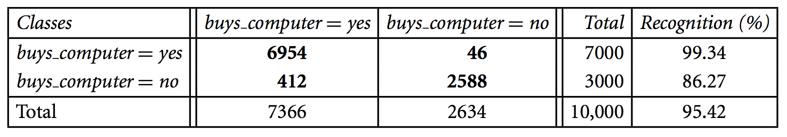

- Confusion matrix for the classes *buys_computer = yes* and *buys_computer = no*

- For example

- - 6954: The number of positive triples classified as positive
  - 412: The number of negative triples classified as positive

 

**Various evaluation measures from a confusion matrix**

Let

- P = the number of positive tuples
- N = the number of negative tuples

With four primitive measures, we can define some important evaluation measures as follows:

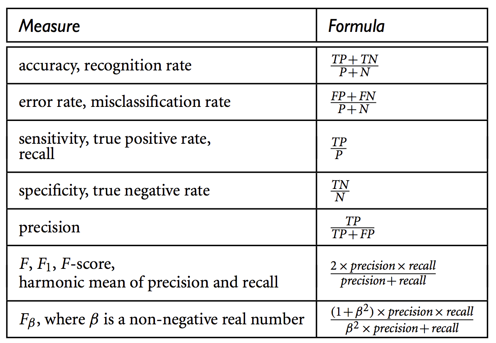

- This table shows some basic evaluation measures for classifications.
- accuracy = 1 - error rate

**Class Imbalance Problem**

One may wonder why we need various evaluation measures. At first, the accuracy seems to be enough for a classification task, but the accuracy may not be a good way to show the performance of your classifier, especially, when the positive class is rare.

Let's first see the following example that shows a confusion matrix for a cancer classification. Again, actuals are rows and predicted are columns in the table.

 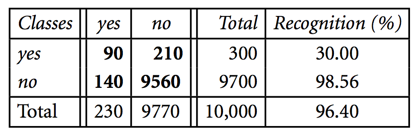

If we only care about the classifier's accuracy, then 96.4% is not a bad result.

Let's think about a more extreme case where our classifier classifies every patient as cancer=no. In this case, we still have 97% accuracy.

Clearly, an accuracy rate of 97% may not be acceptable—the classifier could be correctly labelling only the noncancer tuples and misclassifying all the cancer tuples. Instead, we need other measures, which access how well the classifier can recognise the positive tuples (cancer = yes) and how well it can recognise the negative tuples (cancer = no).

The **sensitivity** and **specificity** measures can be used, respectively, for this purpose.

For example, the sensitivity and specificity of the above example are:

- $sensitivity = \frac{TP}{P} = \frac{90}{300}=0.30$
- $specificity = \frac{TN}{N} = \frac{9560}{9700}=0.99$

Thus, we note that although the classifier has a high accuracy, it’s ability to correctly label the positive (rare) class is poor as given by its low sensitivity. It has high specificity, meaning that it can accurately recognise negative tuples. In conclusion, the sensitivity is much more important than specificity in this case.

The **precision** and **recall** measures, originally developed for information retrieval, are also widely used in classification.

- Precision can be thought of as a measure of exactness

  - i.e., what percentage of tuples classified  as positive are actually such

- Recall (=sensitivity) is a measure of completeness

- - i.e., what percentage of positive tuples are classified as such

Often precision and recall are combined into an  *F1-score*, which is the  harmonic mean of the precision and recall. It might also be called simply *f-score*, or *f-measure*. See the table above for its formulation.

### 2.2. ROC Curve (Text 8.5.6)

### 

- ROC (Receiver Operating Characteristics) curves: for visual comparison of classification models
- **Basic idea**: a *probabilistic classifier* returns a probability of being a positive class. What if we decrease the threshold of classification from 1 to 0 instead of using 0.5?
- Shows the **trade-off** between the true positive rate (TPR) and the false positive rate (FPR)
  - TPR ( = sensitivity) is the proportion of positive tuples that are correctly labelled by the model.
  - FPR  (= 1- specificity) is the proportion of negative tuples that are mislabelled as positive.
- The area under a ROC curve (**ROC-AUC**) is often used to measure the performance of a model.
- The closer to the diagonal line (i.e., the closer the area is to 0.5), the less accurate is the model.

**Plotting ROC curve**

- ROC curve can be plotted with a probabilistic classifier (e.g. naive Bayes, decision trees)
- The vertical axis of an ROC curve represents TPR. The horizontal axis represents FPR.

1. **Rank the test tuples in decreasing order**: the one that is most likely to belong to the positive class (highest probability) appears at the top of the list.
2. Starting at the bottom left corner (where TPR = FPR = 0), we check the tuple’s actual class label at the top of the list. If we have a **true positive** (i.e., a positive tuple that was correctly classified), then true positive (TP) and thus TPR increase.
   - On the graph, we **move up and plot a point**.
3. If, instead, the model classifies a **negative tuple as positive**, we have a false positive (FP), and so both FP and FPR increase.
   - On the graph, we **move right and plot a point**.
4. This process is repeated for each of the test tuples in ranked order, each time moving up on the graph for a true positive or toward the right for a false positive.

**Example 1**

The following table shows the probability value (column 3) returned by a probabilistic classifier for each of the 10 tuples in a test set. Column 2 is the actual class label of the tuple. There are five positive tuples and five negative tuples, thus P = 5 and N = 5. As we examine the known class label of each tuple, we can determine the values of the remaining columns, TP, FP, TN, FN, TPR, and FPR. 

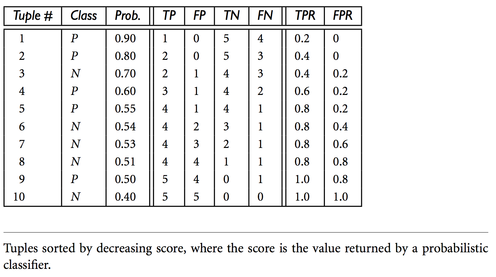

We start with tuple 1, which has the highest probability score and take that score as our threshold, that is, t = 0.9. Thus, the classifier considers tuple 1 to be positive, and all the other tuples are considered negative. Since the actual class label of tuple 1 is positive, we have a true positive, hence TP = 1 and FP = 0. Among the remaining nine tuples, which are all classified as negative, five actually are negative (thus, TN = 5). The remaining four are all actually positive, thus, FN = 4. We can therefore compute TPR = TP = 1 = 0.2, while FPR = 0. Thus, we have the point (0.2, 0) for the ROC curve.

Next, threshold *t* is set to 0.8, the probability value for tuple 2, so this tuple is now also considered positive, while tuples 3 through 10 are considered negative. The actual class label of tuple 2 is positive, thus now TP = 2. The rest of the row can easily be computed, resulting in the point (0.4, 0). Next, we examine the class label of tuple 3 and let *t* be 0.7, the probability value returned by the classifier for that tuple. Thus, tuple 3 is considered positive, yet its actual label is negative, and so it is a false positive. Thus, TP stays the same and FP increments so that FP = 1. The rest of the values in the row can also be easily computed, yielding the point (0.4,0.2). The resulting ROC graph, from examining each tuple, is the jagged line as follows:

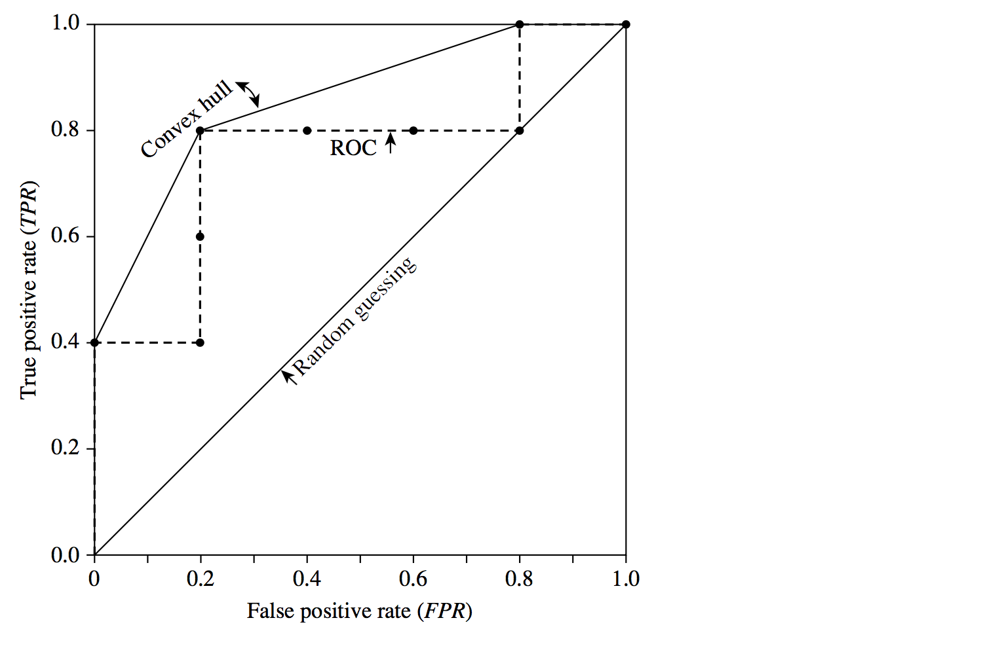

**Example 2**

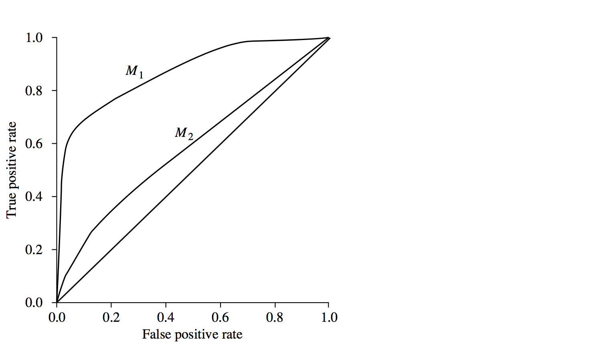

ROC curves of two classification models, M1 and M2. The diagonal shows where, for every true positive, we are equally likely to encounter a false positive. The closer a ROC curve is to the diagonal line, the less accurate the model is. Thus M1 is more accurate here.

### 2.3 Estimating a classifier's accuracy (Text 8.5.2-8.5.4)

In this section, we will see how to report the performance of the models by various methods.

Accuracy (or error rate) on training data is not a good indicator of future performance because the model may be overly-tuned towards exactly the data on which it was trained. For example, consider the model which internally simply remembers the data it has seen and classifies that data as it was classified in the training data, and every new data item is classified arbitrarily. Would you expect this model to work well?

This situation is called **overfitting** and commonly leads to poor performance on unseen data.

**Holdout method**

- Given data is randomly partitioned into two independent sets
  - Training set (e.g., 2/3) for model construction
  - Test set (e.g., 1/3) for accuracy estimation
  - Overall flow of holdout method:
- 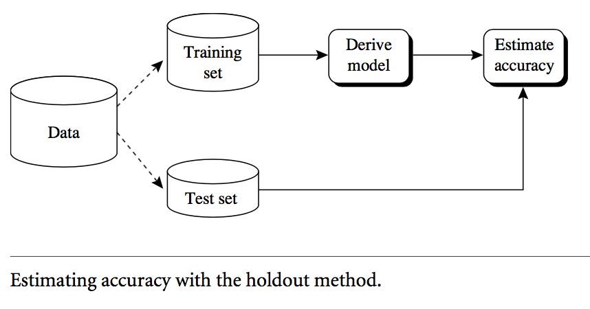

**Training / Validation / Test**

Variation of holdout method when you you want to experiment with parameters of the model-building algorithm.

- Randomly partition the given data into three different sets:
- Training set
  - To construct  (i.e *train*) a classification model
- Validation set
  - To find the best parameters for the model, likely to be done by a person studying  the effect of various parameters on the accuracy (or other quality measures) of the training set.
- Test set
  - To measure the final performance of the model  as it would be reported.

**Cross-validation**

- k-fold, where k = 10 is most popular (due to low bias and variance)
- Randomly partition the data into k mutually exclusive subsets $D_1,D_2,\dots, D_k$ each approximately equal size.
- At i-th iteration, use $D_i$ as test set and others as training set
- **Leave-one-out**: Special case for *small-sized dataset*s: Use k folds where k = number of tuples,
- **Stratified cross-validation**: Special case where folds are not randomly selected but stratified so that the class distribution in each fold is approximately the same as that in the initial data (to achieve low bias).
- Overall accuracy is computed as the average accuracy of each model on its respective test set.

**Bootstrap**

- Works well for small data sets where, otherwise, the requirement to split the data into training and testing sets makes both sets too small for purpose.

- Samples the given training tuples uniformly **with replacement**

  - i.e., each time a tuple is selected, it is equally likely to be selected again and added to the training set again.

- Several bootstrap methods : a common one is .**632 bootstrap**

  - A data set with $d$ tuples is sampled $d$ times, with replacement, resulting in a training set of $d$ samples. The data tuples that did not make it into the training set end up forming the test set. About 63.2% of the original data end up in the training set, and the remaining 36.8% form the test set (since $(1 - 1/d)d \approx e^{-1} = 0.368$ if $d$ is very large.)

  - Repeat the sampling procedure k times, overall accuracy of the model is

    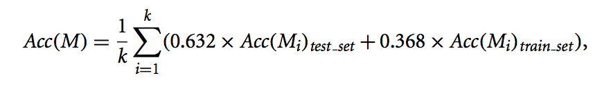

    where $Acc(M_i)_{testset}$ is the accuracy of the model trained with training set $i$ when it is applied to test set $i$ and $Acc(M_i)_{trainset}$ is the accuracy of the model obtained with training set $i$ when it is applied to the training set $i$.

### 2.4 Comparing classifiers (Text 8.5.5)

**Classifier Models M1 vs. M2**

- Suppose we have 2 classifiers, M1 and M2.  Which one is better?

- Use 10-fold cross-validation to obtain mean error rates for M1 and M2, $err(M1), err(M2)$

- It may seem intuitive to choose the model with the lowest error rate

- **However**, these mean error rates are just **estimates** of error on the true population of future data cases

- What if the difference between the 2 error rates is just attributed to chance?

- - Use a test of statistical significance
  - Obtain confidence limits for our error estimates

**Estimating Confidence Intervals: Null Hypothesis**

- **Null Hypothesis: M1 & M2 are the same**

- Test the null hypothesis with **t-test**

  - Use t-distribution with k-1 degree of freedom

- If we can reject null hypothesis, then

  - we conclude that the difference between M1 & M2 is statistically significant.
  - Chose model with lower error rate

- Perform 10-fold cross-validation (k=10)

  - For i-th round of 10-fold cross-validation, the same cross partitioning is used to obtain $err(M1)_i$ and $err(M2)_i$

  - Average over 10 rounds to get $\overline{err(M1)}=\frac1k\sum^k{i=1}err(M1)_i$ and $\overline{err(M2)}$

  - t-test computes **t-statistic** with k-1 degrees of freedom:

    

  - where 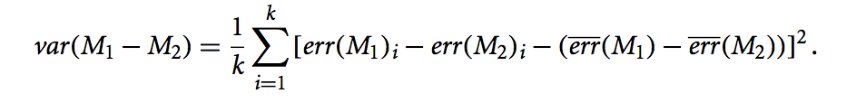

  - to determine whether M1 and M2 are significantly different, we compute t-statistic and select a significance level.

    - 5% significance levels: The difference between M1 and M2 is significantly different for 95% of population.
    - 1% significance levels: The difference between M1 and M2 is significantly different for 99% of population.

  - Based on t-statistics and significance level, we consult a table for the t-distribution.

    - We need to find the t -distribution value corresponding to k − 1 degrees of freedom (or 9 degrees of freedom for our example) from the table (Two-sided).

  - If the t-statistic we calculated above is *not* between the corresponding value in the table and its negative (i.e. the corresponding value in the table multiplied by -1), then we reject the null  hypothesis and conclude that M1 and M2 are significantly different (at the significance level we chose above).

  - Alternatively, if the t-statistic we calculated above *is between* the corresponding value in the table and its negative, we conclude that M1 and M2 are essentially the same and any difference is attributed to chance.

### 2.5 Other issues affecting the quality of a model

A model may be preferred over another for a number of reasons. These reasons will influence the choice of a learning method as well as the selection of a particular classifier produced by the method.

- Accuracy
  - Classifier accuracy: predicting class label
- Speed
  - Time to construct the model (training time)
  - Time to use the model (classification/prediction time)
- Robustness: handling noise and missing values
- Scalability: efficiency in disk-resident databases
- Interpretability
  - Understanding and insight provided by the model. This is especially important in cases where the model is never intended to be put into practice over unseen data, but instead to influence systemic behaviours such as business rules and policies. It may also be critical to enable qualitative evaluation of the model for embedded bias.
- Availability and Trust
  - Does the business environment have the technical infrastructure, skills and policy or governance framework to use it?
  - Will the business environment trust the results to be used for the intended purpose?

- Other measures specific to the method, e.g., goodness of rules, such as decision tree size or compactness of classification rules.

Note well that these kind of factors are just as influential on the selection of a method and a model for mining problems other than classification and prediction. For example, association rules are great for interpretability and scalability, but may not be considered trustworthy.

### 2.6 Exercises: model selection using t-test

Suppose that we want to select between two prediction models, M1 and M2.

We have performed 10 rounds of 10-fold cross-validation on each model, where the same data partitioning in round *i* is used for both M1 and M2.

The error rates obtained for M1 are 30.5, 32.2, 20.7, 20.6, 31.0, 41.0, 27.7, 26.0, 21.5, 26.0.

The error rates for M2 are 22.4, 14.5, 22.4, 19.6, 20.7, 20.4, 22.1, 19.4, 16.2, 35.0.

Comment on whether one model is significantly better than the other considering a significance level of 1%.

**Solution:**

We can do hypothesis testing to see if there is a significant difference in average error. Given that we used the same test data for each observation we can use the “paired observation” hypothesis test to compare two means:

 $H_0:\bar{x_1}-\bar{x_2}=0$

$H_1:\bar{x}_1-\bar{x}_2\not=0$

where $\bar{x}_1$ is the mean error of model M1, and $\bar{x}_2$ is the mean error of model M2. We compute the test statistic $t$ using the formula:

$t=\frac{\bar{d}}{s_d/\sqrt{n}}$

where $\bar{x}$ is the mean of the differences in error, $s_d$ is the standard deviation of the differences in error, and *n* is the number of observations.

In this case $\bar{d}=6.45,s_d=8.7$ and $n=10$. Substituting these values in the equation we get $t=2.34$. Using at distribution table, we look a value for probability 0.01 (0.99) and 9 degrees of freedom, which is 3.25. Given that −3.25 < 2.34 < 3.25 we accept the null hypothesis, i.e., the two models are not different at a significance level of 0.01.

## 3. Practical Exercises: Evaluation

**Objectives**

The objectives of this lab are to experiment with the **evaluation**methods available in **R** and **Rattle**, in order to better understand the issues involved with evaluation in data mining; and to experiment with the different evaluation methods for supervised classification available in the Rattle tool.

---

**Preliminaries**

 Read through the following section in the **Rattle** online documentation:

- [**Evaluating Models**](https://www.togaware.com/datamining/survivor/Evaluation1.html)

For more information about ROC please have a look at the paper

- **ROC Graphs: Notes and Practical Considerations**,  Tom Fawcett, 2004

For this lab, we will mainly use the **weather.csv** data set which you have used previously. If you want to use another data set to conduct more experiments at the end of the lab please do so.

**Tasks**

1. Start **Rattle** in the lab. Here is a quick description of the steps involved:

   a) Open a terminal window (Main menu -> Accessories).
   b) Start R by typing `R` (capitalised!) followed by '`Enter`'.
   c) Type: `library(rattle)` followed by '`Enter`'.
   d) Type: `rattle()` followed by '`Enter`'.

2.  Go to the `Data` tab, make sure you have `Spreadsheet` selected and the `Header` box is ticked, pick the **weather**.csv CSV data set. 

3. Click `Execute` to load the data into **Rattle**. 

4. Training / Validation and Overfitting

   1. Now make sure the variable (attribute) **TARGET_Adjusted** is selected as `Target` variable, and that you partition the data (e.g. leave the 70/15/15 percentage split in the `Partition` box - which must be ticked). This means that we will use 70% of all records in the **weather** data set for training, 15% for validation and 15% for testing.

   2. Also make sure that the variable **Date** is set to role `Ident`(ifier).

   3. Now go to the `Model` tab and make sure the `Tree` type radio button is selected. Set `Min Split, Min Bucket, Max Depth`, and `Complexity` to 1, 1, 50, and 0.01, respectively. To generate a decision tree, click on `Execute` and inspect what is printed into the main **Rattle** output area.

   4. Now go to the `Evaluate` tab and examine the performance of the decision tree. At this time, we first examine the performance of the decision tree on **training set**. Check the `Error matrix` radio and `Training` radio buttons, and then click on `Execute`. What is the overall error of the trained decision tree? Why do you think the model yield that error rate?

      **Solution:**

      Error on training set:

      Overall error: 0%, Averaged class error: 0%

      By setting min-bucket and min-split to 1, the decision tree algorithm will generate enough branches that can perfectly classify the training data. That's why we obtain 0% error rate here. This is often called overfitting.

   5. Go back to the `Model` tab. `Set Min Split, Min Bucket, Max Depth`, and `Complexity` to 20, 7, 30, and 0.01, respectively. Click on Execute, and move to `Evaluate` tab again.

   6. Make sure both `Error Matrix` and `Training` radio buttons are selected. Run `Execute` again and check the overall error this time. What is the overall error of the model with different parameters? Can you tell which model is better?

      **Solution:**

      Error on training set:

      Overall error: 9.7%, Averaged class error: 20.65%

      Although the error rate increases over the previous case, we cannot properly determine which model is the better of the two because the performance was evaluated on the  **training dataset.** For a fair comparison, we need to evaluate both models on some unseen dataset (i.e. validation data).

   7. Now repeat the above process 4.4~4.6. At this time, instead of `Training`, check `Validation` in `Evaluate` tab. What are the overall errors on **validation** data set? Do you think which model is better? It is time to think about the role of the validation data sets.

      **Solution:**

      Error on validation set (with parameters 1, 1, 50, and 0.01):

      Overall error: 16.6%, Averaged class error: 21.8%

      Error on validation set (with parameters 20, 7, 30, and 0.01):

      Overall error: 18.5%, Averaged class error: 30.7%

      Evaluation based on the validation data set suggests that the first model performs better than the second. Since these evaluations are measured with the validation set, we can claim that the first model is better than the second. For robustness in that claim, we may use the t-test.

      This one is an unusual case because we conjecture that the first model overfits the training data, but it turns out the first model also performs well on the validation data. In general, we do not observe this behaviour frequently, but at least in this case, the first model seems better than the second.

      For example, if you train decision tree with parameters 8, 4, 30, and 0.01, the error on the training set is:

      Overall error: 3.1%, Averaged class error: 6.8%

      and on the validation set is:

      Overall error: 14.8%, Averaged class error: 20.7%

      Although the error rate of this model on the training set is worse than the first model was, we can see the error rate on the validation set is better  than that of the first model. So we can show that the first model, which is overfitted to training set, has not generalised well to the unseen data to compared with the last model here.

5. ROC Curve

   1. At this time, we will measure the performance of model with ROC-Curve and overall error.

   2. Now go to the `Model` tab and make sure the `Tree` type radio button is selected. Set `Min Split, Min Bucket, Max Depth`, and `Complexity` to 15, 5, 30, and 0.01, respectively. To generate a decision tree, click on Execute and inspect what is printed into the main **Rattle** output area.

   3. Move to the `Evaluate` tab, and check the overall error and averaged class error. Make sure both `Error Matrix` and `Validation` radio buttons are selected.

      **Solution:**

      Overall error: 13%, Averaged class error: 23.4%

   4. Now check ROC and `Validation` radio buttons, and click on `Execute` to see the ROC curve. How does the ROC curve look like? What is the value of `Area under the ROC curve` in the main Rattle output area?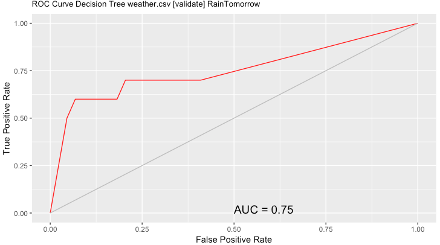

   5. Go back to the `Model` tab, and change `Min Split, Min Bucket, Max Depth`, and `Complexity` to 13, 3, 30, and 0.01, respectively. Click on `Execute` and inspect the result in the main Rattle output area.

   6. Move to the `Evaluate` tab, and check the overall error and averaged class error. Make sure both `Error Matrix` and `Validation` radio buttons are selected. In terms of the overall error, does the new model perform better than the previously trained model? 

      **Solution: **Overall error: 14.8%, Averaged class error: 20.7%

   7. Now check `ROC` and `Validation` radio buttons, and click on `Execute` to see the ROC curve. Inspect the output ROC-curve and the value of `Area under the ROC curve`.

      **Solution:**

      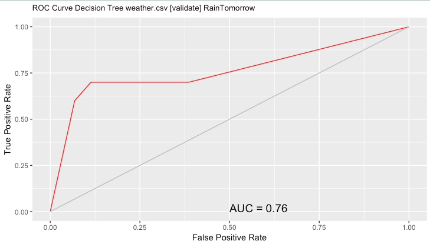

      In terms of the overall error the first model performs better than the second model, however, in terms of the averaged class error and AUC score, the second model performs better than the first model. If you look at the distribution of the RainTomorrow variable, you see the distribution of the variable is highly skewed (Yes=41, No=215). In general, to measure the performance of class imbalanced classification, we prefer to use ROC and averaged error since, for this problem,  it is more important  to identify a rare class than a frequent class (because people tend to be more angry when they get caught in the rain unprepared.).

      Again the choice of evaluation measure is subjective, and someone may have a different opinion.  **You need to choose an evaluation measure that is aligned with your understanding of the problem.**

   8. What is the relation between the overall error and `Area under the ROC curve`? Which measure is more appropriate for predicting **RainTomorrow** variable? and why do you think? (hint: check the distribution of **RainTomorrow** variable)

6. **Training proportion** (Optional extension lab)

   1. In this section, we will examine an effect of training proportion for training a model.

   2. Choose whatever data you want to examine this time. It can be audit.csv, weather.csv, or any other data you are interested in.

   3. Make sure `Partition` box checked. Adjust training/validation/test proportions to 15/70/15.

   4.  Click on `Execute`, and go to `Model` section and train the decision tree with a proper parameter configuration.

   5. Now evaluate the trained model on `Evaluate` tab. Choose one of `Error Matrix` or `ROC` measures. Evaluate the performance of the model on the selected measure. Make sure your evaluation is performed on `Testing` data set.

   6. Go back to `Data` tab, and re-load the same data set. At this time, change training training/validation/test proportions to 30/55/15. Repeat the above processes (6.4-6.5). Is your performance increased?

   7. Add more proportions to training data, but keep the same `testing` proportion. Measure the performance with the adjusted proportions. When is the performance saturated? Does adding more training data increase the performance always?

      **Solution:**

      In my case:

      15% training 15% testing: Overall error: 28.5%, Averaged class error: 48.7%

      30% training 15% testing: Overall error: 23.2%, Averaged class error: 48.8%

      45% training 15% testing: Overall error: 23.2%, Averaged class error: 40.65%

      60% training 15% testing: Overall error: 21.4%, Averaged class error: 30.55%

      75% training 15% testing: Overall error: 16%, Averaged class error: 24.4%

      In general, the performance of your model increases as you increase the training proportion. In this example, we cannot find any saturation in performance. In other words, the performance increases as we increase the training proportion. However, if we are allowed to have a larger dataset, we may observe a point where adding more training data does not increase the model performance.

7. Make sure you log out from your computer *before* you leave the lab room!