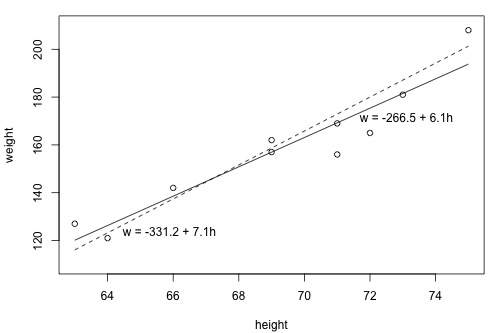
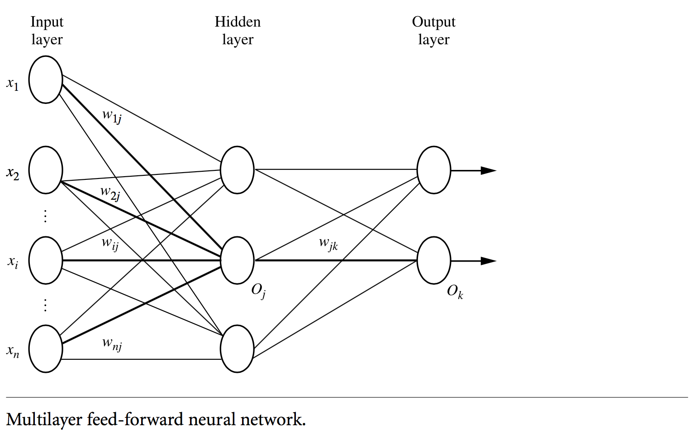
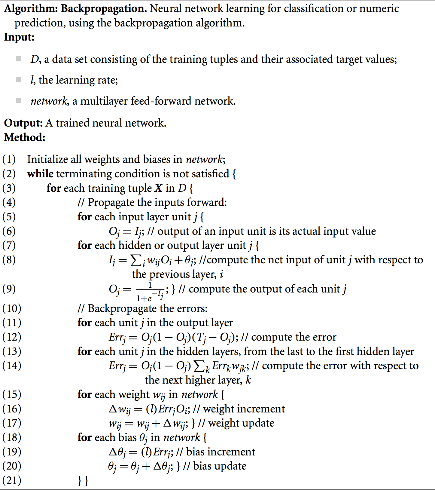
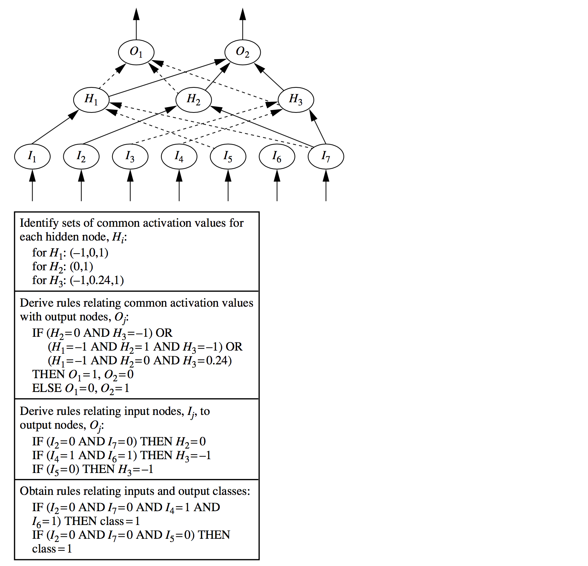
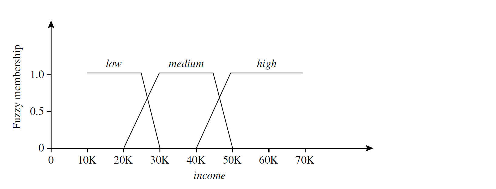
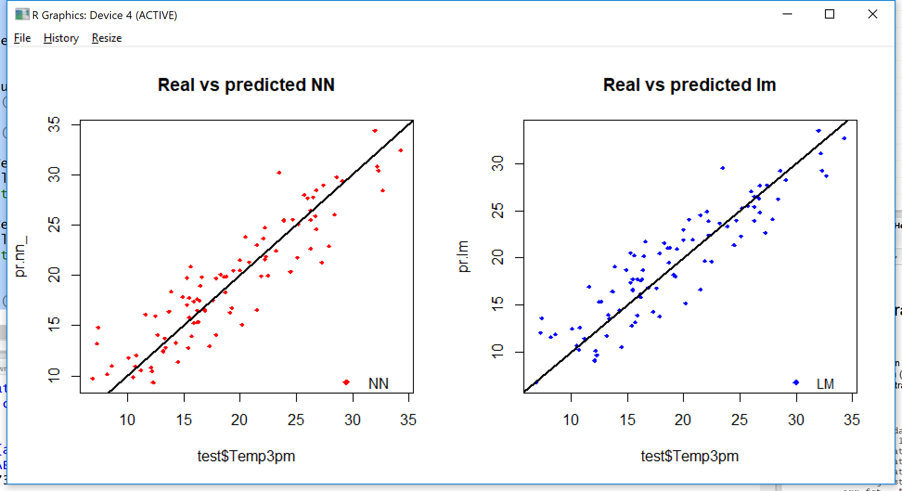

# Week 7 Classification & Prediction: Regression & Neural Nets

## 1. Introduction

Most of this material is derived from the text, Han, Kamber and Pei, Chapter 9, or the corresponding powerpoint slides made available by the publisher.  Where a source other than the text or its slides was used for the material, attribution is given. Unless otherwise stated, images are copyright of the publisher, Elsevier.

Here we continue the topic of classification and prediction, firstly introducing the classic technique of regression, or fitting a line, and then the bio-inspired technique of neural networks and a brief overview of some other "soft" techniques.

For in-depth learning on neural nets and other soft techniques, the courses  Bio-inspired Computing: Applications and Interfaces [COMP8420](http://programsandcourses.anu.edu.au/course/COMP8420) and [COMP4660 ](http://programsandcourses.anu.edu.au/course/COMP4660%20)are recommended.

## 2. Regression (not in textbook)

**Regression**

- provides a way to **predict a numerical variable** given other variables. The other variables are typically numeric, but categorical or ordinal variables can be mapped to numeric values if required.
- models relationship between on *dependent variable* (numerical target variable) and *explanatory varialbes* (other variables)
  - input: independent, explanatory variables
  - output: one dependent, response variable

Regression is different from classification

- classification predicts categorical class labels
- regression models continuous-valued functions and can be considered a *prediction* method becasue the values for explanatory variables of an unseen object can be plugged in to the model to predict the value of the dependent variable.

**Types of relationships considered in regression**

**Deterministic relationship**

- Relationship between explanatory and dependent variable is deterministic
- If we know the value of an explanatroy varialbe then we can predict dependent variable without error
- For example:
  - circumference = $\pi\times$ diameter
  - Fahrenheit = $\frac95\times$ Celsius $+32$

**Statistical relationship**

- Relationship between explanatroy and dependent variable is not perfect
- For example:
  - Height and weight: as height increases, you'd expect weight to increase, but not perfectly.
- Another example of a statistical relationship: 
  - Dependent variable is the mortatlity due to skin cancer (number of deaths per 10 million people)
  - Explanatory varialbe is the latitude of State (measured at the centre of the State in US)
  - Living in a northerm area may reduce the mortality ratio but the relationship is not perfect.

### 2.1 Simple Linear Regression

Simple Linear regression is a statistical method that allows us to study relationships between two continuous variable:

- One variable, denoted $x$, is regarded as the **predictor**, explanatory, or independent variable
- The other variable, denoted $y$, is regarded as the **response**, outcome, or dependent variable
- The goal is to predict the value of response variable when the value of predictor variable is given

Simple linear regression gets is adjective "simple", because it concerns the study of **only one predictor variable**. In contrast, multivariate-liner regression, concerns the study of two more predictor variables.

**Linear Regression Model**

Simple linear regression models the relationship between predictor and response variables as follows:

$\hat{y}=w_0+w_1\times x$

where $w_0$ (y-intercept) and $w_1$ (slope) are coefficient parameters and $\hat{y}$ is a predicted response variable based on the predictor variable $x$. If the value of coefficient parameter is positive then there is a positive relation between predictor and response variable (the value of response variable increases as the predictor variable increases).

The relationship between the two variables can be plotted in x-y plane as follows:



This scatter plot (dots) represent an observed pair of weight and height. Here the height is the predictor variable, and the weight is the response variable. In addition, two linear relations are suggested in this graph. You may have two natural questions from above graph:

- which line is the best line? and
- how can we find it?

**What is the Best Fitting Line?**

Let's assume that we have a training data $D=\{(x_1,y_1),(x_2,y_2),\dots,(x_n,y_n)\}$ which consists of $n$-pairs of $x$ and $y$.

The goal of parameter estimation is to estimate proper values of $w_0$ and $w_1$. To estimate parameters, we first define the sum of square error:

$E=\sum^{|D|}_{i=1}(y_i-\hat{y}_i)^2=\sum^n_{i=1}(y_i-w_0+w_1\times x)^2$

where $\hat{y}$ is the predicted response variable. The sum of square error computes, first, the difference between the true value $y$ and the predicted value $\hat{y}$, second ,square of the difference, and then summation of the squared difference across all training data points.

Parameter estimation find sthe values for $w_0$ and $w_1$ that minimise $E$ and so this technique is called the **least square method**.

**How to evaluate performance?**

The parameter estimation technique suggests an evaluation technique . Accurarcy does not quite make sense here as there are no classes.

Due to the effect of squaring the differences above, linear regression is very sensitive to outliers that fall well away from the line—that is the whole fitted line will be pulled away from the non-outlying values.

The usual methods for asessing performances are

- **RMSE, RMSD, root mean square error.** It is the square root of the average of squared errors for each value of the dependent variable, where error is the simple difference of the actual value and predicted value. This is the same formula used for optimal parameter fitted above. An RMSE value of zero represents a perfect fit.
- **R-squared:** the goodness of fit or coefficient of determination. It is the proportion of the dependent variable variance that is explained by a linear model. R-squared = Explained variance / Total variance. A value of one represents a perfect fit. Variations include pseudo-R-squared methods and adjusted or predicted R-squared.
- **Plot** the actuals and the fitted line on a cartesian plane and visually assess if the points appear to line up. It is a good idea to do thsi every time for linear regression, in combination with quantitative measures. If it doesn't look good, it probably isn't.

Obviously these approaches should be applied to test data rather than training data for a proper assessment, and indeed multifold cross-validation may be applied using the quantitative performance measures above in place of accuracy.

### 2.2 Multivariate Linear Regression

In many applications, it is more general to have more than one predictor variable.

Multivariate linear regression is a direct extension of the linear regression model.

Let's assume that we have $n$ predictor variables for each response variable, i.e., $(x_1,x_2,\dots, x_n,y)$.

In the multivariate-linear regression model, the relation between a response variable and predictor variables are modelled as:

$\hat{y}=w_0+w_1\times x_1+ w_2\times x_2+\dots +w_n\times x_n$

Again, parameters $w_0,\dots, w_n$ can be estimated in least square fashion:

$E=\sum^{|D|}_{i=1}(y_i-\hat{y})^2$

A least square method will find optimal parameters to minimise the squared error $E$.

**Significance of the weight**

Most of regression library or program support the significance testing for each weight. Ususally, significance weights are denoted by $***$ (or $**$ or $*$ depending on the significance level).

The significance attributes indicate that the effect (or influence) of the attribute is not just random! In other words, those significant attributes have high influence on predicting your response variable. This alone may be valuable information.

**Performance evaluation**

The methods for evaluation of simple linear regression generalize straightforwardly to apply to the multivariate case.

## 3. Classification or Prediction by Neural Networks (Text 9.2)

**Neural Network Learning**

- Neural networks were first investigated by psychologists and neurobiologists to develop and test computational analogues of neurons
- A neural network: a set of connected nodes where each node is an *input* (corresponding to dependent variable), *output* (corresponding to an independent variable for numeric prediction or a class for classification; there may be several output nodes) or *hidden* and where each connection has a **weight** associated with it.
- During the learning phase, the **network learns by adjusting the weights** so as to be able to output the correct class label or predicted value for the input tuples.
- Also referred to as *connectionist* learning due to the connection between units
- The classic training algorithms is called *backpropagation*.
- *Convolutional Neural Networks* are neural networks where there are specific roles and connection architectures for hidden nodes and these have been applied very successfully to image recognition and other problems.
- The term *deep learning* often referes to training CNNs.

**Strength/Weakness of neural network as a classifier**

**Strength**

- High tolerance to noisy data
- Ability to classify untrained patterns
- Well-suited for continuous-valued inputs and outputs
- Successful on an array of real-world data, e.g., hand-written letters
- Algorithms are inherently parallel
- Techniques have recently been developed for the extraction of rules from trained neural networks

**Weakness**

- Long training time
- Require a number of parameters typically best determined empirically, e.g., network topology or structure
- Poor interpretability: difficult to interpret the symbolic meaning behind the learned weights and of hidden units in network, that is, behaves as a "black box" model.

### 3.1 Multi-Layer Feed-Forward Neural Network



**Structure of Multilayer neural network**

- The **inputs** to the network correspond to the attributes measured for each training tuple
- Inputs are fed simultaneously into the units making up the **input layer**
- They are then weighted and fed simultaneously to a **hidden layer**
  - The number of hidden layers is arbitrary (1 hidden layer in the example above)
  - The number of hidden units is arbitrary (3 hidden units in the example above)
- The weighted outputs of the last hidden layer are input to units making up the **output layer**, which emits the network's prediction.
- From a statistical point of view, networks perform **nonlinear regression:** given enoughh hidden units and enough training samples, they can closely approximate any function (output)

**Defining a network topology**

- Decide the **network topology:**
  - Specify the number of units in the input layer
  - the number of hidden layers (if > 1)
    - the number of units in each hidden layer
  - and the number of units in the output layer
- normalize the input values for each attribute measured in the training tuples to [0.0~1.0]
- one input unit per domain value, each intialized to 0
- **Output,** one unit per response variable. In a typical binary classification problem only one output unit is used. For classification of more than two classes, one output unit per class is used.
- Once a network has been trained and its accuracy is unacceptable, repeat the training process with a different network topology or a different set of initial weights.

### 3.2 Prediction with Neural Network

.png)

We first discuss how to predict an output variable using MNL.

**1. Initialize the weights**

- The weights in the network are initialized to small random numbers (e.g., ranging from -1.0 to 1.0 or -0.5 to 0.5)
- Each unit has a bias associated with it, as explained later. The biases are similarly initialized to small random numbers.

Each training tuple, $X$, is processed by the following steps.

**2. Propagate the inputs forward**

1. First, the training tuple is fed to the network's input layer. The inputs pass through the input units, unchanged.
2. Hidden layer
   1. Input of hidden unit: all outputs of the previous layer, e.g., if the hidden unit is in the first hidden layer, then the inputs are $x_1,x_2,\dots, x_n$.
   2. Output of hidden unit $j$: weighted linear combination of its input followed by an activate function
      1. $O_j=f(\sum^n_{i=1}w_{ij}\cdot x_j+\theta_j)$
      2. where $w_{ij}$ is the weight of the connection from input $i$ in the previous layer to unit $j$
      3. $\theta_j$ is the bias variable of unit $j$
      4. $f(\cdot)$ is a non-linear activation function which will be described later.
   3. If there will be more than one hidden layer, the above procedure will be repeated unitl the final hidden layer will result outputs.
3. Output layer
   1. The outputs of the final hidden layer will be used as inputs of the output layer.
   2. The number of output units are determined by a task
      1. If out goal is to predict a single numerical variable, then one output unit is enough.
   3. Final output $O_k$:
      1. $O_k=\sum^h_{j=1}w_{jk}\cdot O_j+\theta_k$ or $O_k=f(\sum^h_{j=1}w_{jk}\cdot O_j+\theta_k)$
      2. $O_k$ is the final predicted value given $x_1,x_2,\dots,x_n$.


> Graphical illustration of the computational flow or hidden unit $j$ : The inputs to unit $j$ are outputs from the previous layer. These are multiplied by their corresponding weights to form a weighted sum, which is added to the bias $\theta_j$ associated with unit $j$. A nonlinear activation function $f$ is applied to the net input. Again the output of this unit will be used as an input of the successive layer.

**Non-linear activation function**

An activation function imposes a certain non-linearity in a neural network. There are several possible choices of activation function, but **sigmoid** (or logistic) function is the most widely used activation function.

- **Sigmoid function**
  - Sigmoid functions have domain of all real numbers, with return value monotonically increasing most often from 0 to 1.
  - $f(x)=\frac1{1+\exp{(-x)}}$
  - 
  - Also referred to as a squashing function, because it maps the input domain onto the range of 0 to 1.
- Other activation functions
  - Hyperbolic tangent function
  - Softmax function (for classification)
  - ReLU
  - etc.

### 3.3 BackPropagation 

**Backpropagation**

- Backpropagation algorithms is designed to train weights of a neural network.
- Backpropagation algorithms is based on the **gradient descent** algorithm.

**How backpropagation works?**

The error is **propagated backward** by **updating the weights and biases** to reflect the error of the network's prediction.

- For unit $k$ in the output layer, $E_k$ is computed by
  - $E_k=O_k(1-O_k)(T_k-O_k)$
  - where $O_k$ is the actual output of unit $k$, and $T_k$ is the known target value of the given training tuple.
- To compute the error of a hidden layer unit $j$, the weighted sum of the errors of the units connected to unit $k$ in the next layer are considered.
  - $E_j=O_j(1-O_j)\sum_kE_kw_{jk}$
  - where $w_{jk}$ is the weight of the connection from unit $j$ to a unit $k$ in the next higher layer.
- The weights and biases are **updated to reflect the propagated errors.**
  - Each weight $w_{jk}$ in the network is updated by the following equations, where $\Delta w_{jk}$ is the change in weight $w_{jk}$;
    - $\Delta w_{jk}=l\times E_kO_j$
    - $w_{jk}=w_{jk}+\Delta w_{jk}$
  - Each bias $\theta_j$ in the network is updated by the following equations, where $\Delta \theta_j$ is the change in bias $\theta_j$:
    - $\Delta\theta_j= l\times E_j$
    - $\theta_j=\theta_j+\Delta\theta_j$

**Learning rate:** The variable $l$ is the learning rate, typically, a value between 0.0 and 1.0. If the learning rate is too small, then learning will occur at a very slow rate. If the learning rate is too large, then oscillation between inadequate solutions may occur. A rule of thumb is to set the learning rate to $1/t$, where $t$ is the number of iterations through the training set so far.

**Updating schedules**

- **Case updating:** note that here we are updating the weights and biases after the presentation of each tuple.
- **Epoch updating:** alternatively, the weight and bias increments could be accumulated in variables, so that the weights and biases are updated after all the tuples in the training set have been presented.
- In theory, the mathematical derivation of backpropagation employs epoch updating, yet in practice, case updating is more common because it tends to yield more accurate results.



### 3.4 Interpretability

**Interpretability of neural network**

> Neural networks are like a black box. How can I 'understand' what the backpropagation network has learned?

- A major disadvantage of neural networks lies in their knowledge representation.
- Acquired knowledge in the form of a network of units connected by weighted links is difficult for humans to interpret.
- For easier comprehension: Rule extraction by **network pruning**
- **Simplify the network** structure by removing weighted links that have the least effect on the trained network
- Then perform link, unit, or activation value clustering
- The set of input and activation values are studied to derive rules describing the relationship between the input and hidden unit layers
- 

**Sensitivity analysis**

- Assess the impact that a given input variable has on a network output.
- The input to the variable is varied while the remaining input variables are fixed at some value.
- The knowledge gained from this analysis can be represented in rules
  - Such as "IF X decreases 5% THEN Y increases 8%"

## 4. Other "Soft" Classification Algorithms (Text 9.6)

**Genetic Algorithm**

- Genetic algorithm: based on an analogy to biological evolution
- An initial population $P$ is created consisting of randomly generated rules
  - each rule is represented by a string of bits
  - e.g. if A1 and $\lnot$A2 then C2 can be encoded as 100
  - if an attribute has $k>2$ values, $k$ bits can be used
- Based on the notion of survival of the fittest, a new population is formed to consist of the fittest rules and their offspring
  - The fitness of a rule is represented by its classifciation accurarcy on a set of training examples
- Offspring are generated by crossover and mutation
  - **Crossover:** sub-strings from pairs of rules are swapped to form new pairs of rules
  - **Mutation:** randomly selected bits in a rule's string are inverted
- The process continues until a population $P$ evolves when each rule in $P$ satisfies a prespecified threshold
- Slow but easily parallelisable

**Fuzzy-Set Approach**

- Fuzzy logic uses truth values between 0.0 and 1.0 to represent the degree of membership (such as in a fuzzy membership graph)

- Attribute values are converted to fuzzy values:

  - Income is assigned a fuzzy membership value to each of the discrete categories {low, medium, high}, without fuzzy logic $49K income will be categorized as "medium income"

  - In fuzzy logic:

    - $49K belongs to medium income with fuzzy value 0.15
    - but belongs to "high income" with fuzzy value 0.96.

    

  - Fuzzy membership values do not have to sum to 1.

- Each applicable rule contributes to a vote for membership in the categories

- Typically, the truth values for each predicted category are summed, and these sums are combined

## 5. Practical Exercises: Neural Network and Linear Regression in R

**Objectives**

The objectives of this lab are to experiment with the neural network package available in **R**, in order to better understand the issues involved with this data mining technique; to compare the neural network classification results with the results from linear regression for **predicting** **numerical variable**.

**Preliminaries**

For this lab, we will mainly use the **weather.csv** data set which you have used in the previous labs. If you want to use another data set to conduct more experiments at the end of the lab please do so.

**Rattle** has a limited functionality for training a neural network and linear model, therefore, during this lab, we will directly type commands into the R console.

You can get help on packages used in this lab by typing the following three commands into the **R** console. Specifically for the linear model, type `help(lm)`

For the neural network model, type:

- `library(neuralnet)`
- `help(neuralnet)`

**Tasks**

1. Start R in the lab. Here is a quick description of the steps involved: a) Open a terminal window (Main menu -> Accessories). b) Start R by typing R followed by 'Enter'
2. Install `neuralnet` package. Type: `install.packages("neuralnet")`
3. Now, it is time to load weather.csv data set into R space. We need to move to the folder which contains the data set file first. If the directory was `/usr/local/lib/R/site-library/rattle/csv/` then type: `setwd("/usr/local/lib/R/site-library/rattle/csv/")`
4. To load csv file from the folder, type(Press the enter after typing every command during the lab): `weather <- read.csv("weather.csv")` This command will load the content of weather.csv file into R. To check the file loaded properly, type: `weather` into R console. This will show a first few records of the data set.
5. In this lab, we set our goal to predict temperature at 3pm using various information gathered at 9am on the same date. The following command will select few columns from weather data and copy it to data variable: `data <- subset(weather, select=c("WindSpeed9am", "Humidity9am", "Pressure9am", "Cloud9am", "Temp9am", "Temp3pm"))` If you type `data` into R console, then you will notice that data variable keeps the selected columns only. We will predict **Temp3pm** attribute using the other attributes.
6. The neural network and linear model cannot handle missing information, so let's replace all the missing entries by 0 using the command below. `data[is.na(data)] <- 0`
7. Now it is time to divide the data set into training and test data sets. The following commands will randomly select 75% of data set into `train` variable and 25% of remaining data set into `test` variable

```R
index <- sample(1:nrow(data),round(0.75*nrow(data)))
train <- data[index,]
test <- data[-index,]
```

8. For the neural network, it is important to normalise your attributes in a certain way. Here we decide to normalise attributes to make sure that the rage of variable will be [0,1]:

```R
maxs <- apply(data, 2, max) 
mins <- apply(data, 2, min)
scaled <- as.data.frame(scale(data, center = mins, scale = maxs - mins))
train_ <- scaled[index,]
test_ <- scaled[-index,]
```

The first two commands find the max and min value for each attribute, and then the third command will scale every attribute in the interval [0,1]. Final two commands will divide the scaled data set into `train_` and `test_` sets.

9. Now we will train a neural network model which will predict**Temp3pm** using **WindSpeed9am, Humidity9am, Pressure9am, Cloud9am,** and **Temp9am** attributes.

```R
f <- "Temp3pm ~ WindSpeed9am + Humidity9am + Pressure9am + Cloud9am + Temp9am"
nn <- neuralnet(f,data=train_,hidden=c(5, 3), act.fct = "logistic", linear.output=T)
```

Through the first command, we let the neural network know which attribute we will predict for. The second command will train a neural network with

a) Two hidden layers; the number of hidden units for the first layer is 5, and the number of hidden units for the second layer is 3,

b) `logistic(=softmax)` activation function for hidden layer
using `train_` as a train data set.

10. To see the network structure and learned weight for each edge: `plot(nn)` This will visualize the neural net.
11. To predict the temperature at 3pm for the test data set, type: `pr.nn <- compute(nn,test_[,1:5])`

Note that the predicted values are based on the normalised values in range [0,1]. Let's re-scale the predicted values to the original scale using a series of commands:

```R
pr.nn_ <- pr.nn$net.result*(max(data$Temp3pm)-min(data$Temp3pm))+min(data$Temp3pm)
test.r <- (test_$Temp3pm)*(max(data$Temp3pm)-min(data$Temp3pm))+min(data$Temp3pm)
```

12. Let's visualise the difference between the predicted values and the true values:

```R
plot(test$Temp3pm,pr.nn_,col='red',main='Real vs predicted NN',pch=18,cex=0.7)
```

The absolute average difference between the predicted values and the true values is:

```R
MAE.nn <- sum(abs(test.r - pr.nn))/nrow(test)
print(MAE.nn)
```

13. Now it is time to train a linear model to predict the same attribute used in the neural network. Training a linear model is relatively simple to compare with the neural net. Just type: `lm.fit <- glm(f, data=train)`

Note that we don't need to normalise the values at this time. To predict the values for test data: `pr.lm <- predict(lm.fit, test)`

The absolute average difference between the true value and the predicted value can be computed by:

```R
MAE.lm <- sum(abs(pr.lm - test$Temp3pm))/nrow(test)
print(paste(MAE.lm))
```

Which model performs better? the neural network model or the linear model? 

14. Now, plot two graphs to compare the performance of the neural network and linear models:

```R
par(mfrow=c(1,2))

plot(test$Temp3pm,pr.nn_,col='red',main='Real vs predicted NN',pch=18,cex=0.7)
abline(0,1,lwd=2)
legend('bottomright',legend='NN',pch=18,col='red', bty='n')

plot(test$Temp3pm,pr.lm,col='blue',main='Real vs predicted lm',pch=18, cex=0.7)
abline(0,1,lwd=2)
legend('bottomright',legend='LM',pch=18,col='blue', bty='n', cex=.95)
```



15. If you are familiar with R, check `help(neuralnet)`. There are multiple parameters you can tune int the neural net. Can you find a better network architecture? Try to tune these parameters (Need to re-run 9~12 after adjusting some parameters): 
    a) the number of hidden units, 
    b) the number of hidden layers, 
    c) the activation function
16. If you type `summary(lm.fit)` you will get a summary of the fitted line from the linear regression. The asterisks next to each attribute denotes the significance of the corresponding attributes. It meas these variables have significant influence on your prediction. What variables have a positive relation with the target variable, and what variables have a negative relation with the target variable? Can you measure the influence of each variable with respect to the target variable? This online document may help you interpret the result of linear regression: [[Doc Link\]](http://blog.minitab.com/blog/adventures-in-statistics-2/how-to-interpret-regression-analysis-results-p-values-and-coefficients)

