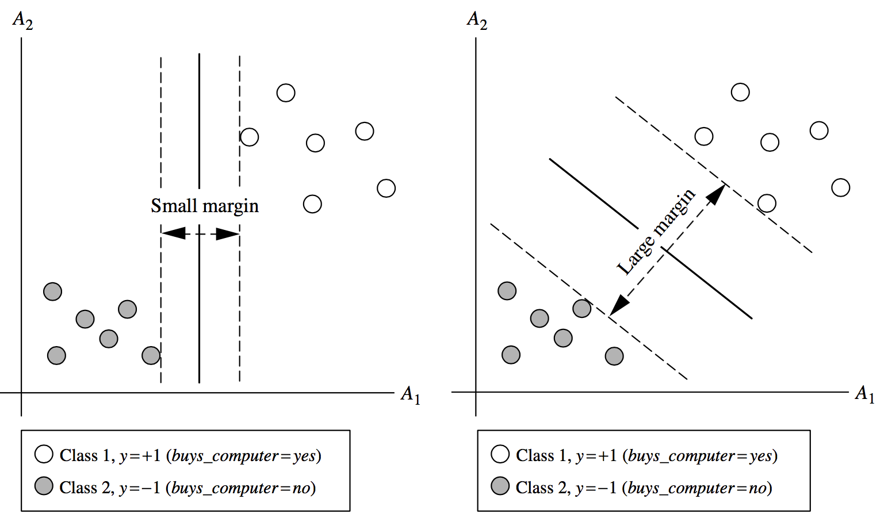
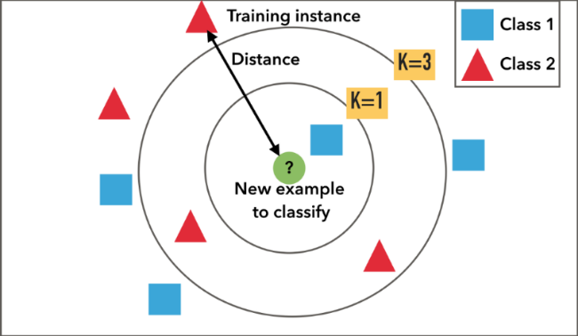
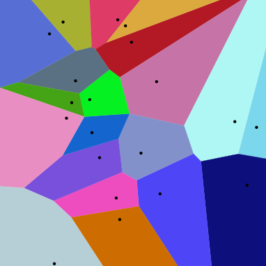

# Week 7 Classification & Prediction: SVM, Lazy Learners, & Variants

## 1. Introduction

Most of this material is derived from the text, Han, Kamber and Pei, Chapter 9, or the corresponding powerpoint slides made available by the publisher.  Where a source other than the text or its slides was used for the material, attribution is given. Unless otherwise stated, images are copyright of the publisher, Elsevier.

This topic concludes our work on the data mining problems of classification and prediction with a look at the very popular [Support Vector Machine](https://wattlecourses.anu.edu.au/mod/resource/view.php?id=1298528) kernel method as well as lazy learning algorithms including k-nearest neighbour, and  finishing up with a brief summary of some variants of the classification and prediction data mining problem.

## 2. Support Vector Machine (Text: 9.3)

**Support vector machines (SVMs)**

- One of the most successful classification methods for both linear and nonlinear data
- It uses a nonlinear mapping to transform the original training data into a higher dimension
- With the new dimension, it searches for the linear optimal separating **hyperplane** (i.e., "decision boundary")
- With an appropriate nonlinear mapping to a sufficiently high dimension, data from two classes can always be separated by a hyperplane
- SVM finds this hyperplane using **support vectors** ("essential" training tuples) and **margins** (defined by the support vectors)

**History and Applications**

- Vapnik and colleagues (1992):
  - groundwork from Vapnik & Chervonenkis' statistical learning theory in 1960s
- Features: training can be slow but accuracy is high owing to their ability to model complex nonlinear decision boundaries (margin maximisation)
- Used for: classification and numeric prediction (regression)
- Applications:
  - handwritten digit recognition, object recognition, speaker identification, benchmarking time-series prediction tests

**Algorithms**

- Training of SVM can be distinguished by
  - linearly separable case
  - non-linearly separable case

### 2.1 Linearly Separable Case

**SVM with linearly separable training data**

-  Let's consider buys_computer example with two input attributes $A_1$ and $A_2$. If the training tuples can be plotted as follows (x-axis and y-axis represent $A_1$ and $A_2$, respectively), then the dataset is linearly separable:

- Because **a straight line (hyperplane) can be drawn to separate all the tuples** of class +1 from all the tuples of class -1.
- There are **infinite lines** (hyperplanes) separating the two classes
  - e.g. all of thedotted lines separate the training tuples exactly the same in the above example
- We want to ==find the best one== (the one that minimizes classification error on unseen data)

**Maximum marginal hyperplane**

SVM searches for the hyperplane with **the largest margin**, i.e., maximum marginal hyperplane (**MMH**)

- **Margin:** Draw a perpendicular line from the hyperplane to a tuple. The distance between the hyperplane and the tuple is the margin of that hyperplane.
- In this example, the hyperplane on the right figure has a larger margin than one on the left.

**Support Vectors:**

- **Support vectors:** the training tuples that determine the largest margin hyperplane. In the above example, red-circled tuples are the support vectors of the hyperplane.

**Formal definition of hyperplanes and support vectors:**

**Two dimensional training tuple case:**

- In two dimensional space ($A_1-A_2$ plane), a hyperplane corresponds to a line, and every hyperplane can be written as: $A_2=a\times A_1 +b$
- For a more general representation, if we replace $A_1$ and $A_2$ by $x_1$ and $x_2$, then the above hyperplane can be rewritten as:
  - $0=w_1\times x_1+w_2\times x_2+w_0$
  - where $w_1=a, w_2=-1,w_0=b$
  - We can represent any hyperplane (line) in two dimensional space with $w_1,w_2$ and $w_0$.
- In the linearly separable case, every training tuple satisfies the following condition:
  - H1 (positive class)
    - If $w_1\times x_1+ w_2\times x_2 + w_0\geq +1$
  - H2 (negative class)
    - If $w_1\times x_1+ w_2\times x_2 + w_0\leq +1$
- Support vector: Therefore, every training tuple that satisfies $w_1\times x_1+w_2\times x_2+w_0=\pm 1$ is a support vector.

**N-dimensional training tuple case:**

- Let $X=(x_1,x_2,x_3,\dots,x_n)$ then a separating hyperplane can be written as
  - $WX^T+w_0=0$
  - where $W=(w_1,w_2,\dots,w_n)$ is a weight vector and $w_0$ is a scalar (bias)
  - $WX^T=\sum^n_{i=1}w_i\times x_i$
- The hyperplane defining the sides of the margin:
  - H1: $w_0+WX^T\geq 1$ for $y_i=+1$ and
  - H2: $w_0+WX^T\leq -1$ for $y_i=-1$
- These two equations can be combined into one equation:
  - $y_i(w_0+WX^T)\geq 1, \forall i$
  - This becomes a constrained (convex) quadratic optimisation problem:
    - there is a way to estimate the weights $W$ from the training dataset

**Classify test tuple using trained model**

Duringthe testing phase, the trained model classifies a new tuple $X$ using the rules:

- Using hyperplane
  - H1 (positive class)
    - if $w_0+WX^T\geq 0$
    - Then $X$ will be classified as a positive class
  - H2 (negative class), vice versa
- **Alternatively**, we can use the support vectors alone to classify test tuples
  - $d(X)=\sum^l_{i=1}y_i\alpha_iX_iX^T+b_0$
  - where $l$ is the number of support vectors, and $\alpha$ and $b_0$ are automatically determined by the optimisation algorithm.
  - If the sign of $d(X)$ is positive then $X$ is classified as H1, otherwise H2.
  - Note that we need to **keep only the support vectors** for testing
    - This fact will be used in the non-linearly separable case

**Why is SVM effective on high-dimensional data?**

- The **complexity** of a trained classifier is characterised by the number of support vectors rather than the dimensionality of the data
- The **support vectors** are the essential or critical training examples —they lie closest to the decision boundary (MMH)
- If all other training examples are removed and the training is repeated, the same separating hyperplane would be found from the support vectors alone
- The number of support vectors found can be used to compute an (upper) bound on the expected error rate of the SVM classifier, which is independent of the data dimensionality
- Thus, an SVM with a small number of support vectors can have good generalisation, even when the dimensionality of the data is high

### 2.2 Linearly Inseparable Case

So far we've discussed the case where there is a straight line that separates two classes in the training datset. Now, we will discuss the case when the data are not linearly separable.

Example of lineraly inseparable data

A two-class dataset that is not linearly separable. The outer ring (cyan) is class '0', while the inner ring (red) is class '1'

- Linearly inseparable training data. Unlike the linearly separable data, it is not possible to draw a **straight (linear) line** to separate the classes.
- Basic SVM would not be able to find a feasible solution here.
- But there is a way to extend the linear approach in this case!

**Kernel Trick**

The idea is to obtain linear separation by **mapping the data to a higher dimensional space**. Let's see the example first:

(Left) A dataset in $\mathbb{R}^2$, not linearly separable, (Right) The same dataset transformed by the transformation $[x_1,x_2]=[x_1,x_2,x_1^2+x_2^2]$

Hyperplane (green plane) that **linearly separates two classes** in the higher dimensional space.

In the above example, we can train a linear SVM classifier that **successfully finds a good decision boundary in $\mathbb{R}$**

However, we are given the dataset in $\mathbb{R}^2$. The chanllenge is to **find a transformation ** $\phi:\mathbb{R}^2\rightarrow\mathbb{R}^3,$ such that the transformed dataset is linearly separable in $\mathbb{R}^3$.

$\phi([x_1,x_2])=[x_1,x_2,x_1^2+x_2^2]$ which after applied to every point in the original tuples yields the linearly separable dataset.

[video visualization of polynomial kernel](https://youtu.be/3liCbRZPrZA)

Assuming we have such a transformation $\phi$, the new classification pipeline is as follows.

- First transform the training set $X$ to $X'$ with $\phi$
- Train a linear SVM on $X'$ to get a new SVM.
- At test time, a new example of $\bar{x}$ will first be transformed to $\bar{x}'=\phi(\bar{x}')$ during the testing time.

This is exactly the same as the train/test procedure for regular linear SVMs, but with an added data transformation via $\phi$.

We have improved the **expressiveness** of the linear SVM classifier by working in a higher-dimensional space.

**Kernel**

- The decision rule used in the linearly separable case was $d(X)=\sum^l_{i=1}y_i\alpha_iX_iX^T+b_0$
- Now it is converted to $d(X)=\sum^l_{i=1}y_i\alpha_i\phi(X_i)\cdot\phi(X)^T+b_0$
- The definition of the kernel function is $K(X_i,X_j)=\phi(X_i)\cdot \phi(X_j)^T$
- Now, every $\phi(X_i)\cdot \phi(X_j)^T$ can be replaced by $K(X_i,X_j)$. Therefore, we do not need an exact formulation of $\phi$, and a kernel function is enough for determining SVM.
- Here are some widely used kernel functions:
  - [Polynomial kernel](https://en.wikipedia.org/wiki/Polynomial_kernel) of degree $h$: $K(X_i,X_j)=(X_j\cdot X_j^T+1)^h$
  - Gaussian radial basis function kernel: $K(X_i,X_j)=e^{-dist(X_i,X_j)^2/2\sigma^2}$
  - Sigmoid Kernel: $K(X_i,X_j)=\tanh(\kappa X_i\cdot X_j^T-\delta)$
  - Linear Kernel: $K(X_i,X_j)=X_i\cdot X_j^T$

[Externel video: Support Vector Machines by Patrick Winston (MIT)](https://www.youtube.com/watch?v=_PwhiWxHK8o) Great lecture on SVM, from MIT opencourseware.

Some of the examples used in this note are from http://www.eric-kim.net/

### 2.3 Neural Network vs. SVM

**Comparison between neural network and SVM**

| Neural Network                                               | SVM                                                          |
| ------------------------------------------------------------ | ------------------------------------------------------------ |
| Nondeterministic algorithm                                   | Deterministic algorithm                                      |
| Generalises well but doesn't have strong mathematical foundation | Nice generalisation property                                 |
| Can easily be learned in incremental fashion                 | Hard to learn - learned in batch mode using quadratic programming techniques |
| To learn complex function, use multi-layer neural network    | Using kernels can learn very complex functions               |

## 3. Lazy Learners (Text: 9.5)

**Lazy vs. Eager Learning**

- Lazy vs. eager learning
  - **Lazy learning** (e.g., instance-based learning): Simply stores training data (or only minor processing) and **waits until it is given a test tuple**
  - **Eager learning** (the discussed methods so far): Given a set of training tuples,**constructs a classification model** before receiving new (e.g., test) data to classify
- Lazy: less time in training but more time in predicting
- Accuracy
  - Lazy method effectively uses a richer hypothesis space since it uses many local linear functions to form an implicit global approximation to the target function
  - Eager: must commit to a single hypothesis that covers the entire instance space

**Lazy Learner: Instance based method**

- Instance-based learning:
  - Store training examples and delay the processing (“lazy evaluation”) until a new instance must be classified
- Typical approaches
  - k-nearest neighbor approach (KNN)
    - Instances represented as points in a Euclidean space.
  - Locally weighted regression
    - Constructs local approximation
  - Case-based reasoning
    - Uses symbolic representations and knowledge-based inference

### 3.1 kNN-Classifier (Text: 9.5.1)

**K-Nearest Neighbourhood (k-NN**

- KNN classifiers are based on learning by analogy
- A training tuple described by $n$ attributes represents a point in the n-dimensional space
  - All training tuples are stored in an n-dim space
- Given an unknown tuple, KNN classifier searches $k$ nearest neighbours of the unknown tuple.
  - The nearest neghbours are defined in terms of Euclidean distance or other metrics, $dist(X_1,X_2)$
- Two ways of classifying the unknown tuple in KNN
  - Discrete method (discrete-valued method)
    - k-NN returns the most common value among the $k$ training examples nearest to $X_q$ (test tuple)
    - Decision function
      - $D(X_q)=\sum^k_{i=1}y_i$
      - where $y_i\in\{+1,-1\}$ is the class of $i$th nearest neighbourhood
      - If $D(X_q)>0$ then $X_q$ is positive class otherwise negative class
    - Voronoi diagram: the decision surface induced by 1-NN for a typical set  of training examples
  - Continuous method (real-valued prediction):
    - Returns the mean values of the $k$ nearest neighbours
    - Distance-weighted nearest neighbour algorithm
      - Weight the contribution of each of the $k$ neighbours according to their distance to the query $X_q$
      - Give greater weight to closer neighbours $w_i=\frac1{dist(X_q,X_i)^2}$
    - Decision function:
      - $D(X)=\sum^k_{i=1}\frac{w_i}{\sum^k_{j=1}w_j}\cdot y_i$
      - The decision rule is the same as for the discrete case

**Characteristics of KNN**

- **Robust** to noisy data by averaging k-nearest neighbours
- **Extremely slow** when classifying test tuples
  - With $|D|$ training tuples, $|D|$ comparisons are required to find $k$-nearest neighbourhood
  - For example, SVM only requires $l$ comparisons where $l$ is the number of support vectors
  - Partial distance method:
    - Compute a distance on a subset of $n$ attributes
    - If the distance exceeds a threshold, further computation will be halted
    - else keep computing the distance

### 3.2 Exercise: kNN Classifier

We are manufacturers of paper products and we wish to understand whether  our new  types of paper tissue are good or not.

We have data from both a survey of customer opinion and objective lab testing with two attributes: acid durability and strength.

Here are four training samples:

| X1 = Acid Durability (seconds) | X2 = Strength (kg/square meter) | Y = Classification |
| ------------------------------ | ------------------------------- | ------------------ |
| 7                              | 7                               | Bad                |
| 7                              | 4                               | Bad                |
| 3                              | 4                               | Good               |
| 1                              | 4                               | Good               |

Now the product developers produce a new paper tissue that passes the laboratory test with X1 = 3 and X2 = 7.

What will be the assigned class (Good or Bad) if we use  a discrete 3-NN classifier to classify the new paper tissue (k=3, distance metric: Euclidean distance)?

**Solution:**

1. Calculate the distance between the query-instance and all the training samples.

2. Sort the distance and determine nearest neighbours based on the K-th minimum distance

3. Gather the category of the nearest neighbours. Notice in the second row last column that the category of nearest neighbour is not included because the rank of this data is more than 3 (=K).

   | X1 = Acid Durability (seconds) | X2 = Strength  (kg/square meter) | Squared Distance to query instance (3,7) | Rank minimum distance | Is it included in 3-Nearest neighbors? | Y = Category of nearest Neighbor |
   | ------------------------------ | -------------------------------- | ---------------------------------------- | --------------------- | -------------------------------------- | -------------------------------- |
   | 7                              | 7                                | 16                                       | 3                     | Yes                                    | Bad                              |
   | 7                              | 4                                | 25                                       | 4                     | No                                     | -                                |
   | 3                              | 4                                | 9                                        | 1                     | Yes                                    | Good                             |
   | 1                              | 4                                | 13                                       | 2                     | Yes                                    | Good                             |

   Use simple majority of the category of nearest neighbours as the prediction value of the query instance. We have 2 good and 1 bad, since 2>1 then we conclude that a new paper tissue that passes laboratory test with X1 = 3 and X2 = 7 is included in **Good** category.

   The example from http://people.revoledu.com/kardi/tutorial/KNN/KNN_Numerical-example.html

### 3.3 Case-Based Reasoning (CBR) (Text: 9.5.2)

- CBR(Case-Based Reasoning): Uses a database of problem solutions to solve new problems
- Store symbolic description (tuples or cases)—not points in a Euclidean space
- Applications: Customer-service (product-related diagnosis), legal ruling
- Methodology
  - Instances represented by rich symbolic descriptions
  - If there is an identical training case, given a test case, the solution of the training case will be returned
  - If not, search for similar cases, multiple retrieved cases may be combined
  - Tight coupling between case retrieval, knowledge-based reasoning, and problem solving
- Challenges
  - Find a good similarity metric
  - Indexing based on syntactic similarity measure, and when failure, backtracking, and adapting to additional cases

## 4. Practical Exercises: Support Vector Machines in Rattle

**Objectives**

The objectives of this lab are to experiment with the support vector machines (SVM) package available in **R** and **Rattle**, in order to better understand the issues involved with this data mining technique; to compare the SVM classification results with the results from decision trees; and to gain more experience with the different evaluation methods for supervised classification available in the **Rattle** tool.

**Preliminaries**

Read through the following section in the Rattle online documentation:

- [**Support Vector Machine**](http://datamining.togaware.com/survivor/Support_Vector.html)
- [**Risk Chart**](https://www.togaware.com/datamining/survivor/Risk_Charts.html)

For this we will mainly use the **audit.csv** data set which you have used in the previous labs. If you want to use another data set to conduct more experiments at the end of the lab please do so.

The support vector machine classifier in **Rattle** is based on the **R** package**kernlab** (Kernel Methods Lab), and specifically on the **ksvm** class from this package. You can get help on this class by typing the following two commands into the **R** console (the terminal window where you started **R** and **Rattle**), assuming you have started **R**: 

- `library(kernlab)`
- `help(ksvm)`

To re-familiarise yourself with the evaluation of (classification) models, you might want to read the corresponding chapter  [Evaluation and Deployment](http://datamining.togaware.com/survivor/Evaluation.html) in the **Rattle Data Miner** documentation (before coming to the lab).

**Tasks**

1. Start **Rattle** as described in the first lab sheet. Here is a quick repeat of the steps involved:

   a) Open a console/terminal window.
   b) Start R by typing **R** (capitalised!) followed by '`Enter`'.
   c) Type: `library(rattle)` followed by '`Enter`'.
   d) Type: `rattle()` followed by '`Enter`'.

2. The following steps (up to step 7) are the same as the first steps for the lab on decision tree:

   Load the **CSV** data set **audit** (make sure you have **CSV File** selected in the **Data** tab, and the **Header** box is ticked).

   Click **Execute** to load the data into **Rattle**.

3. Now make sure the variable (attribute) **TARGET_Adjusted** is selected as `Target` variable, and that you partition the data (e.g. leave the 70/15/15 percentage split in the `Partition` box - which must be ticked). This means that we will use 70% of all records in the **audit** data set for training, 15% for validation (tuning) and 15% for testing.

4. Also make sure that the variable **ID** is set to role `Ident`(ifier).

5. You can select or set to **`Ignore`** other variables if you feel they are not suitable for classification (after having built a classification model you might later want to come back to the **`Data`** tab and change your variable selection).

6. Next you might want to explore the data set in order to again become familiar with it. Specifically, you should examine the values of the *target* variable **TARGET_Adjusted**.

7. You might also want to have a look at the actual data (which you can do in the `Data` tab by clicking on the `View` button).

8. Now go to the `Model` tab and make sure the `SVM` type radio button is selected. As you can see, there is one main parameter you can modify, the **``Kernel`** function (the mathematical function that is at the core of the SVM), and further parameters can be entered into the **Options** input box. Please read the **Rattle** documentation on [support vector machines](http://datamining.togaware.com/survivor/Support_Vector.html) for more information.

9. To build a SVM, click on `Execute` and inspect what is printed into the main **Rattle** output area. How many support vectors are required (out of how many training records)? Go to the `Evaluate` tab and examine the error matrix results you get with this SVM (make sure the `Validation` button is activated and not the `Training` one). Write them down so you can compare them with the results from other SVMs you will construct later on in this lab. Next check the error and accuracy you get on the `Testing` data - why do they differ between `Validation` and `Testing`?

   **Solution:**

   The number of support vectors is 583.

   The training data size is 2000$\times$0.70 = 1400.

   The error rates on validation dataset are:

   Overall error: 17.1%, Averaged class error: 29.1%

   Training and validation errors are different because they use different datasets (validation dataset, and train dataset) to measure the errors.

10. Also, do you remember the accuracy you achieved with the best decision trees on this **audit.csv** data set in the lab on decision tree?

    **Solution:**

    Training and validation errors are different because they use different datasets (validation dataset, and train dataset) to measure the errors.

    Overall error: 15.3%, Averaged class error: 24.2%

11. Now experiment with the **``Kernel`** function, and for each SVM you build examine the resulting error matrix. Which one gives you the best results? Also check the **Training error** printed on the **`Model`** page. Is there a correlation between training and validation error?

    **Solution:**

    Here are some examples that I obtained with different kernels:

    With the polynomial kernel:

    Overall error: 18.1%, Averaged class error: 29.8%

    With the linear kernel:

    Overall error: 18.1%, Averaged class error: 29.8%

    With the laplacian kernel:

    Overall error: 16.7%, Averaged class error: 30.45%

    There are some positive correlation between training and validation errors (when the training error decreases, the validation error also decreases).

    "However, the positive correlation is only valid when there is no overfitting." Fortunately, I couldn't find any overfitting in above examples.

12. Next select the `Tree` classifier (as previously done in the lab on decision tree) and re-create the best decision tree classifier you got in the lab on decision tree. Once you have done this, go to the **`Evaluate`** tab and you will see that you can now also tick the `Tree` model box.
    Make sure both the `SVM` and `Tree` boxes are ticked, select `Error Matrix` and click on `Execute`. This should give you two error matrices each (two for the decision tree and two for the SVM). Which one is the better classifier?

    **Solution:**

    Comparison between the decision tree and SVM(radial basis kernel).

    The decision tree is better in my case in terms of the error rate. The result may vary with respect to a different configuration of parameters.

13. Next select `ROC` and once you've executed you should see a graph window being shown which contains two curves - one for the decision tree (`rpart`) and one for the SVM (`ksvm`) classifier. Compare these graphs - again, which is the better classifier, and how do they differ?

    **Solution:**

    The AUC-ROC of the decision tree is 0.83, and the AUC-ROC of the SVM(radial basis kernel) is 0.86.

    In terms of the AUC-ROC, the SVM performs better than the decision tree.

    NB: a comparison between models depends on a choice of evaluation metric.

14. Let's look at the [risk charts](http://www.togaware.com/datamining/survivor/Risk_Charts.html) implemented in **Rattle** (please read the documentation provided at the previous link). Go back to the **`Data`** tab, and select the **RISK_Adjustment** variable (attribute) as **`Risk`** variable (make sure you click on **`Execute`** before you go back to the **`Model`** tab).

    1. Again build your 2-class classifiers (decision tree and SVM), and then go to the `Evaluation` tab and select `Risk` (make sure both Tree and `SVM` are ticked). Once you click on `Execute` you will see two risk charts popping up (one per classifier). Analyse them to see which of the two classifiers is better. What is the purpose of the **Risk_Adjustment**variable? Can you think of other examples where a risk variable might be more useful than a simple class label?
    2. In a risk chart, all tuples are sorted by their classification score(probability) and aligned along the caseload-axis from the highest score (0%) to the lowest score (100%).
    3. The green and blue line represents the recall and precision, respectively, when x% of sorted tuples(caseload) are classified as a positive class.
    4. The red line shows the proportion of risk taken into account, when x% of sorted tuples(caseload) are considered.

    **Solution:**

    Sometimes, the importance of tuples in your data set is not the same. For example, let's assume that you are working at the lending section of a bank, and you want to build a classification model that classifies whether a loan application is safe or not. Based on the classification result, you will decide to lend or not. In this case, the risk_adjustment variable can be used to indicate the amount of money requested by a borrower, which represents an importance (or a risk) of that tuple. An application with a huge amount of money will have high risk_adjustment value. Therefore, classifying high risk applications will be much more important than just classifying a given application to safe or not.

15. If you have time, you might want to use different data sets, e.g from the[UCI Machine Learning repository](http://archive.ics.uci.edu/ml/), and explore how you can build SVMs and decision trees on them.

16. Make sure you log out from your computer before you leave the lab room!

## 5. Variants of Classificaion (Text 9.7)

**Multiclass-Classification**

- Classification involving more than two classes (i.e. > 2 Classes)
- Method 1. **One-vs-all** (OVA): learn a classifier one at a time
  - Given $m$ classes, train $m$ classifiers: one for each class
  - Classifier $j$: treat tuples in class $j$ as positive & all others as negative
  - To classify a tuple $X$, the set of classifiers vote as an ensemble
- Method 2. **All-vs-all** (AVA): learn a classifier for each pair of classes
  - Given $m$ classes, construct $m(m-1)/2$ binary classifiers
  - A classifier is trained using tuples of the two classes
  - To classify a tuple $X$, each classifier votes, $X$ is assigned to the class with maximal vote
- Comparison
  - All-vs-all tends to be superior to one-vs-all
  - Problem: Binary classifier is senstive to errors, and erros affect vote count

**Semi-supervised Classification**

- Semi-supervised: Uses labeled and unlabeled data to build a classifier
- **Self-training:**
  - Build a classifier using the labeled data
  - Use it to label the unlabeled data, and those with the most confident label prediction are added to the set of labeled data
  - Repeat the above process
  - Advantage: easy to understand; disadvantage: may **reinforce errors**
- **Co-training**: Use two or more classifiers to teach each other
  - Each learner uses a mutually independent set of features of each tuple to train a good classifier, say $f_1$
  - Then $f_1$ and $f_2$ are used to predict the class label for unlabeled data $X$
  - Teach each other: The tuple having the most confident prediction from $f_1$ is added to the set of labeld data for $f_2$, and vice versa

**Active-Learning**

- Class labels are expensive to obtain

- Active learner: **query human (oracle) for labels**

- Pool-based approach: Uses a pool of unlabeled data

  - $L$: a small subset of $D$ is labeled, $U$: a pool of unlabeled data in $D$.
  - Use a query function to carefully select one ore more tuples from $U$ and request labels from an oracle (a human annotator)
  - The newly labeled samples are added to $L$, and learn a model
  - Goal: Achieve high accuracy using as few labeled data as possible

- Evaluated using learning curves: Accuracy as a function of the number of instances queried (# of tuples to be queried should be small)

- Research issue: How to choose the data tuples to be queried?

- - Uncertainty sampling: choose the least certain ones
  - Reduce version space, the subset of hypotheses consistent w. the training data
  - Reduce expected entropy over $U$: Find the greatest reduction in the total number of unlabelled data

**Transfer-Learning**

- Transfer learning: Extract knowledge from one or more source tasks and apply the knowledge to a target task
- Traditional learning: Build a new classifier for each new task
- Transfer learning: Build new classifier by applying existing knowledge learned from source tasks

**Want to know more?**

**COMP8420/COMP4660** **Bio-inspired Computing: Applications and Interfaces**covers, in much more depth, neural, deep learning, fuzzy, evolutionary and  hybrid methods.

**COMP8600/COMP4670 Introduction to Statistical Machine Learning** covers, in much more mathematical depth, Bayesian learning, regression, neural networks, and support vector machines.