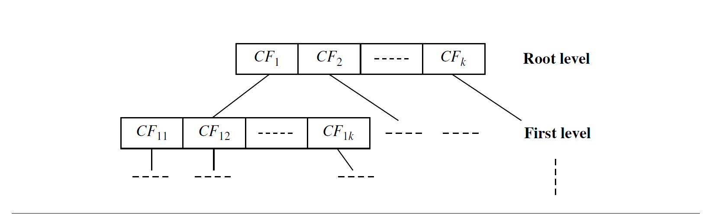
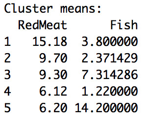
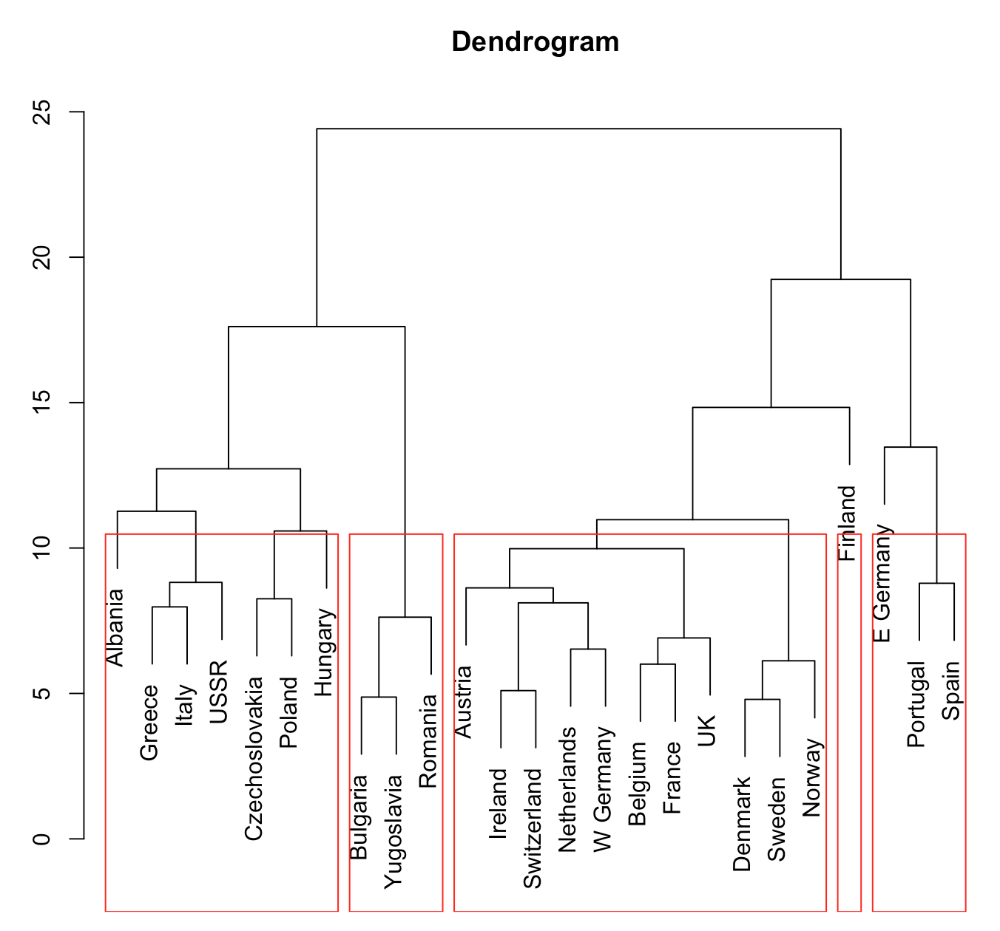
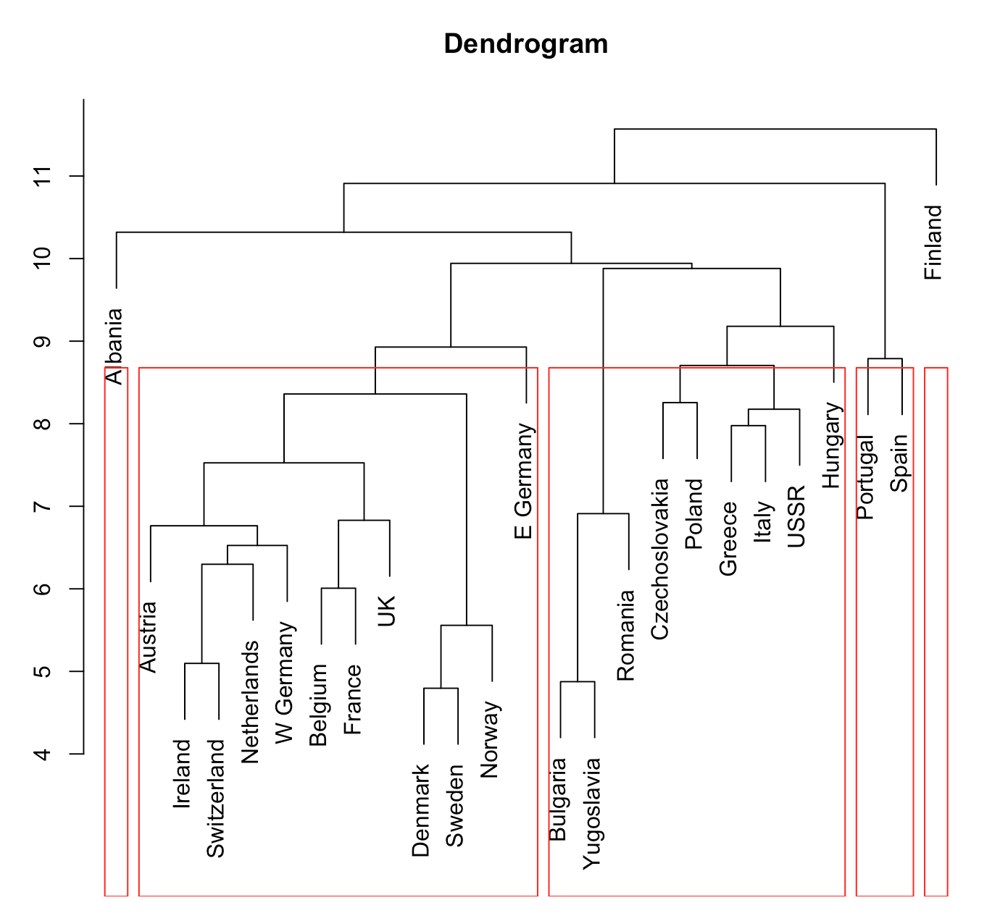
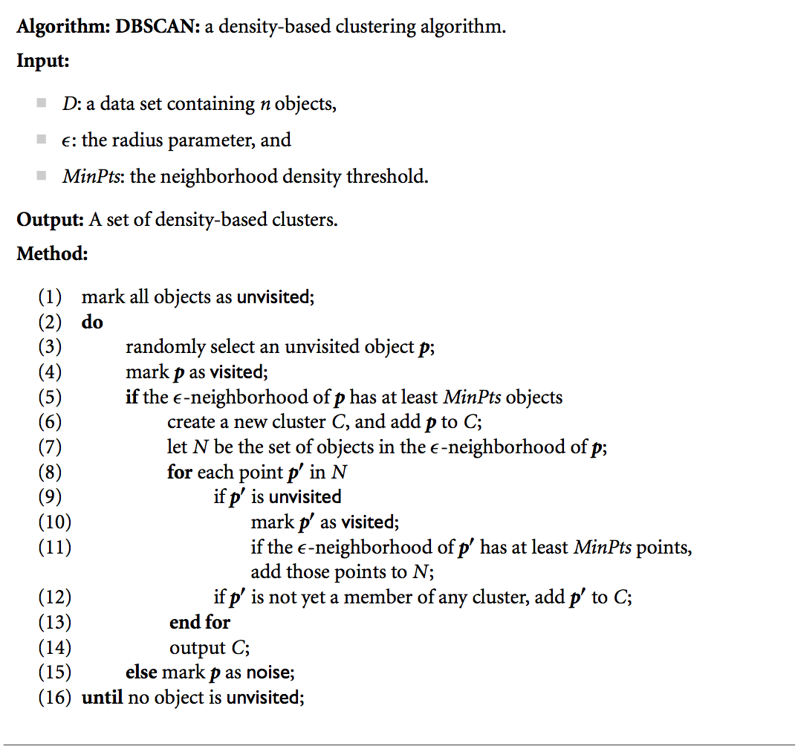
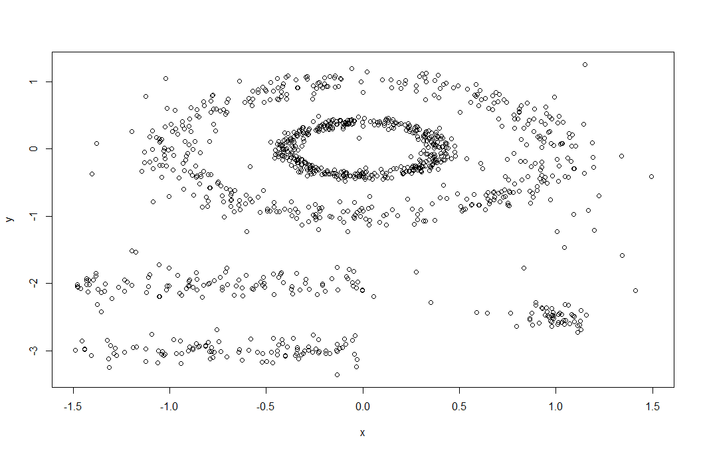
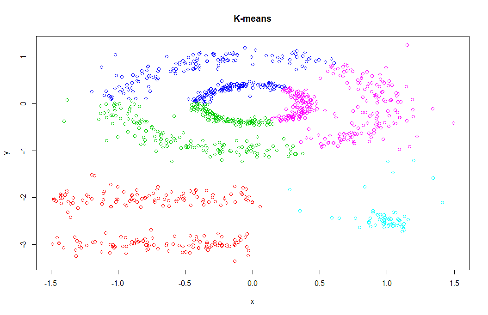
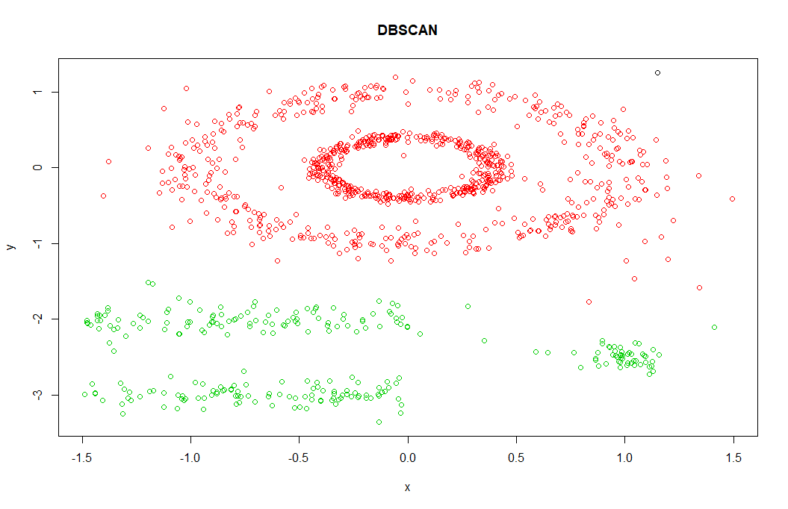
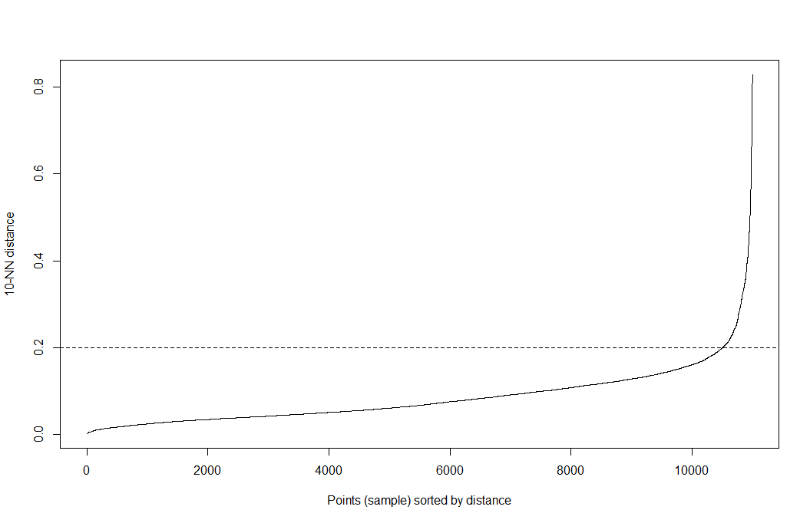
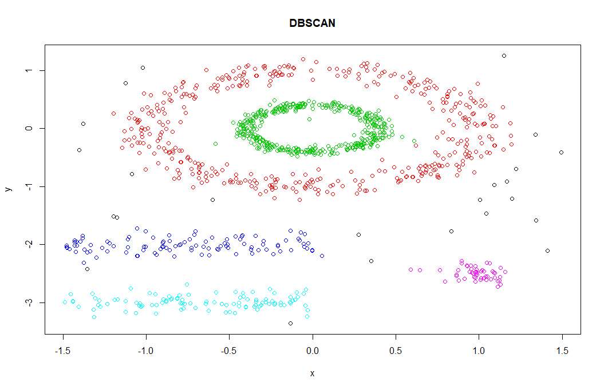

# Week 8 Cluster Analysis

## 1. Introduction (Text: 10.1)

Most of this material is derived from the text, Han, Kamber and Pei, Chapter 10, or the corresponding powerpoint slides made available by the publisher.  Where a source other than the text or its slides was used for the material, attribution is given. Unless otherwise stated, images are copyright of the publisher, Elsevier.

We will present the basic concepts and methods of cluster analysis. Clustering is the process of grouping a set of data objects into multiple groups or clusters so that objects within a cluster have high similarity, but are very dissimilar to objects in other clusters.  

## 2. Clustering: Basic Concepts

**What is Cluster Analysis?**

- Cluster: A collection of data objects
  - similar (or related) to one another within the same group
  - dissimilar (or unrelated) to the objects in other groups
- Cluster analysis (or clustering, data segmentation, ...)
  - Finding similarities between data according to the characteristics found in the data and grouping similar data objects into clusters
- **Unsupervised learning:** no predefined classes
- Typical applications
  - As a **stand-alone tool** to get insight into data distribution
  - As a **preprocessing step** for other algorithms

**Clustering as a Preprocessing Tool**

- Summarization
  - Preprocessing for regression, PCA, classification, and association analysis
- Compression
  - image processing: vector quantisation
- Finding K-nearest neighbours
  - localising search to one or a small number of clusters
- Outlier detection
  - outliers are often viewed as those "far away" from any cluster

**Clustering for Data Understanding and Applications**

- Biology: taxonomy of living things: kingdom, phylum, class, order, family, genus and species
- Information retrieval: document clustering
- Land use: Identification of areas of similar land use in an earth observation database
- Marketing: Help marketers discover distinct groups in their customer bases, and then use this knowledge to develop targeted marketing programs
- City-planning: Identifying groups of houses according to their house type, value, and geographical location
- Earth-quake studies: Observed earth quake epicenters should be clustered along continent faults
- Climate: understanding earth climate, find patterns of atmospheric and ocean
- Economic Science: market research

### 2.1 Quality of Clustering

**What is Good Clustering?**

- A good clustering method will produce high quality clusters
  - high intra-class similarity: cohesive within clusters
  - low inter-class similarity: distinctive between clusters
- The quality of a clustering method depend on
  - the similarity measure used by the method
  - its implementation, and
  - its ability to discover some or all of the hidden patterns

**Measure the Quality of Clustering**

- Dissimilarity/Similarity metric
  - Similarity is expressed in terms of a **distance function**, typically metric: `d(i,j)`
  - The definitions of distance functions are usually rather different for interval-scaled, boolean, categorical, ordinal ratio, and vector variables
  - Weights should be associated with different variables based on applications and data semantics
- Quality of clustering
  - There is usually a separate "quality" function that measures the "goodness" of a cluster.
  - It is hard to define "similar enough" or "good enough"
    - The answer is typically highly subjective

### 2.2 Considerations

**Algorithmic Considerations**

- Partitioning criteria
  - Single level vs. hierarchical partitioning (often, multi-level hierarchical partitioning is desirable)
- Separation of clusters
  - exclusive (e.g., one customer belongs to only one region) vs. non-exclusive (e.g., one document may belong to more than one class)
- Similarity measure
  - distance-based (e.g., Euclidean, road network, vector) vs. connectivity-based (e.g., density or contiguity)
- Clustering space
  - full space (often when low dimensional) vs. subspaces (often in high-dimensional clustering)

**Requirements and Challenges**

- Scalability
  - Clustering all the data instead of only on samples
- Ability to deal with different types of attributes
  - numerical, binary, categorical, ordinal, linked, and mixture of these
- Constraint-based clustering
  - user may give inputs on contraints
  - use domain knowledge to determine input parameters
- Interpretability and usability
- Others
  - Discovery of clusters with arbitrary shape
  - Ability to deal with noisy data
  - Incremental clustering and insensitivity to input order
  - High dimensionality

### 2.3 Major Approaches

Based on different approaches we can categorise known clustering algorithms into:

- Partitioning approach:

  - Construct various partitions and then evaluate them by some criterion, e.g., minimising the sum of square errors
  - Typical methods: k-means, k-medoids, CLARANS

- Hierarchical approach:

  - Create a hierarchical decomposition of the set of data (or objects) using some criterion
  - Typical methods: Diana, Agnes, BIRCH, CAMELEON

- Density-based approach:

  - Based on connectivity and density functions
  - Typical methods: DBSCAN (Density-based spatial clustering of applications with noise), OPTICS, DenClue

- Grid-based approach:

- - based on a multiple-level granularity structure
  - Typical methods: STING, WaveCluster, CLIQUE

- Model-based:

  - A model is hypothesised for each of the clusters and tries to find the best fit of that model to each other
  - Typical methods: EM, SOM, COBWEB

- Frequent pattern-based:

  - Based on the analysis of frequent patterns
  - Typical methods: p-Cluster

- User-guided or constraint-based:

  - Clustering by considering user-specified or application-specific constraints
  - Typical methods: COD (obstacles), constrained clustering

- Link-based clustering:

- - Objects are often linked together in various ways
  - Massive links can be used to cluster objects: SimRank, LinkClus

We will discuss some of major approaches in detail in the following.

## 3. Partitioning Methods (K-means) (Text: 10.2)

**Partitioning method**

Partitioning a database $D$ of $n$ objects into a set of $k$ clusters. The quality of cluster $C_i$ can be measured by the within-cluster variation, which is the sum of squared distances between all object in $C_i$ and the centroid $c_i$, defined as

$E=\sum^k_{i=1}\sum_{p\in C_i}(p-c_i)^2$

- Given $k$, find a partition of $k$ clusters that optimizes the chosen partitioning criterion
  - Globally optimal: exhaustively enumerate all paritions
  - Heuristic methods: k-means and k-medoids algorithms
  - k-means: Each cluster is represented by the centre of the cluster
  - k-medoids or PAM (Partition around medoids): Each cluster is represented by one of the objects in the cluster.

**K-means**

- Given $k$, the k-means algorithm is implemented in four steps:
  1. Arbitrarily choose a centre of $k$ clusters as the initial cluster centres
  2. Assign each object to the cluster to which the object is the most similar
  3. Update the cluster means, that is, calculate the mean value of the objects for each cluster
  4. Go back to Step 2, stop when the assignment does not change

**Illustration of the K-means algorithm** (from PRML, Bishop)


(a) Green points denote the data set in a two-dim Euclidean space. The initial choices for centres for $C_1$ and $C_2$ are shown by the red and blue crosses, respectively.

(b) Each data point is assigned either to the red cluster or to the blue cluster, according to which cluster centre is nearer. This is equivalent to classifying the points according to which side of the perpendicular bisector of the two cluster centres, shown by the magenta line, they lie on.

(c) In the subsequent step, each cluster centre is re-computed to be the mean of the points assigned to the corresponding cluster.

(d)–(i) show successive steps through to final convergence of the algorithm.

### 3.1 Strength and Weakness

- **Strength**:
  - Computational Efficient: time complexity is $O(tkn)$, where $n$ is the number of objects, $k$ is the number of clusters, and $t$ is the number of iterations. Normally, $k,t\ll n.$
    - Comparing: PAM: $O(k(n-k)^2)$, CLARA: $O(ks^2+k(n-k))$
- **Weakness**:
  - Need to specify $k$, the number of clusters, in advance
  - Applicable only to objects in a continuous n-dim space
    - k-modes variant method for categorical data: replaces the mean value by the *mode* of a nominal attribute.
    - In comparison, k-medoids can be applied to a wide range of data
  - Sensitive to noisy data and outliers
  - Non deterministic algorithm. The final result depends on the first initialization.
  - Often terminates at a local optimum, rather than a global optimum.
  - Not suitable for clusters with non-convex shapes

**Noisy data point example**

Consider six points in 1-D space having the values 1,2,3,8,9,10, and 25, respectively. Intuitively, by visual inspection we may imagine the points partitioned into the clusters {1,2,3} and {8,9,10}, **where point 25 is excluded** because it appears to be an **outlier**. How would k-means partition the values? If we apply k-means using k = 2,

- Case 1: partition values into {{1,2,3},{8,9,10,25}}. Within cluster variation is $(1-2)^2+(2-2)^2+(3-2)^2+(8-13)^2+(9-13)^2+(10-13)^2+(25-13)^2=196$ given that the mean of cluster {1,2,3} is 2 and the mean of {8,9,10,25} is 13.
- Case 2: parition values into {{1,2,3,8},{9,10,25}}. Within-cluster variation is $(1-3.5)^2+(2-3.5)^2+(3-3.5)^2+(8-3.5)^2+(9-14.67)^2+(10-14.67)^2+(25-14.67)^2=189.67$ given that 3.5 is the mean of cluster {1,2,3,8} and 14.67 is the mean of cluster {9,10,25}.

The latter partitioning has the lowest within-cluster variation; therefore, the k-means method assigns the value 8 to a cluster different from that containing 9 and 10 due to the outlier point 25. Moreover, the centre of the second cluster, 14.67, is substantially far from all the members in the cluster. 

### 3.2 K-Methods

> How can we modify the k-means algorithm to diminish sensitivity to outliers?

**K-medoids**

Instead of taking the mean value of the object in a cluster as a reference point, we can pick actual objects to represent the clusters.

The k-medoids method is more robust than k-means in the presence of noise and outliers because a medoid is less influenced by outliers or other extreme values than a mean.

**Partitioning Around Medoids (PAM)**

PAM algorithm is a popular realisation of k-medoids clustering.

Starts from an initial set of medoids and iteratively replaces one of the medoids by one of the non-medoids if it improves the total distance of the resulting clustering.

The quality of clustering can be measured by an absolute-error criterion (total cost):

$E=\sum^k_{i=1}\sum_{p\in C_i}dist(p,o_i)$,

where $E$ is the sum of the absolute error for all objects $p$ in the dataset, and $o_i$ is the representative object of $C_i$.

PAM works effectively for small data sets, but does not scale well for large data sets (due to the computational complexity)

**Algorithm**

1. Arbitrarily choose k objects in D as the initial representative objects
2. Assign each remaining object to the cluster with the nearest representative object
3. Randomly select a non-representative object, $o_{random}$
4. Compute the total cost of swapping representative object, $o_j$ with $o_{random}$
   1. If the swapping reduces the total cost, then swap to form the new set of $k$ representative objects
5. Repeat 2-4 until there is no change.

**Illurstration of k-medoids algorithm**


### 3.3 Exercise

Suppose that the data mining task is to cluster points (with (x,y) representing location) into three clusters, where the points are

$A_1(2,10), A_2(2,5), A_3(8,4), B_1(5,8), B_2(7,5), B_3(6,4),C_1(1,2),C_2(4,9)$.

The distance function is Euclidean distance. Suppose initially we assign $A_1, B_1,$ and $C_1$ as the center of each clusters, respectively. Use the k-means algorithm to show three clusters and their centres after the first round of execution.

**Solution:**

The three cluster centres after the first round of execution.

Answer:

After the first round, the three new clusters are:

(1) {A1}, (2) {B1, A3, B2, B3, C2}, (3) {C1, A2},

and their centres are

(1) (2, 10), (2) (6, 6), (3) (1.5, 3.5).

## 4. Hierarchical Clustering (Text: 10.3)

Hierarchical clustering is a method of cluster analysis which seeks to **build a hierarchy of clusters**. Strategies for hierarchical clustering generally fall into two types:

- **Agglomerative**: This is a "bottom up" approach: each observation starts in its own cluster, and pairs of clusters are merged as one moves up the hierarchy.
- **Divisive**: This is a "top down" approach: all observations start in one cluster, and splits are performed recursively as one moves down the hierarchy.

In general, the merges and splits are determined in a greedy manner. The results of hierarchical clustering are usually presented in a dendrogram. (from wikipedia.org)

Here is an example of the agglomerative and divisive hierarchical clustering approaches on data objects *{a,b,c,d,e}*.


Initially, the agglomerative method places each object into a cluster of its own. The clusters are then merged step-by-step according to some criterion. Merging process is repeated until all the objects are eventually merged to one cluster.

The divisive method proceeds in a contrasting way. All the objects are used to form one initial cluster. The cluster is split according to some principle. The splitting process repeats until each new cluster contains only a single object.

AGNES (AGglomerative NESting)

- Uses the single-link method (other method can also be applied, see section 4.1) and dissimilarity matrix
- Merges nodes that have the least dissimilarity
- Go on until all nodes are in the same cluster

DIANA (DIvisive ANAlysis)

- Inverse order of AGNES
- At the end each data object forms its own cluster

### 4.1 Distance between Clusters

Whether using an agglomerative method or a divisive method, a core need is to measure the distance between two clusters, where each cluster is generally a set of objects.

- **Single link (minimum distance, nearest-neighbour clustering)**: smallest distance between an element in one cluster and an element in the other
  - i.e. $dist(C_i,C_j)=\min_{p\in C_i, q\in C_j}(|p-q|)$
- **Complete link (maximum distance)**: largest distance between an element in one cluster and an element in the other
  - i.e. $dist(C_i,C_j)=\max_{p\in C_i, q\in C_j}(|p-q|)$
- **Average (average distance)**: average distance between an element in one cluster and an element in the other
  - i.e. $dist(C_i, C_j)=\frac1{|C_i||C_j|}\sum_{p\in C_i, q\in C_j}(|p-q|)$
- **Centroid**: distance between the centroids of two clusters
  - i.e. $dist(C_i,C_j)=(|c_i-c_j|)$
- **Medoid**: distance between the medoids of two clusters
  - i.e. $dist(C_i,C_j)=(|o_i-o_j|)$

### 4.2 Dendrogram

**Dendrogram**

A tree structured diagram, called dendrogram, is commonly used to represent the process of hierarchical clustering. It shows how objects are grouped together (in an agglomerative method) or partitioned (in a divisive method) step-by-step.

A clustering of the data objects is obtained by cutting the dendrogram at the desired level, then each connected component forms a cluster.

Here's an example of dendrogram on data objects *{a,b,c,d,e}*


For example, by setting the similarity threshold to 0.5, one can obtain 3 clusters (a,b), (c), (d,e) from the dendrogram.

### 4.3 BIRCH

**BIRCH (Balanced Iterative Reducing and Clustering using Hierarchies)**

- Designed for clustering a large amount of numeric data
- Integrating hierarchical clustering and other clustering methods
- Uses **cluster feature**(CF) and **clustering feature tree**(CF-tree) for clustering

**Clustering feature (CF):** used to summarize a cluster, 3D-vector

- $CF=<n,LS,SS>$
- $n=$ a number of points in the cluster
- $LS=$ a linear sum of points in that cluster $(\sum^n_{i=1}x_i)$ where $x_i$ is $i$th point in the cluster
- $SS=$ a square sum of points in that cluster $(\sum^n_{i=1}x_i^2).$

CF can be used to derive useful statistics for the given cluster.

- cluster centroid: $x_0=\frac{LS}n,$
- average distance from the centroid: $R=\sqrt{\frac{n\cdot SS-2LS^2+n\cdot LS}{n^2}},$
- average pairwise distance: $D=\sqrt{\frac{2n\cdot SS-2LS^2}{n(n-1)}}$

CF is additive if two clusters are merged, then the CF of the merged cluster is

- $CF_{merged}=CF_1+CF_2=<n_1+n_2,LS_1+LS_2, SS_1+SS_2>$

**Clustering feature tree (CF-tree):** height-balanced tree

- store clustering features for a hierarchical clustering.

- Nonleaf nodes in a tree: store sums of the CFs of their children

- Two parameters of the tree

  - Branching factor: specifies the maximum number of children per nonleaf node
  - Threshold: maximum diameter of subclusters stored at the leaf nodes

- **Two phase of BIRCH**

- - Phase 1: Scan the database to build initial CF-tree
    - The tree is built dynamically as objects are inserted.
    - A new data point is inserted into the closest leaf node. If the diameter of the inserted node is larger than threshold, the leaf node is split.
  - Phase 2: Apply a clustering algorithm to cluster the leaf nodes of the CF-tree

**Illustration of CF-tree:**


## 5. Practical Exercises: K-means and Hierarchical Clustering

**Objectives**

The objectives of this lab are to experiment with the **clustering** package available in **R** and **Rattle**, in order to better understand k-means and hierarchical clustering algorithms.

**Preliminaries**

For this exercise, we will mainly use "protein.csv" data set which contains 25 European countries and their protein intakes from nine major food sources. Click the following link to download the dataset:

European Protein Consumption dataset

We will use clustering library in R. To install the library type:

- `install.packages("cluster")`

You can get help on packages used in this lab by typing the following three commands into the **R** console. Specifically for the k-means algorithm, type:


- `help(kmeans)`

And for Hierarchical clustering (AGNES) type:

- `library(cluster)`
- `help(agnes)`

**Tasks**

1. For this exercise, we need to load the data set first. Change the current working directory to the directory which contains "protein.csv" file. For example: `setwd("/user/xxx/download/")` will change the current working directory to "/user/xxx/download/"

2. To load csv file from the folder, type command:

   `protein_df <- read.csv("protein.csv")`

3. To check the details of the dataset, type

   `head(protein_df)`

   How many attributes are in the data set? An attribute value indicates a relative amount of protein source (as a percentage of all protein sources).

   **Solution:**

   \> 1)RedMeat 2)WhiteMeat 3)Eggs 4)Milk 5)Fish 6)Cereals 7)Starch 8)Nuts 9)Fr.Veg

   \> Except country name, the data contains 9 attributes.

4. Cluster countries with given protein sources. First we apply k-means clustering using "RedMeat" and "Fish" attributes. 

   ```R
   set.seed(123456789) ## to fix the random starting clusters
   grpMeat <- kmeans(protein_df[,c("RedMeat","Fish")], centers=5, nstart=10)
   ```

   where `centers` argument indicates the pre-specified number of clusters. Type:
   `grpMeat`
   to check the output of the clustering. What are the cluster means? Which cluster consumes the red meat most? Which cluster consumes the fish most?

   **Solution:**

   

   Which cluster consumes the red meat most? Cluster 1

   Which cluster consumes the fish most? Cluster 5

5. To see the actual assignment for each country, type:

   ```R
   o=order(grpMeat$cluster)
   data.frame(protein_df$Country[o],grpMeat$cluster[o])
   ```

6. The following commands will plot the clustering result on two-dimensional(red-meat, fish) space.

   ```R
   plot(protein_df$Red, protein_df$Fish, type="p", xlim=c(3,19), ylim=c(0,15), xlab="Red Meat", ylab="Fish", col=grpMeat$cluster+1)
   text(x=protein_df$Red, y=protein_df$Fish-.6, labels=protein_df$Country, col=grpMeat$cluster+1)
   ```

   Can you find a relationship between geographical locations of countries and clustering assignments? Cross check the result with the clustering means. Is there any geographical relation between cluster means and assigned countries?

   **Solution:**

   > Countries in close geographic proximity tend to be clustered into the same group.

   Except a few cases, countries near the ocean consumes a relatively large mount of fish and clustered together (cluster 3 and cluster 5). 

   Cluster 4 consists of eastern Europe countries whose fish and red meat consumption are relatively less than the other countries.

7. Cluster countries using all attributes. Let the number of clusters be 5.

   ```R
   set.seed(123456789)
   grpProtein <- kmeans(protein_df[,-1], centers=5, nstart=10)
   o=order(grpProtein$cluster)
   data.frame(protein_df$Country[o],grpProtein$cluster[o])
   ```

   Did you find any difference in clustering?

   **Solution:**

   The clustering results are different. For example, Portugal does not represent a single cluster any more.

8. Alternatively, we can apply a hierarchical clustering approach.  Use the AGNES algorithm for clustering. For AGNES clustering, type:

   ```R
   library(cluster)
   agg<-agnes(protein_df[,-1], diss=FALSE, metric="euclidian", method="average")
   ```

   `method` determines the distance metric between clusters, and `metric` determines the basic distance measure between data points.

9. Plot dendrogram using command (enter twice)

   `plot(agg, main='Dendrogram', labels=protein_df$Country)`
   To extract 5 clusters from the dendrogram, type:
   `rect.hclust(agg, k=5, border="red")`
   Again, do you think countries in close geographic proximity tend to be clustered into the same group?

   **Solution:**

   In general, yes.

10. Use *single link (minimum distance)* hierarchical clustering.

    `agg<-agnes(protein_df[,-1], diss=FALSE, metric="euclidian", method="single")`

    Plot the result and extract 5 clusters from the tree:

    ```R
    plot(agg, main='Dendrogram', labels=protein_df$Country)
    rect.hclust(agg, k=5, border="red")
    ```

    Which countries comprise the smallest cluster? What does the smallest cluster mean?

    **Solution:**

    > Albania and Finland. Single link approach agglomerate clusters based on the smallest distance between clusters. Therefore, the clustering results indicate that the protein consumption patterns of Albania and Finland are quite different from the other countries (in terms of Euclidean distance).

    

The original data set is from: http://www.rpubs.com/gabrielmartos/ClusterAnalysis

## 6. Density-Based Methods (Text: 10.4)

Model clusters as dense regions in the data space, separated by sparse regions

- Major features:
  - Discover clusters of arbitrary shape
    - Partitioning and hierarchical methods are designed to find spherical-shaped clusters
  - Handle noise
  - One scan
  - Need density parameters as termination condition

**DBSCAN (Density-Based Spatial Clustering of Applications with Noise**

- Density of an object $o$: the number of objects close to $o$
- Core objects: Objects that have dense neighbourhood
- DBSCAN: connects core objects and their neighbourhoods to form dense regions as cluster
- Two parameters:
  - $\epsilon:$ Maximum radius of the neighbourhood
  - _MinPts:_ Minimum number of points in an $\epsilon-$neighbourhood of that point
- $N_\epsilon(p):{q\in D|dist(p,q)\leq \epsilon}$
  - number of neighbourhood objects including $p$
  - if $N_\epsilon(p) > MinPts,$ then $p$ is core object.
  - $D$ is a data set
- **Directly density-reachable**: A point $p$ is directly density-reachable from a **core** point $q$ if $p$ is within the $\epsilon-$neighbourhood of $q$
  - By definition, no points are directly reachable from a non-core point.
- **Density-reachable**: $p$ is density-reachable from a **core** point $q$ if
  - there is a chain of objects $p_1,p_2,\dots,p_n$ s.t. $p_1=q,p_n=p$ and $p_{i+1}$is directly _density-reachable_ from $p_i$ with respect to $\epsilon$ and _MinPts._
- **Density-connected**: Two objects $p_1,p_2$ are density-connected if
  - there is an object $q$ such that both $p_1$ and $p_2$ are _density-reachable_ from $q$ with respect to $\epsilon$ and _MinPts_

**Definition of Cluster in DBSCAN**

A subset $C\sube D$ is a cluster if

- All points within the cluster are **mutually density-connected.**
- If a point is **density-reachable** from any point of the cluster, it is part of the cluster as well.

**Example of density-reachable and density-connected**

.png)

Let $\epsilon$ be the radius of the circles and _MinPts_ 3.

- $m,p,o,r$ are core objects.
- Object $q$ is directly density-reachable form $m$.
- Object $m$ is directly density-reachable from $p$ and vice versa.
- Object $q$ is density-reachable from $p$ because $q$ is directly density reachable from $m$ and $m$ is directly density-reachable from $p$. However, $p$ is not density reachable from $q$ because $q$ is not a core object.
- $r$ and $s$ are density-reachable from $o$
- $o$ is density-reachable from $r$.
- $o,r,$ and $s$ are all density-connected.

**DBSCAN algorithm**



### 6.1 Practical Exercises: DBSCAN and K-means

**Objectives**

The objectives of this exercise are to experiment with the **clustering** package available in **R,** in order to better understand the difference between kmeans and DBSCAN algorithm.

**Preliminaries**

For this exercise, we will mainly use a synthetic dataset from `factoextra` package. To get the data set, install library:

- `install.packages("factoextra")`

We will use dbscan library in R. To install the library.

- `install.packages("dbscan")`

You can get help on packages used in this exercise by typing the following three commands into the **R** console. Specifically for the dbscan algorithm, type:


- `help(dbscan)`
- `help(kNNdistplot)`
- `help(kNNdist)`

**Tasks**

1. To get a synthetic data set from factoextra package, load the package and load multishape data:

   ```R
   library(factoextra)
   data("multishapes")
   multishapes <- multishapes[,1:2]
   ```

   We will use the first two dimension of `multishapes` data.

2. Let's check how the data set looks like. Type:

   ```R
   plot(multishapes)
   ```

   What does the data set look like? Think about optimal clustering of the data.

   **Solution:**

   

   The multishape dataset might be represented by 5 clusters including:

   2 oval cluster patterns
   2 linear cluster patterns
   1 compact cluster pattern

   This interpretation is **subjective**. You may have a different opinion, however, the following answers are based on this interpretation.

3. First, cluster the data using k-means clustering algorithm.

   ```R
   set.seed(123456789)
   km.res <- kmeans(multishapes, 5, nstart = 25)
   ```

4. To visualise the result, type:

   ```r
   plot(multishapes, type="p", col=km.res$cluster+1, main = "K-means")
   ```

   Is this the result what you expect from clustering?

   **Solution:**

   Here's the result from k-means: The oval clusters are divided into three different clusters. Two linear clusters are merged into a single cluster.

   

5. Import `dbscan` library and then cluster the data using dbscan algorithm.

   ```R
   library(dbscan)
   set.seed(123456789)
   db <- dbscan(multishapes, eps = 0.15, minPts = 5)
   ```

   where we set two parameters eps and minPts to 0.15 and 5, respectively. To plot the result, type:

   ```R
   plot(multishapes, main = "DBSCAN", col=db$cluster)
   ```

   What is your opinion about the dbscan clustering? Is it better than k-means?

   **Solution:**

   Here's the result from DBSCAN: oval and linear cluster patterns are well separated into different clusters. Note that black dots are considered as noise by DBSCAN, so they don't have any cluster assignment.

   

6. DBSCAN seems to perform better for this data set and can identify the correct set of clusters compared to k-means algorithms. However, the result of DBSCAN is very sensitive to the two parameter values, *eps* and*minPts*. Try DBSCAN with *eps*=0.5 and *minPts*=5. What does the result look like?

   **Solution:**

   DBSCAN with different parameters (eps=0.5): two oval clusters are merged. two linear and one single cluster are merged into a single cluster.

   

7. It is really important to configure proper values of two parameters,*eps(ilon)* and *minPts.* In our case, the data set can be plotted on two-dimensional space, so it would be relatively easy to find proper values of parameters. In general, given n-dimensional data, it would not be easy to figure out proper parameter values. Here, we introduce a simple technique that can be applied to find a plausible *eps* given *minPts*.
   Type:

   ```R
   kNNdistplot(multishapes, k =  5)
   ```

   This will plot the distribution of distances to the 5-nearest neighbours. A typical choice of epsilon corresponds to a threshold where a sharp change occurs along the distance curve.

   For example, the above command will plot

   

   We can find a sharp increase of distance around 0.15 which could be a proper choice of epsilon. The number of nearest neighbors corresponds to*minPts* (in this case *minPts*=5).

8. Let's plot a distance distribution of 10-nearest neighbors. Type:

   ```R
   kNNdistplot(multishapes, k =  10)
   ```

   What would be a proper choice of *eps*(ilon) from the distribution plot? Run DBSCAN using alternative parameters. How does the clustering result look like?

   **Solution:**

   DBSCAN with different parameters (eps=0.5): two oval clusters are merged. two linear and one single cluster are merged into a single cluster.

   Here's the result from DBSCAN with eps=0.2 and minPts=10. The result is quite similar with the case where eps = 0.15 and minPts=5.

   Note that some points, considered as noise before, are incorporated into large clusters since we increased eps from 0.15 to 0.2.

   

## 7. Grid-Based Approach (Text: 10.5)

**Grid-based clustering**

Space driven approach by partitioning the input space into cells.

Multiresolution grid data structure approach is used: quantize the object space into a finite number of cells that forms a grid structure.

Fast processing time which is independent of the number of data objects.

Possible clusters are predefined by the design of the grid and therefore the defined allocation of objects to grid cells; the problem becomes to retrieve the clusters that statisfy a query that includes statistical properties of desirable clusters.

**STING: STatistical INformation Grid**

In STING, the input space is divided in a hierarchical way

- At the first layer, the input space is divided into some rectangular cells.
- Each cell at a high level is partitioned to form a number of cells at the next level.


Hierarchical structure for STING clustering.

- Precomputed statistical parameters:
  - Statistical informations such as count, mean, maximum, and minimum, of each grid cell is precomputed and stored.
  - Statistics of the bottom level cells are directly computed from the data.
  - Statistics of a higher level cell can be computed based on lower-level cells
- Answer spatial data queries using precomputed statistics
  - Top down approach: 
  - Start from a pre-selected layer - typically with a small number of cells
  - Compute the confidence interval reflecting the cell’s relevance to the given query
    - Irrelevant cells are removed
    - Children of remaining cells will be examined
    - Repeat until the bottom layer is reached
  - The regions of relevant cells, which satisfy the query, are returned
  - Query example:
    - Select the maximal regions that have at least 100 houses per unit area and at least 70% of the house prices are above $400K and with total area at least 100 units with 90% confidence

Example of clustering result obtained from a query (Wang et al, 1997)

- Advantage
  - Grid-based computation is query-independent
  - Grid structure facilitates parallel processing and incremental updating
  - Computational efficiency: STING goes through the database once to compute the statistical parameters of the cells
- Disadvantage
  - Sensitive to bottom level granularity
    - If the granularity is very fine, the cost of processing will increase substantially 
    - if the bottom level of the grid structure is too coarse, it may reduce the quality of cluster analysis
  - All the cluster boundaries are either horizontal or vertical, and no diagonal boundary is detected

## 8. Evaluation of Clustering (Text: 10.6)

>  *"How can I evaluate whether the clustering results are good?"*

The major tasks of clustering evaluation include the following:

- Accessing clustering tendency

  - Assess whether a non-random structure exists in the data.
  - Clustering analysis on a data set is meaningful only when there is a non-random structure in the data.

- Determining the number of clusters in a dataset.

  - How many clusters are existing in the dataset?
  - Like k-means, many algorithms require the number of clusters a-priori.

- Measuring clustering quality

- - Quality of the resulting clusters
  - There are various quality measures according to different criteria

### 8.1 Assessing Clustering Tendency

Clustering tendency assessment determines whether a given data set has a non-random structure, which may lead to meaningful clusters. 

- Assess if non-random structure exists in the data by measuring the probability that the data is generated by a uniform data distribution
- Test spatial randomness by statistical test: **Hopkins Statistic**
  - Given a dataset $D$ regarded as a sample of a random variable $o$, determine how far away $o$ is from being uniformly distributed in the data space.
  - Sample $n$ points, $p_1,\dots, p_n$, uniformly from the **range** of $D$. For each $p_i$, find its nearest neighbour in $D: x_i=\min dist(p_i,v)$ where $v\in D$.
    - For example, if $D$ consists of real valued observations whose minimum value is 0.5 and maximum value 6.2, then $p_i$ is a random value sampled uniformly between 0.5 and 6.2
  - Sample $n$ points, $q_1,\dots,q_n$ uniformly from $D(q_i\in D)$. For each $q_i$, find its nearest neighbour $D-q_i: y_i=\min dist(q_i, v)$ where $v\in D, v\not=q_i$
    - Unlike $p_i, q_i$ is one of the existing values in $D$ (i.e. $q_i\in D$).
  - Calculate the Hopkins Statistic:
    - If $D$ is uniformly distributed, $\sum x_i$ and $\sum y_i$ will be close to each other and $H$ is close to 0.5.
    - If $D$ is highly skewed, $H$ is close to $0$.
  - If $D$ is uniformly distributed then it contains no meaningful clusters.

### 8.2 Determine the Number of Clusters

- Empirical method
  - number of clusters $\approx \sqrt{n/2}$ for a dataset of $n$ points
- Elbow method
  - use the turning point in the curve of sum of within cluster variance w.r.t the number of clusters
- CV method
  - Divide a given data set into m parts
  - Use m – 1 parts to obtain a clustering model
  - Use the remaining part to test the quality of the clustering
    - E.g., For each point in the test set, find the closest centroid, and use the sum of squared distance between all points in the test set and the closest centroids to measure how well the model fits the test set
  - For any k > 0, repeat it m times, compare the overall quality measure w.r.t. different k’s, and choose the  number of clusters that  corresponds to the k that fits the data the best

### 8.3 Measure Clustering Quality

- Two methods: extrinsic vs. intrinsic

- **Extrinsic**: supervised, i.e., the **ground truth is available**

  - Compare a clustering against the ground truth using certain clustering quality measure
  - Ex. BCubed precision and recall metrics

- **Intrinsic**: unsupervised, i.e., the **ground truth is unavailable**

- - Evaluate the goodness of a clustering by considering how well the clusters are separated, and how compact the clusters are
  - Ex. Silhouette coefficient

**Extrinsic Methods**

To measure clustering quality, we need to define a score function $Q(C,C_g)$ for a clustering $C$ and a ground truth cluster $C_g$.

Four criteria of a good score function:

- Cluster homogeneity: The more pure the clusters, the better the clustering.
- Cluster completeness: The couterpart of homogeneity.  Any two objects belonging to the same category in the ground truth, should be assigned to the same cluster.
- Rag bag: Rag bag category: objects that cannot be merged with other objects. Putting a heterogeneous object into a pure cluster should be penalised more than putting it into a rag bag.
- Small cluster preservation: Splitting a small category into pieces is more harmful than splitting a large category into pieces.

**BCubed precision and recall** metrics satisfy the all four criteria.

- Let $C(o_i)$ be the cluster number of object $o_i$, $L(o_i)$ be the category of $o_i$ given by the ground truth, and $cor(o_i,o_j)$ be 1 if $L(o_i)=L(o_j)$ and $C(o_i)=C(o_j)$, otherwise 0.

- **BCubed precision:** how many other objects in the same cluster belong to the same category as the object.

  $p=\left(\sum^n_{i=1}\frac{\sum_{o_j:i\not= j, C(o_i)=C(o_j)}cor(o_i,o_j)}{||o_j|i\not=j,C(o_i)=C(o_j)||}\right)\times\frac1n$

- **BCubed recall:** how many objects of the same category are assigned to the same cluster.

  $r=\left(\sum^n_{i=1}\frac{\sum_{o_j:i\not= j, L(o_i)=L(o_j)}cor(o_i,o_j)}{||o_j|i\not=j,L(o_i)=L(o_j)||}\right)\times\frac1n$

**Intrinsic Method**

Two criteria for intrinsic method:

- How well the clusters are separated
- How compact the clusters are

Silhouette coefficient satisfies above two conditions.

Let $C_i$ be the $i$th cluster from a clustering,

- $a(o)=\frac{\sum_{o'\in C_i, o\not=o'}dist(o,o')}{|C_i|-1}$ where $o\in C_i,$
- $b(o)=\min_{C_j:1\leq j\leq k,j\not= i} \left(\frac{\sum_{o'\in C_j}dist(o,o')}{|C_j|}\right)$

$a(o)$ reflects the compactness of the cluster $C_i.$ $b(o)$ reflects the degree to which $o$ is separated from other clusters.

The silhouette coefficient of $o$ is then defined as:

- $s(o)=\frac{b(o)-a(o)}{\max\{a(o),b(o)\}}.$

The value lies between -1 and 1. A negative value means $o$ is closer to the objects in another cluster than to the objects in the same cluster in expectation, and this is normally undesirable.

