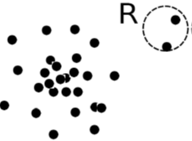
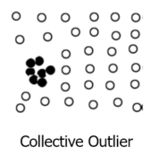
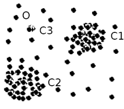
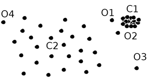
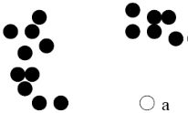
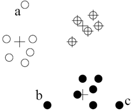
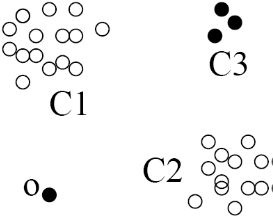
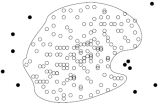
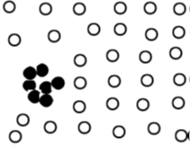

# Week 9 Outlier Detection

## 1. Introduction

Nearly all of this material is derived from the text, Han, Kamber and Pei, Chapter 12, or the corresponding powerpoint slides made available by the publisher.  Where a source other than the text or its slides was used for the material, attribution is given. Unless otherwise stated, images are copyright of the publisher, Elsevier.

In this topic we present methods for seeking for outliers or anomalies in data. Most of these are using methods we have already covered in the course, but applying them in a different way.  As usual, we need to select a method that is appropriate to the data we have, and we need to carefully evaluate our results.  There are practical exercises using R.

[Youtube Video](https://www.youtube.com/watch?v=0GNRpPaGrMk), up to 7:55.

## 2. What are Outliers? (Text 12.1)

**Outlier:**

- A data object that **deviates significantly** from the normal objects as if it were generated by a different mechanism.
- Example Unusual credit card purchase, Sports stars, Tax frauds
- Outliers are different from  noise data: Noise is random error or variance in a measured variable
- Noise should be removed before outlier detection
- Outliers are *interesting*:  They violate the mechanism that generates the normal data
- Outlier detection vs. *novelty* detection: early stage is an outlier; but later could be *novelty* and then merged into the model



**Applications:**

- Credit card frau detection - fraudulent transactions
- Telecom fraud detection - stolen phones
- Customer segmentation
- Medical research
- Students at risk of failing -> novelty detection?
- National security
- Network intrustion detection

**Types: Global, Contextual or Collective**

- A data set may have multiple types of outlier.
- One object may belong to more than one type of outlier.

**Global outlier** (or point anormaly)

- Object $O_g$ if it significantly deviates from the rest of the data set
- e.g. Intrusion detection in computer networks
- Issue: Find an appropriate measurement of deviation

**Contextual outlier** (or *conditional outlier*)

- Object $O_c$ if it deviates significantly based on a selected context
- e.g.  0 celsius degree in Canberra outlier? (depends if it is summer or winter)
- Attributes of data objects should be divided into two groups
  - Contextual attributes: defines the context, e.g., time & location
  - Behavioral attributes:  characteristics of the object, used in outlier evaluation, e.g., temperature
- Can be viewed as a generalization of *local outliers*—whose density significantly deviates from its local area
- Issue: How to define or formulate meaningful context?

**Collective outliers**



- A subset of data objects *collectively* deviate significantly from the whole data set, even if the individual data objects may not be outliers
- Applications: e.g., intrusion detection: When a number of computers keep sending denial-of-service packets to each other.
- Detection of collective outliers
  - Consider not only behaviour of individual objects, but also that of groups of objects
  - Need to have the background knowledge on the relationship among data objects, such as a distance or similarity measure on objects.

**Challenges in Outlier Detection**

- Modeling normal objects and outliers properly
  - Hard to enumerate all possible normal behaviours in an application
  - The border between normal and outlier objects is often a grey area
  - Can assign a data object into class "normal" vs "outlier" , or assign an "outlier-ness" measure
- Application-specific outlier detection
  - Choice of distance measure among objects and the model of relationship among objects are often application-dependent
  - e.g., clinical data: a small deviation could be an outlier; while in marketing analysis, larger fluctuations are expected
  - Applications associate different costs with detecting or missing an outlier.
  - Difficult to develop generic, application independent outlier detection methods
- Handling noise in outlier detection
  - Noise may distort the normal objects and blur the distinction between normal objects and outliers.  It may help outliers to hide and reduce the effectiveness of outlier detection
- Understandability
  - Understand why these are outliers: Justification of the detection
  - Specify the degree of an outlier: the unlikelihood of the object being generated by a normal mechanism

One of the really challenging problems in outlier detection is turning the human perception of "I know one when I see it" into an objective algorithm that knows one when it sees it. Unlike other mining problems, there are very few accepted objective quality measures of outlier-detection. Generally, the best we can do is to assume that an outlier is a good one if it ranks most highly compared to other potential outliers in the same data set, according to the measure we use to define outliers. If, subjectively, we don't like what we see, we try a different method or a different measure.

## 3. Statistical Approaches (Text 12.3)

Statistical methods (also known as model-based methods) assume that the normal data follow some statistical model (a stochastic model). The data not following the model  (i.e. in low probability regions of the model) are deemed to be outliers.


First use *Gaussian*  (also called *normal*) distribution to model the normal data:

- For each object in region $\mathit{R}$, estimate $g_D$, the probability that $y$ fits the Gaussian distribution.
- If $g_D$ is very low, $y$ is unlikely to be generated by the Gaussian model, thus an outlier.

**Effectiveness**

The effectiveness of these statistical methods highly depends on whether the assumption of a statistical model holds in the real data. Analysts may need to understand something about the underlying data-generation process, perhaps a physical process,  to select a suitable statistical model to use. The fit of the data to the model must be validated (and this is ironic because we are setting out to find what does *not* fit). 

There are many alternatives to statistical models available for this method, e.g., parametric vs. non-parametric.

**Parametric methods**

Assumes that the non-outlying data is generated by a parametric distribution with parameter $\theta$, e.g. Gaussian as above.

The probability density function of the parametric distribution $f(x,\theta)$ gives the probability that object $x$ is generated by the distribution. The smaller this value, the more likely $x$ is an outlier.

Some methods based on fitting one or more Gaussian distributions, are covered here.

**Non-parametric methods**

Non-parametric methods do not assume an a-priori statistical model and determine the model from the input data.

They are not completely parameter-free but consider the number and nature of the parameters are flexible and not fixed in advance.

**Histogram non-parametric method**

The parameters to be determined are bin width and bin boundaries. A simple threshold can then be applied to determine outliers as those objects falling in a low-frequency bin. Three problems occur:

- The method is very sensitive to the arbitrary bin boundaries. An outlier can fall outside a low-frequency class due only to the choice of starting point for binning along the x-axis (and vice versa).
- Too small bin size -> normal objects in empty/rare bins, false positive.
- Too big bin size -> outliers in some frequent bins, false negative.

**Kernel Density estimation non-parametric method**

Kernel density estimation fits a _smoothing_ function to estimate a probability density distribution, to achieve something like a smoothed histogram. If the density estimated by the smoothed distribtuion is low in some region, that is, below some threshold, then the objects in the region are considered outliers.

The determination of data points to become outliers is dependent on the parameters to the fitting process (parameters similar to bin size and bin boundaries for histograms), but offers a smoother boundary behaviour than the discrete histogram.

### 3.1 Parametric Methods: Univariate Outliers from a Normal Distribution 

**General approach to determine outliers based on only one variable**

1. Assume data is generated by an underlying *Gaussian/normal* distribution (or choose some other distribution).
2. Set parameters of the distribution from input data, using e.g. maximum likelihood
3. Identify data points of low probability according to the fitted distribution as outliers

Three methods are given here.

**1. Using IQR**

Earlier we identified outliers for visual representation on boxplots defined as values below Q1 − 1.5 IQR or above Q3 + 1.5 IQR. The same method for determination of outliers can be used more generally here.

**2. Using maximum likelihood**

Example:

Consider the following data for temperature in Canberra at noon over 11 days:

{24.0, 28.9, 28.9, 28.9, 29.0, 29.1, 29.1, 29.2, 29.2, 29.3, 29.4}.

1. We will use a _normal_ distribution that is defined by

   $f(x|\mu,\sigma^2)=\frac1{\sqrt{2\pi\sigma^2}}e^{-\frac{(x-\mu)^2}{2\sigma^2}}$

   with parameters mean $\mu$ and variance $\sigma^2$

2. We will set these parameters to fit the distribution to our data by maximizing likelihood.

   _Likelihood_ is defined as

   $p(x_1,\dots, x_N|\mu,\sigma^2)=\prod^N_{n=1}\frac1{\sqrt{2\pi}\sigma}\exp\Bigg\{\frac{-(x_n-\mu)^2}{2\sigma^2}\Bigg\}$

   This can be _maximized_ by taking deriavatives of the log of the likelihood to get estimates for the _maxmimum likelihood mean_ and _maximum likelihood variance_ resepectively:

   $\hat{\mu}=\bar{x}=\frac1n\sum^n_{i=1}x_i$

   $\hat{\sigma^2}=\frac1n\sum^n_{i=1}(x_i-\bar{x})^2$

   Using the temperatures in Canberra with $n=11$, we get $\hat{\mu}=28.636$ and $\hat{\sigma}=\sqrt{2.175}=1.474$

3. Now we can determine outliers as points of low probability by a heuristic such as:

   *An outlier is any value outside 3 estimated standard deviations from the estimated mean.*

   So outliers fall outside $28.64\pm(3\times 1.474)=[24.21, 33.06]$.

   In our temperature data, $24.0$ is the only value that falls outside this range, and therefore $24.0$ is an outlier.

**3. Using Grubb's test**

Grubb's test, also called the _minimum normed residual test_ is an alternative  heuristic to identify  data points of low probability according to the fitted normal distribution as outliers. Strictly, the statistical assurance comes when both the data follows a normal distribution and at most one outlying value exists. In this formulation, we permit the outlying value to be either the minimum or the maximum value in the data, and so we use the two-sided t-test, and both the minimum and maximum should be tested. In practice, all values will be tested (or more practically, all values starting from each end until a non-outlier from each end is found).

Consider a dataset of $N$ data points, with standard deviation $s$.

You need to choose an $\alpha$ to apply this test, and by that determine the significance you want. This is not unlike having to choose the number of standard deviations in the maximizing likelihood method above. A value of $\alpha=0.05$ is a typical.

Define the $z$-score for a data point $x$ as $z(x)=\frac{|x-\bar{x}|}{s}$

Then, according to Grubb's test $x$ is an outlier if

$z(x)\geq \frac{N-1}{\sqrt{N}\sqrt{\frac{t_\alpha^2/(2N),N-2}{N-2+t^2_{\alpha/(2N),N-2}}}}$

where $t_{\alpha/(2N),n-2}$ is the _critical value_ taken by a t-distribution with _degrees of freedom_ $N-2$ at a _significance level_ of $\alpha/(2N)$.

You can look up this critical value in a table such as [http://www.itl.nist.gov/div898/handbook/eda/section3/eda3672.htm](http://www.itl.nist.gov/div898/handbook/eda/section3/eda3672.htm) or [T-distribution table](https://en.wikipedia.org/wiki/Student%27s_t-distribution#Table_of_selected_values) or you can use the Excel `T.INV` function. Use the one-sided formulation of the tables because the two-sidedness is already taken into account by the significance level indicated here.

N.B The text has an error here: it incorrectly squares the value taken by the t-distribution.

**Example**:

Using the Canberra temperature data above, we will test if the minimum value, 24.0, is an outlier by Grubb's test.

Choose $\alpha=0.05$. Then $\alpha/2N=0.00227$ and $z(24.0)=\frac{|24.0-28.636|}{2.175}=\frac{4.636}{2.175}=2.131$. Then look up $t_{0.00227,9}$  using co-ords (0.99773,9) to get 3.250. Here, we approximate by taking the lower value of the nearby columns in the table to be slightly more permissive in assigning data values to be outliers. Now we have that 24.0 is an outlier if 

$2.131\geq \frac{10}{3.317}\sqrt{\frac{3.250^2}{9+3.250^2}}=2.97\times0.540=1.60$. So 24.0 is an outlier.

### 3.2 Parametric Methods: Multivariate Outliers

**Multivariate data** refers to a data set involving two or more attributes or variables (the usual case!).

This is addressed by transforming the multivariate outlier detection task into a univariate outlier detection problem.

**Method 1. Compute Mahalaobis distance**

Let $\bar{o}$ be the mean vector for a multivariate data set. Let $S$ be the covariance matrix.

**Mahalaobis distance** for an object $o$ to $\bar{o}$ is defined as

$MDist(o,\bar{o})=(o-\bar{o})^TS^{-1}(o-\bar{o})$

where $T$ and $-1$ are the operators for  matrix *transpose* and *inverse* respectively.

Using this transformation, we now have a univariate data set $\{MDist(o,\bar{o})|o\in D\}$

Then use the Grubb's test on this univariate data set  to identify  outliers.

**Method 2. Use $\chi^2-$statistics**

$\chi^2=\sum^n_{i=1}\frac{(o_i-E_i)^2}{E_i}$

where $E_i$ is the mean of the $i$-dimension among all objects, and $n$ is the dimensionality.

If $\chi^2-$statistic is large, then objects $o_i$ is an outlier.

### 3.3 Parametric Methods: Mixture of Parametric Distributions

Assuming that data is generated by a normal distribution could often overly simplified.

**Example**

If the data below is modelled  as  a normal distribution along either axis then  objects between the two clusters  C1 and C2 will not be captured as outliers since they are close to the estimated mean of the data.



Instead, we assume data is generated by multiple distribution, for example two as here.  

For any object *o* in the data set, the probability that *o* is generated by the mixture of the two distributions is given by

$Pr(o|\Theta_1,\Theta_2)=f_{\Theta_1}(o)+f_{\Theta_2}(o)$

where $f_{\Theta_1}$ and $f_{\Theta_2}$ are the probability density function of $\theta_1$ and $\theta_2$

Then we can use an _expectation maximization_ algorithm for probabilistic model-based clustering to learn the parameter $\mu_1,\sigma_1,\mu_2,\sigma_2$ from data. Each cluster is then represented by one of the two normal distributions.

And object $o$ is an outlier if it does not belong to any learned cluster, that is, the probability that it was generated by the combination of the two distributions is below some threshold.

We are not covering the expectation maximisation algorithm in the course but it is explained  in the text. You can think of it as a generalisation of the method using  maximum likelihood over a single fitted distribution.

**Weakness**

What happens to those objects in the region of C3 above? Well, if we have  one or two distributions and  *o* in the diagram  is a genuine outlier then the higher local density of  the collection of C3 objects means they are  likely to be interpreted as non-outliers by the normal distribution-fitting.

## 4. Proximity-Based Approaches (Text 12.4)

Based on the idea that objects that are far away from the others are outliers, proximity-based approaches  assume  the proximity of an outlier deviates significantly from that of most of the others in the data set.

There are two types of proximity-based outlier detection methods

- Distance-based outlier detection: An object *o* is an outlier if its neighbourhood does not have enough other points in it


- Density-based outlier detection: An object *o* is an outlier if  the density of objects around it is much lower than that of its neighbours

### 4.1 Distance-Based Outlier Detection: Nested Loop method

For a set $D$ of data points, start with a user-defined parameter $r$ called the **distance threshold** that defines a reasonable neighbourhood for each object. For each object $o$, examine the _number_ of other objects in the $r$-neighbourhood of $o$. If enough of the objects in $D$ are beyond the $r$-neighbourhood of $o$, then $o$ should be considered an outlier.

Formally, let $\pi (0<\pi<1)$ be a **fraction threshold**, a user-defined parameter that defines what proportion of objects in $D$ are expected to be within the $r$-neighbourhood of every non-outlying object.

Then an object $o$ is a distance-based outlier $DB(r,\pi)$ if

$\frac{||\{o'|dist(o,o')\leq r\}||}{||D||}\leq \pi$

that is, if the proportion of objects in $D$ that are close as $r$ is no more than $pi$.

*Equivalently,* one can check the distance between $o$ and its $k-$nearest neighbour $o_k$, where $k$ is defined by

$k=\lceil\pi || D||\rceil$

In this case, $o$ is an outlier if $dist(o, o_k)>r$

**Computation**

The simple nested-loop algorithm below, although theoretically $O(n^2)$, is usually linear in practice because the inner loop terminates early when there are few outliers.

For any object $o_i$, calculate its distance from other objects, and count the number of other objects in the $r-$neighbourhood.

If $\pi\cdot n$ other objects are within $r$ distance, terminate the inner loop. Otherwise, $o_i$ is a $DB(r,\pi)$ outlier.


**Example: Distance-Based Outlier with Nested Loop**

We define outliers as those points with a $\pi$ or less proportion of the data that is within (or equal to) radius $r$ distance. That is, for an outlier, too little of the data is close enough. Another way of seeing it is that the $k-$th nearest neighbour is too far away (distance greater than $r$), where $k$ is the number of data points of the data set corresponding to the proportion $\pi$.

Consider the one-dimensional dataset $D=\{1,2,10\}$. Use $r=1,\pi=\frac13$. Use simple arithmetical substraction of values for distance.

_**Nested loop algorithm**_

*NB: slight abuse of notation here:  $i$ is used here for the value of the data point, not for the position in the dataset as in the algorithm.* 

Outer for loop

- For $i=1$: $dist(1,2)=1$ that is $\leq r$ so $count=1$. Now $count\geq \pi$. $n=\frac13\times 3$. So exit because $i=1$ cannot be an outlier.
- For $i=2: dist(2,1)=1$ that is $\leq r$ so $count=1$. So exit because $i=2$ cannot be an outlier.
- For $i=10: dist(10,1)=9$ that is not $\leq r$. $dist(10,2)=8$ which is not $\leq r$. Finished the loop over $j$. print (10) because $10$ **is an outlier**.

endfor.

**_kth-NN method_**

$k=\lceil(\pi||D||)\rceil=1.$

- For data value $1$: 1-th NN = 2 and dist(1,2)=1 which is not greater than $r$ so 1 is not an outlier.
- For data value $2$: 1-th NN = 1 and dist(2,1)=1 which is not greater than $r$ so 2 is not an outlier.
- For data value $10:$ 1-th NN =2 and dist(10,2)=8 which is greater than $r$, **so 10 is an outlier.**

### 4.2 Density-based Outlier Detection

Density-based outlier detection aims to detect **local outliers**, that is data points that are outliers compared to their local neighbourhoods, as well as **global outliers** that differ from the global data distrbituion.



In the diagram, C1 is a dense cluster and C2 is sparse. o1 and o2 are local outliers to C1, o3 is a global outlier that can be detected by a distance-based method.   Proximity-based clustering cannot find that o1 and o2 are outliers (as they are closer to objects in C1 than the average distance apart of the objects in C2.  o4 is not an outlier because the density of objects nearby is also low.

For local outlier detection we want to capture the idea that  the density of objects near an outlier is significantly lower than the density of objects near its neighbouring objects.

**Method:**

Use the relative density of an object against its neighbours as the indicator of the degree of the object being outliers.

First we identify the distance from each object that defines a neighbourhood, by choosing a user-defined $k$ and calculating the distance to the object's $k-$th nearest neighbour.

Define **$k$-distance** of an object $o$

$dist_k(o)=dist(o,p)$ where $p\in D$ is an object such that

- There are at least $k$ objects $o'\in D-\{o\}$ such that $dist(o,o')\leq dist(o,p)$ and 
- There are at most $k-1$ objects $o''\in D-\{o\}$ such that $dist(o,o'')<dist(o,p)$

That is, $dist_k(o)$ is the distance between $o$ and its $k$-th nearest neighbour (which is $p$ in the definition above).

Now, the **$k$-distance neighbourhood** of $o$ is the set of objects that are closer than (or as close as) the $k$-distance of $o$. That is

$N_k(o)=\{o'|o'\in D, dist(o,o')\leq dist_k(o\}$

While $N_k(o)$ is usually of size $k$, it could hold more than $k$ objects since multiple objects may be same distance from $o$.

Now we have a set of objects that are in the neighbourhood of $o$, but we need to translate that to a notion of density around $o$. For this, we start with asymmetric **reachability distance** amongst pairs of objects, from $o$ to $o'$:

$reachdist(o'\leftarrow o)=\max(dist_k(o'), dist(o',o))$

**Density**

So the density function for an object becomes the **local reachability density,** defined as

$lrd_k(o)=\frac{||N_k(o)||}{\sum_{o'\in N_k(o)}reachdist(o'\leftarrow o)}$

See how this is the number of objects in the k-distance neighbourhood  of *o* per  unit of space. That space is  the sum of the reachability distances from *o* to each of those objects. Let one of those objects be *o'*. The reachability distance here will often be  simply the distance from the object *o'* to *o.* However, where it is higher, the k-distance neigbourhood of that other object *o'* will be used instead of the simple distance between the two. Such an object *o'* falls *inside* the k-distance neighbourhood of *o*, but *o* occurs outside its k-distance neighbourhood. The effect of using the k-distance neigbourhood of *o'* here, then, is to increase the density around *o* to account for  close objects like *o'* that are themselves more densely-packed.

**Local outlier factor**

Now we compare the density of an object $o$ to the density of its neighbours. The **local outlier factor** $LOF_k(o)$ is defined as

$LOF_k(o)=\frac{\sum_{o'\in N_k(o)}\frac{lrd_k(o')}{lrd_k(o)}}{||N_k(o)||}=\sum_{o'\in N_k(0)}lrd_k(o')\cdot \sum_{o'\in N_{k}(o)}reachdis_k(o'\leftarrow o)$

That is, the local outlier factor is the average of the ratio of the local reachability density of the k-nearest neighbours of *o* to  the the local reachability density of  *o* itself.

**Properties**

The lower the local reachability density of *o*, and the higher the local reachability density of the k-nearest neighbours of  *o*, then the higher  the LOF. This captures the idea that a **high LOF indicates  a local outlier** whose local density is relatively low compared to the local densities of its  nearest neighbours. LOF is close to 1 for an object deep inside a consistent cluster, whether dense or sparse.

A user-defined threshold can be used to select outliers as those with the highest LOF.

**Exercise: Density-based outlier detection using LOF**

Detect outliers in the following dataset by computing the local outlier factor for each object. Use  the Manhattan (city-block) measure to calculate distances between objects. Use k =2 for the number of other objects in an object's neighbourhood.

There are 4 2-dim objects in the data set: **a(0,0), b(0,1), c(1,1), d(3,0)**

1. Compute the distance between every pair of objects.

   dist(a, b) = 1
   dist(a, c) = 2
   dist(a, d) = 3 
   dist(b, c) = 1
   dist(b, d) = 3+1=4
   dist(c, d) = 2+1=3

2. Compute $dist_k(o)$, the $k$-distance for each object.

   c is the 2nd nearest neighbour of  a. dist2(a)= dist(a, c) = 2    
   a is the 2nd nearest neighbour of  b . dist2(b)= dist(b, a) = 1    
   a is the 2nd nearest neighbour of c.  dist2(c)= dist(c, a) = 2    
   a or c is the 2nd nearest neighbour of d.  dist2(d)= dist(d, a) =3    

3. Compute the k-distance neighbourhood for each object, $N_k(o)=\{o'|o'\in D, dist(o,o')\leq dist_k(o)\}$

   N2(a) =  {b, c}
   N2(b) =  {a, c}
   N2(c) =  {b, a}
   N2(d) =  {a, c}

4. Calculate the local reachability density for each object $lrd_k(o)$

   Starting with object a:
   || N2(a) || = || {b, c} || = 2
   lrdk(a) =||N2(a)|| / (reachdist2(b←a)+reachdist2(c←a))
   reachdist2(b←a)=max{dist2(b),dist(b,a)}= max{1,1} = 1
   reachdist2(c←a)=max{dist2(c),dist(c,a)}= max{2,2} = 2
   Therefore, lrd2(a) =||N2(a)||/(reachdist2(b←a)+reachdist2(c←a)=2/(1+2)) = 0.667

   Similarly,
   lrd2(b) =||N2(b)||/(reachdist2(a←b)+reachdist2(c←b)=2/(2+2)) = 0.5
   lrd2(c) =  ||N2(c)||/(reachdist2(b←c)+reachdist2(a←c)=2/(1+2)) = 0.667
   lrd2(d) =  ||N2(b)||/(reachdist2(a←d)+reachdist2(c←d)=2/(3+3)) = 0.33

5. Calculate the local outlier factor for each object $LOF_k(o)$

   LOF2(a) = (lrd2(b) + lrd2(c)) * (reachdist2(b←a)+ reachdist2(c←a)) = (0.5+0.667) * (1+2) = 3.501
   LOF2(b) = (lrd2(a) + lrd2(c)) * (reachdist2(a←b)+ reachdist2(c←b)) = (0.667+0.667) * (2+2) = 5.336
   LOF2(c) = (lrd2(b) + lrd2(a)) * (reachdist2(b←c)+ reachdist2(a←c)) = (0.5+0.667) * (1+2) = 3.501
   LOF2(d) = (lrd2(a) + lrd2(c)) * (reachdist2(a←d)+ reachdist2(c←d)) = (0.667+0.667) * (3+3) = 8.004

6. Which object is the most outlying by $LOF_k(o)$?

   Sort all the  LOFk(o). The sorted order is:
   LOF2(d) = 8.004
   LOF2(b) = 5.336
   LOF2(a) = 3.501
   LOF2(c) = 3.501

   So  the top outlier is object d.

## 5. Clustering Based Approaches (Text 12.5)

Clustering-based approaches select outliers by examining the relationship between objects and clusters.  An outlier is an object that belongs to a small and remote cluster, or belongs to no cluster.

**Case 1: Not belonging to any cluster**



Use a density-based clustering method such as DBSCAN and consider the unclustered points (*noise*) to be outlliers.

Example: Identify animals  that are not part of a flock of animals e.g. sheep



Use **k-means clustering**  to partition data points  into clusters.

For each object $o$, assign an outlier score based on its distance from its closest cluster centre (cluster centres) are marked with + in the diagram)

Let $c_o$ be the closest cluster centre to object $o$, let $avdist(c_o)$ be the average distance of all the objects in the cluster from $c_o$.

- If $dist(o,c_o)/avdist(c_o)$ is large then $o$ is considered an outlier
- Alternatively for the case of unseen data $o$,
  - If $dist(o,c_o)>\max(dist(p_i,c_o))$ for all training data $p_i$ with closest cluster centre $c_o$, then $o$ is considered an outlier.

**Example: Clustering Based Approaches**

Let's assume that our dataset consists of following 6 tuples: $x_1=(1,1),x_2=(2,1),x_3=(1,2),x_4=(4,5),x_5=(5,4),x_6=(8,8)$. We ran Euclidean k-means on this dataset and obtained two clusters with the cluster centres:

$c_1=(1.33,1.33), c_2=(5.66,5.66)$

where $x_1,x_2, x_3$ are assigned to cluster 1.

To find outliers, we first compute $dist(x_i,c_j)/avdist(c_j)$ for each tuple.

First, the average distances to each data point in each cluster are:

$avdist(c_1)=\frac13\Bigg\{dist(x_1,c_1)+dist(x_2,c_1)+dist(x_3,c_1)\Bigg\}=\frac13(0.47+0.75+0.75)=0.65$

$avdist(c_2)=\frac13\Bigg\{dist(x_4,c_2)+dist(x_5,c_2)+dist(x_6,c_2)\Bigg\}=\frac13(1.8+1.8+3.3)=2.3$

For each data point $x_i$, $dist(x_i,c_j)/avdist(c_j)$ is

$dist(x_1,c_1)/avdist(c_1)=0.72$

$dist(x_2,c_1)/avdist(c_1)=1.14$

$dist(x_3,c_1)/avdist(c_1)=1.14$

$dist(x_4,c_2)/avdist(c_2)=1.97$

$dist(x_5,c_2)/avdist(c_2)=1.97$

$dist(x_6,c_2)/avdist(c_2)=4.11$

According to the result, $x_6$ is likely to be an outlier in this dataset.

(Note that the distances are rounded after calculation by R, the number in the second decimal place might be different from your calculation.)

Now let's consider the case where we have an unseen data $x_7=(2,2)$. The closest cluster centre of $x_7$ is $c_1$, therefore to assess whether $x_7$ is outlier, we can use the following equation

$dist(x_7,c_1)>\max(dist(x_i,c_1))$

where $x_i$ is a member of $c_1$ (i.e. $x_1,x_2,x_3$).

SInce $dist(x_7,c_1)=0.94$ and $\max(dist(x_i,c_1))=0.75$ so $x_7$ can be considered as an outlier.

Example:  Application to Intrusion detection

- Group TCP connections into a segement per day.
- Find frequent itemsets in each segment
- Frequent itemsets occurring  in most segments are treated as attack-free
- Segments containing frequent itemsets are the   "training data"
- Cluster the training data
- Compare new data points with the clusters mined—Outliers from those clusters are possible attacks

**Case 3: Belonging to a small, distant cluster**



Use, e.g. **FindCBLOF** algorithm as follows:

- Find clusters, and sort them in decreasing size
- To each data point, assign a **cluster-based local outlier factor** (CBLOF):
  - If obj *p* belongs to a large cluster, CBLOF = cluster_size X similarity between *p* and  it's cluster
  - If *p* belongs to a small cluster, CBLOF = cluster size X  similarity between *p* and the closest large cluster
- Data points with low CBLOF are considered outliers

In the diagram above, CBLOF can find that *o* is an outlier, and that all the objects in cluster*C3* are outliers.

**Strength of Clustering Based Approaches**

- Lablelled data not required (unsupervised)
- Works for many data types
- Clusters may be useful data summaries
- Fast checking once clusters are built

**Weaknesses of Clustering Based Approaches**

- Effectiveness dependent on clustering effectiveness
- Typically high computational cost for clustering

## 6. Classification-Based Approaches (Text 12.6)

If we have a labelled training set of outliers and non-outliers, then classification methods can be used.

However, the training set would typically be heavily biased in favour of non-outlying data, so classification has to be sensitive to this asymmetry of classes.



**One-class model: A classifier is built to describe only the normal class**

- Learn the decision boundary of the normal class using classification methods such as SVM e.g. diagram above
- Any samples that do not belong to the normal class (not within the decision boundary) are declared as outliers

Advantage: Can easily detect new outliers that were not close to any outlier objects in the training set

Extension:  Can also have normal  objects may belong to multiple classes -- can be more selective if labels available

**Strengths and Weaknesses of Classification-based approaches**

Strength: human knowledge can be incorporated by  selection of training data

Strength: Outlier detection is fast

Bottleneck: Quality heavily depends on the availability and quality of the training set, but often difficult to obtain representative and high-quality training data

## 7. Contextual and Collective Outliers (Text 12.7)

**A. Contextual Outliers**

An object is a **contextual outlier**  (or *conditional outlier)* if it deviates significantly  with respect to a specific context of the object. The context is defined in the values of  identified**contextual attributes** of the object, such as location, time or demographic. The remaining attributes of the object are called **behavioural attributes.**

**Applications:**

- Detect a credit card holder with expenditure patterns matching millionaires in a context of low income
- Do not detect as an outlier a millionaire with high expenditure, given a context of high income
- Detect people with unusual spending or travelling patterns in a context of demographics and income for  target marketing
- Detect unusual weather  in a context of season and locality

**Method 1: Transform into Conventional Outlier Detection.**

-  Use the context attributes to define groups
-  Detect outliers in the group based on the behavioural attributes alone, using a conventional outlier detection method

**Method 2: Model normal Behaviour wrt Contexts**

Used when it is not so easy to choose a the significant set of contextual attributes from the data you have.

- Using a training data set, build a predictive model for the “normal” behaviour from all the context attributes
- An object is a contextual outlier if its behaviour attribute values significantly deviate from the values predicted by the model

**B. Collective Outliers**

A group of data objects forms  a **collective outlier** if the objects as a whole deviate from the entire data set, even though each individual is not an outlier alone.  They are difficult to find because of the need to take into account the structure of the data set, ie relationships between multiple data objects, e.g. black dots in following diagram



Each of these structures is inherent to its respective type of data

- For temporal data (such as time series and sequences), we explore the structures formed by time, which occur in segments of the time series or subsequences
- For spatial data,  explore local areas
- For graph and network data, we explore subgraphs

Difference from contextual outlier detection: the structures are often not explicitly defined, and have to be discovered as part of the outlier detection process.

**Method 1: Reduce the problem to conventional outlier detection**

- Identify structure units (e.g., subsequence, time series segment, local area, or subgraph)
- Treat each structure unit, representing a group of original data objects, as a single data object
- Extract or transform  features into a conventional attribute type for that structured object
- Use outlier detection on the set of “structured" data  objects  constructed using the extracted features
- A structured object, representing a group of objects in the orginal data, is an outlier if that object deviates significantly from the others in the transformed space.

**Method 2: Direct Modelling of the Expected Behaviour of Structure Units**

Example 

- Detect collective outliers in online social network of customers
- Treat each possible subgraph of the network as a structure unit
- Collective outlier: An outlier subgraph in the social network
  - Small subgraphs that are of very low frequency
  - Large subgraphs that are surprisingly frequent

Example.

- Detect collective outliers in temporal sequences
- Learn a Markov model from the sequences
- A sub-sequence can then be declared as a collective outlier if it significantly deviates from the model.

**Strengths and Weaknesses**

- Collective outlier detection is subtle due to the challenge of exploring the structures in data
- The exploration typically uses heuristics, and thus may be application dependent rather than generally applicable.
- The computational cost is often high due to the sophisticated mining process

## 8. Practical Exercises: Finding Outliers with R

**Objectives**

The objectives of this exercises is to experiment with ways to find outliers in data sets. We will use in **R** as **Rattle** has little support for this.  Do not type the given commands blindly; carefully inspect the results as you go to understand how we are detecting outliers.

**Preliminaries**

For this exercise, we will use the same dataset we used for the clustering exercises previously. We use "protein.csv" data set which contains 25 European countries and their protein intakes from nine major food sources. Click the following link to download the dataset:

European Protein Consumption dataset

If you did not do so for the clustering exercises, you will need to install the clustering library in R. To install the library type:

- `install.packages("cluster")`

You can get help on packages by using the `help()` command into the **R** console. Specifically for the k-means algorithm, type:

- `help(kmeans)`

**Tasks**

1. We need to load the data set first. Change the current working directory to the directory which contains "protein.csv" file. For example:

   `setwd("/user/xxx/download/")`

   will change the current working directory to "/user/xxx/download/"

2. To load csv file from the folder, type command:

   `protein_df <- read.csv("protein.csv")`

3. To check the details of the dataset, type

   `head(protein_df)`

   **How many attributes are there in the data?** An attribute value indicates a relative amount of protein source.

4. Cluster countries with given protein sources. First we apply k-means clustering using "RedMeat" and "Fish" attributes. 

   ```R
   set.seed(123456789) ## to fix the random starting clusters
   grpMeat <- kmeans(protein_df[,c("RedMeat","Fish")], centers=5, nstart=10)
   ```

   where the `centers` argument indicates the pre-specified number of clusters. Type:

   `grpMeat`

   to check the output of the clustering.  **What are the cluster sizes?** You can type `grpMeat$size` if you are having trouble finding it in the oumeaningfully distinguish the  clusters.

5. To see the actual assignment for each country, type:

   ```R
   o <- order(grpMeat$cluster)
   data.frame(protein_df$Country[o],grpMeat$cluster[o])
   ```

6. **Can you see something that looks like an outlier?**

   **Solution:**

   Portugal is in a cluster all of its own, which suggests it is an outlier. Notice how much fish the Portugese eat.

7. Repeat the clustering with only 4 clusters.

   ```R
   set.seed(123456789) ## to fix the random starting clusters
   grpMeat <- kmeans(protein_df[,c("RedMeat","Fish")], centers=4, nstart=10)
   grpMeat
   ```

   **What happened to that outlier?**   Have a look at the members of each cluster as above.  

   **Solution:**

   with `o<-order(grpMeat$cluster)`
   `data.frame(protein_df$Country[o],grpMeat$cluster[o])`.  Portugal seems to have joined the fish-eating nations. It is not so far away from those other fish-eaters to avoid being  pressed into another cluster when it had to be due to the reduction in the number of clusters.

8. Now we will look for outliers more conventionally, based on the 4-means clusters we just built, and following the clustering-based approach *far from its closest cluster*, explained previously.

   This is a simple idea, but a bit tricky to implement in **R** if your skills are poor (*mea culpa*). I am sure many of you can see a cleaner way.

   ```R
   fit<- fitted(grpMeat); fit  ## map relevant cluster number and cluster mean to each data point 

   resid <- protein_df[,c("RedMeat","Fish")] - fit  ; resid  ##  difference in each dimension between
                                                                                                                            each point and its cluster centroid 
   dist<-sqrt(resid[1]^2+resid[2]^2); dist ## compute the Euclidean distance from the relevant cluster centroid
   distclus <-cbind(protein_df[1], dist, grpMeat$cluster); distclus ## put the country, the distances 
                                                                                                          and  the cluster numbers together for convenience 
   avdist <- by(distclus[,2],distclus[,3] , mean); avdist ## like an SQL GROUP BY , to compute average                                                                                                          distance from the centroid for each data point 
   avd<-cbind(t(cbind(t(avdist[1]), t(avdist[2]), t(avdist[3]), t(avdist[4]))), c(1,2,3,4)); avd ##                                                                                            just re-shape the avdist structure ready for the next step.                                                                                                                                     There must be a better way.
   join <- merge(distclus , avd, by.x=3, by.y=2); join ## Like a relational join, on cluster number,                                                                                                 to get the cluster average distances ('V1") lined up                                                                           with the distance for each dat point ("RedMeat").
   ratio <- cbind(join[2], join[3]/join[4], join[1]); ratio ## Here we finally compute, for each data point,                                                                                                               the ratio of its distance to cluster centre to the                                                                   average distance to cluster centre for the cluster                                                              to which it belongs.
   ```

9. The ratio is shown in the "RedMeat" column.  **Have a look at the ratios. Can you see any outliers? What is the most outlying point?** 

   **Solution:**

   Portugal is very high compared to the others.  It certainly looks like an outlier, even though  being clustered with the other  fish eaters, they really do seem to be in a class of their own. Don't forget to use your domain knowledge in this assessment -- I am willing to believe that, with respect to fish and red meat consumption,  Portugal is different.  I think it is fair to say that Portugal is an outlier. The next highest outlier is Greece. 

10. We are going to try out one more method for outlier detection, the density based method using the **local outlier factor** $LOF_k(o)$ here. You will need to install another package:

    `install.packages("DMwR"); library(DMwR); help(lofactor)`

    We will use all the attributes for protein sources this time.

11. `protein_df ##  Reacquaint yourself with the data.`

12. `pr <- protein_df[,2:9]; pr ## remove the country column because it is not numerical`

13. `lof <- lofactor(pr, 5); lof  ## the 5 defines the size of the neighbourhood`

14. `plot(density(lof))  ## look at the density of lofs. Most are pretty similar, suggesting an even spread`

15. Now checkout the greatest lofs, that is those behave most as local outliers.

    ```R
    clof <- cbind(lof, protein_df[1]) ; clof ## Put the countries back in
    o <- order(lof, decreasing=TRUE)[1:5]; o ## pick out the top 5 lofs
    clof[o,] ## and see what countries they are. 
    ```

    **What are the top 5 local outliers by lof?**

    **Solution:**

    ​        lof    Country
    17 1.471816   Portugal
    8  1.276772    Finland
    4  1.252576   Bulgaria
    25 1.235771 Yugoslavia
    19 1.146449      Spain

    Portugal is right up there again.

16. Remember that we used all the features here.

    **Go back and see what the top 5 outliers are by the kmeans method on the full dataset.** **When you know what they are post the top 5 outliers by LOF and the top 5 outliers by K-means on the forum.**

    No solution given - let's see what people get.

17. Reconsider the definition we gave for an outlier. **Did you find any outliers or not?**

    **Solution:**

    We don't know enough about the provenance of the dataset, but it seems unlikely that we have found *noise* as it is a small amount of aggregated data that has presumably been taken from a largish population sample. However, it does *appear*  that one of those countries is truly different from the rest -- it*does* deviate significantly.   But then it is hard to call it as " generated by a different mechanism.",  as say,  you might expect an outlier in network intrusion detection.  Unless the data collection went badly wrong it is still generated by people eating food.  So... it does indeed seem interesting, if not strictly an *outlier.*  If I am forced to answer this question with a yes or no, I am going to go with "yes" it *is* an outlier due to its significant deviation and my expectation that that deivation is meaningful and *useful*. For example it could be useful in studying health outcomes with respect to high fish diets, or in marketing new fish products to a potentially receptive test market.

The original data set is from: http://www.rpubs.com/gabrielmartos/ClusterAnalysis