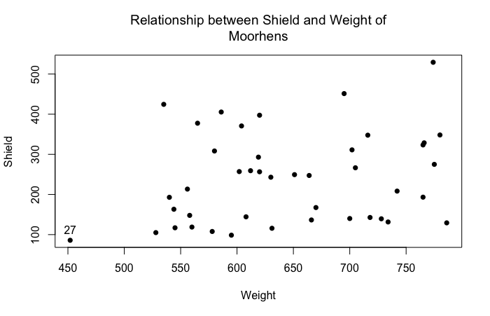

# Question 1

### Executive Summary
In this question, we are interested in the data of 43 observed moorhens. Specifically, we will investigate the relationship between `Weight`(unit in mg) and `Shield`(unit in mm$^2$) as two main variables of moorhens. Our goal is to determine which one of those two variables is more likely to be an indicator of the social status of a moorhen.

```{r prepare, echo=FALSE}
# Prepare Data
moorhen <- read.csv('moorhen.csv', header = TRUE)
# As we only need Weight and Shield in this assignment, we ignore the other variables.
moorhen <- moorhen[,1:2]
attach(moorhen)
```

### (a)
<!-- Plot `Shield` against `Weight` (which means that `Shield` should be the response variable on the Y or vertical axis and `Weight` should be the explanatory variable on the X or horizontal axis.) Use the `identify()` function in R to identify any unusual data points on the plot. Discuss why you chose these observation(s) as being unusual.-->

```{r plot1, echo=FALSE, eval=FALSE}
plot(Weight, Shield, pch=16, main="Relationship between Shield and Weight of Moorhens")

# identify(Weight, Shield)
```

The plot is shown as below. We also use `identify()` command to manually select unusual data point on the left lower corner. The plot indicates such point is labeled with index 27 in our sample.



The reason that we believe the moorhen with data with index 27 is an unusual is that, among all moorhens with similar `Shield` area, its has a lowest `Weight`. But the data points did not show an obvious pattern, so the evidence that it is unusual is not very strong.

### (b)
<!-- Is there a significant correlation between `Weight` and `Shield`? Use the `cor.test()` function to conduct a suitable hypothesis test. Clearly specify the hypotheses you are testing and present and interpret the results.-->

```{r corr, echo=FALSE}
cor.test(Weight, Shield)
```

The hypotheses tested are:

- $H_0: \rho=0$, i.e. there is no corrleation between variable `Weight` and `Shield`.
- $H_A: \rho\not=0$, i.e. there is some correlation. 

Since $t_{95}=1.5793,\ p=0.122>0.05$, so we fail to reject $H_0$, so we cannot say there is a significant correlation between `Shield` and `Weight`.

### (c)
<!-- Experiment with applying natural log transformation (to the base e, which is the default for the `log()` function in R) and square root transformation to one or both of `Weight` and `Shield`, and repeat the analysis in parts (a) and (b). Do NOT show all of your results, just pick whichever one you think is the best choice of scale for the two variables and show and discuss the results for your chosen combination.-->

After generating 8 different combinations of `log()` and `sqrt()` transformations on `Weight` and `Shield`, we pick

```{r modification, eval=FALSE, echo=FALSE}
# loop for different combinations of transformations
sv <- cbind(Shield, log(Shield), sqrt(Shield))
wv <- cbind(Weight, log(Weight), sqrt(Weight))
varNames <- c("", "log", "sqrt")

i = 1; j = 2; count = 0
while (count != 3**2-1) {
        while (j <= 3) {
                plot(wv[,j], sv[,i], pch=16,
                     #xlim=c(0, max(wv[,j])), ylim=c(0,max(sv[,i])),
                     main=paste("Relationship between", varNames[i], "Shield and",
                                varNames[j], "Weight of Moorhens"), 
                     xlab = paste(varNames[j], "Weight"), 
                     ylab = paste(varNames[i], "Shield"))
                print(cor.test(wv[,j], sv[,i]))
                j <- j + 1
                count <- count + 1
        }
        i <- i + 1
        j <- 1
}
```

```{r logVlog, echo=FALSE}
plot(log(Weight), log(Shield), pch=16, 
     main="Relationship between log(Shield) and log(Weight) of Moorhens")
cor.test(log(Weight), log(Shield))
```
According to the results of t test, the case `log(Shield)` vs. `log(Weight)` has the lowest $p$-value, but still slightly above $0.05$ (in fact it's $0.05552$).

Still, for the same reason, we fail to reject null hypothesis. In other words, we can say that there isn't a significant evidence of correlation between `log(Shield)` and `log(Weight)`.

### (d)
<!-- Fit a simple linear regresssion (SLR) model with your chosen transformation of `Shield` as the response variable and your chosen transformation of `Weight` as the predictor. Construct a plot of the residuals against the fitted values, a normal Q-Q plot of the residuals, a bar plot of the leverages for each observation and a bar plot of Cook's distances for each observation. Use these plots to comment on the model assumptions and on any unusal data points. -->

```{r moorhen.lm, echo=FALSE}
(moorhen.lm <- lm(log(Shield) ~ log(Weight)))

# Residuals vs Fitted, Normal Q-Q
par(mfrow=c(2,2))
plot(moorhen.lm, which=1:2)

# Leverage Barplot
barplot(hat(log(Weight)), main="Leverage plot of the hat values", xlab = "Obs. number")
abline(h=2*sum(hat(log(Weight)))/length(log(Shield)))

# Cook's Distances
plot(moorhen.lm, which=4)
# Here we use 4/n as the cut-off value for spotting highly influential points.
abline(h=4/length(log(Shield)))
```

First we should have an impression that residuals, leverages, and Cook's distances are 3 measurements of influential statistics.

- The residual measure "outlierness", the distance between observations and its fitted value.
- The leverage measures how far away the independent variable values of an observation are from those of the other observations, it tells us about its potential to influence the fit.
- The Cook's distance measure influence of each data value on the fit.

Specifically,

- **The residuals vs. fitted plot** indicates the observations with index `4, 26, 40` are outliers. If we ignore these 3 data points, there are almost equally spread residuals around the horizontal line without distinct patterns.
- **The normal Q-Q plot** highlights that `4, 26, 40` again do not fall on the diagonal line. Generally speaking, the whole plot is slightly "S-shaped", which means the distribution is light-tailed comparing with normal distributions. And this contradicts the assumption that all errors are normally distributed.
- **The leverage barplot** shows that the observation `27` is an unusual data points whose leverage is high.
- **The Cook's distances barplot** shows that the observations `4, 27, 40` have high Cook's distances, which means they have great influence on our SLR.

Also different diagnostics outlines different unusual data points. Probably we have to reconsider the our model.

### (e)
<!-- Produce the ANOVA (Analysis of Variance) table for the SLR model in part (d) and intepret the results for the F test. What is the coefficient of determination for this model and how should you intepret this summary measure?-->

```{r anova, echo=FALSE}
anova(moorhen.lm)
```

Here we have hypotheses:

- $H_0: \frac{\sigma_{regression}^2}{\sigma^2_{Error}}=1$.
- $H_A: \frac{\sigma_{regression}^2}{\sigma^2_{Error}}>1$.

According to the results of F test:

$F_{1,95}=3.8843,\ p = 0.05552 > 0.05$, so fail to reject null hypothesis that $\frac{\sigma_{regression}^2}{\sigma^2_{Error}}=1$.

The result is consistent with the t-test we performed previously. In the end, for SLR, t-test and F-test are equivalent tests with:

$$ \text{F-statistics} = 3.884 = 1.9709^2 = \text{t-statistics}^2 $$
The coefficient of determination for this model ($R^2$) is calculated as $\frac{0.8569}{0.8569+9.0447}$:

```{r coe_det, echo=FALSE}
(r2 <- 0.8569/(0.8569+9.0447))
```

The coefficient of determination is $0.08654$, which is the proportion of total variation of outcomes explained by our model. In this case, this proportion is not high at all, so the variation cannot be mainly explained by model. Variation explained by errors also plays an import role in our case, then our model could be problematic.

### (f)
<!-- What are the estimated coefficients of the SLR model in part (d) and the standard errors associated with these coefficients? Intepret the values of these estimated coefficients and perform t-tests to test whether or not these cofficients differ significantly from zero. What do you conclude as a result of these t-tests? -->

```{r summary, echo=FALSE}
summary(moorhen.lm)
```

The estimated coefficients of the SLR model are $\hat{\beta_0} = -1.4844, \hat{\beta_1} = 1.0599$

The standard errors are $se(\beta_0) = 3.4757, se(\beta_1)=0.5378.$

Our model is: `log(Shield)`$=\beta_0 + \beta_1$`log(Weight)`$+\epsilon, \epsilon\overset{iid}\sim N(0, \sigma^2).$

First we do t-test on $\beta_0$:

- $H_0: \beta_0=0,$
- $H_A: \beta_0\not=0.$

$t_{95}=-0.427,\ p = 0.6716 > 0.05.$ Fail to reject $H_0$, we claim that $\beta_0$ (the intercept) is not significantly different from $0$.

Then we do t-test on $\beta_1$:

- $H_0: \beta_1=0,$
- $H_A: \beta_1\not=0.$

$t_{95}=1.971,\ p = 0.0555 > 0.05.$ Again fail to reject $H_0$, and we claim that $\beta_0$ (the coefficient of `Weight`) is not significantly different from $0$.

Therefore, it looks like that the value of variable `log(Shield)` does not have a significant relationship with the variable `log(Weight)`. Our model definitely needs more improvement.

### (g)
<!-- Repeat part (a) and again plot `Shield` against `Weight`, but this time extend both X and Y axes to include the origin. Now include the transformed SLR model from part (d) as a curve on your plot and also include the untransformed SLR of `Shield` against `Weight` as a line on the plot. Use different line types for the two curves and also include an appropriate legend on the plot. What are your overall conclusions about the relationship between `Weight` and `Shield`, and the broader research questions discussed in the second paragraph of this question? -->

For the regression line between `log(Shield)` and `log(Weight)`, if we want to plot it in the original plot, we need to do the following 'backward' transformation.

$$
\begin{split}
\ln(Shield) &= \beta_0 + \beta_1\cdot\ln(Weight)\\
Shield &= e^{\beta_0 + \beta_1\cdot\ln(Weight)}
\end{split}
$$

```{r plot2, echo=FALSE}
plot(Weight, Shield, pch=16,
     xlim = range(-50, max(Weight)+50),
     ylim = range(-50, max(Shield)+50),
     main="Relationship between Shield vs Weight of Moorhens (2nd plot)")
moorhen.lm2 <- lm(Shield ~ Weight)
abline(moorhen.lm2$coefficients, lty=2, col="blue")

beta0 <- as.numeric(moorhen.lm$coefficients[1])
beta1 <- as.numeric(moorhen.lm$coefficients[2])

newXrange <- seq(0, max(Weight)+50, by=2)
lines(newXrange, exp(1)**(beta0+beta1*log(newXrange)), lty=1, col = "red")
legend(-50, 550, c("transformed SLR model", "untransformed SLR model"), 
       lty=1:2, col=c("red","blue"))
```

As we can see from the plot, the two lines standing for two different SLR models basically agree with each other. The untransformed model even looks better, with similar amounts of data points on two sides on the line.

But the problem is, the hypothesis tests' results for corrleation between `log(Weight)` vs `log(Shield)` and corrleation between `Weight` vs `Shield` are not good. In other words, there might be not very significant relationship between the two variables of interest. And back to the plot we have here, the regression lines seem to cut this flock of data points into halves, but there is not any obvious linear trend in these data points.

After all, neither of these two models is good enough to reflect the true relationship between `Weight` and `Shield`. And we can do the following to improve our model:

- We should include more data points (larger sample size) to increase the range of `Weight` (e.g. more data with `Weight` less than 400, to cover the blank space in the plot above).
- A more complex model (or to include more variables from the data set) would be introduced.

# Question 2
### Executive Summary
The dataset `fat` contains estimates of the percentage of adipose tissue (`body.fat`) and other related measurements taken on a sample of 252 adult men. The measurements include a derived variable, `BMI` or body mass index, which is frequently used as a measure of obesity and is based on simple weight and height measurements.

For this assignment, we are interested in whether or not `BMI`, which is relatively easy to measure, can be used to predict the percentage of `body.fat`, which has to be estimated using an underwater weighing technique?

### (a) 
<!-- Plot `body.fat` against `BMI`. Describe the correlation shown in the plot. Would you expect a simple linear regression model to be a reasonable model for the relatinship shown in the plot?-->

```{r, echo=FALSE}
bf <- read.csv('fat.csv')
attach(bf)
plot(BMI, body.fat, main="Relation between body.fat and BMI")
```

Looks like the two variables `body.fat` and `BMI` share a plausible SLR model as the two have a generally linear trend, i.e. when `BMI` increases, `body.fat` increases correspondingly and linearly.


### (b)
<!-- Fit a simple linear regression (SLR) model with `body.fat` as the response variable and `BMI` as the predictor. Construct a plot of the residuals against the fitted values, a Q-Q plot of the residuals and a bar plot of Cook's Distances for each observation. Comment on the model assumptions and on any unusual data points.-->

```{r bodymodel, echo=FALSE}
(bf.lm <- lm(body.fat ~ BMI))
par(mfrow=c(1,3))
plot(bf.lm, which=c(1,2,4))
```

- In residual plot, the amounts of data points above and below the line are basically equal. But the 39th observation is way below the line, which is problematic.
- In normal Q-Q plot, some data points (e.g. 39th observation) don't lie on a diagonal line, which does not support the assumption that all errors are normally distributed.
- In Cook's distance plot, the value of the 39th observation still outnumbers other observations, which means the 39th observation has a great impact on the fitted model.

All three plots above indicate that data with index 39 is unusual, which has a great influence on our model.

### (c)
<!-- A natural log(to the base $e$) transformation (to one or both of the response and predictor variables) is often used to adjust the scale of the variables prior to fitting an SLR model. Now fit another SLR model with `body.fat` as the response variable and `log(BMI)` as the predictor. What would be the problem with also applying a log transformation to the response variable? Check the same plots you produced for the earlier model in part (b). Are the same problems still apparent? -->

```{r bodymodel-withlog, echo=FALSE}
log_BMI <- log(BMI)
(bflog.lm <- lm(body.fat ~ log_BMI))
par(mfrow=c(1,3)) 
plot(bflog.lm, which=c(1,2,4))

# min(body.fat)
# The following would cause an Error:
# loglog.lm <- lm(log(body.fat) ~ log_BMI)
# plot(loglog.lm, which=c(1,2,4))
```

If we also apply a log transformation to `body.fat`, the program would not proceed successfully, since the minimum in `body.fat` is `0`, and `log(0)` is a singularity.

Comparing with previous plots, the 39th observation could still be an unusual data point in our SLR model between `body.fat` and `log(BMI)`.

### (d)
<!-- Produce the ANOVA table and the table of the estimated coefficients for the transformed SLR model in part (c). Intepret the values of the estimated coefficients for this SLR model and the results of the overall F test and the t-tests on the estimated coefficients. -->

```{r anova2, echo=FALSE}
anova(bflog.lm)
summary(bflog.lm)
```

The estimated coefficients of the SLR model are $\hat{\beta_0} = -119.233, \hat{\beta_1} = 42.820$.

In details, $\beta_0$ stands for the baseline of this SLR model. For example, it is the value of `body.fat` when `log(BMI)` is zero (although this might be impossible in reality). $\beta_1$ stands for the amount of increament in `body.fat` when `log(BMI)` increases by $1$ unit.

For F test, we are testing the following hypotheses:

- $H_0: \frac{\sigma_{regression}^2}{\sigma^2_{Error}}=1$.
- $H_A: \frac{\sigma_{regression}^2}{\sigma^2_{Error}}>1$.

$F_{1,95}=313.28,\ p = 2.2\times 10^{-16} \ll 0.05$, so reject $H_0$ in favour of $H_A$ and conclude that the variance explained by the model is greater than the error variance, which means the model involving `log(BMI)` explains a significant proportion of the variability in `body.fat`.

We have the following model: `body.fat`$=\beta_0 + \beta_1$`log(BMI)`$+\epsilon, \epsilon\overset{iid}\sim N(0, \sigma^2).$

For t test on $\beta_0$

- $H_0: \beta_0=0,$
- $H_A: \beta_0\not=0.$

$t_{95}=-15.26,\ p \ll 0.05,$ we reject $H_0$ in favour of $H_A$ and conclude that $\beta_0$ (the intercept) is significantly different from $0$.

Then we do t test on $\beta_1$:

- $H_0: \beta_1=0,$
- $H_A: \beta_1\not=0.$

$t_{95}=17.70,\ p = \ll 0.05,$, again we are to reject $H_0$ in favour of $H_A$, and we claim that $\beta_0$ (the slope of `log(BMO)`) is significantly different from $0$.

So our model is pretty plausible.

### (e)
<!-- Body mass index values less than $18.5$ are typically categorised as "underweight"; from $18.5$ to $25$ as "normal", $25$ to $30$ as "overweight" and over $30$ as "obese". Use the transformed SLR model from part (c) to predict the `body.fat` percentage for groups of males with typical `BMI` values $17.25$ ("moderately underweight"), $21.75$ ("normal"), $27.5$ ("overweight") and $32.5$ ("moderately obese"), respectively. Find $95\%$ confidence intervals for these predictions. Do you think this SLR model is a good model for making these predictions? -->

```{r prediction, echo=FALSE}
crit_logbmi <- log(c(17.25, 21.75, 27.5, 32.5))
(predictions <- predict(bflog.lm, newdata = data.frame(log_BMI=crit_logbmi),
                        interval = "confidence"))
```

Our SLR model from part (c) looks like a very good model for predictions, since all four 95\% confidence intervals have no overlaps. Also, the span of each interval is not quite large, so we consider the predictions precise.

In this case, we believe around 95\% of data with those critical `BMI` values should fall into our confidence intervals of `body.fat` correspondingly.

\pagebreak

# Appendix

```{r appendix, echo=TRUE, eval=FALSE}
# Prepare Data
moorhen <- read.csv('moorhen.csv', header = TRUE)
# As we only need Weight and Shield in this assignment, we ignore the other variables.
moorhen <- moorhen[,1:2]
attach(moorhen)

plot(Weight, Shield, pch=16, main="Relationship between Shield and Weight of Moorhens")

identify(Weight, Shield)

cor.test(Weight, Shield)

# loop for different combinations of transformations
sv <- cbind(Shield, log(Shield), sqrt(Shield))
wv <- cbind(Weight, log(Weight), sqrt(Weight))
varNames <- c("", "log", "sqrt")

i = 1; j = 2; count = 0
while (count != 3**2-1) {
        while (j <= 3) {
                plot(wv[,j], sv[,i], pch=16,
                     #xlim=c(0, max(wv[,j])), ylim=c(0,max(sv[,i])),
                     main=paste("Relationship between", varNames[i], "Shield and",
                                varNames[j], "Weight of Moorhens"), 
                     xlab = paste(varNames[j], "Weight"), 
                     ylab = paste(varNames[i], "Shield"))
                print(cor.test(wv[,j], sv[,i]))
                j <- j + 1
                count <- count + 1
        }
        i <- i + 1
        j <- 1
}

plot(log(Weight), log(Shield), pch=16, 
     main="Relationship between log(Shield) and log(Weight) of Moorhens")
cor.test(log(Weight), log(Shield))

(moorhen.lm <- lm(log(Shield) ~ log(Weight)))

# Residuals vs Fitted, Normal Q-Q, Cook's Distances
par(mfrow=c(2,2))
plot(moorhen.lm, which=c(1,2,4))
# Here we use 4/n as the cut-off value for spotting highly influential points.
abline(h=4/length(log(Shield)))

# Leverage Barplot
barplot(hat(log(Shield)), main="Leverage plot of the hat values", xlab = "Obs. number")
abline(h=2*sum(hat(log(Shield)))/length(log(Shield)))

anova(moorhen.lm)

(r2 <- 0.8569/(0.8569+9.0447))

summary(moorhen.lm)

plot(Weight, Shield, pch=16,
     xlim = range(-50, max(Weight)+50),
     ylim = range(-50, max(Shield)+50),
     main="Relationship between Shield vs Weight of Moorhens (2nd plot)")
moorhen.lm2 <- lm(Shield ~ Weight)
abline(moorhen.lm2$coefficients, lty=2, col="blue")

beta0 <- as.numeric(moorhen.lm$coefficients[1])
beta1 <- as.numeric(moorhen.lm$coefficients[2])
newXrange <- seq(0, max(Weight)+50, by=2)
lines(newXrange, exp(1)**(beta0+beta1*log(newXrange)), lty=1, col = "red")
legend(-50, 550, c("transformed SLR model", "untransformed SLR model"), 
       lty=1:2, col=c("red","blue"))

bf <- read.csv('fat.csv')
attach(bf)
plot(BMI, body.fat, main="Relation between body.fat and BMI")

(bf.lm <- lm(body.fat ~ BMI))
par(mfrow=c(1,3)) 
plot(bf.lm, which=c(1,2,4))

log_BMI <- log(BMI)
(bflog.lm <- lm(body.fat ~ log_BMI))
par(mfrow=c(1,3))
plot(bflog.lm, which=c(1,2,4))

# min(body.fat)
# The following would cause an Error:
# loglog.lm <- lm(log(body.fat) ~ log_BMI)

anova(bflog.lm)
summary(bflog.lm)

crit_logbmi <- log(c(17.25, 21.75, 27.5, 32.5))
(predictions <- predict(bflog.lm, newdata = data.frame(log_BMI=crit_logbmi),
                        interval = "confidence"))
```