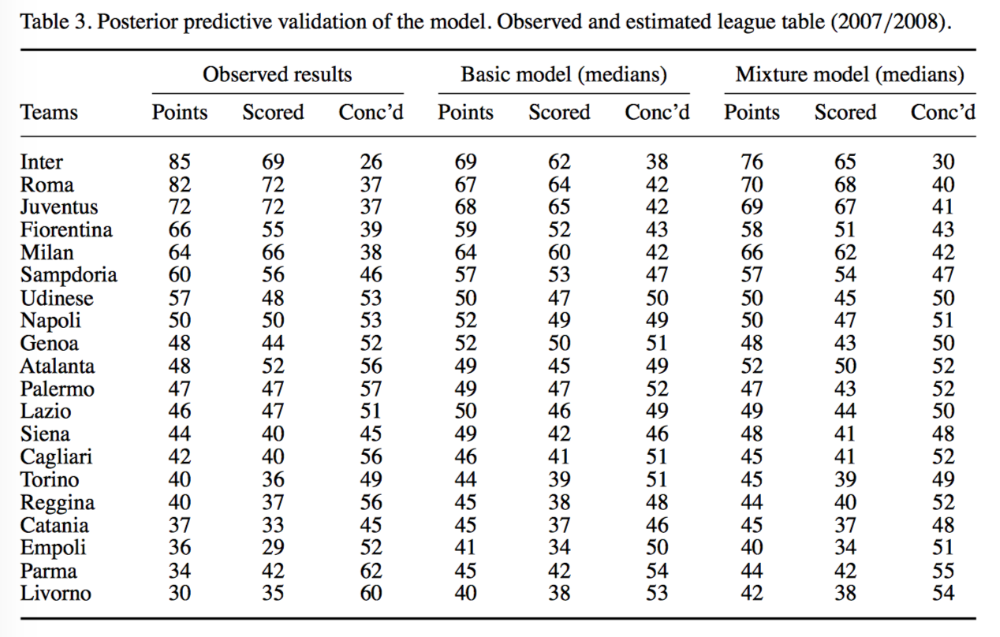

#  Bayesian hierarchical model for the prediction of football results

## some contexts

- using a model with 2 Poisson variables where the relevant parameters are constructed as the product of the strength in the attack for one team and the weakenss in the defense for the other (assuming the indepedence between the goals scored by the home and the visiting team)
- although low, have shown some correlations between the two quantities
- maybe bivariate Poisson distribution?
- or use the difference in the goals as a variable
- ==This paper: a Bayesian hierarchical model for the number of goals scored by the two teams in each match.== Hierarchical models are widely used in many different fields as they are natural way of taking into account relations between variables, by assuming a common distribution for a set of relevant parameters thought to underlie the outcomes of interest.

## base model

- $T=$ number of teams

- $G=$ number of games $=T\cdot(T-1)$

- $y_{g1},y_{g2}$ are the num of goals scored by home/away team in the $g$-th game

- $\mathbf{y}=(y_{g1},y_{g2})$ are modeled as independent Poisson:

  $y_{gj}|\theta_{gj}\sim Poisson(\theta_{gy})$

  conditionally on parameters $\mathbf{\theta}=(\theta_{g1},\theta_{g2})$ representing the scoring intensity in the $g$th game for home/away team.

  $\log\theta_{g1}=home+att_{h(g)}+def_{a(g)}$

  $\log\theta_{g2}=att_{a(g)+def_{a(g)}}$

- parameter $home$: home team advantage

- scoring intensity is determined jointly by the attack and defense ability of the two teams involved, as $att$ and $def$.

- priors

  - $home$ is modelled as a fiexed effect, a standard minimally informative Normal prior, $home\sim N(0,0.0001)$

  - $att$ and $def$ are team-specific effects, modelled as exchangeable from a common distribution $att_t\sim N(\mu_{att},\tau_{att}), def_t\sim N(\mu_{def},\tau_{def})$

    - need a constraint (zero-sum):

      $\sum^T_{t=1}att_t=0, \sum^T_{t=1}def_t=0$

    - also a "corner constraint":

      $att_1=0, def_1=0$

  - hyperpriors of attack and defense effects (also with minimally informative normal prior)

    - $\mu_{att}\sim N(0,0.0001), \mu_{def}\sim N(0,0.0001),$
    - $\tau_{att}\sim Gamm(0.1,0.1), \tau_{def}\sim Gamm(0.1,0.1)$

  

- call the unobservable hyper-parameters $\mathbf{\eta}=(\mu_{att},\mu_{def},\tau_{att},\tau_{def})$

- Each game contributes to the estimation of these parameters, which in turn generate the main effects that explain the variations in the parameters $\mathbf{\theta}$, therefore, implying a form of correlation on the observed counts $\mathbf{y}$.

## results

- 2-fold objectives:
  - obj1: estimate the value of the main effects that we used to explain the scoring rates (by entering the evidence provided by the observed results, $\mathbf{y}$ vector and updating the prior dist by means of the Baye's thm using a MCMC)
  - obj2: prediction, use the results in the implied posterior dist for the vector $\mathbf{\theta}$ to predict a future occurence of a similar (exchangeable) game. After convergence, produce a vector $\mathbf{y}^{pred}$ of 1000 replications from the posterior predictive dis of $\mathbf{y}$ that we used for direct model checking.

## hierarchical model

- drawback: overshrinkage — some of extreme occurrences tend to be pulled towards the grand mean of the observations.

- it could be possible for our case since the performance of different teams in a league in a season can diverge, some are really good, some are really bad.

- previous model the hyper-parameters assume all attack/defense intensity are drawn by a common process, which is not sufficient to capture the different skill levels of each team, therefore, shrinkage, penalizing extremely good teams and overestimating the bad teams

- hence, introducing hierarchical model with 3 different generating mechanisms: top, mid, bottom

  - model the $att$ and $def$ parameters using a non central $t$ dist on $\nu=4$ degrees of freedom, instead 2 from normal dist.

  - the observable variables, the prior specificaition for $\theta_{gj}$, the hyper-parameter $home$ is unchanged, other hypers are modell as

    - each team $t$ has two latent (unobservable) variables $grp^{att}(t), grp^{def}(t)$ taking on the value of 1,2,3 representing bottom, mid, top level. These are given suitable categorical dist each depending on a vector of prior prob $\mathbf{\pi}^{att}=(\pi^{att}_{1t}, \pi^{att}_{2t}, \pi^{att}_{3t})$ and $\mathbf{\pi}^{def}=(\pi^{def}_{1t}, \pi^{def}_{2t}, \pi^{def}_{3t})$
    - specifically assume these two vectors $\mathbf{\pi}\sim$ Dirichlet dist with parameters (1,1,1)

  - now each $att, def$ follows

    - $att_t\sim nct(\mu^{att}_{grp(t)},\tau^{att}_{grp(t)},\nu)$

    - $def_t\sim nct(\mu^{def}_{grp(t)},\tau^{def}_{grp(t)},\nu)$

    - since $grp^{att}(t)$ and $grp^{def}(t)$ unknown, mixture model ->

      $att_t=\sum^3_{k=1}\pi_{kt}^{att}\times nct(\mu^{att}_{grp(t)},\tau^{att}_{grp(t)},\nu)$

      $def_t=\sum^3_{k=1}\pi_{kt}^{def}\times nct(\mu^{def}_{grp(t)},\tau^{def}_{grp(t)},\nu)$

    - $\mu_1^{att}\sim truncN(0,0.001,-3,0)$

    - $\mu_1^{def}\sim truncN(0,0.001,0,3)$

    - $\mu_3^{att}\sim truncN(0,0.001,0,3)$

    - $\mu_3^{def}\sim truncN(0,0.001,-3,0)$

    - $\mu_2^{att}\sim N(0,\tau_2^{att})$

    - $\mu_2^{def}\sim N(0,\tau_2^{def})$

    - $\tau_k^{att}\sim Gamma(0.01, 0.01), \tau^{def}_2\sim Gamma(0.01, 0.01)$

## updated results

- use a later year result for testing

  - but the contextual settings have changed
    - winning points from 2 to 3
    - league expanding T=18 to T=20, so G=360
  - bigger gap between two extremes
    - overshrinkage occurs with base model
- findings from the result table

  - ...
  - ...
  - ...

## discussion

limitation: predictions are obtailned in one batch — using the observed results to estimate the parameters.

improvement: hyper as "time" specifc, to include more variables like injuries, suspensions, winning streak etc.

## appendix

- [Bayesian hierarchical model for the prediction of football results](https://www.tandfonline.com/doi/abs/10.1080/02664760802684177), Gianluca Baio and Marta Blangiardo
- [Hierarchical Bayesian Modeling of the English Premier League](http://mc-stan.org/events/stancon2017-notebooks/stancon2017-kharratzadeh-epl.pdf), Milad Kharratzadeh, see also https://github.com/milkha/EPL_KDD
- [A Bayesian inference approach for determining player abilities in soccer](https://arxiv.org/abs/1710.00001), Gavin A. Whitaker, Ricardo Silva, Daniel Edwards
- [Modeling Match Result in Soccer using a Hierarchical Bayesian Poisson Model](http://sumsar.net/papers/baath_2015_modeling_match_resluts_in_soccer.pdf), Rasmus Baath

---

# implementation

- 