```{r setup, include=FALSE}
knitr::opts_chunk$set(echo = FALSE)
```


## background

- paper information:
    - _Bayesian hierarchical model for the prediction of football results_, Gianluca Baio & Marta Blangiardo, Journal of Applied Statistics, 21 Jan 2010.
- statistical question:
    - estimate the characteristics that bring a team to lose or win a game, and to predict the score of a particular match
- why hierarchical?
    - "Hierarchical models are widely used in many different fields as they are natural way of taking into account relations between variables, by assuming a common distribution for a set of relevant parameters thought to underlie the outcomes of interest."

## data - Serie A (1991-1992)

|$g$|Home Team|Visiting Team|$h(g)$|$a(g)$|$y_{g1}$|$y_{g2}$|
|:-|:--------|:--------|:-:|:-:|:-:|:-:|
|1|Verona|Roma|18|15|0|1|
|2|Napoli|Atalanta|13|2|1|0|
|3|Lazio|Parma|11|14|1|1|
|4|Cagliari|Sampdoria|4|16|3|2|
|...|...|...|...|...|...|...|
|303|Sampdoria|Cremonese|16|5|2|2|
|304|Roma|Bari|15|3|2|0|
|305|Inter|Atalanta|9|2|0|0|
|306|Torino|Ascoli|17|1|5|2|

## base model - parameters and variables

- $T=18$, $G=306$
- $y_{gj}\mid\theta_{gj}\sim Poisson(\theta_{gj})$, conditional on parameters $\mathbf{\theta}=(\theta_{g1},\theta_{g2})$ (scoring intensity in the $g$-th game)
- $\log\theta_{g1}=home+att_{h(g)}+def_{a(g)}$
- $\log\theta_{g2}=att_{a(g)+def_{a(g)}}$
    - $home$
    - $att$, $def$

## base model - priors

- $home$: fixed effect, uninformative:
    - $home\sim N(0,0.0001)$
- $att, def$: team-specific
    - $att_t\sim N(\mu_{att},\tau_{att}), def_t\sim N(\mu_{def},\tau_{def})$
    - zero-sum contraint: $\sum^T_{t=1}att_t=0, \sum^T_{t=1}def_t=0$
- hyperpriors of $att, def$:
    - uninformative
    - $\mu_{att}\sim N(0,0.0001), \mu_{def}\sim N(0,0.0001)$
    - $\tau_{att}\sim Gamma(0.1,0.1), \tau_{def}\sim Gamma(0.1,0.1)$
    
## base model - priors{.centered}

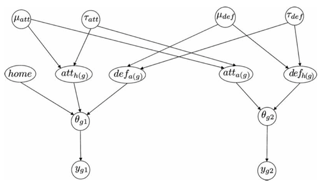

- unobservable hyper-parameters $\mathbf{\eta}=(\mu_{att},\mu_{def},\tau_{att},\tau_{def})$

## base model - estimate

**estimate** the value of the main effects that we used to explain the scoring rates (by entering the evidence provided by the observed results, $\mathbf{y}$ vector and updating the prior distributions by means of the Baye's thm using a MCMC)

## base model - estimate{.centered}

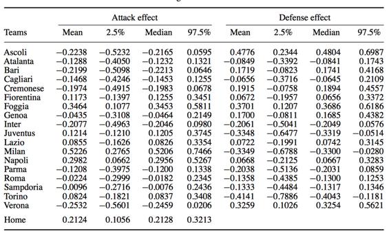

<!-- ## base model - prediction -->

<!-- **prediction**: use the results in the implied posterior dist for the vector $\mathbf{\theta}$ to predict a future occurence of a similar (exchangeable) game. After convergence, produce a vector $\mathbf{y}^{pred}$ of 1000 replications from the posterior predictive dis of $\mathbf{y}$ that we used for direct model checking. -->

## base model - prediction{.centered}

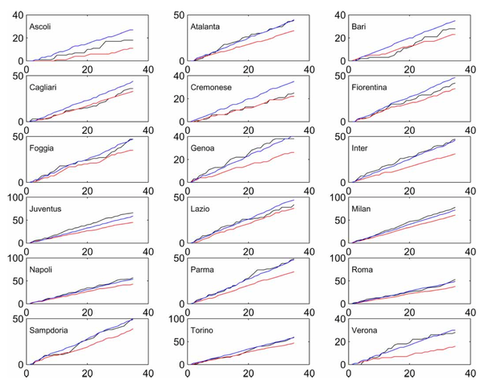

## why not base model

- **overshrinkage**: some of extreme occurrences tend to be pulled towards the grand mean of the observations.
- it could be possible for our case since the performance of different teams in a league in a season can diverge, some are really good, some are really bad.
- previous model the hyper-parameters assume all attack/defense intensity are drawn by a common process, which is not sufficient to capture the different skill levels of each team, therefore, shrinkage, penalizing extremely good teams and overestimating the bad teams

## hierarchical model

- stratify the teams into 3 levels: **top, mid** and **bottom**
- model the $att$ and $def$ parameters using a non central $t$ distribution on $\nu=4$ degrees of freedom, instead 2 from normal

- the observable variables, the prior specificaition for $\theta_{gj}$, the hyper-parameter home is unchanged, other hypers are modeled as
    - each team $t$ has two latent (unobservable) variables $grp^{att}(t), grp^{def}(t)$ taking on the value of $1,2,3$ representing **bottom, mid, top** level. These are given suitable categorical dist each depending on a vector of prior probability $\mathbf{\pi}^{att}=(\pi^{att}_{1t}, \pi^{att}_{2t}, \pi^{att}_{3t})$ and $\mathbf{\pi}^{def}=(\pi^{def}_{1t}, \pi^{def}_{2t}, \pi^{def}_{3t})$
    -  $\mathbf{\pi}\sim Dirichlet(1,1,1)$
    
## hierarchical model

- $att_t\sim nct(\mu^{att}_{grp(t)},\tau^{att}_{grp(t)},\nu)$
- $def_t\sim nct(\mu^{def}_{grp(t)},\tau^{def}_{grp(t)},\nu)$
- $grp^{att}(t), grp^{def}(t) \implies$
    - $att_t=\sum^3_{k=1}\pi_{kt}^{att}\times nct(\mu^{att}_{grp(t)},\tau^{att}_{grp(t)},\nu)$
    - $def_t=\sum^3_{k=1}\pi_{kt}^{def}\times nct(\mu^{def}_{grp(t)},\tau^{def}_{grp(t)},\nu)$
- $\mu_1^{att}\sim truncN(0,0.001,-3,0), \mu_1^{def}\sim truncN(0,0.001,0,3)$
- $\mu_3^{att}\sim truncN(0,0.001,0,3), \mu_3^{def}\sim truncN(0,0.001,-3,0)$
- $\mu_2^{att}\sim N(0,\tau_2^{att}), \mu_2^{def}\sim N(0,\tau_2^{def})$
- $\tau_k^{att}\sim Gamma(0.01, 0.01), \tau^{def}_k\sim Gamma(0.01, 0.01)$

## hierarchical model - updated results (07-08){.centered}

- context changed: winning points, league expansion
- bigger gap between two extremes

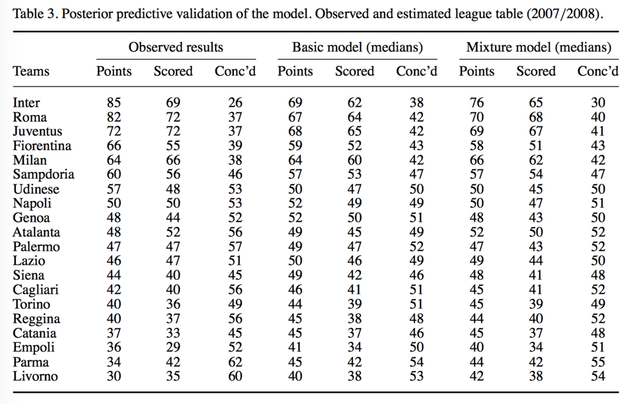

## replication - 07-08 Serie A data

- data: [jokecamp/FootballData](https://github.com/jokecamp/FootballData/tree/master/football-data.co.uk) (raw data), wikipedia page (result table)

- tool: pymc

- setup for mcmc: `iter=200,000, burnin=40,000, thin=20`

- Note: simplification $att_t\sim N(0,\tau_{att}), def_t\sim N(0,\tau_{def})$

## replication - diagnostics{.centered}

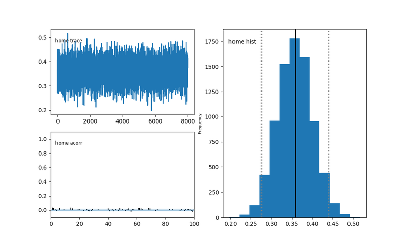

## replication - diagnostics{.centered}

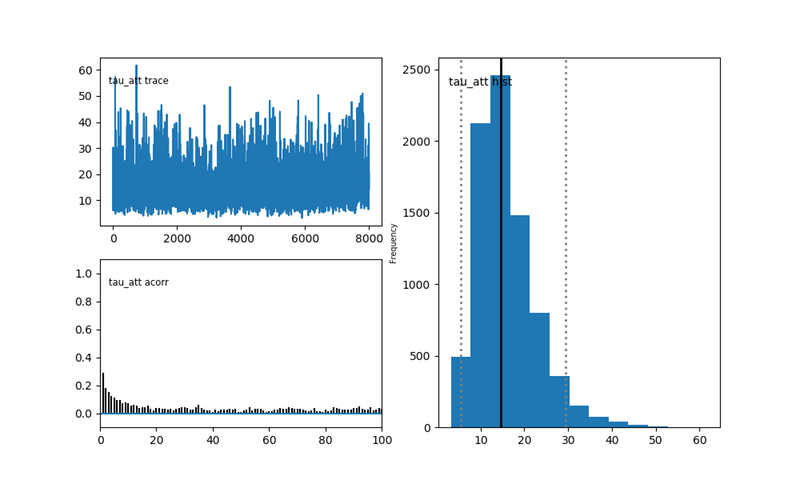

## replication - diagnostics{.centered}

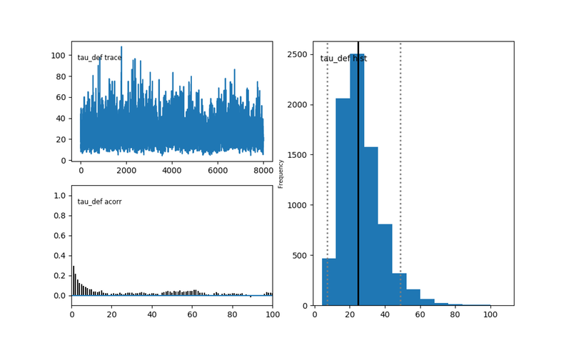

## replication - mean att vs mean def{.centered}

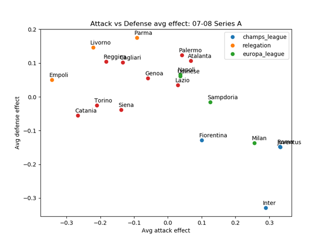

## replication - HPD{.centered}

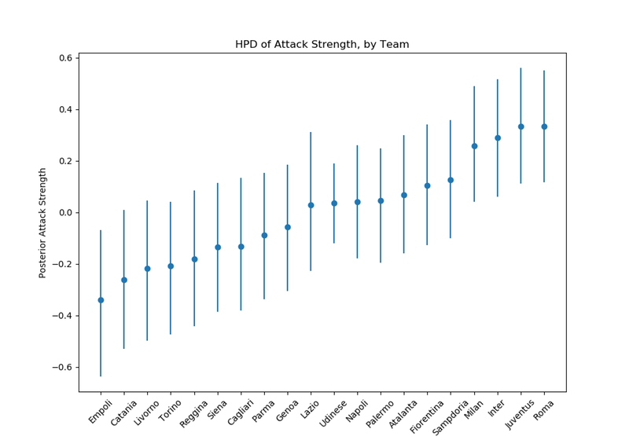

## replication - simulation

### simulated
 
- top 4: Juventus (70/60), Roma (68/52), Inter (67/50), Milan (66/66)
- bottom 3: Udinese (38/33) , Empoli (37/34), Torino (29/35)

### real
- top 4: Inter (85/69), Roma (82/72), Juventus (72/72), Fiorentina (66/55)
- bottom 3: Empoli (36/29), Parama (34/42), Livorno (30/35)
  
## replication - 90% credible interval{.centered}

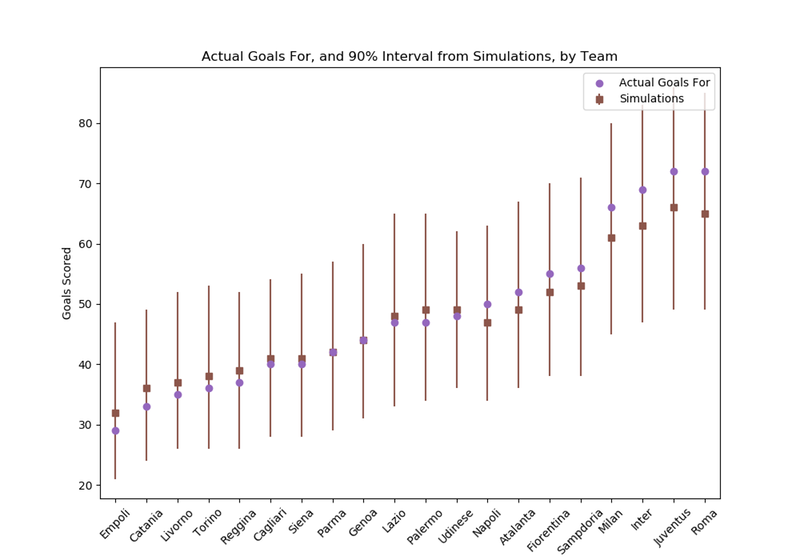

## replication - top 4 summary{.centered}

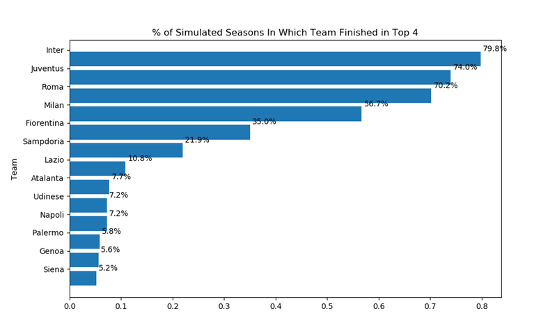

## application - thoughts

- wait, but what can we **really** learn from these data?
- we are using history to "predict" history, seems not very meaningful
    - maybe, use past seasons/years to predict this year? (under the circumstance that no transfer, nor relegation/promotion happens!)
- but at least, we can learn some _features_ about a league

## application - 15-16 Premier League data{.centered}

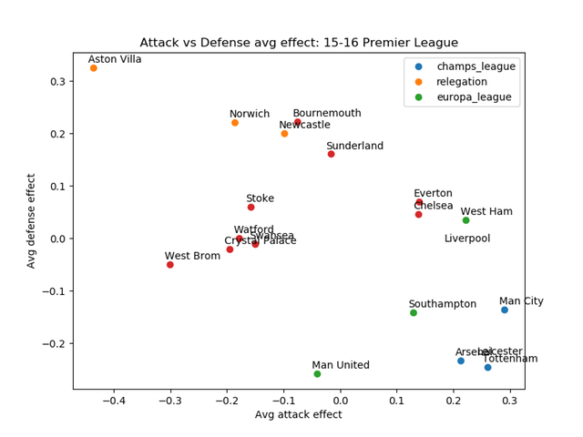

## application - comparison{.centered}


## other attempts

- existing other attempts
    - Sabermetrics
        - search for objective knowledge about baseball
        - the mathematical and statistical analysis of baseball record
    - ELO ratings
        - a measure of the team's current strength
    - models based on machine learning
        - one of the intelligent methodologies

- the fields can be applied to
    - gambling
    - coaching improvements
    - journalism
    
## conclusion

- base model
    - extreme occurences -- overshrinkage
- Bayesian hierarchical model
    - bettering performance in prediction
    - easily implemented by using standard MCMC algorithms
    - easily extended to include a mixture structure
    
## conclusion

- limitation and improvement
    - predictions are obtained in one batch
         - using the observed results to estimate the parameters
    <!-- - define the hyper-parameters $\eta$ as "time" -->
    - include more variables

## references

- Baio, G. and Blangiardo, M., 2010. [Bayesian hierarchical model for the prediction of football results](https://www.tandfonline.com/doi/abs/10.1080/02664760802684177). _Journal of Applied Statistics_, Volume 37 Issue 2.
- Milad Kharratzadeh, _A Hierarchical Bayesian Model for Predicting Soccer Results_
- Gavin A. Whitaker, Ricardo Silva, Daniel Edwards, [A Bayesian inference approach for determining player abilities in soccer](https://arxiv.org/abs/1710.00001). _arXiv.org_.
- Rasmus Baath, _Modeling Match Result in Soccer using a Hierarchical Bayesian Poisson Model_, [part 1](http://www.sumsar.net/blog/2013/07/modeling-match-results-in-la-liga-part-one/) & [part 2](http://www.sumsar.net/blog/2013/07/modeling-match-results-in-la-liga-part-two/)
- Albert, J., 1997. An introduction to sabermetrics. _Bowling Green State University (http://www-math.bgsu.edu/~albert/papers/saber.html)._
- Bunker, R.P. and Thabtah, F., 2017. A machine learning framework for sport result prediction. _Applied Computing and Informatics._

## references

- Costa, G.B., Huber, M.R. and Saccoman, J.T., 2007. _Understanding sabermetrics: An introduction to the science of baseball statistics._ McFarland.
- Hvattum, L.M. and Arntzen, H., 2010. Using ELO ratings for match result prediction in association football. _International Journal of forecasting,_ 26(3), pp.460-470.
- Ulmer, B., Fernandez, M. and Peterson, M., 2013. _Predicting Soccer Match Results in the English Premier League_ (Doctoral dissertation, Doctoral dissertation, Ph. D. dissertation, Stanford).

