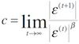

##Output in a glance

We have three sets of randomly generated initial guess data.

*Note: the guess is not fully random, since 'suitable' guesses is always more preferrable. And we claim that a suitable guess of p1 should range from 0.5 to 1, and p2 from 0 to 0.5, as the observed p1 is 20/25=0.8, observed p2 is 6/25=0.24. So we believe in real life, such ranges of guesses are better than a fully random guess.*

*Another Note: the result of `mle_alt` generated one more line than the true number of iteration the method stopped at. For example, `mle_alt` has 47 lines for the first initial guess, but in fact, the last two lines are exactly the same, which is used to check stopping condition, so in the following table, the number of iterations should be 46.*

###First guess

With `p1 = 0.63275433157104999` and `p2 = 0.18606194981839508` 

Method  | iterations | ets. p1             | ets. p2 
------- | ---------- | ------------------- | --------------------
mle_alt | 46         | 0.83007546584433389 | 0.28329283584105291 
mle_mvn | 10         | 0.83007546584433389 | 0.28329283584105297 
mle_mos | 10         | 0.83007546583596892 | 0.28329283584413389
mle_nlm | 8          | 0.83007508229279126 | 0.28329253611342803

###Second guess

With `p1 = 0.59244112996384501` and `p2= 0.35118701797910035`

Method  | iterations | ets. p1             | ets. p2 
------- | ---------- | ------------------- | --------------------
mle_alt | 47         | 0.83007546584433389 | 0.28329283584105291 
mle_mvn | 10         | 0.83007546584433389 | 0.28329283584105297 
mle_mos | 10         | 0.83007546583814262 | 0.28329283584335119
mle_nlm | 9          | 0.83007545802191118 | 0.28329284508035912


###Third guess

With `p1 = 0.58402076316997409` and `p2 = 0.40375819953624159`

Method  | iterations | ets. p1             | ets. p2 
------- | ---------- | ------------------- | --------------------
mle_alt | 47         | 0.83007546584433389 | 0.28329283584105291 
mle_mvn | 10         | 0.83007546584433389 | 0.28329283584105291 
mle_mos | 10         | 0.83007546583843395 | 0.28329283584324649
mle_nlm | 8          | 0.83007545562099061 | 0.28329284321319914

##Sensitivity with initial guess

* `mle_alt`: The different initial guesses did not affect the estimation of p1 and p2; not sensitive. 
    + Particularly, with any given initial guess, the estimated p1 is always 0.83007546584433389 and p2 is 0.28329283584105291.

* `mle_mvn`: Different initial guesses affected the estimation of p1 and p2; a little bit sensitive.
    + In details, the estimated values from fisrt and second set of guess had very tiny variation in p2 after 10 iterations. 
    + On the other hand, the third set of guess produced the same mle p1 and p2 as `mle_alt`.

* `mle_mos`: Similarly, this was also affected by initial guesses; quite sensitive.
    + Three different sets of guesses resulted in three totally different estimations after 10 iterations.
    + The variation is not very huge, but noticable.

* `mle_nlm`: Also sensitive to different initial guesses; maybe we could add a 'very'.
    + Three different initial guesses, three pairs of different estimations.
    
* If ordering among these four methods is allowed, I would say the sensitivity to change of initial guesses, from lowest to highest, is: `alt < mvn < mos < nlm`.
    + Why `mle_mos` is less sensitive than `mle_nlm`? Because when the number of iterations is large enough, different initial guesses will also go to the same mle (this will be shown in next part).

##Answer similarity
Under some circumstances, like the third guess, we have the same answers from different methods (`alt` and `mvn`). We better want to discuss the second set of guess (p1 = 0.59244112996384501, p2= 0.35118701797910035), which is the most diversified among three.

```{r}
source("~/Dropbox/1516/STA410cstat/A1/function.r")

options(digits=17)

alt <- log_likelihood(c(0.83007546584433389, 0.28329283584105291), 130, 25, 25, 75, 20, 6)
mvn <- log_likelihood(c(0.83007546584433389, 0.28329283584105297), 130, 25, 25, 75, 20, 6)
mos <- log_likelihood(c(0.83007546583814262, 0.28329283584335119), 130, 25, 25, 75, 20, 6)
nlm <- log_likelihood(c(0.83007545802191118, 0.28329284508035912), 130, 25, 25, 75, 20, 6)
#optimum
opm <- log_likelihood(c(0.83007546584433389, 0.28329283584105291), 130, 25, 25, 75, 20, 6)

abs(opm - alt)
abs(opm - mvn)
abs(opm - mos)
abs(opm - nlm)
```

So it's not hard to find out that:

* `alt` has the exactly same log-likelihood as the maximum.
* `mvn` is very close to `alt`.
* `nlm` is close too, but not as close as `mvn`.
* `mos` is the the farthest one.

Simply, the closer, the better.

###A second thought

For each set of guess, we want to give `mle_mos` another chance with more iterations, say `20`; 

seed                | ets. p1                          | ets. p2
--------------------| -------------------------------- | --------------------
1                   | 0.83007546584433389              | 0.28329283584105291
2                   | 0.83007546584433389              | 0.28329283584105291
3                   | 0.83007546584433389              | 0.28329283584105297

After doing this, we find out that all of those estimations of p1 and p2 are pointing to the same p1 and p2 pair, as desired.

Note that although there is still negligible variation at the 17th decimal number of estimated p2, we claim that it is equal to previously calculated mle.

Therefore, even the initial guess is not as 'suitable' as we want them to be, as long as the iteration number is large enough, `mos` will produce the same mle of p1 and p2. So at this moment, we could say `alt`, `mvn` and `mos` are all at the same level of 'goodness'.

##Convergence order

By definition, the convergence order beta should satisfy that: 

That is equivalent to say the 

For the following calculation, we choose to use the third initial guess `p1 = 0.58402076316997409` and `p2 = 0.40375819953624159`, with mle `p = (0.83007546584433389, 0.28329283584105291)`.

### `mle_alt`

`mle_alt` consists of mainly bisection method, the length of the bracketing interval shrinks to almost its half after each iteration.

```{r}
# the following are calculated errors after 43, 44, 45 iterations.

p <- c(0.83007546584433389, 0.28329283584105291)

p43 <- c(0.83007546584433345, 0.28329283584105414)
p44 <- c(0.83007546584433345, 0.28329283584105319)
p45 <- c(0.83007546584433378, 0.28329283584105319)

epsilon43 <- p - p43 # 4.440892e-16 -1.221245e-15
epsilon44 <- p - p44 # 4.440892e-16 -2.775558e-16
epsilon45 <- p - p45 # 1.110223e-16 -2.775558e-16

```
By observation, the absolute value of error(epsilon) tends to be stable, and they have the same number of decimals. So we believe the convergence is linear, i.e. `beta = 1`.

### `mle_mvn` 

```{r}
# the following are calculated errors after 4, 5, 6 iterations.

p <- c(0.83007546584433389, 0.28329283584105291)

p4 <- c(0.83046607572012954, 0.28305307635107246)
p5 <- c(0.8300760651000777, 0.2832924650233955)
p6 <- c(0.83007546584574299, 0.28329283584017867)

epsilon4 <- p - p4 # -0.0003906099  0.0002397595
epsilon5 <- p - p5 # -5.992557e-07  3.708177e-07
epsilon6 <- p - p6 # -1.409095e-12  8.742451e-13

```

By observation, the error converges much faster than `mle_alt` does, and the number of decimals tends to double after every iteration. So we believe the convergence is quadratic, i.e., 

### `mle_mos`

`mle_mos` also has quadratic convergence with convergence is quadratic, i.e. `beta = 2`.

```{r}
# the following are calculated errors after 4, 5, 6 iterations.

p <- c(0.83007546584433389, 0.28329283584105291)

p4 <- c(0.83017312892992112, 0.28326036220547818)
p5 <- c(0.83006630050474739, 0.28329643543771804)
p6 <- c(0.83007631357123401, 0.28329253172802304)

epsilon4 <- p - p4 # -9.766309e-05  3.247364e-05
epsilon5 <- p - p5 # 9.165340e-06 -3.599597e-06
epsilon6 <- p - p6 # -8.477269e-07  3.041130e-07
```

By observation, the error ocsiliates, but the absolute value of it converges. The rate is slower than `mle_mos`, but a little bit faster than `mle_alt`, the number of decimals increases after each iteration. So we believe the convergence is neither linear nor quadratic, the value of `beta` is between 1 and 2, but closer to 1.

##Easiness

* `mle_nlm` is the easiest of course, because all we need to do is only to call the built-in function.

* `mle_mvn` and `mle_mos` are pretty similar in easiness, since they are two methods based on multivariate newton method to find local maximum.
    + Probably `mle_mos` is a little bit more complex, since the calculation of Fisher information matrix is included. But generally they are the same idea.
    
* `mle_alt` is the most complex method among four. I using bisections is already quite time-consuming and inefficient, and alternatively obviously just double the workload. Implementing it with the help a while-loop with a long paragraph of code could explain everything.

##Bonus

Use the Hessian matrix computed at the maximum likelihood estimate to obtain stan- dard errors for p 1 and p 2 . Note in this regard that statistical theory suggests that the inverse of minus the Hessian of the log likelihood is an estimate of the covariance matrix of the sampling distribution of the estimate, or alternatively, of the covariance matrix of the posterior distribution (if the prior information is not strong). Also find standard errors using the Fisher information matrix, and compare them to those found using the Hessian (observed information). Do they differ much for the data used here? Might they differ more for other data?

```{r}
source("~/Dropbox/1516/STA410cstat/A1/function.r")

options(digits=17)

n <- 130
m1 <- 25
m2 <- 25
x <- 75
x1 <- 20
x2 <- 6
p_mle <- c(0.83007546584433389, 0.28329283584105291)

# using inverse of Hessian of the log likelihood
print(solve(-log_likelihood_hessian(p_mle, n, m1, m2, x, x1, x2)))
# standard error of p1
print((solve(-log_likelihood_hessian(p_mle, n, m1, m2, x, x1, x2))[1, 1])^(-2))
# standard error of p1
print((solve(-log_likelihood_hessian(p_mle, n, m1, m2, x, x1, x2))[2, 2])^(-2))

# using Fisher information matrix
print(solve(-fisher_information(p_mle, n, m1, m2, x, x1, x2)))
# standard error of p1
print((solve(-fisher_information(p_mle, n, m1, m2, x, x1, x2))[1, 1])^(-2))
# standard error of p2
print((solve(-fisher_information(p_mle, n, m1, m2, x, x1, x2))[2, 2])^(-2))

```
So the standard errors differ a lot.


