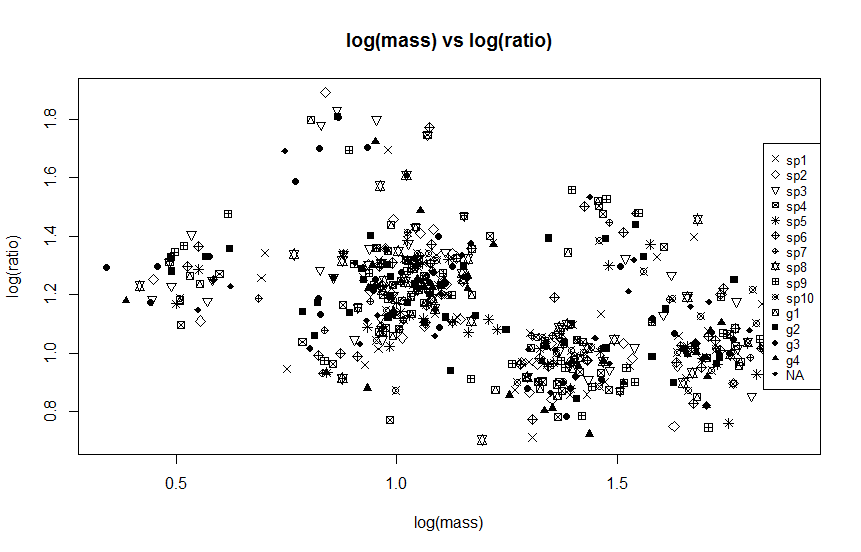
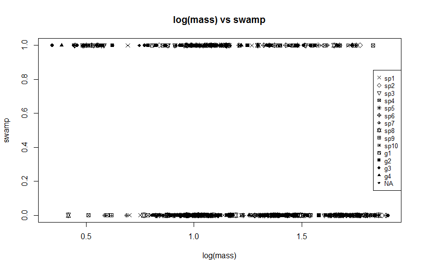
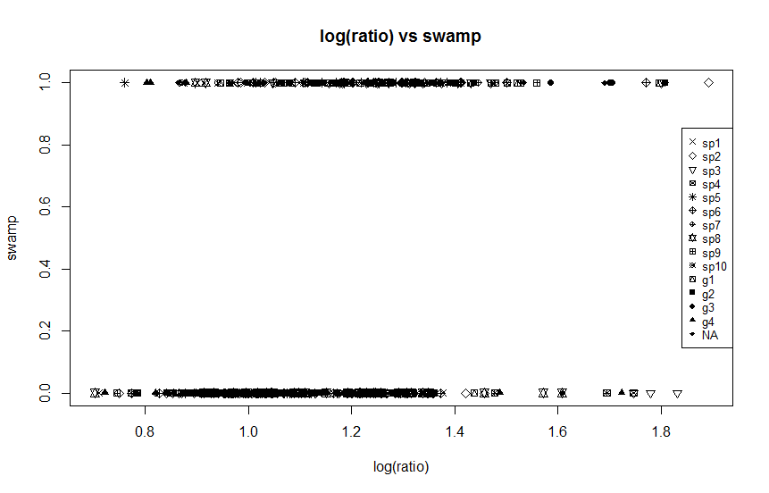

#STA410 Assignment 2
###**Rui Qiu #999292509**

2015-11-19

## Problem 1: Minecraft Revisited

- The following is a partial output of EM algorithm:

 iter | est.p1  | est.p2 | log-likelihood
----- | --------| -------|------------
82 | 0.83007546584433323 |0.28329283584105358 |-8.0379597929241164
83 | 0.83007546584433356 |0.28329283584105336 |-8.0379597929240667
84 | 0.83007546584433367 |0.28329283584105319 |-8.0379597929240454
85 | 0.83007546584433378 |0.28329283584105308 |-8.0379597929240330
86 | 0.83007546584433378 |0.28329283584105303 |-8.0379597929240241
87 | 0.83007546584433378 |0.28329283584105303 |-8.0379597929240241
88 | 0.83007546584433378 |0.28329283584105303 |-8.0379597929240241

- Discussion: 
	- By observation, we find out that in our test case, the values of estimated p1, estimated p2 and log-likelihood all become stable after 86 iterations.
	- And actually it should converge from all the starting points.
- Easiness to do EM:
	- The EM algorithm is straightforward, namely, to do expectation in E-step and do maximization in M-step, and iterate finitely many times until we get some satisfying results.
	- The most important advantage is that EM involves no computation of first or second derivative, thus saving us lots of time.
- How fast it converges.
	- So we take the estimated p1 from iteration 82, 83, 84:

			> final <- 0.83007546584433378
			> p1.82 <- 0.83007546584433323
			> p1.83 <- 0.83007546584433356
			> p1.84 <- 0.83007546584433367
			> (p1.82-final)/(p1.83-final)
			[1] 2.5
			> (p1.82-final)^2/(p1.83-final)
			[1] -1.38777878078e-15
			> (p1.83-final)/(p1.84-final)
			[1] 2
			> (p1.83-final)^2/(p1.84-final)
			[1] -4.4408920985e-16
			
	- This is the behaviour expected with linear convergence -- the error after t+1 iterations is about 1/5 the after t iterations.
	- So the rate of convergence is 1.

## Problem 2: The Beetles
- The final output is shown below:

		            mu        vu       rho      alpha
		sp1  0.8942923 1.0342643 0.2657339 0.06729892
		sp2  1.3899676 0.9623014 0.0993474 0.19440148
		sp3  1.7168589 1.0546248 0.1551782 0.07671346
		sp4  0.5312401 1.2620517 0.8176918 0.07347779
		sp5  1.5094600 1.4086777 0.9183584 0.05511000
		sp6  1.7233369 0.9994049 0.1464464 0.10582222
		sp7  1.3208239 0.9380040 0.4295160 0.04366880
		sp8  1.0519352 1.2553052 0.4406961 0.15757814
		sp9  1.0239227 1.2366704 0.4606217 0.19213491
		sp10 0.9046637 1.7304230 0.5328304 0.03379428

- Although we belive different initial guesses (parameter matrices) should lead to the same convergence, somehow when I test with mean value of different parameters, the likelihood goes to `NaN` immediately.
- How fast it converges.
	- The results are stable after 63 iterations.
	- And we take the estimated mu1 from iteration 59, 60, 61:

			> final <- 0.8942923
			> mu1.59 <- 0.8942927
			> mu1.60 <- 0.8942927
			> mu1.61 <- 0.8942926
			> (mu1.59-final)/(mu1.60-final)
			[1] 1
			> (mu1.60-final)/(mu1.61-final)
			[1] 1.333333
			> (mu1.59-final)^2/(mu1.60-final)
			[1] 4e-07
			> (mu1.60-final)^2/(mu1.61-final)
			[1] 5.333333e-07
	
	- Similarly, the rate of convergence should be 1. This is a linear convergence case.
- Alternative way to EM
	- Easy way: sometimes in practice, we could just ignore the data entry with `NA`, taking it just as an invalid entry.
	- Hard way: In order to guarantee feasibility and consistency in high dimensions, we could use moment-based approaches or so-called "spectral techniques". Reference: [https://en.wikipedia.org/wiki/Expectation%E2%80%93maximization_algorithm#Alternatives_to_EM](https://en.wikipedia.org/wiki/Expectation%E2%80%93maximization_algorithm#Alternatives_to_EM)
- Plotting
	- log(mass) vs log(ratio) plot
	
	- log(mass) vs swamp plot
	
	- log(ratio) vs swamp plot
	

