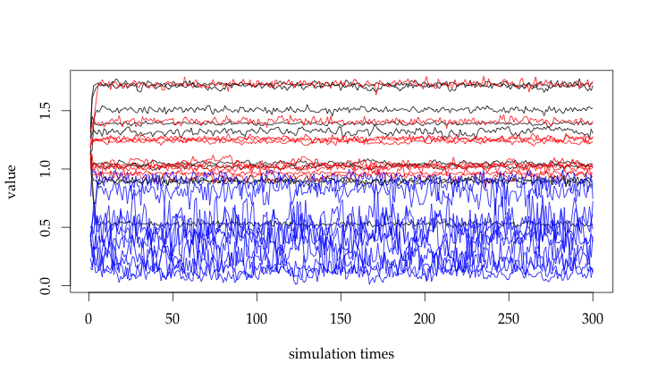
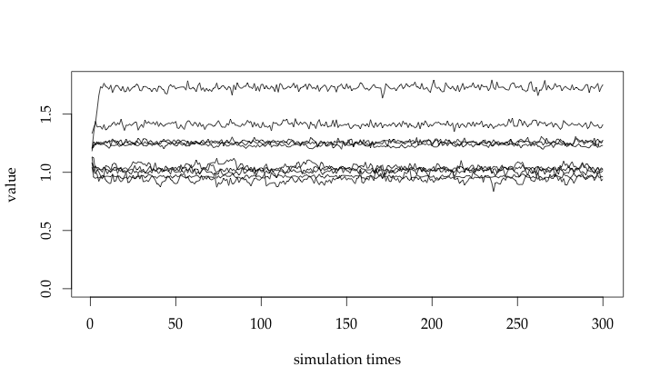
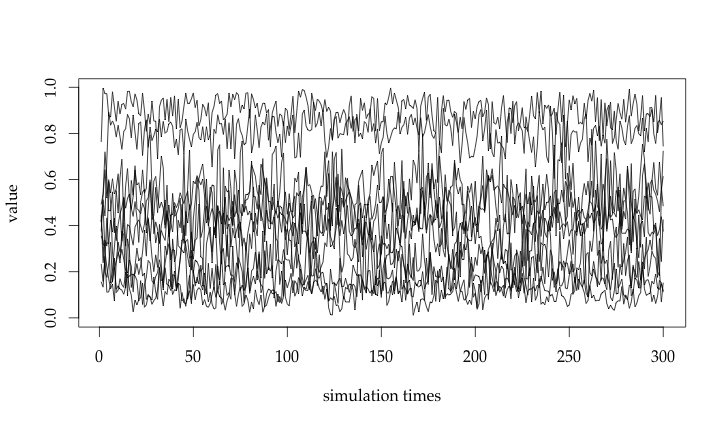
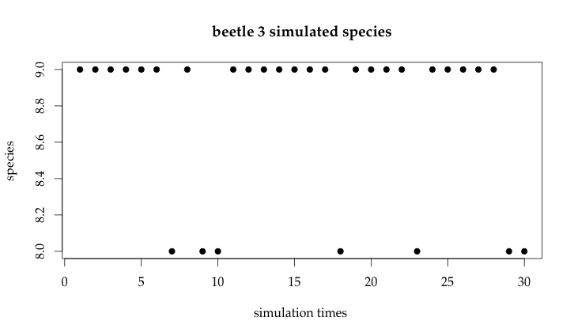
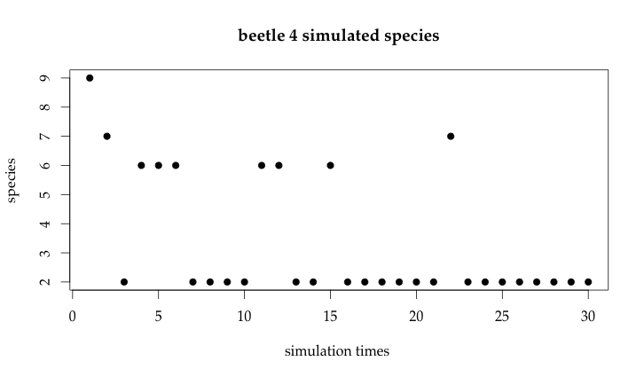
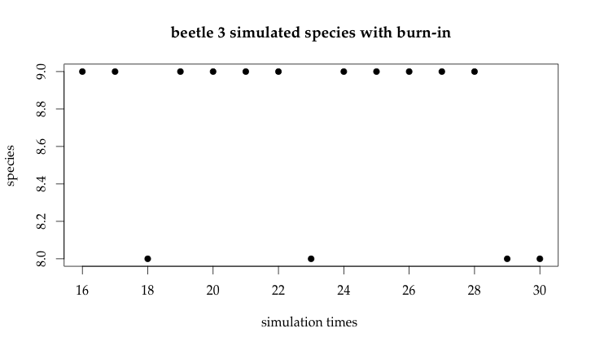
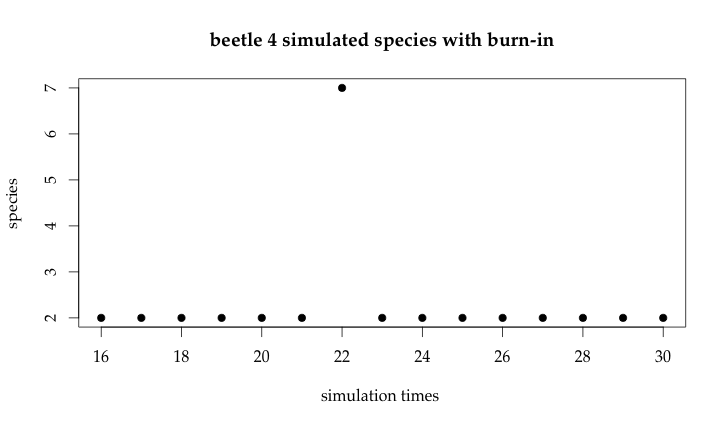

# STA410 Assignment 3

2015-12-07

Rui Qiu \#999292509

## 1. Traceplots of parameters



The total traceplot with 3 parameters (black for mu, red for vu, blue for rho). 

To clarify, the separate traceplots are listed below:

The traceplot of mu.


The traceplot of vu.



The traceplot of rho.



By observation, we are able to make the following statements:

- The value of rho, of any species, is rather chaotic in Gibbs sampling.
- The value of mu and vu have a quite big "jump" at the beginning of Gibbs sampling, so we could consider some "burn-in" iterations.
- The value of mu and vu after some burn-in iterations are somewhat "constant", although they do have some fluctuations up and down.

## 2. Estimated posterior mean and standard deviation

If we consider the first 15 iterations are "burn-in" iterations, then we are going to have the following results:

mu:

		            sp1         sp2        sp3        sp4        sp5        sp6        sp7
		mean 0.89217667 1.389672760 1.71534615 0.52909171 1.50745940 1.72127823 1.32025228
		sd   0.01528185 0.009622424 0.02339015 0.01483819 0.01647131 0.01248323 0.02279837
		            sp8        sp9       sp10
		mean 1.04448905 1.02683415 0.90321044
		sd   0.01800056 0.01544346 0.02023304

vu:

		            sp1        sp2        sp3       sp4        sp5        sp6        sp7
		mean 1.02552750 0.96268060 1.04027651 1.2599138 1.41086193 1.01502662 0.93990246
		sd   0.01919384 0.01036092 0.03199098 0.0163944 0.02054309 0.01718367 0.02953991
		            sp8        sp9       sp10
		mean 1.25438964 1.23585511 1.72856199
		sd   0.01733282 0.01439401 0.02324842

rho:

		            sp1       sp2        sp3        sp4        sp5        sp6       sp7
		mean 0.26855897 0.1088104 0.19960786 0.80438839 0.89748316 0.15574658 0.4303648
		sd   0.09403528 0.0408743 0.09534101 0.06219955 0.05873907 0.05319458 0.1290998
		            sp8        sp9      sp10
		mean 0.43081742 0.45978450 0.5301337
		sd   0.09564121 0.07666759 0.1195193

Comparing with the results of EM in Assignment 2, I would consider the results of Gibbs sampling quite satisfying.

		            mu        vu       rho      alpha
		sp1  0.8942923 1.0342643 0.2657339 0.06729892
		sp2  1.3899676 0.9623014 0.0993474 0.19440148
		sp3  1.7168589 1.0546248 0.1551782 0.07671346
		sp4  0.5312401 1.2620517 0.8176918 0.07347779
		sp5  1.5094600 1.4086777 0.9183584 0.05511000
		sp6  1.7233369 0.9994049 0.1464464 0.10582222
		sp7  1.3208239 0.9380040 0.4295160 0.04366880
		sp8  1.0519352 1.2553052 0.4406961 0.15757814
		sp9  1.0239227 1.2366704 0.4606217 0.19213491
		sp10 0.9046637 1.7304230 0.5328304 0.03379428

## 3. Consistency of species sampling

In our Gibbs sampling, we have to put a species for those data without species information in original data, and we want to check whether such "manually-added" speices are consistent.

So we do a test-run with 30 iterations on beetle 3 and beetle 4, and we generate the scatterplots of their speices. (Since we need to update )





And consider "burn-in".





## 4. Summary of Gibbs sampling

- Gibbs sampling converges after about 15 iterations (as "burn-in"), then the value of mu and vu consistently fluctuate near a certain value.
- For mu and vu, the dependencies of previous parameter is rather high; but for rho, the dependency of previous parameter is low.

## 5. Appendices

Source code.

```{r}
# a function to calculate the probability of each species given a certain k-th beetle entry
# m := log mass of this beetle
# r := log ratio of this beetle
# sw := swamp condition of this beetle
# para is a 10 by 3 parameter matrix

calcProb <- function(k, data, para, alpha) { 
  
  entry <- data[k,]
  sp <- entry[1, 1]
  g <- entry[1, 2]
  m <- log(entry[1, 3])
  r <- log(entry[1, 4])
  sw <- entry[1, 5]
  up <- rep(0, 10)
  down <- 0
  
  if (is.na(sp) && is.na(g)) {
    for (i in 1:10) {
      up[i] <- helper(i, para, m, r, sw)
      down <- down+helper(i, para, m, r, sw)
    }
  }
  
  if (!is.na(g) && is.na(sp)) {
    if (g==1) {
      for (i in 1:3) {
        up[i] <- helper(i, para, m, r, sw)
        down <- down+helper(i, para, m, r, sw)
      }
    }
    
    if(g==2){
      for(i in 4:5){
        up[i] <- helper(i, para, m, r, sw)
        down <- down+helper(i, para, m, r, sw)
      }
    }
    
    if(g==3){
      for(i in 6:7){
        up[i] <- helper(i, para, m, r, sw)
        down <- down+helper(i, para, m, r, sw)
      }
    }
    
    if(g==4){
      for(i in 8:10){
        up[i] <- helper(i, para, m, r, sw)
        down <- down+helper(i, para, m, r, sw)
      }
    }
  }
  up <- up/down
  return(up)
}

helper <- function(i, para, m, r, sw) {
  return(dnorm(m, para[i, 1], 0.08)*dnorm(r, para[i, 2], 0.1)*
    (para[i, 3]^sw)*((1-para[i, 3])^(1-sw))*(alpha[i]))
}

# a function used to generate a species "manually" for those
# beetles that don't have species information at the beginning
dataModify <- function(data,para,alpha) {
  
  data1 <- data
  for (k in 1:nrow(data1)) {
    if (is.na(data1[k,1])) {
      data1[k,1] <- sample(1:10, 1, prob=calcProb(k, data, para, alpha))
    } else {
      data1[k,1] <- data[k,1]
    }
  }
  return(data1)
}

gibbs <- function(data, initial, iter) {
  
  results <- list(mu=matrix(nrow=iter, ncol=10), vu=matrix(nrow=iter, ncol=10),
   rho=matrix(nrow=iter, ncol=10))

  para <- initial
  
  storage <- matrix(0,iter,2)
  
  for (t in 1:iter) {
    data2 <- dataModify(data,para,alpha)
    # the following if-loop is only used for a test-run
    if (test==1) {
      storage[t, 1] <- data2[3, 1]
      storage[t, 2] <- data2[4, 1]
    }
    for (i in 1:10) {
      n <- sum(data2[, 1]==i)
      rho_temp <- sum(data2[which(data2[, 1]==i), 5])/n
      results$mu[t, i] <- rnorm(1, (0.5+2*sum(log(data2[which(data2[, 1]==i), 3]))/0.08^2)/(2*sqrt(0.25+n/0.08^2)), 1) *
        (1/(sqrt(0.25+n/0.08^2)))
      results$vu[t, i] <- rnorm(1, (0.5+2*sum(log(data2[which(data2[, 1]==i), 4]))/0.1^2)/(2*sqrt(0.25+n/0.1^2)), 1) *
        (1/(sqrt(0.25+n/0.1^2)))
      results$rho[t, i] <- rbeta(1, sum(data2[which(data2[, 1]==i), 5]) + 1, n + 1 -  sum(data2[which(data2[, 1]==i), 5]))
      para[i, 1] <- results$mu[t, i]
      para[i, 2] <- results$vu[t, i]
      para[i, 3] <- results$rho[t, i]
    }
  }
  # also only for a test-run
  if (test==1) {
    return(storage)
  }
  results
}
```

Script.
```{r}
source("a3.r")
data <- read.table("./ass2-data.txt", header=T)
initial <- matrix(0.5, 10, 3)
alpha <- c(0.05, 0.20, 0.05, 0.06, 0.04, 0.15, 0.05, 0.15, 0.20, 0.05)

# To see whether the manually sampled species for "missing-species data" is consistent,
# we want to do this tiny test run. The target beetles are the third and fourth beetles
# in original data which don't have species.

test <- 1

res <- gibbs(data,initial,30)

plot(1:30, res[, 1], main="beetle 3 simulated species", 
     xlab="simulation times ", ylab="species", pch=19, family="Palatino")
plot(1:30, res[, 2], main="beetle 4 simulated species", 
     xlab="simulation times ", ylab="species", pch=19, family="Palatino")

# consider burn-in?
plot(16:30, res[16:30, 1], main="beetle 3 simulated species with burn-in", 
     xlab="simulation times ", ylab="species", pch=19, family="Palatino")
plot(16:30, res[16:30, 2], main="beetle 4 simulated species with burn-in", 
     xlab="simulation times ", ylab="species", pch=19, family="Palatino")

# Test run swithc off (for better performance)
test <- 0

r <- gibbs(data,initial,300)

plot(NULL, xlim=c(1, 300), ylim=range(c(r$rho, r$mu)), xlab="simulation times", ylab="value", family="Palatino")
for (i in 1:ncol(r$mu)) lines (r$mu[, i])
for (i in 1:ncol(r$vu)) lines (r$vu[, i], col="red") 
for (i in 1:ncol(r$rho)) lines (r$rho[, i], col="blue")

plot(NULL, xlim=c(1, 300), ylim=range(c(0, r$mu)), xlab="simulation times", ylab="value", family="Palatino")
for (i in 1:ncol(r$mu)) lines (r$mu[, i])

plot(NULL, xlim=c(1, 300), ylim=range(c(0, r$vu)), xlab="simulation times", ylab="value", family="Palatino")
for (i in 1:ncol(r$vu)) lines (r$vu[, i])

plot(NULL, xlim=c(1,300), ylim=range(c(0, r$rho)), xlab="simulation times", ylab="value", family="Palatino")
for (i in 1:ncol(r$rho)) lines (r$rho[, i])

# Discard first 15 iterations as burn-in

burn_in <- 15

# print estimated posterior means and standard deviations of each parameters

m1 <- rbind(colMeans(r$mu[(burn_in+1):300, ]),
            apply(r$mu[(burn_in+1):300, ], 2, sd))
colnames(m1) <- c("sp1", "sp2", "sp3", "sp4", "sp5", "sp6", "sp7", "sp8", "sp9", "sp10")
rownames(m1) <- c("mean", "sd")
print(m1)

m2 <- rbind(colMeans(r$vu[(burn_in+1):300, ]),
            apply(r$vu[(burn_in+1):300,], 2, sd))
colnames(m2) <- c("sp1", "sp2", "sp3", "sp4", "sp5", "sp6", "sp7", "sp8", "sp9", "sp10")
rownames(m2) <- c("mean", "sd")
print(m2)

m3 <- rbind(colMeans(r$rho[(burn_in+1):300,] ),
            apply(r$rho[(burn_in+1):300,], 2, sd))
colnames(m3) <- c("sp1", "sp2", "sp3", "sp4", "sp5", "sp6", "sp7", "sp8", "sp9", "sp10")
rownames(m3) <- c("mean", "sd")
print(m3)
```
		